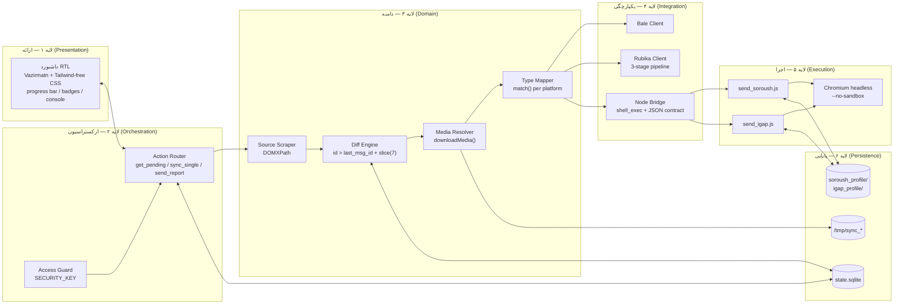
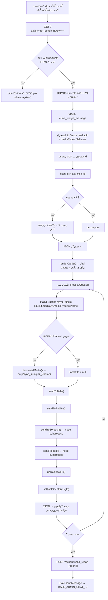
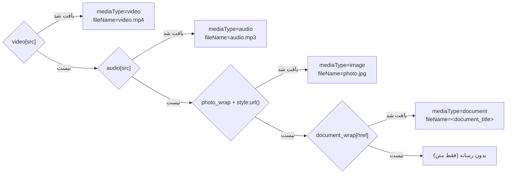
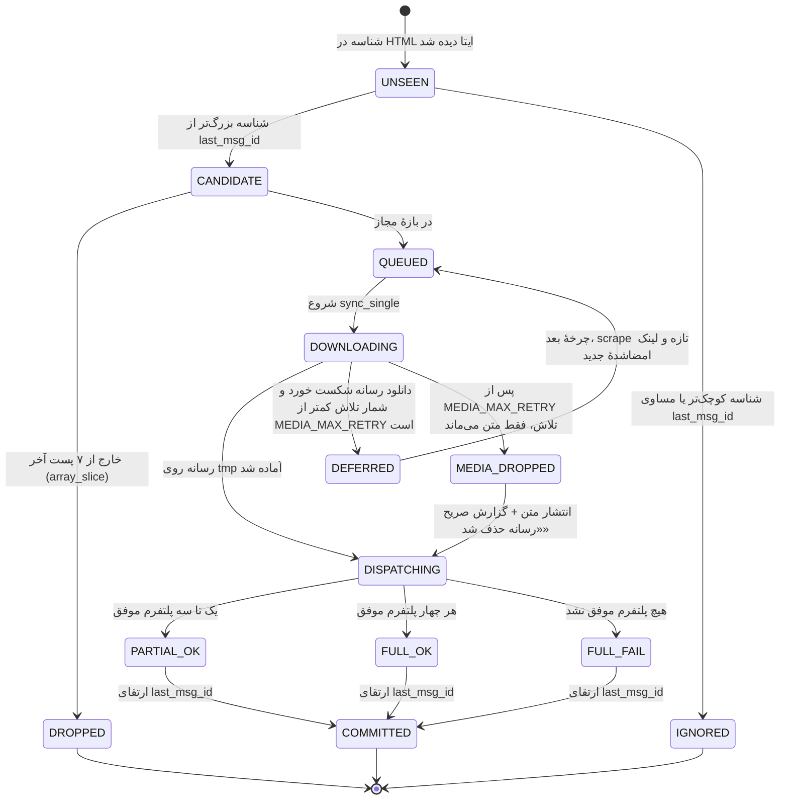
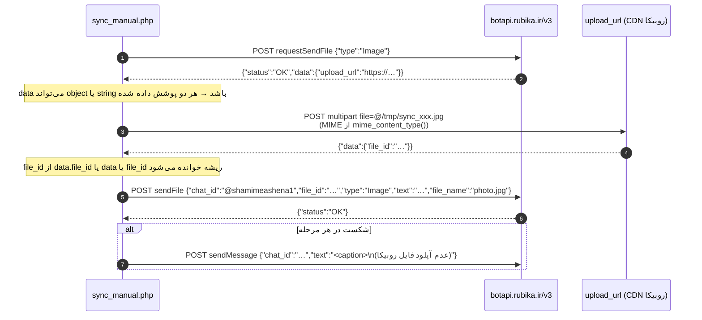
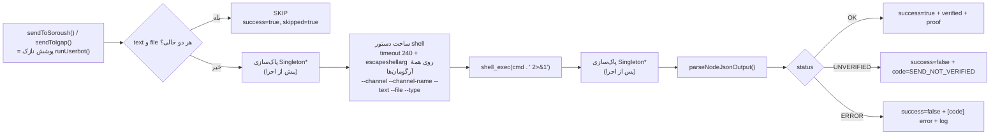
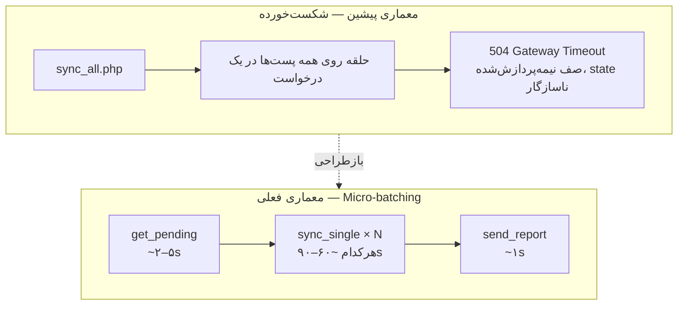
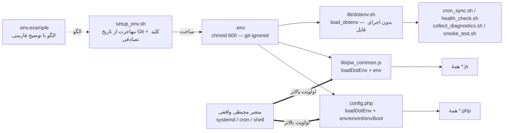

# ARCHITECTURE.md — معماری فنی سیستم همگام‌سازی چندکاناله

> سند مرجع مهندسی: جریان داده، مکانیک scraping، یکپارچگی REST API، ارکستراسیون Playwright، منطق state machine و پروتکل‌های امنیتی.
>
> سطح سند: **Principal Systems Architect** — برای توسعه‌دهندگان و اپراتورهای ارشد.
> مستندات مرتبط: [`README.md`](README.md) · [`DEPLOYMENT.md`](DEPLOYMENT.md) · [`PLAYWRIGHT_SPECS.md`](PLAYWRIGHT_SPECS.md) · [`TROUBLESHOOTING.md`](TROUBLESHOOTING.md)

---

## فهرست مطالب

1. [اصول طراحی](#s1)
2. [لایه‌بندی اجزا](#s2)
3. [جریان داده End-to-End](#s3)
4. [مکانیک Scraping ایتا](#s4)
5. [State Machine و پایایی وضعیت](#s5)
6. [یکپارچگی REST API](#s6)
7. [ارکستراسیون Playwright و قرارداد Subprocess](#s7)
8. [ارکستراتور AJAX و معماری Micro-batching](#s8)
9. [پروتکل‌های امنیتی](#s9)
10. [مدل خطا و Observability](#s10)
11. [بدهی فنی و نقشه راه](#s11)

---

## ۱. اصول طراحی <a id="s1"></a>

| # | اصل | پیاده‌سازی عملی |
|---|---|---|
| ۱ | **Idempotency در سطح state، نه در سطح ارسال** | `last_msg_id` تنها پس از پردازش کامل یک پست ارتقا می‌یابد؛ پست در حال پردازش هرگز دوبار در صف ظاهر نمی‌شود. |
| ۲ | **جداسازی لایهٔ پرخطر از لایهٔ وب** | عملیات Playwright در subprocess مستقل Node اجرا می‌شود؛ crash مرورگر نمی‌تواند worker PHP را بکشد. |
| ۳ | **مرز زمانی کوتاه برای هر درخواست HTTP** | هر پست = یک درخواست `sync_single`. این تنها راه فرار از `ProxyTimeout`/FastCGI در محیط cPanel است. |
| ۴ | **قرارداد خروجی ماشینی** | اسکریپت‌های Node **فقط** یک خط JSON روی stdout چاپ می‌کنند؛ هر چیز دیگر نویز محسوب می‌شود. |
| ۵ | **Degradation تدریجی** | شکست روبیکا در آپلود فایل → fallback به ارسال متن با یادداشت؛ شکست یک پلتفرم → ادامهٔ سه پلتفرم دیگر. |
| ۶ | **پروفایل پایدار به‌جای Session موقت** | `launchPersistentContext` روی دایرکتوری ثابت؛ کوکی‌ها، LocalStorage و IndexedDB بین اجراها حفظ می‌شوند. |
| ۷ | **هیچ اعتبارنامه‌ای روی دیسک عمومی** | پروفایل‌ها، `state.sqlite` و `*_session.json` از Git خارج شده‌اند و باید با `.htaccess` از وب محافظت شوند. |

---

## ۲. لایه‌بندی اجزا <a id="s2"></a>



### مسئولیت هر فایل

| فایل | لایه | مسئولیت | وابستگی‌ها |
|---|---|---|---|
| `sync_manual.php` | ۱–۴ | داشبورد + روتر + همهٔ کلاینت‌های API + پل Node (`runUserbot`) + سیاست تعویق رسانه | `pdo_sqlite`, `curl`, `dom`, `mbstring`, `fileinfo` |
| `cli_run.php` | ۱ (CLI) | اجرای هر action از `sync_manual.php` بدون Apache و بدون کلید وب | PHP CLI |
| `lib/pw_common.js` | ۵ (مشترک) | `parseArgs`، `RunLog`، `cleanSingletons`، `resolveChromium`، `launchBrowser`، `seen`/`waitUntil`/`firstVisible`، `insertText`، `emit`، `detectLoginPage` | `fs`, `path` |
| `send_soroush.js` | ۵ | خودکارسازی `web.splus.ir` + تأیید ارسال | `playwright`, `lib/pw_common.js` |
| `send_igap.js` | ۵ | خودکارسازی `web.igap.net` + تأیید ارسال | `playwright`, `lib/pw_common.js` |
| `login_soroush.js` | ۵ (bootstrap) | ساخت session سروش‌پلاس با OTP تعاملی | `playwright`, `readline` |
| `login_igap.js` | ۵ (bootstrap) | ساخت session آی‌گپ با OTP تعاملی (قالب `09…` و `+98…`) | `playwright`, `readline` |
| `restore_session.js` | ۵ (bootstrap) | تزریق LocalStorage/SessionStorage/IndexedDB از فایل پشتیبان | `playwright`, `fs` |
| `dump_dom.js` | ۵ (diagnostics) | دامپ DOM + استخراج کاندیدهای سلکتور بر پایهٔ کلمهٔ کلیدی | `playwright`, `lib/pw_common.js` |
| `inspect_igap.js` / `inspect_attach.js` | ۵ (diagnostics) | استخراج سلکتور زنده از DOM | `playwright` |
| `cron_sync.sh` | ۶ (ops) | چرخهٔ خودکار: صف → ارسال → گزارش (حالت CLI یا HTTP) | `bash`, `jq`, `flock`, PHP CLI یا `curl` |
| `smoke_test.sh` / `acceptance.sh` | ۶ (ops) | آزمون پذیرش محیط + ارسال زندهٔ تستی | `bash`, `jq`, `curl` |
| `health_check.sh` | ۶ (ops) | سلامت روزانه + هشدار به مدیر در بله | `bash`, PHP CLI |
| `collect_diagnostics.sh` | ۶ (ops) | جمع‌آوری یکجای شواهد برای گزارش خطا | `bash`, `sqlite3`, `curl` |
| `sync_daemon.php` | legacy | حلقهٔ daemon مستقل (Bale + Rubika فقط؛ سروش غیرفعال) | `pdo_sqlite`, `curl`, `dom` |
| `test*.php`, `send_test.php` | diagnostics | تست‌های ایزولهٔ هر یکپارچگی | `curl`, `dom`, `gd` |

---

## ۳. جریان داده End-to-End <a id="s3"></a>



### ۳.۱ مدل شیء پیام (Message DTO)

خروجی `get_pending` و ورودی `sync_single` از یک شکل واحد پیروی می‌کنند:

```json
{
  "id": 74124,
  "text": "❤️ سلام عزیزان جان! ...",
  "mediaUrl": "https://eitaa.com/download_4292da...?token=78da01ae...",
  "mediaType": "document",
  "fileName": "مجله آشنا ۲۴۳.pdf"
}
```

| فیلد | نوع | منبع در DOM | نکته |
|---|---|---|---|
| `id` | `int` | `data-post="shamimeashena/74124"` | کلید state machine |
| `text` | `string` | `textContent` گرهٔ `etme_widget_message_text` | فقط متن خام؛ HTML و ایموجی‌های قالب‌بندی‌شده حفظ نمی‌شوند |
| `mediaUrl` | `?string` | `video[src]` / `audio[src]` / `style` / `href` | اگر نسبی باشد با `https://eitaa.com` کامل می‌شود |
| `mediaType` | `?string` | نوع گره | `video` \| `audio` \| `image` \| `document` \| `null` |
| `fileName` | `?string` | عنوان سند یا مقدار پیش‌فرض | `video.mp4`, `audio.mp3`, `photo.jpg`, یا عنوان واقعی سند، پیش‌فرض `document.bin` |

---

## ۴. مکانیک Scraping ایتا <a id="s4"></a>

### ۴.۱ واکشی

```php
$ch = curl_init("https://eitaa.com/" . EITAA_CHANNEL_ID);
curl_setopt_array($ch, [
    CURLOPT_RETURNTRANSFER => true,
    CURLOPT_FOLLOWLOCATION => true,
    CURLOPT_SSL_VERIFYPEER => false,
    CURLOPT_TIMEOUT        => 25
]);
```

- **نمایش عمومی بدون لاگین**: `https://eitaa.com/<channel>` نسخهٔ وب عمومی کانال را برمی‌گرداند؛ نیازی به cookie نیست.
- **بدون User-Agent سفارشی در `sync_manual.php`** (برخلاف `sync_daemon.php` و `test.php` که UA مرورگر می‌فرستند). در صورت دریافت `403` از سمت ایتا، افزودن UA اولین اقدام اصلاحی است — نگاه کنید به [`TROUBLESHOOTING.md`](TROUBLESHOOTING.md) §۴.
- `CURLOPT_SSL_VERIFYPEER = false` یک **مصالحهٔ آگاهانه** برای سازگاری با زنجیرهٔ CA قدیمی CentOS است؛ ریسک MITM را در §۹ ببینید.

### ۴.۲ پارس DOM

```php
$dom = new DOMDocument();
libxml_use_internal_errors(true);
$dom->loadHTML('<?xml encoding="utf-8" ?>' . $html, LIBXML_HTML_NOIMPLIED | LIBXML_HTML_NODEFDTD);
libxml_clear_errors();
```

| تکنیک | دلیل |
|---|---|
| prefix `<?xml encoding="utf-8" ?>` | بدون آن، `loadHTML` متن فارسی را به entity های `&#1605;...` تبدیل می‌کند و خروجی در پیام‌رسان‌ها به‌هم ریخته می‌شود. |
| `LIBXML_HTML_NOIMPLIED \| LIBXML_HTML_NODEFDTD` | جلوگیری از افزودن `<html>`/`<body>` مصنوعی و `<!DOCTYPE>` که مسیر XPath را جابه‌جا می‌کند. |
| `libxml_use_internal_errors(true)` + `clear_errors()` | HTML ایتا کاملاً well-formed نیست؛ بدون این دو، حافظهٔ خطای libxml در طول زمان نشت می‌کند. |

### ۴.۳ نقشهٔ سلکتورهای XPath

| هدف | XPath | استخراج |
|---|---|---|
| کانتینر پیام | `//div[contains(concat(' ', normalize-space(@class), ' '), ' etme_widget_message ')]` | — |
| شناسهٔ پیام | `@data-post` روی کانتینر | `(int)substr(strrchr($dataPost, '/'), 1)` |
| متن | `.//div[contains(@class, 'etme_widget_message_text')]` | `trim(textContent)` |
| ویدیو | `.//video` | `@src` |
| صدا | `.//audio` | `@src` |
| تصویر | `.//a[contains(@class, 'etme_widget_message_photo_wrap')]` | regex روی `@style`: `/url\(\'?(.*?)\'?\)/` |
| سند | `.//a[contains(@class, 'etme_widget_message_document_wrap')]` | `@href` |
| نام سند | `.//div[contains(@class, 'etme_widget_message_document_title')]` (داخل گرهٔ سند) | `trim(textContent)` |

> **چرا `concat(' ', normalize-space(@class), ' ')`؟**
> چون `contains(@class, 'etme_widget_message')` به‌اشتباه با کلاس‌هایی مثل `etme_widget_message_text` یا `etme_widget_message_photo_wrap` هم مطابقت می‌کند. افزودن فاصله در دو طرف، مطابقت **کلاس کامل** را تضمین می‌کند.

> **چرا `contains(@class, ...)` در زیردرخت؟**
> در گره‌های فرزند، مطابقت جزئی کافی و پایدارتر است؛ ایتا کلاس‌های کمکی (مثل `clearfix`) را به همان گره‌ها اضافه می‌کند.

### ۴.۴ ترتیب اولویت تشخیص رسانه

`sync_manual.php` از زنجیرهٔ `if / elseif` با اولویت زیر استفاده می‌کند:



⚠️ **واگرایی شناخته‌شده:** `sync_daemon.php` اولویت معکوس دارد (`photo` قبل از `video`) و فقط `image` را دانلود می‌کند. اگر daemon را فعال کردید، این تفاوت را در نظر بگیرید — §۱۱.

### ۴.۵ لینک‌های رسانهٔ امضاشده و زمان‌دار

لینک واقعی رسانه در ایتا به این شکل است:

```
https://eitaa.com/download_4292da3202981ecabd1ef660532f45a9?token=78da01ae0051ff100000000ae805322805dc5037…
```

پیامدهای معماری:

1. **Token منقضی می‌شود.** فاصلهٔ زمانی بین `get_pending` و `sync_single` باید کوتاه باشد. اگر کاربر داشبورد را باز کند و ساعت‌ها بعد دکمهٔ ادامه را بزند، دانلود با `403` شکست می‌خورد → راه‌حل: اجرای مجدد `get_pending`.
2. **هدر `Referer` الزامی است.** `downloadMedia()` هدر `Referer: https://eitaa.com/<channel>` را می‌فرستد؛ بدون آن CDN ایتا درخواست را رد می‌کند.
3. **کدهای `200` و `206` هر دو معتبرند** (پاسخ `206 Partial Content` برای استریم ویدیو طبیعی است).
4. **آستانهٔ اندازه**: `filesize($tmpPath) > 100` بایت. پاسخ‌های خطای HTML (مثل صفحهٔ «دسترسی ممکن نیست») معمولاً کوچک‌اند و با این آستانه رد می‌شوند.
5. **رسانهٔ سنگین در نمای وب ظاهر نمی‌شود.** برای فایل‌های بزرگ، ایتا به‌جای `<video src>` عبارت «حجم رسانه بالاست / مشاهده در ایتا» را نمایش می‌دهد. در این حالت `mediaUrl = null` و پست **فقط به‌صورت متنی** همگام می‌شود. این یک محدودیت ذاتی scraping نمای وب است، نه باگ.

---

## ۵. State Machine و پایایی وضعیت <a id="s5"></a>

### ۵.۱ طرحواره

```sql
CREATE TABLE IF NOT EXISTS sync_state (
    channel     TEXT    PRIMARY KEY,
    last_msg_id INTEGER NOT NULL
);
```

مقدار نمونهٔ تولید:

```
sqlite> SELECT * FROM sync_state;
shamimeashena|74124
```

### ۵.۲ عملگرها

```php
// خواندن — در صورت نبود رکورد، ۰ برمی‌گردد (یعنی «همه پست‌ها جدید»)
function getLastSeenId(PDO $db, string $channel): int;

// UPSERT اتمیک — کلید اصلی channel است
INSERT INTO sync_state (channel, last_msg_id) VALUES (:channel, :msg_id)
ON CONFLICT(channel) DO UPDATE SET last_msg_id = :msg_id;
```

> `ON CONFLICT ... DO UPDATE` نیازمند SQLite ≥ 3.24 است. در CentOS 7 با SQLite قدیمی، این دستور با خطای syntax شکست می‌خورد — راه‌حل در [`TROUBLESHOOTING.md`](TROUBLESHOOTING.md) §۶.

### ۵.۳ نمودار وضعیت هر پست



> **تغییر کلیدی:** حالت `DEFERRED` جدید است. پیش‌تر شکست دانلود رسانه **بی‌صدا** به «انتشار بدون رسانه» می‌انجامید و `last_msg_id` هم ارتقا می‌یافت (یعنی محتوای ناقص و غیرقابل بازگشت). اکنون پست در چنین حالتی منتشر نمی‌شود و `last_msg_id` جلو نمی‌رود؛ چون `get_pending` هر بار از ایتا scrape تازه می‌کند، لینک امضاشدهٔ جدید ساخته می‌شود و مورد خودترمیم است. سقف `MEDIA_MAX_RETRY` (پیش‌فرض ۳) از حلقهٔ بی‌پایان برای رسانه‌ای که هرگز لینک مستقیم ندارد جلوگیری می‌کند.

### ۵.۴ ناورداهای سیستم (Invariants)

| # | ناواردا | تضمین‌کننده |
|---|---|---|
| I-1 | `last_msg_id` هرگز کاهش نمی‌یابد | `get_pending` خروجی را صعودی مرتب می‌کند و حلقهٔ مرورگر به ترتیب ارسال می‌کند |
| I-2 | یک `id` حداکثر یک‌بار به `sync_single` می‌رسد | فیلتر `id > lastSeenId` + UPSERT در پایان |
| I-3 | صف حداکثر ۷ عضو دارد | `MAX_MESSAGES_LIMIT` + `array_slice($newMessages, -7)` |
| I-4 | هیچ فایل موقتی روی دیسک نمی‌ماند | `@unlink($localFile)` پس از dispatch و همچنین داخل `downloadMedia()` در مسیر شکست |
| I-5 | دو مرورگر هم‌زمان روی یک پروفایل اجرا نمی‌شوند | پاک‌سازی `Singleton*` + اجرای ترتیبی در `sync_single` + کرانهٔ `timeout 240` + `flock` در `cron_sync.sh` |
| I-6 | پست رسانه‌دار **هرگز بی‌صدا** بدون رسانه منتشر نمی‌شود | یا `DEFERRED` (چیزی منتشر نمی‌شود) یا انتشار با `media.ok=false` و گزارش صریح در پاسخ، لاگ cron و گزارش مدیریتی |
| I-7 | `OK` از UserBot تنها با شاهد تأیید صادر می‌شود | پنجرهٔ تأیید ۲۰ ثانیه‌ای (P-8) و در غیر این صورت `UNVERIFIED` |
| I-8 | هر اجرای UserBot حداکثر ۲۴۰ ثانیه worker را اشغال می‌کند | `timeout` دور subprocess + `setDefaultTimeout(30s)` داخل صفحه |

> ⚠️ **استثنای I-2:** در حالت `DEFERRED` یک `id` می‌تواند بیش از یک‌بار به `sync_single` برسد، ولی چون **هیچ‌چیز منتشر نشده** است، تکراری در کانال‌ها ایجاد نمی‌شود. شمارندهٔ `media_fail` این تکرارها را سقف می‌گذارد.

### ۵.۵ شکست ناواردا — حالت‌های لبه

| حالت | پیامد | اقدام |
|---|---|---|
| `last_msg_id = 0` (پایگاه دادهٔ تازه) | **همهٔ** پست‌های موجود در صفحهٔ ایتا جدید محسوب می‌شوند → ۷ پست آخر منتشر می‌شود | پیش از اولین اجرای تولید، مقدار اولیه را دستی ست کنید (§۵.۶) |
| پست حذف‌شده در مبدأ | `id` هرگز دیده نمی‌شود؛ state جلو می‌زند و پست برای همیشه از دست می‌رود | resend دستی با اسکریپت‌های Node |
| `sync_single` وسط اجرا می‌میرد (kill/تایم‌اوت) | `last_msg_id` ارتقا نمی‌یابد → پست در اجرای بعد **دوباره** ارسال می‌شود (احتمال تکرار در ۴ کانال) | اجتناب از اجرای هم‌زمان دو داشبورد + `flock` در `cron_sync.sh` |
| رسانهٔ پست در ایتا لینک مستقیم ندارد («حجم رسانه بالاست») | پس از ۳ تلاش، پست فقط متنی منتشر می‌شود و `media.info=DROPPED_AFTER_3_TRIES:EMPTY_OR_PLACEHOLDER_BODY` | انتشار دستی رسانه از طریق خود ایتا/کلاینت دسکتاپ |
| لینک امضاشدهٔ رسانه منقضی شد (`403`) | پست `DEFERRED` می‌شود و در چرخهٔ بعد با لینک تازه تلاش می‌شود | فاصلهٔ بین `get_pending` و `sync_single` را کوتاه نگه دارید |
| UserBot پیام را فرستاد ولی تأیید نشد (`UNVERIFIED`) | ممکن است resend باعث انتشار دوباره شود | پیش از resend کانال مقصد را چشمی بررسی کنید (اسکرین‌شات شاهد + `logs/`) |
| اجرای هم‌زمان دو کاربر روی داشبورد | race روی UPSERT و قفل شدن پروفایل Chromium | `.htaccess`/IP allowlist یا `SECURITY_KEY` اختصاصی |

### ۵.۶ مقداردهی اولیهٔ state (جلوگیری از انتشار ۷ پست قدیمی)

```bash
# آخرین شناسهٔ موجود در کانال را بخوانید
curl -s "https://your-domain/s/test.php?ch=shamimeashena" \
  | grep -o '"latest_post_id":[0-9]*'

# آن را به‌عنوان نقطهٔ شروع ثبت کنید
sqlite3 /home/file/public_html/s/state.sqlite \
  "INSERT INTO sync_state (channel, last_msg_id) VALUES ('shamimeashena', 74124)
   ON CONFLICT(channel) DO UPDATE SET last_msg_id = 74124;"
```

---

## ۶. یکپارچگی REST API <a id="s6"></a>

### ۶.۱ لایهٔ مشترک `callApi()`

```php
function callApi(string $url, mixed $data, bool $isMultipart, array $headers = []): array
```

| خصوصیت | مقدار |
|---|---|
| متد | همیشه `POST` |
| `CURLOPT_TIMEOUT` | ۶۰ ثانیه |
| `CURLOPT_SSL_VERIFYPEER` | `false` |
| تعیین multipart | **ضمنی**: اگر `$data` آرایه باشد → `multipart/form-data`؛ اگر رشته باشد → بدنهٔ خام |
| خروجی | `['code' => <HTTP int>, 'res' => <array|string>]` با `json_decode(...) ?? $raw` |

> پارامتر `$isMultipart` در پیاده‌سازی فعلی **استفاده نمی‌شود** (cURL خودش از روی نوع `$data` تصمیم می‌گیرد). این یک بدهی فنی مستندشده است (§۱۱).

### ۶.۲ بله (Bale)

**پایه:** `https://tapi.bale.ai/bot<TOKEN>/` — توکن با `preg_replace('/^bot/i', '', trim(BALE_BOT_TOKEN))` نرمال می‌شود تا از `botbot...` جلوگیری شود.

| حالت | متد | بدنه | نکات |
|---|---|---|---|
| فقط متن | `sendMessage` | `{"chat_id": "@testforme", "text": "..."}` | هدر `Content-Type: application/json` |
| تصویر | `sendPhoto` | multipart: `chat_id`, `caption`, `photo=@file` | `caption = mb_substr($text, 0, 1000)` |
| ویدیو | `sendVideo` | multipart: `chat_id`, `caption`, `video=@file` | — |
| صدا | `sendAudio` | multipart: `chat_id`, `caption`, `audio=@file` | — |
| سند | `sendDocument` | multipart: `chat_id`, `caption`, `document=@file` | نام فایل از `fileName` ایتا |

**نگاشت نوع با `match()` (PHP 8):**

```php
$method = match($type) {
    'video'    => 'sendVideo',
    'audio'    => 'sendAudio',
    'document' => 'sendDocument',
    default    => 'sendPhoto'
};
$param = match($type) {
    'video'    => 'video',
    'audio'    => 'audio',
    'document' => 'document',
    default    => 'photo'
};
```

> `CURLFile` با MIME تهی ساخته می‌شود (`new CURLFile($file, '', $fileName)`) تا بله خودش نوع را از محتوا استنتاج کند؛ این کار از ارسال MIME نادرست برای فایل‌هایی با پسوند فارسی جلوگیری می‌کند.

**معیار موفقیت:** `HTTP 200 && $res['ok'] === true`

### ۶.۳ روبیکا (Rubika) — pipeline سه‌مرحله‌ای

**پایه:** `https://botapi.rubika.ir/v3/<TOKEN>/`

**نگاشت نوع:**

| `mediaType` ایتا | `type` روبیکا |
|---|---|
| `video` | `Video` |
| `audio` | `Music` |
| `voice` | `Voice` |
| `document` | `File` |
| `image` / سایر | `Image` |



**پیاده‌سازی دقیق:**

```php
$req = callApi($base . 'requestSendFile', json_encode(['type' => $rType]), false,
               ['Content-Type: application/json']);

// data می‌تواند آبجکت ({'upload_url': …}) یا رشتهٔ مستقیم باشد
$uploadUrl = is_array($req['res']['data'] ?? null)
    ? ($req['res']['data']['upload_url'] ?? '')
    : (string)($req['res']['data'] ?? '');

$cFile = new CURLFile($file, mime_content_type($file) ?: 'application/octet-stream', $fileName);
$upRes = callApi($uploadUrl, ['file' => $cFile], true);

$fileId = is_array($upRes['res']['data'] ?? null)
    ? ($upRes['res']['data']['file_id'] ?? null)
    : ($upRes['res']['data'] ?? $upRes['res']['file_id'] ?? null);
```

> **نام فیلد آپلود `file` است** (نه `photo` یا `media`). این نکته با `test_rubika_media.php` در محیط تولید تأیید شده است.
>
> **MIME واقعی لازم است**: برخلاف بله، روبیکا به `mime_content_type()` نیاز دارد (اکستنشن `fileinfo`). اگر این اکستنشن غیرفعال باشد، `application/octet-stream` ارسال می‌شود و روبیکا ممکن است فایل را به‌عنوان `File` معمولی ذخیره کند.

**معیار موفقیت:** `HTTP 200 && $res['status'] === 'OK'`

**fallback:** اگر `upload_url` خالی، `file_id` تهی، یا `sendFile` غیر از `OK` باشد → یک `sendMessage` با متن کپشن + پسوند `(عدم آپلود فایل روبیکا)`. در این حالت `rubika.ok = false` ولی **متن پست همچنان در کانال روبیکا منتشر می‌شود** — این رفتار در گزارش مدیریتی با ❌ دیده می‌شود اما محتوا از دست نرفته است.

### ۶.۴ شناسهٔ چت روبیکا: username در برابر GUID

`test_rubika.php` هر دو شکل را آزمون می‌کند:

| شکل | نمونه | کاربرد |
|---|---|---|
| username عمومی | `@shamimeashena1` | خوانا؛ نیازمند ادمین بودن بات در کانال |
| GUID داخلی | `<GUID_32_CHAR>` | پایدارتر؛ از پاسخ `getMe`/webhook یا `test_rubika.php` قابل استخراج است |

اگر ارسال با username ناموفق بود ولی با GUID موفق شد، `RUBIKA_CHANNEL_ID` را به GUID تغییر دهید.

### ۶.۵ سروش‌پلاس: دو مسیر ممکن

| مسیر | وضعیت در این سیستم | جزئیات |
|---|---|---|
| **Bot API رسمی** `https://api.splus.ir/bot<TOKEN>/` | فقط در `test_soroush.php` و `sync_daemon.php` (با `ENABLE_SOROUSH = false`) | به‌دلیل محدودیت سمت سرور سروش برای ارسال به کانال، در مسیر تولید **غیرفعال** است |
| **UserBot (Playwright)** | ✅ مسیر تولید در `sync_manual.php` | `send_soroush.js` روی `web.splus.ir` با حساب کاربری واقعی |

---

## ۷. ارکستراسیون Playwright و قرارداد Subprocess <a id="s7"></a>

### ۷.۱ پل PHP ↔ Node



**دستور ساخته‌شده (پس از اصلاح باگ `sprintf` و افزودن `timeout`/`--channel-name`/`--type`):**

```bash
timeout 240 '/usr/bin/node' '/home/file/public_html/s/send_soroush.js' \
  --channel='shamimeashena1' \
  --channel-name='شمیم آشنا' \
  --text='❤️ سلام عزیزان جان! …' \
  --file='/tmp/sync_66f1a2b3c4d5e_maghale.pdf' \
  --type='document' 2>&1
```

هر دو تابع `sendToSoroush()` و `sendToIgap()` اکنون پوشش نازکی بر یک `runUserbot()` مشترک‌اند؛ یعنی **یک** پیاده‌سازی برای زمان‌بندی، کرانهٔ زمانی، پاک‌سازی Singleton، پارس JSON و نگاشت وضعیت.

> **باگ اصلاح‌شده:** نسخهٔ پیشین از `sprintf('\%s \%s --channel=\%s', escapeshellcmd(NODE_BIN), …)` استفاده می‌کرد. در PHP، `'\%s'` داخل single-quote به‌صورت **backslash خام + `%s`** تفسیر می‌شود؛ بنابراین خروجی sprintf با `\` آغاز می‌شد و backslash بلافاصله قبل از `'` تولیدشده توسط `escapeshellarg()` قرار می‌گرفت. نتیجه: `\'` در shell به معنای «نقل‌قول ادبی» است و **کل ساختار quoting به‌هم می‌ریخت** — آرگومان‌های چندکلمه‌ای و حاوی `\n` به‌درستی منتقل نمی‌شدند. نسخهٔ فعلی با الحاق مستقیم و `escapeshellarg()` روی همهٔ اجزا ساخته می‌شود.

### ۷.۲ قرارداد CLI اسکریپت‌های Node

پارس آرگومان در `lib/pw_common.js` متمرکز است (یک پیاده‌سازی برای هر دو پلتفرم).

| آرگومان | الزامی | پردازش |
|---|---|---|
| `--channel=<id>` | برای سروش بله (راهبرد hash/جست‌وجو) | حذف `@` ابتدایی + حذف کوتیشن جفت‌شده |
| `--channel-name=<نام>` | توصیه‌شده (معیار تأیید چت درست) | حذف کوتیشن جفت‌شده + حذف `"` و `\` پیش از ورود به سلکتور |
| `--text=<string>` | خیر | ممکن است شامل `\n`، ایموجی و کاراکتر فارسی باشد |
| `--file=<path>` | خیر | باید از قبل روی دیسک وجود داشته باشد (`fs.existsSync`) وگرنه `FILE_MISSING` |
| `--type=<mediaType>` | خیر | نوع رسانه از لایهٔ scraping؛ در نبود آن، حدس از پسوند |
| `--item-id=<id>` | خیر (فقط آی‌گپ) | `data-list-item-id` سل کانال؛ env جایگزین: `SYNC_IGAP_ITEM_ID` |

```javascript
const clean = (v) => {                      // دفاع در برابر کوتیشنِ باقی‌مانده از shell
    let s = String(v == null ? '' : v).trim();
    while (s.length >= 2 && ((s[0] === "'" && s[s.length-1] === "'") ||
                             (s[0] === '"' && s[s.length-1] === '"'))) s = s.slice(1, -1).trim();
    return s;
};
const get = (flag, def = null) => {
    const found = args.find(a => a.startsWith(`--${flag}=`));
    return found ? clean(found.split('=').slice(1).join('=')) : def;
};
```

> `split('=').slice(1).join('=')` عمداً انتخاب شده تا متن‌های حاوی `=` (مثل لینک‌های دارای query string) سالم بمانند. `clean()` لایهٔ دفاع دوم در برابر باگ تاریخی quoting است ([`TROUBLESHOOTING.md`](TROUBLESHOOTING.md) §۸.۵).

### ۷.۳ قرارداد خروجی (Output Contract)

| وضعیت | کانال | کد خروج | بدنه |
|---|---|---|---|
| موفق تأییدشده | `stdout` | `0` | `{"status":"OK","message":"Sent to iGap (modal-button)","verified":true,"proof":"snippet-in-chat","header":"شمیم آشنا","log":"…/logs/send_igap_….log"}` |
| ارسال بدون تأیید | `stdout` | `1` | `{"status":"UNVERIFIED","code":"SEND_NOT_VERIFIED","verified":false,…}` |
| خطا | `stdout` | `1` | `{"status":"ERROR","code":"SESSION_EXPIRED","error":"…","log":"…"}` |
| لاگ مرحله‌ای | `stderr` + `logs/send_<platform>_<ts>_<pid>.log` | — | `RunLog` — هرگز روی stdout نمی‌رود |

سه ناواردا (invariant) در این قرارداد:

1. stdout **دقیقاً یک خط** JSON است؛ حتی در خطای غیرمنتظره (`NO_RESULT`).
2. `OK` تنها با دست‌کم یک شاهد تأیید صادر می‌شود (متن در چت، رشد تعداد پیام، تغییر پیش‌نمایش لیست، بسته‌شدن مودال).
3. `process.exit()` داخل `catch` ممنوع است؛ `process.exitCode` در `finally` پس از `closeQuietly()` و `cleanSingletons()`.

**چرا `parseNodeJsonOutput()` لازم است؟**
Chromium و Playwright گاهی هشدارهایی مانند موارد زیر چاپ می‌کنند:

```
[0920/113012.123456:WARNING:bluez_dbus_manager.cc(247)] Floss manager not present
MESA-LOADER: failed to open swrast
```

با `2>&1` این خطوط به خروجی اضافه می‌شوند و `json_decode(trim($output))` روی کل رشته **null** برمی‌گرداند → badge «✕» کاذب. تابع جدید خطوط را از انتها پیمایش می‌کند و اولین خط معتبر با prefix `{` را به‌عنوان نتیجه می‌پذیرد.

```php
function parseNodeJsonOutput(string $output): ?array {
    $lines = preg_split('/\R/', trim($output));
    foreach (array_reverse($lines) as $line) {
        $line = trim($line);
        if ($line === '' || $line[0] !== '{') continue;
        $decoded = json_decode($line, true);
        if (is_array($decoded)) return $decoded;
    }
    return null;
}
```

### ۷.۴ راه‌اندازی مرورگر

هر دو اسکریپت از `launchBrowser()` در `lib/pw_common.js` استفاده می‌کنند:

```javascript
const { browser, page } = await C.launchBrowser({ chromium }, PROFILE_DIR, VIEWPORT, log);
// معادل داخلی:
cleanSingletons(profileDir, log);
browser = await chromium.launchPersistentContext(profileDir, {
    executablePath: resolveChromium(),      // SYNC_CHROMIUM_BIN ← /usr/bin/chromium-browser ← chromium ← google-chrome
    args: [
        '--no-sandbox',              // الزامی در cPanel (بدون user namespace)
        '--disable-setuid-sandbox',  // مکمل --no-sandbox
        '--disable-dev-shm-usage',   // جلوگیری از پر شدن /dev/shm (معمولاً ۶۴MB در cPanel)
        '--disable-gpu',             // بدون GPU در سرور
        '--disable-features=IsolateOrigins,site-per-process',
        '--mute-audio'
    ],
    headless: true,                  // با SYNC_HEADED=1 غیرheadless
    viewport,                        // آی‌گپ: 1440×900 / سروش: 1280×720
    locale: 'fa-IR', timezoneId: 'Asia/Tehran', ignoreHTTPSErrors: true
});
page.setDefaultTimeout(30000);
page.setDefaultNavigationTimeout(60000);
page.on('dialog', d => d.dismiss().catch(() => {}));   // alert بومی جریان را متوقف نکند
```

| گزینه | چرا |
|---|---|
| `launchPersistentContext` | کوکی‌ها، LocalStorage و IndexedDB (که session پیام‌رسان در آن‌هاست) بین اجراها زنده می‌مانند |
| `resolveChromium()` | مسیر باینری دیگر در هر فایل hard-code نیست؛ با یک متغیر محیطی یا نام‌های رایج جایگزین می‌شود |
| `headless: true` | سرور بدون X11 است؛ جزئیات سازگاری در [`PLAYWRIGHT_SPECS.md`](PLAYWRIGHT_SPECS.md) §۶ |
| `userAgent` **override نمی‌شود** | نمونه‌های کاری پروژه (`inspect_*.js`) بدون override موفق بودند؛ UA ثابتِ قدیمی با نسخهٔ واقعی Chromium ناهمخوان بود. فقط با `SYNC_USER_AGENT` فعال می‌شود |
| `setDefaultTimeout(30s)` | هیچ `waitFor`/`click` ای بی‌پایان منتظر نمی‌ماند؛ کرانهٔ بیرونی `timeout 240` سمت PHP است |
| `locale`/`timezoneId` | زبان UI و زمان‌نگارش پیام‌ها با حساب کاربر هم‌تراز می‌شود |

### ۷.۵ مدیریت قفل Singleton

Chromium برای هر `user-data-dir` سه فایل قفل می‌سازد: `SingletonLock` (symlink), `SingletonCookie`, `SingletonSocket`. اگر اجرای قبلی با `SIGKILL` پایان یافته باشد، این فایل‌ها باقی می‌مانند و اجرای بعدی با خطای زیر شکست می‌خورد:

```
Failed to create /home/file/public_html/s/igap_profile/SingletonLock: Permission denied (13)
```

**دفاع سه‌لایه‌ای:**

```javascript
// لایه ۱ — Node، پیش از launch
['SingletonLock', 'SingletonCookie', 'SingletonSocket'].forEach(f => {
    const p = path.join(userDataDir, f);
    if (fs.existsSync(p)) { try { fs.unlinkSync(p); } catch (e) {} }
});
```

```php
// لایه ۲ و ۳ — PHP، پیش از shell_exec و پس از آن
@array_map('unlink', glob($profileDir . '/Singleton*') ?: []);
$output = shell_exec($cmd . ' 2>&1');
@array_map('unlink', glob($profileDir . '/Singleton*') ?: []);
```

```bash
# لایه ۴ — عملیاتی (در cron / systemd و به‌صورت دستی)
chown -R file:file /home/file/public_html/s/{soroush_profile,igap_profile}
find /home/file/public_html/s -maxdepth 2 -name 'Singleton*' -delete
```

> **علت ریشه‌ای `Permission denied (13)`**: اگر حتی یک‌بار اسکریپت را با `root` اجرا کرده باشید، فایل‌های `Singleton*` با مالکیت `root:root` ساخته می‌شوند. کاربر وب‌سرور (`file`) نمی‌تواند آن‌ها را حذف کند و حتی با پاک‌سازی خودکار هم به بن‌بست می‌رسد. **هرگز اسکریپت‌ها را با root اجرا نکنید**؛ همیشه `sudo -u file`.

**لایهٔ پنجم — پایان ایمن فرایند (P-9):** اگر `process.exit()` داخل `catch` صدا زده شود، `finally` نیمه‌کاره می‌ماند: کرومیوم زنده می‌ماند، `Singleton*` پاک نمی‌شود و اجرای بعدی با `Permission denied (13)` شکست می‌خورد. این همان «آبشار قفل» بود که یک شکست گذرا را به چندین شکست پیاپی تبدیل می‌کرد. اکنون:

```javascript
} finally {
    await C.closeQuietly(browser, log);     // هرگز استثنا پرتاب نمی‌کند
    C.cleanSingletons(PROFILE_DIR, log);
    C.emit(result || { status: 'ERROR', code: 'NO_RESULT', error: 'بدون نتیجه' });
    process.exitCode = exitCode;            // نه process.exit()
}
```

کرانهٔ `timeout 240` سمت PHP آخرین دفاع است: اگر Node به هر دلیل گیر کرد، subprocess کشته می‌شود و پاک‌سازی Singleton پس از `shell_exec` اجرا می‌گردد.

---

## ۸. ارکستراتور AJAX و معماری Micro-batching <a id="s8"></a>

### ۸.۱ مسئله: بودجهٔ زمانی

محدودیت‌های واقعی محیط cPanel/Apache:

| لایه | محدودیت نوعی | مقدار |
|---|---|---|
| `max_execution_time` در PHP | پیش‌فرض cPanel | ۳۰–۱۲۰ ثانیه |
| `ProxyTimeout` / `Timeout` آپاچی | پیش‌فرض | ۶۰–۳۰۰ ثانیه |
| LiteSpeed / FastCGI idle timeout | پیش‌فرض | ۳۰–۶۰ ثانیه |
| مرورگر کاربر (fetch بدون timeout صریح) | — | وابسته به سرور |

**بودجهٔ زمانی واقعی یک پست رسانه‌دار:**

| مرحله | بدبینانه | نوعی |
|---|---|---|
| `downloadMedia()` | ۱۸۰s (timeout صریح) | ۲–۸s |
| بله (۱ فراخوانی) | ۶۰s | ۱–۳s |
| روبیکا (۳ فراخوانی + fallback) | ۲۴۰s | ۴–۱۰s |
| `send_soroush.js` (launch + 25.5s delay ثابت) | ~۹۰s | ~۲۵–۳۵s |
| `send_igap.js` (launch + 25.7s delay ثابت) | ~۹۰s | ~۲۵–۳۵s |
| **مجموع یک پست** | **> ۵۰۰s** | **~۶۰–۹۰s** |
| **مجموع ۷ پست (صف کامل)** | **> ۱ ساعت** | **~۷–۱۰ دقیقه** |

نتیجه: پردازش کل صف در یک درخواست HTTP **غیرممکن** است.

### ۸.۲ راه‌حل: تفکیک به سه اندپوینت



| اندپوینت | هزینهٔ زمانی | `set_time_limit` | چرا امن است |
|---|---|---|---|
| `get_pending` | ۲–۵ ثانیه | پیش‌فرض | فقط یک cURL + پارس DOM |
| `sync_single` | ۶۰–۹۰ ثانیه | **۳۰۰** | فقط **یک** پست؛ در بدترین حالت هم زیر سقف می‌ماند |
| `send_report` | <۱ ثانیه | پیش‌فرض | فقط یک `sendMessage` به بله |

**نکتهٔ کلیدی:** حلقهٔ تکرار در **مرورگر کاربر** است (`for` در `processQueue()`) نه در سرور. بنابراین محدودیت زمانی سرور هرگز با تعداد پست‌ها ضرب نمی‌شود.

### ۸.۳ قرارداد سمت کلاینت

```javascript
async function processQueue() {
    for (let i = 0; i < pendingMessages.length; i++) {
        const m = pendingMessages[i];
        // ۱) همهٔ badge ها → حالت loading (انیمیشن pulse)
        // ۲) POST sync_single و await پاسخ
        // ۳) به‌روزرسانی ۴ badge بر اساس result.<platform>.ok
        // ۴) افزودن یک بند گزارش به reportList
        // ۵) به‌روزرسانی درصد: Math.round((i / total) * 100)
    }
    // ۶) POST send_report با کل reportList
}
```

- `await` ترتیبی است → **هیچ‌گاه دو subprocess هم‌زمان اجرا نمی‌شوند** (تضمین ناواردا I-5).
- خطای شبکه در `try/catch` گرفته می‌شود و هر ۴ badge آن پست به «خطا» تغییر می‌کند، اما حلقه **متوقف نمی‌شود**.

### ۸.۴ شکل گزارش مدیریتی

```
📊 گزارش همگام‌سازی ۴ کانال:
زمان: 2026-09-20 14:32:10
تعداد پست‌ها: 3

🔹 پست 74122 [document]:
  بله: ✅ | روبیکا: ✅
  سروش: ✅ | آی‌گپ: ❌

🔹 پست 74123 [متن]:
  بله: ✅ | روبیکا: ✅
  سروش: ✅ | آی‌گپ: ✅
```

منطق تولید در `renderCards`/`processQueue` و ارسال در `action=send_report` با `implode("\n\n", $reportItems)`.

---

## ۹. پروتکل‌های امنیتی <a id="s9"></a>

### ۹.۱ وضعیت فعلی و ریسک‌ها

| # | موضوع | وضعیت فعلی | ریسک | اقدام لازم |
|---|---|---|---|---|
| S-1 | `SECURITY_KEY = '1'` | ✅ **رفع شد** — `setup_env.sh` کلید تصادفی ۳۲ نویسه‌ای می‌سازد و اگر خالی باشد داشبورد بالا نمی‌آید | 🟢 کنترل‌شده | کلید فعلی را در `.env` نگه دارید و در URL داشبورد استفاده کنید |
| S-2 | توکن‌ها hard-code در `.php` | ✅ **رفع شد** — همه از `.env` خوانده می‌شوند؛ اما مقدارهای قدیمی هنوز **در تاریخ Git** هستند | 🟠 بالا (تاریخچه) | **چرخش توکن‌ها** + اختیاری: `git filter-repo`/BFG برای پاک‌سازی تاریخ |
| S-3 | پروفایل‌های مرورگر در `public_html` | `web.splus.ir`/`web.igap.net` session ها روی دیسک عمومی، با مجوز `700` و `.htaccess` deny | 🔴 بحرانی — دسترسی = دسترسی کامل به حساب کاربری | انتقال به خارج از `public_html` (مسیر با `SOROUSH_PROFILE_DIR`/`IGAP_PROFILE_DIR` در `.env` قابل تغییر است) |
| S-4 | `state.sqlite` در `public_html` | `.htaccess` deny فعال | 🟢 کنترل‌شده | حفظ قاعده در هر تغییر `.htaccess` |
| S-5 | `CURLOPT_SSL_VERIFYPEER = false` | در همهٔ فراخوانی‌های cURL | 🟡 متوسط — MITM روی توکن‌ها | فعال‌سازی + به‌روزرسانی `ca-certificates` |
| S-6 | `start_browser.sh` با `--remote-debugging-address=0.0.0.0` | ✅ **رفع شد** — فقط `127.0.0.1` و `pkill` محدود به پروفایل هدف | 🟢 کنترل‌شده | فقط در دیباگ، با SSH tunnel |
| S-7 | اسکرین‌شات‌های اجرا در `public_html` | `.htaccess` مسدود می‌کند؛ فایل‌ها می‌توانند حاوی OTP/شماره موبایل باشند | 🟠 بالا | حذف دوره‌ای + مشاهده فقط با `scp`/SSH |
| S-8 | `shell_exec` با ورودی کاربر | ✅ با `escapeshellarg()` محافظت‌شده | 🟢 کنترل‌شده | حفظ الگو در هر تغییر آینده |
| S-9 | `.env` خودش یک هدف نشت است | مجوز `600`، git-ignored، مسدود در `.htaccess`، هرگز لاگ نمی‌شود (فقط وضعیت کلیدها) | 🟡 متوسط | در `collect_diagnostics.sh` فقط نام کلیدها چاپ می‌شود، نه مقدارها |

### ۹.۲ معماری پیکربندی: یک فایل `.env` برای همهٔ زبان‌ها

الگوی پیاده‌شده (جایگزین `config.local.php` پیشنهادی قدیمی):



**قاعدهٔ اولویت** (یکسان در PHP و Node):

```text
متغیر محیطی واقعی   >   مقدار در .env   >   پیش‌فرض داخل کد
```

**اصل «پیش‌فرض خالی برای secret»:** همهٔ کلیدهای حساس (`SECURITY_KEY`, `*_BOT_TOKEN`, `*_ADMIN_CHAT_ID`, `RUBIKA_CHAT_ID_GUID`, `SOROUSH_CHAT_ID`) پیش‌فرض **رشتهٔ خالی** دارند. نتیجه: نبود پیکربندی هرگز به «ارسال به کانال اشتباه» یا «OK کاذب» تبدیل نمی‌شود، بلکه به خطای صریح:

```php
// config.php
function envMissing(array $keys): array          // کدام کلیدها خالی‌اند
function envMissingMessage(array $keys): string  // پیام راهنما با نام setup_env.sh
```

```php
// sync_manual.php — sendToBale
$missing = envMissing(['BALE_BOT_TOKEN']);
if ($missing) return ['ok' => false, 'code' => 0, 'info' => envMissingMessage($missing)];
```

سمت Node هم همین منطق: اگر `SOROUSH_CHANNEL_ID` و `SOROUSH_CHANNEL_NAME` هر دو خالی باشند، اسکریپت با کد `NO_CHANNEL` خارج می‌شود (پیش از راه‌اندازی مرورگر).

**چرا `.env` و نه `config.local.php`؟**

| معیار | `.env` | `config.local.php` |
|---|---|---|
| خواندن از PHP | ✅ | ✅ |
| خواندن از Node | ✅ (بدون subprocess) | ❌ نیاز به `php -r` دارد |
| خواندن از Bash (cron) | ✅ `lib/dotenv.sh` (لودر خط‌به‌خط) | ❌ |
| تزریق از systemd `Environment=` | ✅ هم‌نام | باید دستی map شود |
| ریسک اجرای کد دلخواه | ❌ (فقط key=value) | ⚠️ PHP اجرا می‌شود |

### ۹.۳ لایهٔ دفاعی `.htaccess`

فایل واقعی در ریپو سه لایه دارد (نسخهٔ خلاصه):

```apache
Options -Indexes

# ۱) انکار پیش‌فرض برای هر چیزی که PHP اجرایی نیست
<FilesMatch "!\.php$">
    Require all denied
</FilesMatch>

# ۲) فقط نقاط ورود مجاز وب باز می‌شوند (config.php و cli_run.php عمداً نیستند)
<FilesMatch "^(sync_manual|test|test_rubika|test_rubika_media|test_soroush|send_test)\.php$">
    Require all granted
</FilesMatch>

# ۲-ب) لایهٔ صریح برای پیکربندی و اعتبارنامه (دفاع دوم)
<FilesMatch "^(\.env|\.env\..*|\.cron_key|\.cron_env|config\.php|cli_run\.php)$">
    Require all denied
</FilesMatch>

# ۳) قفل Rewrite برای پسوندهای داده‌ای/رسانه‌ای
RewriteRule \.(sqlite|sqlite3|sqlite-journal|sqlite-wal|json|log|sh|env|ini|key|pem|jpg|jpeg|png|html)$ - [F,L,NC]
```

> ⚠️ `igap_dump.html` و `step*.jpg` نیز مسدود می‌شوند؛ برای مشاهدهٔ اسکرین‌شات‌ها از `scp` یا SSH tunnel استفاده کنید نه URL عمومی.
>
> 🔴 `.htaccess` **جایگزین مجوز فایل نیست**: اگر `DocumentRoot` به‌گونه‌ای پیکربندی شود که `AllowOverride None` باشد، این لایه بی‌اثر می‌شود. بررسی: `curl -I https://دامنه/s/.env` باید `403` بدهد.

### ۹.۴ مدل مجوز فایل

| مسیر | مالک | مجوز | دلیل |
|---|---|---|---|
| `/home/file/public_html/s/` | `file:file` | `755` | Apache باید بتواند بخواند |
| `*.php`, `*.js` | `file:file` | `644` | خواندنی برای وب |
| `.env`, `.cron_key` | `file:file` | `600` | حاوی همهٔ توکن‌ها (`640` + گروه `www-data` فقط در حالت `mod_php`) |
| `.env.example`, `config.php` | `file:file` | `644` | بدون مقدار حساس |
| `setup_env.sh`, `cron_sync.sh`, `health_check.sh` | `file:file` | `750` | اجرایی فقط برای مالک |
| `lib/dotenv.sh` | `file:file` | `644` | کتابخانهٔ source‌شدنی (اجرایی نیست) |
| `soroush_profile/`, `igap_profile/` | `file:file` | `700` | session = اعتبارنامه |
| `state.sqlite` | `file:file` | `660` | نیاز به نوشتن توسط PHP **و** CLI |
| `logs/` | `file:file` | `750` | نوشتن توسط هر دو مسیر وب و CLI |
| `/tmp/sync_*` | `file:file` | `600` (خودکار) | رسانهٔ موقت |

**چرا `source .env` ممنوع است؟** مقدارهای فارسیِ دارای فاصله (مثل `SOROUSH_CHANNEL_NAME=شمیم آشنا`) در bash به `VAR=کلمهٔاول` + اجرای `کلمهٔدوم` ترجمه می‌شوند ⇒ `command not found` و در `set -e` مرگ اسکریپت. `lib/dotenv.sh` فایل را خط‌به‌خط می‌خواند و **هیچ دستوری اجرا نمی‌کند**؛ کوتیشن تکی/دوجمله‌ای، `export`، کامنت انتهایی و مقدار فارسی را درست تحلیل می‌کند و متغیر محیطیِ از قبل ست‌شده را بازنویسی نمی‌کند. `setup_env.sh` هم مقدارهای دارای فاصله را خودش کوتیشن می‌گذارد تا حتی `source` خام هم نشکند.

**قاعدهٔ لاگ:** هیچ اسکریپتی مقدار یک secret را چاپ نمی‌کند. `setup_env.sh --show` و `collect_diagnostics.sh` فقط «نام کلید + وضعیت (ست شده/خالی) + چند نویسهٔ اول» را نشان می‌دهند.

---

## ۱۰. مدل خطا و Observability <a id="s10"></a>

### ۱۰.۱ طبقه‌بندی خطاها

| کلاس | نمونه | رفتار سیستم |
|---|---|---|
| **خطای منبع** | ایتا در دسترس نیست / HTML خالی | `get_pending` → `{success:false, error:'عدم دسترسی به ایتا'}`؛ صف ساخته نمی‌شود |
| **خطای رسانه** | `403` روی لینک امضاشده، فایل <۱۰۰ بایت | `downloadMedia()` → `null`؛ پست **فقط متنی** ارسال می‌شود |
| **خطای API** | بله `ok:false`، روبیکا `status != OK` | badge «✕» + کد HTTP در `info` |
| **خطای UserBot** | timeout سلکتور، session منقضی | JSON `{"status":"ERROR","error":…}` → badge «✕» + پیام خام در `info` |
| **خطای زیرساخت** | `504`, `Permission denied (13)`, `database is locked` | نیازمند مداخلهٔ اپراتور — [`TROUBLESHOOTING.md`](TROUBLESHOOTING.md) |

### ۱۰.۲ نقاط Observability

| نقطه | چه چیزی | چگونه بخوانیم |
|---|---|---|
| ترمینال مجازی داشبورد | رویدادهای زنده با مهر زمانی `fa-IR` | در مرورگر |
| badge های هر پست | نتیجهٔ هر ۴ پلتفرم | در مرورگر |
| گزارش بله به مدیر | خلاصهٔ تجمیعی | در `BALE_ADMIN_CHAT_ID` |
| `last_media_send.jpg` | اسکرین‌شات نهایی سروش‌پلاس | روی دیسک |
| `last_igap_send.jpg` | اسکرین‌شات نهایی آی‌گپ | روی دیسک |
| `error_log` | خطاهای PHP/Apache | `tail -f /home/file/public_html/s/error_log` |
| خروجی stdout اسکریپت Node | JSON قرارداد | اجرای دستی CLI |

> **شکاف observability:** هیچ لاگ ساختاریافتهٔ سمت سرور برای نتیجهٔ هر پلتفرم وجود ندارد (فقط گزارش بله). افزودن یک جدول `sync_log(msg_id, platform, ok, detail, ts)` در §۱۱ پیشنهاد شده است.

### ۱۰.۳ نمونهٔ خطای واقعی ثبت‌شده در `error_log`

```
[20-Sep-2026 09:33:31 UTC] PHP Parse error: syntax error, unexpected fully qualified name "\vert"
                            in /home/file/public_html/s/sync_manual.php on line 180
```

این خطا ناشی از یک ویرایش میانی بود که در آن backslash خام (`\`) بلافاصله قبل از یک عملگر/نام در رشتهٔ قالب `sprintf` قرار گرفته بود — همان خانوادهٔ باگی که در §۷.۱ تشریح شد. **قاعدهٔ پیشگیری:** هرگز در رشته‌های single-quote PHP از `\` قبل از `%` استفاده نکنید؛ برای ساخت دستور shell فقط `escapeshellarg()` و الحاق رشته.

---

## ۱۱. بدهی فنی و نقشه راه <a id="s11"></a>

| # | مورد | اثر | پیشنهاد | اولویت | وضعیت در این نسخه |
|---|---|---|---|---|---|
| D-1 | پارامتر بی‌استفادهٔ `$isMultipart` در `callApi()` | گمراه‌کننده برای توسعه‌دهندهٔ بعدی | حذف یا اعمال واقعی (ساخت مرز multipart دستی) | کم | ⏳ باز |
| D-2 | همگرایی ناموفق `sync_daemon.php` با `sync_manual.php` (اولویت رسانه، `sendPhoto` روبیکا به‌جای pipeline سه‌مرحله‌ای، فقط تصویر) | دو رفتار متفاوت برای یک دامنه | حذف daemon یا بازنویسی آن به‌عنوان consumer مشترک از همان توابع | متوسط | ⏳ باز — تا زمانی که `sync_daemon.php` حذف نشده، فقط `sync_manual.php` + `cli_run.php` مسیر پشتیبانی‌شده است |
| D-3 | نبود جدول لاگ | عدم امکان resend خودکار پست‌های شکست‌خورده | افزودن `sync_log` + اندپوینت `?action=retry_failed` | **بالا** | 🟡 بخشی — جدول `media_fail` و لاگ ماندگار هر اجرای Node (`logs/send_<platform>_<ts>_<pid>.log`) اضافه شد؛ `sync_log` کامل و `retry_failed` باقی است |
| D-4 | اجرای ترتیبی سروش و آی‌گپ | ~۳۰s اتلاف برای هر پست رسانه‌دار | اجرای موازی با پروفایل‌های جداگانه (هر دو هم‌زمان ممکن است چون `user-data-dir` متفاوت است) با `proc_open` | متوسط | ⏳ باز — کرانهٔ `timeout 240` ریسک گیرکردن را کم کرده ولی اتلاف زمانی پابرجاست |
| D-5 | `delay()` های ثابت به‌جای `waitForSelector` | شکنندگی روی سرور کند + اتلاف زمان روی سرور سریع | جایگزینی با `page.waitForLoadState` / انتظار صریح روی سلکتور | **بالا** | ✅ رفع شد — `seen()`/`waitUntil()`/`firstVisible()` در همهٔ نقاط حساس (مودال، کپشن، منو، تأیید)؛ چند `delay` کوتاه فقط برای hydrate باقی است |
| D-6 | سلکتور سخت‌کدشدهٔ آی‌گپ `data-list-item-id="16200343869985976"` | با تغییر کانال یا به‌روزرسانی UI می‌شکند | انتقال به فایل پیکربندی + fallback بر اساس متن | متوسط | ✅ رفع شد — `--item-id`/`--channel-name` + متغیرهای محیطی + سه راهبرد با تأیید هدر |
| D-7 | `SECURITY_KEY` و توکن‌ها در کد | ریسک امنیتی §۹ | §۹.۲ | **بحرانی** | ⏳ باز — الگوی `config.local.php` در §۹.۲ آماده است؛ چرخش توکن‌های نشت‌کرده همچنان ضروری است |
| D-8 | `CURLOPT_SSL_VERIFYPEER = false` | ریسک MITM | `dnf install ca-certificates && update-ca-trust` سپس `true` | متوسط | ⏳ باز |
| D-9 | نبود health check خودکار | خرابی session تا اجرای دستی کشف نمی‌شود | cron سلامت (§۸ [`DEPLOYMENT.md`](DEPLOYMENT.md)) با هشدار به `BALE_ADMIN_CHAT_ID` | **بالا** | ✅ رفع شد — `health_check.sh` با ۲۵+ بررسی و هشدار خودکار به مدیر + `deploy/systemd/eitaa-health.timer` |
| D-10 | نبود تست خودکار | رگرسیون سلکتورها دیر کشف می‌شود | افزودن `smoke_test.sh` که فقط متن تستی به یک کانال موقت می‌فرستد | متوسط | ✅ رفع شد — `smoke_test.sh` (۶ بخش، با `--live` برای ارسال واقعی) و پوشش `acceptance.sh` |

---

**پایان سند معماری.** برای استقرار عملی به [`DEPLOYMENT.md`](DEPLOYMENT.md) و برای جزئیات سلکتورها به [`PLAYWRIGHT_SPECS.md`](PLAYWRIGHT_SPECS.md) مراجعه کنید.
