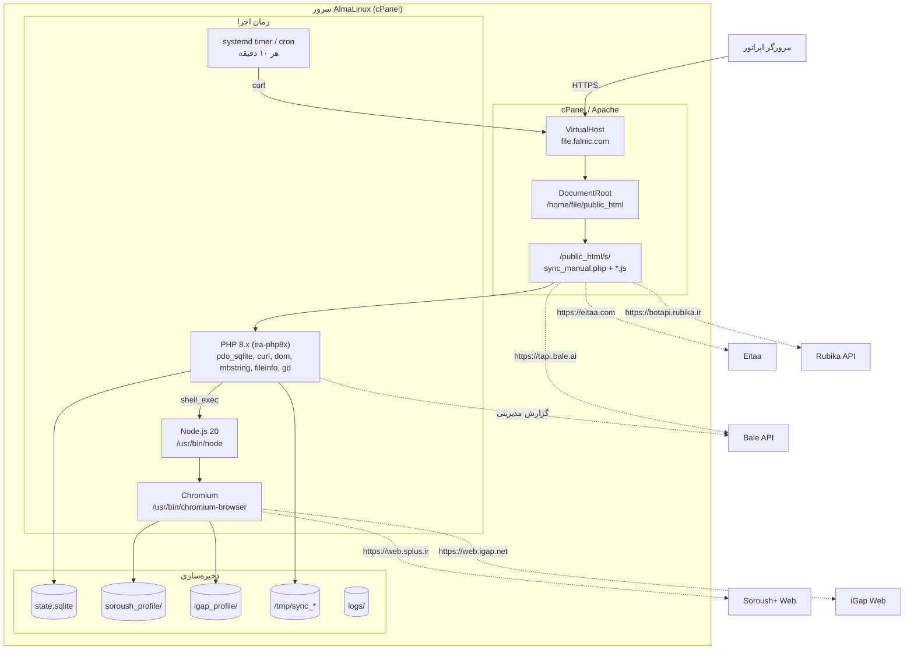

# DEPLOYMENT.md — راهنمای استقرار تولید

> محیط هدف: **AlmaLinux / CentOS 8–9** با **cPanel + Apache (LiteSpeed اختیاری)**، کاربر وب‌سرور `file:file`، مسیر استقرار `/home/file/public_html/s/`.
>
> زمان تقریبی استقرار کامل (با مقداردهی session): **۶۰ تا ۹۰ دقیقه**.
> مستندات مرتبط: [`README.md`](README.md) · [`ARCHITECTURE.md`](ARCHITECTURE.md) · [`PLAYWRIGHT_SPECS.md`](PLAYWRIGHT_SPECS.md) · [`TROUBLESHOOTING.md`](TROUBLESHOOTING.md)

---

## فهرست مطالب

1. [توپولوژی استقرار](#s1)
2. [پیش‌نیازها](#s2)
3. [نصب پکیج‌های سیستم](#s3)
4. [استقرار کد و ساختار دایرکتوری](#s4)
5. [مجوزها و مالکیت](#s5)
6. [پیکربندی PHP و Apache](#s6)
7. [پیکربندی اپلیکیشن](#s7)
8. [مقداردهی اولیهٔ Session](#s8)
9. [اتوماسیون: Cron و Systemd](#s9)
10. [مانیتورینگ و بررسی سلامت](#s10)
11. [مجموعهٔ آزمون پذیرش](#s11)
12. [به‌روزرسانی و رول‌بک](#s12)
13. [چک‌لیست نهایی](#s13)

---

## ۱. توپولوژی استقرار <a id="s1"></a>



**دو مسیر اجرا وجود دارد و باید هر دو تست شوند:**

| مسیر | محرک | کاربرد |
|---|---|---|
| داشبورد وب | انسان، در مرورگر | کنترل دستی، عیب‌یابی بصری، resend |
| `cron_sync.sh` | systemd timer / cron | اجرای بدون اپراتور |

---

## ۲. پیش‌نیازها <a id="s2"></a>

| مورد | حداقل | توصیه |
|---|---|---|
| CPU | ۲ هسته | ۴ هسته (Chromium تک‌هسته‌ای CPU-bound است) |
| RAM | ۲ GB | ۴ GB (هر Chromium ≈ ۳۵۰–۷۰۰ MB + PHP) |
| `/dev/shm` | ۶۴ MB | هرچه بزرگ‌تر بهتر (با `--disable-dev-shm-usage` قابل دور زدن) |
| دیسک | ۵ GB آزاد | ۲۰ GB (پروفایل‌های مرورگر رشد می‌کنند) |
| دسترسی | `root` یا sudo برای نصب پکیج | + دسترسی SSH تعاملی برای OTP |
| شبکه | خروجی باز به دامنه‌های زیر | — |

**دامنه‌هایی که باید در فایروال/CSF مجاز باشند:**

```
eitaa.com                 (منبع)
tapi.bale.ai              (بله)
botapi.rubika.ir          (روبیکا)
*.rubika.ir / rubika-upload CDN (آپلود فایل روبیکا)
api.splus.ir              (تست Bot API سروش)
web.splus.ir + *.splus.ir (وب‌کلاینت سروش‌پلاس)
web.igap.net + *.igap.net (وب‌کلاینت آی‌گپ)
cdn.jsdelivr.net          (فونت Vazirmatn داشبورد)
```

بررسی سریع دسترسی خروجی:

```bash
for h in eitaa.com tapi.bale.ai botapi.rubika.ir api.splus.ir web.splus.ir web.igap.net; do
  printf '%-22s ' "$h"
  curl -s -o /dev/null -w '%{http_code} (%{time_total}s)\n' --max-time 12 "https://$h" || echo "FAIL"
done
```

> اگر سرور پشت **CSF/LFD** است، پورت‌های خروجی ۴۴۳ را بررسی کنید و در صورت نیاز در `/etc/csf/csf.conf` مقدار `TCP_OUT` را شامل `443` نگه دارید، سپس `csf -r`.

---

## ۳. نصب پکیج‌های سیستم <a id="s3"></a>

همهٔ دستورات این بخش با `root` (یا `sudo`) اجرا می‌شوند.

### ۳.۱ مخازن و ابزار پایه

```bash
dnf install -y epel-release
dnf groupinstall -y "Development Tools"
dnf install -y git curl wget jq flock util-linux policycoreutils-python-utils \
               sqlite unzip which tar
dnf -y update ca-certificates
update-ca-trust
```

> `jq` برای `cron_sync.sh` (§۹) **الزامی** است.

### ۳.۲ Chromium

```bash
dnf install -y chromium chromium-headless
```

وابستگی‌های runtime که در محیط minimal اغلب غایب‌اند:

```bash
dnf install -y \
  nss atk at-spi2-atk at-spi2-core cups-libs libdrm libxkbcommon \
  libX11 libXcomposite libXdamage libXext libXfixes libXrandr \
  mesa-libgbm mesa-libEGL alsa-lib pango cairo \
  liberation-fonts
```

**فونت‌های فارسی — برای رندر صحیح متون و اسکرین‌شات‌ها حیاتی است:**

```bash
dnf install -y \
  google-noto-sans-arabic-fonts \
  google-noto-naskh-arabic-fonts \
  google-noto-color-emoji-fonts
fc-cache -fv
fc-list :lang=fa | head
```

> بدون فونت فارسی، Chromium حروف را به‌صورت مربع (tofu) رندر می‌کند. این موضوع بر `insertText()` اثر ندارد (متن در DOM درست درج می‌شود) اما **اسکرین‌شات‌های شاهد** (`last_igap_send.jpg`) ناخوانا می‌شوند و تشخیص خطا را غیرممکن می‌کنند.

بررسی نهایی باینری و وابستگی‌ها:

```bash
ls -l /usr/bin/chromium-browser
/usr/bin/chromium-browser --version
ldd /usr/bin/chromium-browser | grep -c "not found"   # باید 0 باشد
```

اگر مسیر باینری `/usr/bin/chromium` است، یک symlink بسازید (چون در کد، مسیر `/usr/bin/chromium-browser` سخت‌کد شده):

```bash
ln -sf "$(command -v chromium)" /usr/bin/chromium-browser
```

### ۳.۳ Node.js 20

```bash
curl -fsSL https://rpm.nodesource.com/setup_20.x | bash -
dnf install -y nodejs
node -v      # باید v20.x باشد
which node   # باید /usr/bin/node باشد
```

اگر cPanel نسخهٔ دیگری در مسیر متفاوت نصب کرده، مسیر را یکسان‌سازی کنید (چون `NODE_BIN = '/usr/bin/node'`):

```bash
ls -l /usr/bin/node /usr/local/bin/node 2>/dev/null
ln -sf "$(command -v node)" /usr/bin/node
```

### ۳.۴ PHP 8 و اکستنشن‌ها (cPanel / EasyApache 4)

```bash
# نسخهٔ PHP پیش‌فرض دامنه را ببینید
/usr/local/cpanel/bin/whmapi1 get_domain_info 2>/dev/null | head
ea-php81 -v

# اکستنشن‌های موردنیاز
dnf install -y \
  ea-php81-php-pdo \
  ea-php81-php-sqlite3 \
  ea-php81-php-curl \
  ea-php81-php-xml \
  ea-php81-php-mbstring \
  ea-php81-php-fileinfo \
  ea-php81-php-gd \
  ea-php81-php-posix \
  ea-php81-php-process
```

> `ea-php81-php-xml` همزمان `dom`، `libxml`، `xpath` و `simplexml` را فراهم می‌کند.
> اگر از PHP 8.2/8.3 استفاده می‌کنید، `ea-php81-*` را با `ea-php82-*` یا `ea-php83-*` جایگزین کنید.

بررسی:

```bash
ea-php81 -m | grep -Ei 'pdo_sqlite|^curl$|^dom$|libxml|mbstring|fileinfo|^gd$'
```

خروجی مورد انتظار:

```
curl
dom
fileinfo
gd
libxml
mbstring
pdo_sqlite
```

### ۳.۵ بررسی `disable_functions`

cPanel به‌صورت پیش‌فرض ممکن است `shell_exec` را غیرفعال کند — که **کل مسیر سروش‌پلاس و آی‌گپ را از کار می‌اندازد**:

```bash
ea-php81 -i | grep -i 'disable_functions'
```

اگر `shell_exec`، `proc_open` یا `exec` در لیست بود، از مسیر زیر حذف کنید:

```
WHM → MultiPHP INI Editor → Basic Editor → دامنه مورد نظر → disable_functions
```

یا مستقیم در فایل INI کاربر:

```bash
grep -n disable_functions /home/file/.php/81*/php.ini /opt/cpanel/ea-php81/root/etc/php.ini 2>/dev/null
# پس از ویرایش:
/scripts/restartsrv_apache
```

### ۳.۶ نصب وابستگی Node پروژه

```bash
cd /home/file/public_html/s
sudo -u file PLAYWRIGHT_SKIP_BROWSER_DOWNLOAD=1 npm install
sudo -u file node -e "console.log('playwright', require('playwright/package.json').version)"
```

خروجی مورد انتظار: `playwright 1.63.0`

> `PLAYWRIGHT_SKIP_BROWSER_DOWNLOAD=1` از دانلود ~۱۷۰ MB مرورگر اختصاصی جلوگیری می‌کند، چون هر دو اسکریپت `executablePath: '/usr/bin/chromium-browser'` را مشخص کرده‌اند.
>
> اگر `npm install` به‌دلیل دسترسی به رجیستری شکست خورد: `npm config set registry https://registry.npmjs.org/` و در صورت نیاز proxy را در `~/.npmrc` تنظیم کنید.

---

## ۴. استقرار کد و ساختار دایرکتوری <a id="s4"></a>

### ۴.۱ روش الف — Git (توصیه‌شده)

```bash
cd /home/file/public_html
sudo -u file git clone <REPO_URL> s
cd s
sudo -u file git checkout arena/01a0be7e-send-massages   # یا main پس از merge
```

### ۴.۲ روش ب — rsync از ماشین محلی

```bash
rsync -avz --progress \
  --exclude 'node_modules/' \
  --exclude 'soroush_profile/' \
  --exclude 'igap_profile/' \
  --exclude 'soroush_session.json' \
  --exclude 'state.sqlite' \
  --exclude '*.jpg' \
  --exclude 'error_log' \
  ./send-massages/ file@server:/home/file/public_html/s/
```

### ۴.۳ ساخت دایرکتوری‌های runtime

```bash
cd /home/file/public_html/s
sudo -u file mkdir -p logs backups
sudo -u file mkdir -p soroush_profile igap_profile
```

### ۴.۴ فایل‌های لازم پس از استقرار

```bash
ls -1 /home/file/public_html/s
```

خروجی مورد انتظار (فایل‌های کد):

```
ARCHITECTURE.md
DEPLOYMENT.md
PLAYWRIGHT_SPECS.md
README.md
TROUBLESHOOTING.md
.gitignore
inspect_attach.js
inspect_igap.js
login_soroush.js
package-lock.json
package.json
restore_session.js
send_igap.js
send_soroush.js
send_test.php
start_browser.sh
sync_daemon.php
sync_manual.php
test.php
test_img.jpg
test_rubika.php
test_rubika_media.php
test_soroush.php
backups/          logs/          node_modules/
```

---

## ۵. مجوزها و مالکیت <a id="s5"></a>

این بخش **مهم‌ترین** گام استقرار است؛ ریشهٔ خطای `Permission denied (13)` در Chromium (§۷ [`TROUBLESHOOTING.md`](TROUBLESHOOTING.md)).

```bash
APP=/home/file/public_html/s

# ۱) مالکیت کل درخت
chown -R file:file "$APP"

# ۲) مجوز پایه
find "$APP" -type d -exec chmod 755 {} \;
find "$APP" -type f -exec chmod 644 {} \;

# ۳) اسکریپت‌های اجرایی
chmod 750 "$APP"/start_browser.sh "$APP"/cron_sync.sh "$APP"/health_check.sh 2>/dev/null

# ۴) پروفایل‌های مرورگر = اعتبارنامه (محدودترین مجوز ممکن)
chmod 700 "$APP"/soroush_profile "$APP"/igap_profile
find "$APP"/soroush_profile "$APP"/igap_profile -type f -exec chmod 600 {} \;
find "$APP"/soroush_profile "$APP"/igap_profile -type d -exec chmod 700 {} \;

# ۵) پایگاه داده و session
chmod 660 "$APP"/state.sqlite
chmod 600 "$APP"/soroush_session.json "$APP"/config.local.php "$APP"/.cron_key 2>/dev/null

# ۶) پاک‌سازی قفل‌های به‌جامانده از اجراهای قبلی با root
find "$APP" -maxdepth 2 -name 'Singleton*' -ls -delete

# ۷) بازبینی
ls -ld "$APP" "$APP"/{soroush_profile,igap_profile}
ls -l  "$APP"/state.sqlite "$APP"/sync_manual.php
```

**بررسی نهایی با کاربر واقعی وب‌سرور:**

```bash
sudo -u file test -w /home/file/public_html/s/state.sqlite        && echo "sqlite: WRITABLE ✅"
sudo -u file test -w /home/file/public_html/s/soroush_profile     && echo "soroush_profile: WRITABLE ✅"
sudo -u file test -w /home/file/public_html/s/igap_profile        && echo "igap_profile: WRITABLE ✅"
sudo -u file test -w /home/file/public_html/s/logs                && echo "logs: WRITABLE ✅"
sudo -u file /usr/bin/chromium-browser --version                  && echo "chromium: OK ✅"
```

> ⚠️ اگر SELinux فعال است (`getenforce` → `Enforcing`)، Apache ممکن است از اجرای `shell_exec` روی مسیرهای خاص جلوگیری کند:
> ```bash
> ausearch -m avc -ts recent | grep -i httpd
> # در صورت مشاهدهٔ denial:
> setsebool -P httpd_can_network_connect 1
> setsebool -P httpd_execmem 1
> ```

---

## ۶. پیکربندی PHP و Apache <a id="s6"></a>

### ۶.۱ مقادیر `php.ini` مورد نیاز

از **WHM → MultiPHP INI Editor** یا مستقیم در `/home/file/.php/81*/php.ini`:

| Directive | مقدار | دلیل |
|---|---|---|
| `max_execution_time` | `300` | یک `sync_single` با رسانه ≈ ۶۰–۹۰s و در حالت بدبینانه تا ۳۰۰s |
| `max_input_time` | `300` | هم‌تراز با بالا |
| `memory_limit` | `512M` | `DOMDocument` روی HTML ایتا + buffer دانلود |
| `post_max_size` | `64M` | بدنهٔ JSON `sync_single` کوچک است، اما برای تست‌های دستی |
| `upload_max_filesize` | `64M` | — |
| `display_errors` | `Off` (تولید) | در کد `On` است → در تولید خاموش کنید |
| `error_reporting` | `E_ALL & ~E_DEPRECATED` | — |
| `date.timezone` | `Asia/Tehran` | در کد هم با `date_default_timezone_set` تنظیم شده |
| `disable_functions` | **بدون** `shell_exec` | §۳.۵ |

### ۶.۲ تایم‌اوت‌های Apache / Proxy

```bash
grep -RniE '^\s*(Timeout|ProxyTimeout)\b' /etc/httpd/conf/httpd.conf /etc/httpd/conf.d/ 2>/dev/null
```

مقادیر توصیه‌شده در `/etc/apache2/conf.d/userdata/std/2_4/file/<domain>/*.conf` (مسیر cPanel برای تنظیمات اختصاصی vhost):

```apache
Timeout 600
ProxyTimeout 600
```

سپس:

```bash
/scripts/restartsrv_apache
```

اگر از **LiteSpeed** استفاده می‌کنید، در `/usr/local/lsws/conf/httpd_config.conf`:

```
rollingTimeout 600
```

### ۶.۳ محافظت از مسیر با `.htaccess`

فایل `/home/file/public_html/s/.htaccess` را بسازید:

```apache
Options -Indexes -ExecCGI

# ۱) مسدودسازی هر چیزی که اعتبارنامه یا state است
<FilesMatch "\.(sqlite|sqlite3|sqlite-journal|sqlite-wal|json|log|sh|ini|env|key|pem)$">
    Require all denied
</FilesMatch>

# ۲) مسدودسازی دامپ DOM و اسکرین‌شات‌های شاهد
<FilesMatch "\.(jpg|jpeg|png|html)$">
    Require all denied
</FilesMatch>

# ۳) باز کردن صریح فقط نقاط ورود مجاز
<FilesMatch "^(sync_manual|test|test_rubika|test_rubika_media|test_soroush|send_test)\.php$">
    Require all granted
</FilesMatch>

# ۴) محدودسازی IP داشبورد (اختیاری اما اکیداً توصیه‌شده)
# <Files "sync_manual.php">
#     Require ip 203.0.113.45
#     Require ip 198.51.100.0/24
# </Files>

<IfModule mod_headers.c>
    Header set X-Robots-Tag "noindex, nofollow, noarchive, nosnippet"
    Header set Referrer-Policy "no-referrer"
    Header set X-Content-Type-Options "nosniff"
</IfModule>

<IfModule mod_expires.c>
    ExpiresActive Off
</IfModule>
```

```bash
chown file:file /home/file/public_html/s/.htaccess
chmod 644 /home/file/public_html/s/.htaccess
```

**تأیید:**

```bash
BASE="https://your-domain/s"
for u in state.sqlite soroush_session.json igap_dump.html step2.jpg last_igap_send.jpg \
         send_soroush.js start_browser.sh error_log; do
  printf '%-28s → %s\n' "$u" "$(curl -s -o /dev/null -w '%{http_code}' "$BASE/$u")"
done
```

همه باید `403` باشند. سپس:

```bash
curl -s -o /dev/null -w '%{http_code}\n' "$BASE/sync_manual.php?key=WRONG"   # 403
curl -s -o /dev/null -w '%{http_code}\n' "$BASE/sync_manual.php?key=RIGHT"   # 200
```

> ⚠️ `AllowOverride` باید شامل `FileInfo` و `AuthConfig` باشد. اگر `.htaccess` بی‌اثر بود:
> ```bash
> grep -RniE 'AllowOverride' /etc/httpd/conf/httpd.conf /etc/apache2/conf/httpd.conf 2>/dev/null
> ```

---

## ۷. پیکربندی اپلیکیشن <a id="s7"></a>

### ۷.۱ ویرایش ثابت‌ها

```bash
cp sync_manual.php sync_manual.php.bak.$(date +%F)
nano sync_manual.php
```

حداقل تغییرات لازم:

| ثابت | اقدام |
|---|---|
| `SECURITY_KEY` | یک رشتهٔ تصادفی ≥ ۳۲ کاراکتر |
| `BALE_BOT_TOKEN` | توکن جدید بات بله (از @BotFather بله) |
| `BALE_CHANNEL_ID` | کانال مقصد نهایی (نه `@testforme`) |
| `BALE_ADMIN_CHAT_ID` | شناسهٔ عددی کاربر مدیر |
| `RUBIKA_BOT_TOKEN` | توکن جدید بات روبیکا |
| `RUBIKA_CHANNEL_ID` | کانال مقصد روبیکا |
| `SOROUSH_CHANNEL_ID` | نام کاربری کانال سروش‌پلاس بدون `@` |
| `IGAP_CHANNEL_ID` | نام کاربری کانال آی‌گپ بدون `@` |

تولید کلید تصادفی امن:

```bash
head -c 48 /dev/urandom | base64 | tr -d '/+=\n' | cut -c1-40
```

دریافت `BALE_ADMIN_CHAT_ID` عددی:

```bash
TOKEN='<BALE_BOT_TOKEN>'
curl -s "https://tapi.bale.ai/bot${TOKEN}/getUpdates" | jq '.result[-1].message.chat | {id, title, username}'
```

> اگر پاسخ خالی بود، ابتدا یک پیام به بات بدهید یا بات را ادمین کانال کنید، سپس دوباره `getUpdates` را بخوانید.

### ۷.۲ اعتبارسنجی سینتکس پس از هر ویرایش

```bash
ea-php81 -l /home/file/public_html/s/sync_manual.php
```

خروجی لازم: `No syntax errors detected in /home/file/public_html/s/sync_manual.php`

> 🔴 **این گام را هرگز رد نکنید.** سابقهٔ خطای ثبت‌شده در `error_log`:
> ```
> PHP Parse error: syntax error, unexpected fully qualified name "\vert" in .../sync_manual.php on line 180
> ```
> یک backslash خام در رشتهٔ قالب بود که داشبورد را کاملاً از کار انداخت. §۷.۱ [`ARCHITECTURE.md`](ARCHITECTURE.md) را ببینید.

### ۷.۳ مسیرهای مطلق

کد از مسیر مطلق `/home/file/public_html/s/...` استفاده می‌کند (در `SOROUSH_SCRIPT`، `IGAP_SCRIPT` و `userDataDir` هر دو اسکریپت Node). اگر نام کاربری یا مسیر شما متفاوت است، این چهار نقطه را ویرایش کنید:

```bash
grep -rn '/home/file/public_html/s' --include='*.php' --include='*.js' --include='*.sh' .
```

جایگزینی دسته‌جمعی (با پشتیبان‌گیری):

```bash
cd /home/file/public_html/s
cp -a . ../s.bak.$(date +%F)
grep -rl '/home/file/public_html/s' --include='*.php' --include='*.js' --include='*.sh' . \
  | xargs -r sed -i 's#/home/file/public_html/s#/home/USER/public_html/s#g'
ea-php81 -l sync_manual.php && node --check send_soroush.js && node --check send_igap.js
```

---

## ۸. مقداردهی اولیهٔ Session <a id="s8"></a>

هر دو UserBot نیاز به یک **حساب کاربری واردشده** دارند. session در پروفایل پایدار Chromium ذخیره می‌شود و تا زمانی که از سمت پلتفرم باطل نشود، زنده می‌ماند.

### ۸.۱ سروش‌پلاس با `login_soroush.js` (تعاملی)

اسکریپت موجود، ورود را به‌صورت نیمه‌خودکار انجام می‌دهد و در سه نقطه از اپراتور ورودی می‌گیرد:

```bash
cd /home/file/public_html/s
sudo -u file /usr/bin/node login_soroush.js
```

مراحل:

| گام | پرسش/اقدام اسکریپت | پاسخ اپراتور |
|---|---|---|
| ۱ | `=> Enter your mobile number without zero (e.g. 9905367498):` | شماره بدون صفر پیرو |
| ۲ | اسکرین‌شات `step_filled.jpg` نوشته می‌شود | بررسی بصری از طریق URL چاپ‌شده |
| ۳ | کشور روی `Iran` تنظیم و دکمهٔ «بعدی» زده می‌شود | — |
| ۴ | `=> Enter the verification code:` | کد OTP از پیامک یا تلگرام |
| ۵ | ۱۲ ثانیه انتظار و اسکرین‌شات `step3.jpg` | تأیید ورود موفق |

**چگونه اسکرین‌شات‌ها را ببینیم؟**

- **روش ۱ (توصیه‌شده — امن):** کپی روی ماشین محلی
  ```bash
  scp file@server:/home/file/public_html/s/step*.jpg ./
  ```
- **روش ۲:** URL عمومی — فقط اگر `.htaccess` هنوز نصب نشده باشد؛ در غیر این صورت مسدود است (که درست است).
- **روش ۳ (دیباگ زنده بصری):** تونل SSH به پورت دیباگ Chromium:
  ```bash
  # روی سرور (موقت، فقط 127.0.0.1 — نه 0.0.0.0)
  sudo -u file /usr/bin/chromium-browser \
    --remote-debugging-port=9222 --remote-debugging-address=127.0.0.1 \
    --user-data-dir=/home/file/public_html/s/soroush_profile \
    --no-sandbox --disable-setuid-sandbox --disable-dev-shm-usage --disable-gpu \
    --headless=new https://web.splus.ir &

  # روی ماشین محلی
  ssh -N -L 9222:127.0.0.1:9222 file@server
  # سپس در Chrome محلی:  http://127.0.0.1:9222  → انتخاب target → DevTools زنده
  ```
  پس از پایان دیباگ حتماً مرورگر را ببندید:
  ```bash
  pkill -f 'remote-debugging-port=9222'
  ```

> 🔴 `start_browser.sh` موجود در ریپو از `--remote-debugging-address=0.0.0.0` استفاده می‌کند. **پروتکل CDP هیچ احراز هویتی ندارد** و باز بودن آن روی همهٔ اینترفیس‌ها یعنی کنترل کامل حساب کاربری شما از اینترنت. پیش از هر اجرای production آن را به `127.0.0.1` تغییر دهید و پورت را در فایروال ببندید:
> ```bash
> sed -i 's/--remote-debugging-address=0.0.0.0/--remote-debugging-address=127.0.0.1/' start_browser.sh
> csf -d 9222 "CDP debug port - blocked" && csf -r    # یا: firewall-cmd --permanent --remove-port=9222/tcp
> ss -lntp | grep 9222                                  # باید خالی یا فقط 127.0.0.1 باشد
> ```

### ۸.۲ آی‌گپ (اسکریپت ورود)

ریپو فعلی اسکریپت ورود اختصاصی آی‌گپ ندارد؛ `igap_profile/` باید یک‌بار به‌صورت دستی مقداردهی شود. اسکریپت زیر را در `/home/file/public_html/s/login_igap.js` ذخیره کنید (الگویی دقیقاً مشابه `login_soroush.js`، متناسب با `web.igap.net`):

```javascript
// login_igap.js — ورود تعاملی به آی‌گپ و ساخت igap_profile
const { chromium } = require('playwright');
const readline = require('readline').createInterface({ input: process.stdin, output: process.stdout });
const question = (q) => new Promise(r => readline.question(q, r));
const delay = (ms) => new Promise(r => setTimeout(r, ms));

(async () => {
    const userDataDir = '/home/file/public_html/s/igap_profile';

    const browser = await chromium.launchPersistentContext(userDataDir, {
        executablePath: '/usr/bin/chromium-browser',
        args: ['--no-sandbox', '--disable-setuid-sandbox', '--disable-dev-shm-usage', '--disable-gpu'],
        headless: true,
        viewport: { width: 1440, height: 900 },
        userAgent: 'Mozilla/5.0 (Windows NT 10.0; Win64; x64) AppleWebKit/537.36 (KHTML, like Gecko) Chrome/120.0.0.0 Safari/537.36'
    });

    const page = browser.pages()[0] || await browser.newPage();
    console.log('[*] Opening https://web.igap.net ...');
    await page.goto('https://web.igap.net', { waitUntil: 'domcontentloaded', timeout: 60000 });
    await delay(8000);
    await page.screenshot({ path: '/home/file/public_html/s/igap_login_step1.jpg' });

    // ۱) شماره موبایل
    const phone = (await question('=> شماره موبایل (مثلاً 09123456789): ')).trim();
    const phoneInput = page.locator('input[type="tel"], input[placeholder*="موبایل"], input[placeholder*="شماره"], input').first();
    await phoneInput.waitFor({ state: 'visible', timeout: 15000 });
    await phoneInput.click({ force: true });
    await phoneInput.fill(phone);
    await delay(800);
    await page.screenshot({ path: '/home/file/public_html/s/igap_login_step2.jpg' });

    // ۲) دکمهٔ ادامه / ورود
    const nextBtn = page.locator('button:has-text("ادامه"), button:has-text("ورود"), button[type="submit"]').first();
    await nextBtn.click({ force: true });
    console.log('[*] Waiting for OTP step...');
    await delay(6000);
    await page.screenshot({ path: '/home/file/public_html/s/igap_login_step3.jpg' });
    console.log('[!] اسکرین‌شات: igap_login_step3.jpg (با scp منتقل کنید)');

    // ۳) کد تأیید
    const otp = (await question('=> کد تأیید دریافتی: ')).trim();
    const otpInput = page.locator('input').first();
    await otpInput.click({ force: true });
    await page.keyboard.type(otp, { delay: 120 });
    await delay(15000);
    await page.screenshot({ path: '/home/file/public_html/s/igap_login_step4.jpg' });

    // ۴) تأیید حضور کانال هدف در لیست
    const channel = page.locator('span:has-text("شمیم آشنا"), div[data-list-item-id="16200343869985976"]').first();
    const visible = await channel.isVisible().catch(() => false);
    console.log(visible
        ? '[+] ورود موفق — کانال هدف در لیست دیده شد.'
        : '[!] ورود احتمالاً موفق بوده اما کانال هدف در لیست دیده نشد؛ اسکرین‌شات step4 را بررسی کنید.');

    await browser.close();
    readline.close();
})();
```

اجرا:

```bash
cd /home/file/public_html/s
chown file:file login_igap.js && chmod 644 login_igap.js
sudo -u file /usr/bin/node login_igap.js
```

سپس اسکرین‌شات‌ها را ببینید و صحت ورود را تأیید کنید:

```bash
scp file@server:/home/file/public_html/s/igap_login_step*.jpg ./
```

### ۸.۳ پشتیبان‌گیری و بازگردانی session

**پس از ورود موفق، بلافاصله پشتیبان بگیرید:**

```bash
cd /home/file/public_html/s
tar -czf backups/sessions_$(date +%F_%H%M).tar.gz \
    soroush_profile igap_profile soroush_session.json state.sqlite
chmod 600 backups/*.tar.gz
ls -lh backups/
```

**بازگردانی:**

```bash
cd /home/file/public_html/s
pkill -f chromium || true
find . -maxdepth 2 -name 'Singleton*' -delete
tar -xzf backups/sessions_2026-09-20_1200.tar.gz
chown -R file:file soroush_profile igap_profile state.sqlite
```

**بازگردانی session سروش از فایل JSON** (اگر پروفایل آسیب دیده اما `soroush_session.json` سالم است):

```bash
sudo -u file /usr/bin/node restore_session.js
# خروجی: step_restored.jpg
```

این اسکریپت `localStorage`، `sessionStorage` و همهٔ دیتابیس‌های `indexedDB` را از فایل پشتیبان تزریق و صفحه را reload می‌کند.

### ۸.۴ مقداردهی اولیهٔ `state.sqlite`

**بدون این گام، اولین اجرا ۷ پست قدیمی کانال را دوباره منتشر می‌کند.**

```bash
cd /home/file/public_html/s

# ۱) ساخت جدول
sudo -u file sqlite3 state.sqlite \
  "CREATE TABLE IF NOT EXISTS sync_state (channel TEXT PRIMARY KEY, last_msg_id INTEGER NOT NULL);"

# ۲) خواندن آخرین شناسهٔ فعلی کانال
LAST=$(curl -s "https://file.falnic.com/s/test.php?ch=shamimeashena" \
        | jq -r '.messages[0].id // empty')
echo "آخرین پست کانال ایتا: $LAST"

# ۳) ثبت به‌عنوان نقطهٔ شروع
sudo -u file sqlite3 state.sqlite \
  "INSERT INTO sync_state (channel, last_msg_id) VALUES ('shamimeashena', ${LAST:-0})
   ON CONFLICT(channel) DO UPDATE SET last_msg_id = ${LAST:-0};"

# ۴) تأیید
sudo -u file sqlite3 state.sqlite "SELECT * FROM sync_state;"
chmod 660 state.sqlite && chown file:file state.sqlite
```

> اگر `test.php` در دسترس نیست، شناسه را از URL آخرین پست بخوانید:
> `https://eitaa.com/s/shamimeashena/74124` → شناسه `74124`.

---

## ۹. اتوماسیون: Cron و Systemd <a id="s9"></a>

داشبورد وب برای اجرای **دستی** است. برای اجرای خودکار، از اسکریپت زیر استفاده کنید که دقیقاً همان سه اندپوینت را با `curl` صدا می‌زند.

### ۹.۱ `cron_sync.sh`

```bash
cat > /home/file/public_html/s/cron_sync.sh <<'SCRIPT'
#!/usr/bin/env bash
# ============================================================
#  cron_sync.sh — رانندهٔ بدون مرورگر برای sync_manual.php
#  get_pending → sync_single (×N) → send_report
# ============================================================
set -uo pipefail

APP_DIR="/home/file/public_html/s"
BASE_URL="https://file.falnic.com/s/sync_manual.php"   # ← دامنهٔ خود
KEY_FILE="${APP_DIR}/.cron_key"
LOG_DIR="${APP_DIR}/logs"
LOG_FILE="${LOG_DIR}/cron_sync.log"
LOCK_FILE="/tmp/cron_sync.lock"

export HOME="/home/file"
export LANG="en_US.UTF-8"                              # برای نام فایل‌های فارسی ضروری است
export LC_ALL="en_US.UTF-8"

mkdir -p "$LOG_DIR"
log() { printf '[%s] %s\n' "$(date '+%Y-%m-%d %H:%M:%S')" "$*" >>"$LOG_FILE"; }

# --- قفل اجرای یکتا (جلوگیری از هم‌پوشانی دو اجرای هم‌زمان) ---
exec 9>"$LOCK_FILE"
if ! flock -n 9; then
  log "SKIP: اجرای قبلی هنوز در جریان است"
  exit 0
fi

if [[ ! -r "$KEY_FILE" ]]; then
  log "FATAL: فایل کلید $KEY_FILE وجود ندارد یا خواندنی نیست"
  exit 1
fi
KEY="$(tr -d '\n\r' <"$KEY_FILE")"

# --- ۱) دریافت صف ---
PENDING="$(curl -sS --max-time 60 "${BASE_URL}?action=get_pending&key=${KEY}" 2>>"$LOG_FILE")"
if [[ -z "$PENDING" ]]; then
  log "ERROR: پاسخ خالی از get_pending (تایم‌اوت یا خطای Apache)"
  exit 1
fi
if [[ "$(jq -r '.success // false' <<<"$PENDING")" != "true" ]]; then
  log "ERROR: get_pending → $(jq -r '.error // "نامشخص"' <<<"$PENDING")"
  exit 1
fi

COUNT="$(jq -r '.count // 0' <<<"$PENDING")"
if [[ "$COUNT" -eq 0 ]]; then
  log "OK: پیام جدیدی نیست (lastSeenId=$(jq -r '.lastSeenId' <<<"$PENDING"))"
  exit 0
fi
log "START: ${COUNT} پست جدید"

# --- ۲) پردازش ترتیبی هر پست ---
FAIL=0
REPORT=""
for ((i = 0; i < COUNT; i++)); do
  PAYLOAD="$(jq -c ".messages[$i]" <<<"$PENDING")"
  MID="$(jq -r '.id' <<<"$PAYLOAD")"

  RESULT="$(curl -sS --max-time 300 -X POST \
              -H 'Content-Type: application/json' \
              --data "$PAYLOAD" \
              "${BASE_URL}?action=sync_single&key=${KEY}" 2>>"$LOG_FILE")"

  if ! jq -e '.success' >/dev/null 2>&1 <<<"$RESULT"; then
    log "ERROR: پاسخ نامعتبر برای پست ${MID}: ${RESULT:0:200}"
    FAIL=$((FAIL + 1))
    continue
  fi

  B="$(jq -r '.bale.ok'    <<<"$RESULT")"
  R="$(jq -r '.rubika.ok'  <<<"$RESULT")"
  S="$(jq -r '.soroush.ok' <<<"$RESULT")"
  G="$(jq -r '.igap.ok'    <<<"$RESULT")"
  SB_DETAIL="$(jq -r '.soroush.info // ""' <<<"$RESULT" | head -c 160)"
  IG_DETAIL="$(jq -r '.igap.info   // ""' <<<"$RESULT" | head -c 160)"

  log "POST ${MID} → bale=${B} rubika=${R} soroush=${S} igap=${G}"
  [[ "$S" != "true" ]] && log "   soroush.detail: ${SB_DETAIL}"
  [[ "$G" != "true" ]] && log "   igap.detail: ${IG_DETAIL}"
  [[ "$B$R$S$G" != *"true"* ]] && FAIL=$((FAIL + 1))

  mark() { [[ "$1" == "true" ]] && echo "✅" || echo "❌"; }
  REPORT+="🔹 پست ${MID}: بله $(mark "$B") | روبیکا $(mark "$R") | سروش $(mark "$S") | آی‌گپ $(mark "$G")"$'\n'
done

# --- ۳) گزارش مدیریتی به بله ---
jq -n --arg r "$REPORT" '{report: [$r]}' \
  | curl -sS --max-time 30 -X POST -H 'Content-Type: application/json' \
      --data @- "${BASE_URL}?action=send_report&key=${KEY}" >>"$LOG_FILE" 2>&1

log "DONE: ${COUNT} پست پردازش شد، ${FAIL} مورد با شکست کامل"
SCRIPT

chown file:file /home/file/public_html/s/cron_sync.sh
chmod 750 /home/file/public_html/s/cron_sync.sh

# ذخیرهٔ کلید دسترسی در فایل مجزا (به‌جای hard-code در اسکریپت)
echo -n 'SECURITY_KEY_خود_را_اینجا_بگذارید' > /home/file/public_html/s/.cron_key
chown file:file /home/file/public_html/s/.cron_key
chmod 600 /home/file/public_html/s/.cron_key
```

**اجرای آزمایشی:**

```bash
sudo -u file bash /home/file/public_html/s/cron_sync.sh
tail -30 /home/file/public_html/s/logs/cron_sync.log
```

### ۹.۲ گزینهٔ الف — Cron (ساده‌ترین، سازگار با cPanel)

```bash
crontab -e -u file
```

```cron
# محیط اجرا
SHELL=/bin/bash
PATH=/usr/local/bin:/usr/bin:/bin
HOME=/home/file
LANG=en_US.UTF-8
MAILTO=""

# هر ۱۰ دقیقه — همگام‌سازی محتوا
*/10 * * * * /usr/bin/flock -n /tmp/cron_sync_outer.lock /home/file/public_html/s/cron_sync.sh >/dev/null 2>&1

# هر روز ساعت ۰۴:۳۰ — بررسی سلامت
30 4 * * * /home/file/public_html/s/health_check.sh >/dev/null 2>&1

# هر روز ساعت ۰۴:۵۵ — پاک‌سازی فایل‌های موقت و چرخش لاگ
55 4 * * * find /tmp -maxdepth 1 -name 'sync_*' -mmin +180 -delete; \
           find /home/file/public_html/s -maxdepth 2 -name 'Singleton*' -delete; \
           /usr/bin/logrotate -s /home/file/.logrotate.status /home/file/public_html/s/logrotate.conf >/dev/null 2>&1
```

> در cPanel می‌توانید همان خطوط را در **cPanel → Cron Jobs** وارد کنید؛ فقط توجه کنید که cPanel دستور را با `sh -c` اجرا می‌کند، بنابراین مسیرهای مطلق (`/usr/bin/flock`) الزامی است.

### ۹.۳ گزینهٔ ب — systemd (توصیه‌شده برای لاگ و کنترل بهتر)

```bash
cat > /etc/systemd/system/eitaa-sync.service <<'UNIT'
[Unit]
Description=Eitaa to Bale/Rubika/Soroush/iGap content syndication
Documentation=file:///home/file/public_html/s/DEPLOYMENT.md
After=network-online.target
Wants=network-online.target

[Service]
Type=oneshot
User=file
Group=file
WorkingDirectory=/home/file/public_html/s
Environment=HOME=/home/file
Environment=LANG=en_US.UTF-8
Environment=LC_ALL=en_US.UTF-8
ExecStart=/home/file/public_html/s/cron_sync.sh
TimeoutStartSec=1800
Nice=10
IOSchedulingClass=best-effort
IOSchedulingPriority=6
PrivateTmp=false
NoNewPrivileges=true
UNIT

cat > /etc/systemd/system/eitaa-sync.timer <<'UNIT'
[Unit]
Description=Run eitaa-sync every 10 minutes

[Timer]
OnBootSec=3min
OnUnitActiveSec=10min
AccuracySec=30s
RandomizedDelaySec=60s
Persistent=true
Unit=eitaa-sync.service

[Install]
WantedBy=timers.target
UNIT

systemctl daemon-reload
systemctl enable --now eitaa-sync.timer
systemctl list-timers eitaa-sync.timer --no-pager
```

**اجرای دستی یک‌باره و مشاهدهٔ نتیجه:**

```bash
systemctl start eitaa-sync.service
journalctl -u eitaa-sync.service -n 50 --no-pager
```

> ⚠️ `PrivateTmp=false` **الزامی** است: اگر `true` باشد، systemd یک `/tmp` ایزوله می‌سازد و فایل موقت رسانه که PHP در آن می‌نویسد، برای subprocess Node (که در همان سرویس است) قابل دیدن است اما بین اجراهای مختلف ناپایدار — و مهم‌تر، مسیرهای `/tmp/sync_*` در لاگ‌ها با واقعیت دیسک نمی‌خوانند و عیب‌یابی را سخت می‌کنند.
>
> ⚠️ `NoNewPrivileges=true` با `shell_exec` سازگار است، اما اگر بعدها به `sudo` داخل اسکریپت نیاز پیدا کردید، باید آن را `false` کنید.

### ۹.۴ گزینهٔ ج — daemon بلندمدت (`sync_daemon.php`)

این مسیر **legacy** است و فقط بله + روبیکا را پوشش می‌دهد (`ENABLE_SOROUSH = false`). تنها در صورتی استفاده کنید که UserBot ها لازم نیستند:

```bash
cat > /etc/systemd/system/eitaa-daemon.service <<'UNIT'
[Unit]
Description=Eitaa broadcast daemon (Bale + Rubika only)
After=network-online.target

[Service]
Type=simple
User=file
Group=file
WorkingDirectory=/home/file/public_html/s
Environment=HOME=/home/file
Environment=LANG=en_US.UTF-8
ExecStart=/usr/bin/ea-php81 /home/file/public_html/s/sync_daemon.php
Restart=always
RestartSec=15
StandardOutput=append:/home/file/public_html/s/logs/daemon.log
StandardError=append:/home/file/public_html/s/logs/daemon-error.log

[Install]
WantedBy=multi-user.target
UNIT

systemctl daemon-reload
systemctl enable --now eitaa-daemon.service
journalctl -u eitaa-daemon -f
```

> مسیر باینری PHP در cPanel معمولاً `/usr/bin/ea-php81` یا `/opt/cpanel/ea-php81/root/usr/bin/php` است. با `ls /usr/bin/ea-php*` مسیر دقیق را پیدا کنید.
>
> اگر daemon و cron هم‌زمان فعال باشند، **هر دو روی یک `state.sqlite` می‌نویسند** و ممکن است یک پست دوبار منتشر شود. فقط یکی را فعال کنید.

### ۹.۵ چرخش لاگ

```bash
cat > /home/file/public_html/s/logrotate.conf <<'CONF'
/home/file/public_html/s/logs/*.log
/home/file/public_html/s/error_log
{
    daily
    rotate 14
    compress
    delaycompress
    missingok
    notifempty
    copytruncate
    maxsize 50M
}
CONF
chown file:file /home/file/public_html/s/logrotate.conf
chmod 644 /home/file/public_html/s/logrotate.conf
```

---

## ۱۰. مانیتورینگ و بررسی سلامت <a id="s10"></a>

### ۱۰.۱ `health_check.sh`

```bash
cat > /home/file/public_html/s/health_check.sh <<'SCRIPT'
#!/usr/bin/env bash
# health_check.sh — بررسی سلامت زیرساخت + ارسال هشدار به مدیر در بله
set -uo pipefail

APP_DIR="/home/file/public_html/s"
LOG_FILE="${APP_DIR}/logs/health.log"
KEY_FILE="${APP_DIR}/.cron_key"
BASE_URL="https://file.falnic.com/s/sync_manual.php"
export LANG="en_US.UTF-8"

mkdir -p "${APP_DIR}/logs"
PROBLEMS=()

chk() {  # chk "شرح" "دستور شرط"
  if eval "$2" >/dev/null 2>&1; then
    printf '  [OK]   %s\n' "$1" | tee -a "$LOG_FILE"
  else
    printf '  [FAIL] %s\n' "$1" | tee -a "$LOG_FILE"
    PROBLEMS+=("$1")
  fi
}

echo "=== $(date '+%F %T') بررسی سلامت ===" | tee -a "$LOG_FILE"

chk "باینری node"                'test -x /usr/bin/node'
chk "باینری chromium-browser"    'test -x /usr/bin/chromium-browser'
chk "اکستنشن pdo_sqlite"         'ea-php81 -m | grep -qx pdo_sqlite'
chk "shell_exec فعال است"        "! ea-php81 -i | grep -i disable_functions | grep -q shell_exec"
chk "state.sqlite خواندنی/نوشتنی" 'test -r ${APP_DIR}/state.sqlite && test -w ${APP_DIR}/state.sqlite'
chk "soroush_profile نوشتنی"     'test -w ${APP_DIR}/soroush_profile'
chk "igap_profile نوشتنی"        'test -w ${APP_DIR}/igap_profile'
chk "مالکیت profile = file"      'stat -c %U ${APP_DIR}/igap_profile | grep -qx file'
chk "بدون Singleton باقی‌مانده"   'test -z "$(find ${APP_DIR} -maxdepth 2 -name "Singleton*" -print -quit)"'
chk "فضای دیسک > 1GB"            'test "$(df -BM --output=avail /home | tail -1 | tr -dc 0-9)" -gt 1024'
chk "رم آزاد > 500MB"            'test "$(free -m | awk "/^Mem:/{print \$7}")" -gt 500'
chk "بدون فرایند chromium یتیم"  'test "$(pgrep -c -f chromium 2>/dev/null || echo 0)" -lt 20'
chk "دسترسی به ایتا"             'curl -s -o /dev/null --max-time 15 -w "%{http_code}" https://eitaa.com/shamimeashena | grep -q 200'
chk "دسترسی به API بله"          'curl -s -o /dev/null --max-time 15 https://tapi.bale.ai'
chk "دسترسی به API روبیکا"       'curl -s -o /dev/null --max-time 15 https://botapi.rubika.ir'
chk "دسترسی به web.splus.ir"     'curl -s -o /dev/null --max-time 20 -w "%{http_code}" https://web.splus.ir | grep -qE "200|301|302"'
chk "دسترسی به web.igap.net"     'curl -s -o /dev/null --max-time 20 -w "%{http_code}" https://web.igap.net | grep -qE "200|301|302"'
chk "session سروش تازه (< 30 روز)" 'test -n "$(find ${APP_DIR}/soroush_profile -name Cookies -mtime -30 -print -quit 2>/dev/null)"'
chk "session آی‌گپ تازه (< 30 روز)" 'test -n "$(find ${APP_DIR}/igap_profile -name Cookies -mtime -30 -print -quit 2>/dev/null)"'
chk "get_pending پاسخ می‌دهد"     'curl -s --max-time 60 "${BASE_URL}?action=get_pending&key=$(cat ${KEY_FILE})" | grep -q "\"success\""'

echo "-------------------------------------" | tee -a "$LOG_FILE"

if [[ ${#PROBLEMS[@]} -eq 0 ]]; then
  echo "RESULT: HEALTHY ✅" | tee -a "$LOG_FILE"
  exit 0
fi

echo "RESULT: ${#PROBLEMS[@]} مشکل ⚠️" | tee -a "$LOG_FILE"
printf '  - %s\n' "${PROBLEMS[@]}" | tee -a "$LOG_FILE"

# هشدار به مدیر در بله (بدون نیاز به کانال)
MSG="⚠️ هشدار سلامت سیستم همگام‌سازی
زمان: $(date '+%F %T')
موارد ناموفق:
$(printf '• %s\n' "${PROBLEMS[@]}")"
jq -n --arg t "$MSG" '{report:[$t]}' \
  | curl -s --max-time 30 -X POST -H 'Content-Type: application/json' \
      --data @- "${BASE_URL}?action=send_report&key=$(cat ${KEY_FILE})" >/dev/null

exit 1
SCRIPT

chown file:file /home/file/public_html/s/health_check.sh
chmod 750 /home/file/public_html/s/health_check.sh
sudo -u file bash /home/file/public_html/s/health_check.sh
```

### ۱۰.۲ مانیتورینگ زنده

```bash
# لاگ کرون
tail -f /home/file/public_html/s/logs/cron_sync.log

# خطاهای PHP
tail -f /home/file/public_html/s/error_log

# لاگ Apache
tail -f /etc/apache2/logs/error_log /usr/local/apache/logs/error_log 2>/dev/null

# وضعیت systemd
systemctl status eitaa-sync.timer eitaa-sync.service --no-pager
journalctl -u eitaa-sync.service --since "1 hour ago" --no-pager

# فرایندهای Chromium در حال اجرا
ps -eo pid,user,etime,rss,cmd | grep -E 'chromium|send_(soroush|igap)' | grep -v grep

# وضعیت state
sqlite3 /home/file/public_html/s/state.sqlite "SELECT channel, last_msg_id FROM sync_state;"
```

### ۱۰.۳ شاخص‌های کلیدی که باید رصد شوند

| شاخص | آستانهٔ هشدار | منبع |
|---|---|---|
| نرخ موفقیت هر پلتفرم | < ۹۰٪ در ۲۴ ساعت | `logs/cron_sync.log` |
| مدت زمان یک `sync_single` | > ۱۸۰ ثانیه | `curl -w '%{time_total}'` |
| سن session | > ۳۰ روز | `find ... -mtime -30` |
| `last_msg_id` بی‌حرکت | > ۴۸ ساعت با وجود پست جدید در ایتا | مقایسهٔ `state.sqlite` با `test.php` |
| فضای `/home` | < ۱ GB | `df -h /home` |
| تعداد فرایند chromium | > ۵ به‌صورت هم‌زمان | `pgrep -c chromium` |

---

## ۱۱. مجموعهٔ آزمون پذیرش <a id="s11"></a>

این آزمون‌ها را **به ترتیب** اجرا کنید. هر مرحله باید قبل از رفتن به مرحلهٔ بعد سبز شود.

| # | آزمون | دستور | معیار پذیرش |
|---|---|---|---|
| T-1 | باینری‌ها | `/usr/bin/node -v && /usr/bin/chromium-browser --version` | `v20.x` + نسخهٔ Chromium |
| T-2 | Playwright | `cd /home/file/public_html/s && sudo -u file node -e "require('playwright');console.log('OK')"` | `OK` |
| T-3 | اکستنشن‌های PHP | `ea-php81 -m \| grep -E 'pdo_sqlite\|curl\|dom\|mbstring\|fileinfo\|gd'` | ۶ مورد |
| T-4 | نوشتن SQLite | `sudo -u file ea-php81 -r '$d=new PDO("sqlite:/home/file/public_html/s/state.sqlite");$d->exec("CREATE TABLE IF NOT EXISTS sync_state(channel TEXT PRIMARY KEY,last_msg_id INTEGER NOT NULL)");echo "OK\n";'` | `OK` |
| T-5 | پارسر ایتا | `curl -s "https://your-domain/s/test.php?ch=shamimeashena" \| jq '.total_fetched, .latest_post_id'` | عدد > ۰ |
| T-6 | بله (متن) | `curl -sS -X POST "https://tapi.bale.ai/bot<TOKEN>/sendMessage" -H 'Content-Type: application/json' -d '{"chat_id":"@testforme","text":"acceptance T-6"}' \| jq .ok` | `true` |
| T-6b | سروش Bot API (فقط تشخیصی) | `curl -s "https://your-domain/s/test_soroush.php" \| jq '.get_me.response.status // .get_me.http_code'` | `200` — مسیر تولید UserBot است، نه این API |
| T-7 | بله (تصویر end-to-end) | `curl -s "https://your-domain/s/send_test.php" \| jq '.status, .bale_http_code, .file_size_byte'` | `finished`, `200`, > 1024 |
| T-8 | روبیکا (متن) | `curl -s "https://your-domain/s/test_rubika.php" \| jq '.test_username.http_code, .test_username.response.status'` | `200`, `OK` |
| T-9 | روبیکا (pipeline فایل) | `curl -s "https://your-domain/s/test_rubika_media.php" \| jq '.send_file_result.status'` | `OK` |
| T-10 | سروش‌پلاس (متن) | `sudo -u file node send_soroush.js --channel=shamimeashena1 --text="T-10"` | `{"status":"OK",...}` |
| T-11 | سروش‌پلاس (رسانه) | `sudo -u file node send_soroush.js --channel=shamimeashena1 --text="T-11" --file=/home/file/public_html/s/test_img.jpg` | `{"status":"OK",...}` + مشاهده در کانال |
| T-12 | آی‌گپ (متن) | `sudo -u file node send_igap.js --channel=shamimeashena --text="T-12"` | `{"status":"OK",...}` |
| T-13 | آی‌گپ (رسانه) | `sudo -u file node send_igap.js --channel=shamimeashena --text="T-13" --file=/home/file/public_html/s/test_img.jpg` | `{"status":"OK",...}` + مشاهده در کانال |
| T-14 | داشبورد — حالت بی‌کار | `curl -s "https://your-domain/s/sync_manual.php?action=get_pending&key=<KEY>" \| jq '.success, .count'` | `true`, عدد |
| T-15 | داشبورد — guard | `curl -s -o /dev/null -w '%{http_code}' "https://your-domain/s/sync_manual.php?action=get_pending&key=wrong"` | `403` |
| T-16 | اجرای کامل از UI | باز کردن داشبورد و کلیک «بررسی و شروع همگام‌سازی» | ۴ badge سبز برای هر پست + دریافت گزارش در بله |
| T-17 | اجرای کامل از cron | `sudo -u file bash cron_sync.sh && tail -20 logs/cron_sync.log` | `DONE: N پست پردازش شد، 0 مورد با شکست کامل` |
| T-18 | محافظت وب | §۶.۳ | همهٔ منابع حساس `403` |
| T-19 | سلامت | `sudo -u file bash health_check.sh` | `RESULT: HEALTHY ✅` |

**اسکریپت یکپارچهٔ آزمون (ذخیره به‌عنوان `acceptance.sh`):**

```bash
cat > /home/file/public_html/s/acceptance.sh <<'SCRIPT'
#!/usr/bin/env bash
set -uo pipefail
APP=/home/file/public_html/s
cd "$APP"
pass=0; fail=0
t() { printf '%-34s' "$1"; if eval "$2" >/dev/null 2>&1; then echo "PASS"; pass=$((pass+1));
      else echo "FAIL"; fail=$((fail+1)); fi; }

t "T-1  node binary"        'test -x /usr/bin/node'
t "T-1  chromium binary"    'test -x /usr/bin/chromium-browser'
t "T-2  playwright module"  'sudo -u file node -e "require(\"playwright\")"'
t "T-3  pdo_sqlite"         'ea-php81 -m | grep -qx pdo_sqlite'
t "T-3  curl ext"           'ea-php81 -m | grep -qx curl'
t "T-3  dom ext"            'ea-php81 -m | grep -qx dom'
t "T-3  mbstring"           'ea-php81 -m | grep -qx mbstring'
t "T-3  fileinfo"           'ea-php81 -m | grep -qx fileinfo'
t "T-4  sqlite writable"    'sudo -u file test -w $APP/state.sqlite'
t "T-4  profile writable"   'sudo -u file test -w $APP/igap_profile'
t "T-5  php syntax"         'ea-php81 -l $APP/sync_manual.php | grep -q "No syntax errors"'
t "T-5  js syntax soroush"  'node --check $APP/send_soroush.js'
t "T-5  js syntax igap"     'node --check $APP/send_igap.js'
t "T-18 htaccess present"   'test -f $APP/.htaccess'
t "T-18 gitignore present"  'test -f $APP/.gitignore'
echo "-----------------------------------------"
echo "PASS=$pass  FAIL=$fail"
[[ $fail -eq 0 ]] || exit 1
SCRIPT
chown file:file /home/file/public_html/s/acceptance.sh
chmod 750 /home/file/public_html/s/acceptance.sh
bash /home/file/public_html/s/acceptance.sh
```

> آزمون‌های T-6 تا T-17 نیازمند اعتبارنامهٔ واقعی و تعامل هستند، پس در `acceptance.sh` نیامده‌اند؛ آن‌ها را دستی طبق جدول اجرا کنید.

---

## ۱۲. به‌روزرسانی و رول‌بک <a id="s12"></a>

### ۱۲.۱ رویهٔ به‌روزرسانی ایمن

```bash
APP=/home/file/public_html/s
STAMP=$(date +%F_%H%M)

# ۱) پشتیبان کامل (کد + state + session)
sudo -u file tar -czf "$APP/backups/pre_deploy_$STAMP.tar.gz" \
    --exclude='node_modules' --exclude='logs' -C /home/file/public_html s
chmod 600 "$APP/backups/pre_deploy_$STAMP.tar.gz"
sqlite3 "$APP/state.sqlite" ".backup '$APP/backups/state_$STAMP.sqlite'"

# ۲) توقف زمان‌بنندها (جلوگیری از اجرای نیمه‌راه)
systemctl stop eitaa-sync.timer 2>/dev/null
crontab -l -u file > "$APP/backups/crontab_$STAMP.txt" 2>/dev/null

# ۳) اعمال تغییرات
cd "$APP" && sudo -u file git pull --ff-only
sudo -u file PLAYWRIGHT_SKIP_BROWSER_DOWNLOAD=1 npm install

# ۴) اعتبارسنجی سینتکس (اجباری)
ea-php81 -l sync_manual.php
node --check send_soroush.js
node --check send_igap.js

# ۵) مجوزها
chown -R file:file "$APP"
find "$APP" -maxdepth 2 -name 'Singleton*' -delete

# ۶) آزمون دود (متن فقط، بدون رسانه)
sudo -u file node send_igap.js   --channel=shamimeashena  --text="smoke $(date +%T)"
sudo -u file node send_soroush.js --channel=shamimeashena1 --text="smoke $(date +%T)"

# ۷) بازگرداندن زمان‌بنندها
systemctl start eitaa-sync.timer
```

### ۱۲.۲ رول‌بک

```bash
APP=/home/file/public_html/s
STAMP=<مهر_زمانی_پشتیبان>          # مثال: 2026-09-20_1430

systemctl stop eitaa-sync.timer 2>/dev/null
pkill -f 'send_(soroush|igap)\.js' 2>/dev/null
pkill -f chromium 2>/dev/null

# کد
cd "$APP" && sudo -u file git reset --hard HEAD@{1}     # یا checkout تگ پایدار قبلی

# state (فقط اگر state خراب شده)
cp "$APP/backups/state_$STAMP.sqlite" "$APP/state.sqlite"

# session (فقط اگر پروفایل خراب شده)
tar -xzf "$APP/backups/pre_deploy_$STAMP.tar.gz" -C /tmp
cp -a /tmp/s/soroush_profile /tmp/s/igap_profile "$APP/"

chown -R file:file "$APP"
find "$APP" -maxdepth 2 -name 'Singleton*' -delete
ea-php81 -l "$APP/sync_manual.php"
systemctl start eitaa-sync.timer
```

### ۱۲.۳ پاک‌سازی دوره‌ای

```bash
# فایل‌های موقت رسانهٔ فراموش‌شده
find /tmp -maxdepth 1 -name 'sync_*' -mmin +180 -ls -delete

# رشد پروفایل مرورگر (cache) — session را از بین نمی‌برد
du -sh /home/file/public_html/s/{soroush_profile,igap_profile}
rm -rf /home/file/public_html/s/igap_profile/Default/{Cache,Code\ Cache,GPUCache}
rm -rf /home/file/public_html/s/soroush_profile/Default/{Cache,Code\ Cache,GPUCache}
chown -R file:file /home/file/public_html/s/{soroush_profile,igap_profile}

# اسکرین‌شات‌های قدیمی
find /home/file/public_html/s -maxdepth 1 -name '*.jpg' -mtime +14 -ls -delete

# پشتیبان‌های قدیمی
find /home/file/public_html/s/backups -name '*.tar.gz' -mtime +30 -ls -delete
```

---

## ۱۳. چک‌لیست نهایی <a id="s13"></a>

پیش از اعلام «آمادهٔ تولید»، همهٔ این موارد باید تیک بخورند:

- [ ] `dnf install` Chromium + Node 20 + اکستنشن‌های PHP انجام و تأیید شده (§۳)
- [ ] فونت‌های فارسی/عربی + ایموجی نصب و `fc-cache` اجرا شده (§۳.۲)
- [ ] `/usr/bin/node` و `/usr/bin/chromium-browser` دقیقاً در همین مسیرها وجود دارند (§۳.۲–۳.۳)
- [ ] `PLAYWRIGHT_SKIP_BROWSER_DOWNLOAD=1 npm install` با کاربر `file` اجرا شده (§۳.۶)
- [ ] `shell_exec` در `disable_functions` نیست (§۳.۵)
- [ ] `chown -R file:file` و `chmod 700` روی پروفایل‌ها اعمال شده (§۵)
- [ ] `find … -name 'Singleton*' -delete` اجرا شده و مالکیت `root` باقی نمانده (§۵)
- [ ] `max_execution_time = 300` و `Timeout/ProxyTimeout ≥ 600` تنظیم شده (§۶.۱–۶.۲)
- [ ] `.htaccess` نصب شده و همهٔ منابع حساس `403` می‌دهند (§۶.۳)
- [ ] `SECURITY_KEY` تغییر کرده و در `.cron_key` (chmod 600) ذخیره شده (§۷.۱، §۹.۱)
- [ ] **توکن‌های بله/روبیکا/سروش چرخش یافته‌اند** (چون در تاریخ Git هستند) (§۷.۱)
- [ ] `start_browser.sh` به `--remote-debugging-address=127.0.0.1` تغییر یافته و پورت ۹۲۲۲ در فایروال بسته است (§۸.۱)
- [ ] session سروش‌پلاس با `login_soroush.js` ساخته و با T-10/T-11 تأیید شده (§۸.۱)
- [ ] session آی‌گپ با `login_igap.js` ساخته و با T-12/T-13 تأیید شده (§۸.۲)
- [ ] پشتیبان session در `backups/` با `chmod 600` گرفته شده (§۸.۳)
- [ ] `state.sqlite` با آخرین `last_msg_id` مقداردهی شده (§۸.۴)
- [ ] `ea-php81 -l sync_manual.php` بدون خطا (§۷.۲)
- [ ] `cron_sync.sh` یک اجرای موفق دستی داشته (§۹.۱)
- [ ] systemd timer یا cron فعال شده — **فقط یکی** (§۹.۲/۹.۳)
- [ ] `health_check.sh` با نتیجهٔ `HEALTHY ✅` اجرا شده (§۱۰.۱)
- [ ] `logrotate.conf` ساخته شده (§۹.۵)
- [ ] آزمون‌های T-1 تا T-19 سبز شده‌اند (§۱۱)
- [ ] `.gitignore` فعال است و `git status` هیچ فایل حساسی را نشان نمی‌دهد

**آخرین تأیید:**

```bash
cd /home/file/public_html/s
git status --porcelain        # باید خالی باشد یا فقط فایل‌های مستندسازی
git ls-files | wc -l          # باید ~۱۷–۲۲ باشد، نه چند هزار
sudo -u file bash acceptance.sh
```

---

**پایان راهنمای استقرار.** در صورت بروز خطا، [`TROUBLESHOOTING.md`](TROUBLESHOOTING.md) را با کلیدواژهٔ پیام خطا جست‌وجو کنید.
