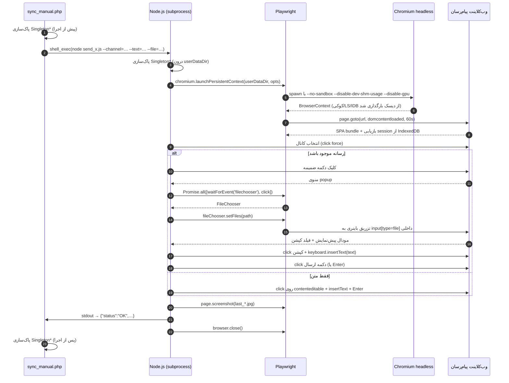
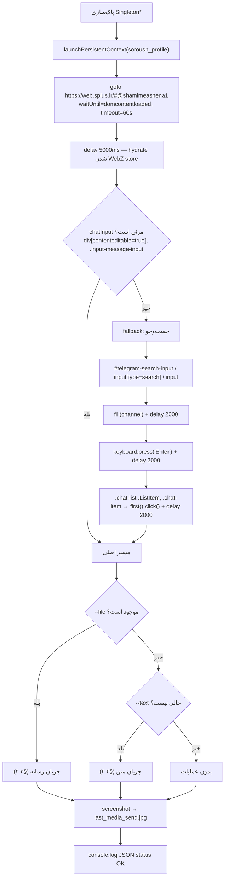
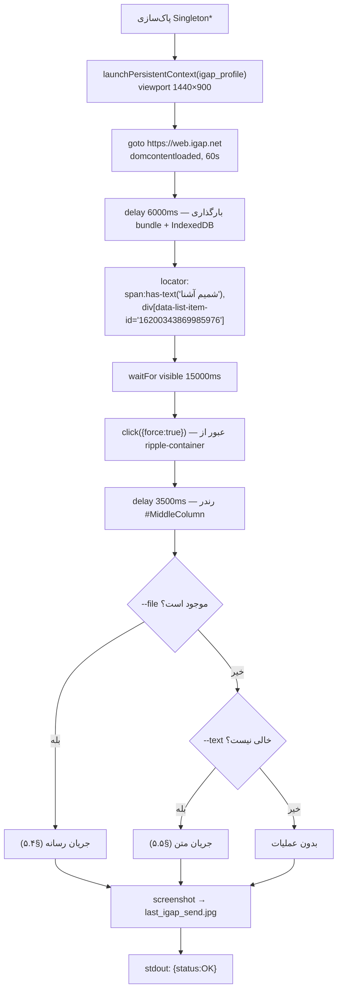

# PLAYWRIGHT_SPECS.md — مشخصات خودکارسازی UI (سروش‌پلاس و آی‌گپ)

> سند مرجع سلکتورها، توالی رویدادها، مدیریت race condition و workaround های حالت headless برای دو UserBot:
> `send_soroush.js` (وب‌کلاینت سروش‌پلاس) و `send_igap.js` (وب‌کلاینت آی‌گپ).
>
> **Playwright:** 1.63.0 · **Chromium:** `/usr/bin/chromium-browser` · **حالت اجرا:** headless
> مستندات مرتبط: [`ARCHITECTURE.md`](ARCHITECTURE.md) §۷ · [`TROUBLESHOOTING.md`](TROUBLESHOOTING.md) §۱–۲ · [`DEPLOYMENT.md`](DEPLOYMENT.md) §۸

---

## فهرست مطالب

1. [مدل اجرا](#s1)
2. [قرارداد ورودی/خروجی](#s2)
3. [الگوهای بنیادین (چرا این‌گونه نوشته شده‌اند)](#s3)
4. [مشخصات سروش‌پلاس — `send_soroush.js`](#s4)
5. [مشخصات آی‌گپ — `send_igap.js`](#s5)
6. [سازگاری با حالت Headless](#s6)
7. [جدول مرجع کامل سلکتورها](#s7)
8. [Playbook نگهداری و بازسازی سلکتور](#s8)
9. [امضاهای خطا و نگاشت آن‌ها به علت](#s9)
10. [محدودیت‌های شناخته‌شده](#s10)

---

## ۱. مدل اجرا <a id="s1"></a>

### ۱.۱ چرخهٔ حیات یک فراخوانی



### ۱.۲ پارامترهای مرورگر

| پارامتر | سروش‌پلاس | آی‌گپ | توضیح |
|---|---|---|---|
| `userDataDir` | `/home/file/public_html/s/soroush_profile` | `/home/file/public_html/s/igap_profile` | **هرگز** بین دو اسکریپت مشترک نشود |
| `executablePath` | `/usr/bin/chromium-browser` | `/usr/bin/chromium-browser` | Chromium سیستم، نه مرورگر دانلودی Playwright |
| `headless` | `true` | `true` | سرور بدون X11 |
| `viewport` | `1280 × 720` | `1440 × 900` | آی‌گپ در عرض کم، ستون‌ها را collapse می‌کند |
| `userAgent` | Chrome/120 Win64 | Chrome/120 Win64 | یکسان برای هر دو |
| `args` | `--no-sandbox --disable-setuid-sandbox --disable-dev-shm-usage --disable-gpu` | همان | §۶ |

### ۱.۳ دسترسی به صفحه

```javascript
const page = browser.pages()[0] || await browser.newPage();
```

`launchPersistentContext` همیشه **یک** صفحهٔ باز برمی‌گرداند؛ `newPage()` فقط یک سوپاپ اطمینان است. هرگز `browser.contexts()[0].newPage()` را اضافه نکنید — تب دوم باعث می‌شود `page.waitForEvent('filechooser')` روی صفحهٔ اشتباه ثبت شود.

---

## ۲. قرارداد ورودی/خروجی <a id="s2"></a>

### ۲.۱ آرگومان‌های خط فرمان

```javascript
const args = process.argv.slice(2);
const getArg = (flag) => {
    const found = args.find(a => a.startsWith(`--${flag}=`));
    return found ? found.split('=').slice(1).join('=') : null;
};
```

| آرگومان | نوع | پیش‌فرض | ملاحظات |
|---|---|---|---|
| `--channel=<id>` | string | سروش: `shamimeashena1` / آی‌گپ: `''` | `@` ابتدایی با `replace(/^@/, '')` حذف می‌شود |
| `--text=<string>` | string | `''` | می‌تواند چندخطی، فارسی و دارای ایموجی باشد |
| `--file=<abs path>` | string | `null` | باید با `fs.existsSync` تأیید شود |

> **چرا `split('=').slice(1).join('=')`؟** اگر متن حاوی `=` باشد (مثلاً لینک `https://shamiim.ir/?a=b`)، `split('=')[1]` متن را می‌بُرد. این الگو همهٔ بخش‌های بعد از اولین `=` را دوباره به هم می‌چسباند.

> **هشدار:** در آی‌گپ آرگومان `--channel` عملاً **استفاده نمی‌شود**؛ اسکریپت کانال را با سلکتور سخت‌کدشده پیدا می‌کند (§۵.۲). اگر کانال هدف عوض شد، باید سلکتور را به‌روز کنید.

### ۲.۲ خروجی

| حالت | stream | exit code | payload |
|---|---|---|---|
| موفق | `stdout` (`console.log`) | `0` | `{"status":"OK","message":"Media post dispatched successfully"}` |
| خطا | `stderr` (`console.error`) | `1` | `{"status":"ERROR","error":"<err.message>"}` |

**قانون طلایی:** هیچ `console.log` دیگری در مسیر موفق مجاز نیست. هر خروجی اضافی، `json_decode` سمت PHP را می‌شکند. به همین دلیل سمت PHP تابع `parseNodeJsonOutput()` اضافه شده که خطوط را از انتها پیمایش می‌کند و اولین خط با prefix `{` را می‌پذیرد:

```php
$result = parseNodeJsonOutput((string)$output);
return (isset($result['status']) and $result['status'] === 'OK')
    ? ['success' => true,  'message' => $result['message'] ?? 'OK']
    : ['success' => false, 'message' => $result['error'] ?? trim((string)$output)];
```

### ۲.۳ ساخت دستور shell سمت PHP

```php
$cmd = escapeshellarg(NODE_BIN) . ' ' . escapeshellarg(IGAP_SCRIPT)
     . ' --channel=' . escapeshellarg($cleanChannel);
if ($text !== '')                        $cmd .= ' --text=' . escapeshellarg($text);
if ($filePath and file_exists($filePath)) $cmd .= ' --file=' . escapeshellarg($filePath);
$output = shell_exec($cmd . ' 2>&1');
```

نتیجهٔ واقعی:

```bash
'/usr/bin/node' '/home/file/public_html/s/send_igap.js' --channel='shamimeashena' \
  --text='🌼🍃🌸 صبح شما به‌سرعت آفتاب' --file='/tmp/sync_66f1a2b3c4d5e_photo.jpg' 2>&1
```

> 🔴 **ضدالگویی که حذف شد:** `sprintf('\%s \%s --channel=\%s', escapeshellcmd(NODE_BIN), escapeshellarg(SCRIPT), …)`. در PHP، `'\%'` یک escape معتبر نیست و backslash **به‌صورت ادبی** در رشته می‌ماند؛ بنابراین قالبِ sprintf با `\` شروع می‌شد و backslash بلافاصله پیش از `'` تولیدشده توسط `escapeshellarg()` قرار می‌گرفت. در shell، `\'` یعنی «نقل‌قول ادبی» → کل ساختار quoting فرو می‌ریخت و متن‌های چندخطی/چندکلمه‌ای درست منتقل نمی‌شدند. **هرگز از `sprintf` با `\%` برای ساخت دستور shell استفاده نکنید.**

---

## ۳. الگوهای بنیادین <a id="s3"></a>

این شش الگو، ستون فقرات هر دو اسکریپت‌اند. هر تغییر آینده باید آن‌ها را حفظ کند.

### ۳.۱ الگوی P-1 — `insertText()` به‌جای `type()`

```javascript
// ❌ غلط — باعث ارسال زودهنگام می‌شود
await page.keyboard.type(postText);

// ✅ درست
await page.keyboard.insertText(postText);
```

| | `keyboard.type()` | `keyboard.insertText()` |
|---|---|---|
| نحوهٔ کار | شبیه‌سازی رویداد `keyDown`/`keyPress`/`keyUp` برای **هر کاراکتر** | یک فراخوانی `Input.insertText` در سطح CDP |
| رفتار با `\n` | به‌عنوان **کلید Enter** ارسال می‌شود → پیام زودهنگام submit می‌شود و پست چندخطی به چند پیام خرد می‌شود | به‌عنوان **کاراکتر خط جدید** درج می‌شود |
| سرعت | کند (به‌ازای هر کاراکتر یک round-trip) | فوری |
| ایموجی/فارسی | گاهی ترکیب‌های ZWNJ و ایموجی را می‌شکند | سالم |

**این مهم‌ترین اصلاح تاریخ پروژه است:** پیش از آن، یک پست ۱۰ خطی ایتا به ۱۰ پیام جداگانه در سروش و آی‌گپ تبدیل می‌شد.

### ۳.۲ الگوی P-2 — `click({ force: true })` برای عبور از لایهٔ Ripple

```javascript
await channelItem.click({ force: true });
```

کلیک معمولی Playwright پیش از اجرا، **actionability check** انجام می‌دهد: عنصر باید visible، stable، enabled و از همه مهم‌تر *receive events* باشد — یعنی نقطهٔ کلیک در hit-test به خود عنصر برسد. در آی‌گپ لایهٔ `.ripple-container` (و `MuiTouchRipple-root`) روی کل سل کشیده شده و hit-test را می‌بلعد:

```
elementhandle.click: Element is not receiving pointer events
  waiting for element to be visible, enabled and stable
  <div class="ripple-container"></div> from <div>… subtree intercepts pointer events
```

`force: true` این بررسی را رد می‌کند و `dispatchEvent` را مستقیماً روی عنصر هدف انجام می‌دهد. رویداد سپس به‌صورت طبیعی در DOM به سمت والد (handler واقعی) حباب می‌شود.

> ⚠️ `force: true` یک *escape hatch* است، نه یک عادت. فقط در موارد زیر مجاز است: (۱) لایهٔ تزئینی رهگیر وجود دارد، (۲) انیمیشن باعث ناپایداری موقتی می‌شود. در موارد دیگر از `waitFor` صریح استفاده کنید.

### ۳.۳ الگوی P-3 — `Promise.all` برای حذف race condition روی FileChooser

```javascript
// ❌ غلط — رویداد ممکن است پیش از ثبت listener شلیک شود
await targetMenuItem.click({ force: true });
const fileChooser = await page.waitForEvent('filechooser');   // ← timeout

// ✅ درست — listener پیش از محرک ثبت می‌شود
const [fileChooser] = await Promise.all([
    page.waitForEvent('filechooser', { timeout: 15000 }),
    targetMenuItem.click({ force: true })
]);
await fileChooser.setFiles(mediaFile);
```

`Promise.all` تضمین می‌کند که هر دو Promise **پیش از** هر رویداد ممکن آغاز شده‌اند. این الگو در `send_igap.js` به‌کار رفته است.

> در `send_soroush.js` الگوی معادل اما با ساختار متغیر استفاده شده:
> ```javascript
> const fileChooserPromise = page.waitForEvent('filechooser', { timeout: 10000 });  // ثبت نخست
> await targetItem.click({ force: true });                                          // سپس محرک
> const fileChooser = await fileChooserPromise;                                     // سپس انتظار
> ```
> این هم از نظر ترتیب **صحیح** است (listener پیش از click ساخته شده)، ولی `Promise.all` خوانا‌تر و مقاوم‌تر در برابر refactoring است. یکسان‌سازی این دو، یکی از موارد بدهی فنی است.

### ۳.۴ الگوی P-4 — `.last()` در برابر `.first()`

| اسکریپت | انتخاب | دلیل |
|---|---|---|
| `send_igap.js` — فیلد کپشن | `.last()` | مودال پیش‌نمایش **پس از** composer اصلی در DOM اضافه می‌شود؛ `.first()` به composer پشت مودال می‌رسید |
| `send_igap.js` — دکمه ارسال مودال | `.last()` | چند سلکتور با `join(', ')` ترکیب شده‌اند؛ آخرین مطابقت، دکمهٔ داخل مودال باز است |
| `send_igap.js` — chatBox متنی | `.last()` | در حالت بدون مودال، editor فعال `#MiddleColumn` آخرین گرهٔ مطابقت است |
| `send_soroush.js` — کپشن مودال | `.last()` | WebZ مودال را به انتهای `<body>` اضافه می‌کند |
| `send_soroush.js` — editor متنی | `.first()` | در WebZ تنها یک `contenteditable` فعال در چت وجود دارد |

### ۳.۵ الگوی P-5 — تحمل نبودِ عنصر بدون شکست جریان

```javascript
if (await captionInput.isVisible({ timeout: 5000 }).catch(() => false)) {
    await captionInput.click({ force: true });
    await page.keyboard.insertText(postText);
}
```

`.catch(() => false)` باعث می‌شود اگر ساختار مودال در نسخهٔ جدید تغییر کرد، اسکریپت **به‌جای شکست کامل**، رسانه را بدون کپشن بفرستد. انتشار محتوا اولویت بالاتری نسبت به کپشن دارد.

### ۳.۶ الگوی P-6 — `finally` برای آزادسازی قطعی مرورگر

```javascript
} finally {
    if (browser) await browser.close();
}
```

بدون این، هر خطا یک Chromium یتیم با قفل `Singleton*` به‌جا می‌گذارد و اجرای بعدی با `Permission denied (13)` شکست می‌خورد.

---

## ۴. مشخصات سروش‌پلاس — `send_soroush.js` <a id="s4"></a>

### ۴.۱ زمینهٔ پلتفرم

| خصوصیت | مقدار |
|---|---|
| وب‌کلاینت | `https://web.splus.ir` |
| شجرهٔ نرم‌افزاری | کلون **Telegram WebZ** (`telegram-tt`) |
| نتیجهٔ معماری | کلاس‌های اختصاصی WebZ مثل `.AttachMenu`, `.menu-container`, `.MenuItem`, `.bubble`, `.confirm-dialog-button`, `#sign-in-phone-code`, `#telegram-search-input` |
| ناوبری کانال | hash route: `https://web.splus.ir/#@<channel>` |
| ذخیره‌سازی session | IndexedDB + LocalStorage (در پروفایل پایدار) |

> چون WebZ یک SPA با hash routing است، `page.goto('https://web.splus.ir/#@channel')` **بدون reload کامل** کار می‌کند؛ اما در اولین بار پس از `launchPersistentContext` صفحه تازه بارگذاری می‌شود، بنابراین `delay(5000)` برای hydrate شدن store لازم است.

### ۴.۲ توالی اجرا



### ۴.۳ جریان رسانه

```javascript
const ext = path.extname(mediaFile).toLowerCase();
const isVisual = ['.jpg', '.jpeg', '.png', '.webp', '.gif', '.mp4'].includes(ext);

// ۱) دکمهٔ سنجاقک
const attachBtn = page.locator(
  '.AttachMenu button, button.attach-file, button[aria-label*="Attach"], button[title*="Attach"], .attach-file'
).first();
await attachBtn.waitFor({ state: 'visible', timeout: 10000 });
await attachBtn.click({ force: true });
await delay(1000);

// ۲) کانتینر منوی بازشده
const openMenu = page.locator(
  '.menu-container:not(.not-open), .AttachMenu .menu-container, .bubble.open'
).last();
await openMenu.waitFor({ state: 'visible', timeout: 5000 });

// ۳) فقط آیتم‌های مرئی درون همان منو
const visibleItems = openMenu.locator('.MenuItem:visible, [role="menuitem"]:visible');
const targetItem = isVisual ? visibleItems.first() : visibleItems.nth(1);

// ۴) ثبت listener پیش از کلیک
const fileChooserPromise = page.waitForEvent('filechooser', { timeout: 10000 });
await targetItem.click({ force: true });
const fileChooser = await fileChooserPromise;
await fileChooser.setFiles(mediaFile);

// ۵) مودال پیش‌نمایش
await delay(4000);
const modalCaption = page.locator(
  '.modal-dialog div[contenteditable="true"], .media-preview div[contenteditable="true"], div[contenteditable="true"]'
).last();
if (await modalCaption.isVisible({ timeout: 4000 })) {
    await modalCaption.click({ force: true });
    await page.keyboard.insertText(postText);
    await delay(500);
}

// ۶) ارسال
const sendModalBtn = page.locator(
  '.modal-dialog button.confirm-dialog-button, .modal-dialog button.primary, ' +
  '.modal-dialog button:has-text("ارسال"), .modal-dialog button:has-text("Send")'
).last();
if (await sendModalBtn.isVisible({ timeout: 5000 })) {
    await sendModalBtn.click({ force: true });
} else {
    await page.keyboard.press('Enter');
}
await delay(10000);   // مهلت آپلود روی سرور سروش
```

**تحلیل طراحی:**

| تصمیم | دلیل |
|---|---|
| `.menu-container:not(.not-open)` | WebZ منوها را در DOM نگه می‌دارد و فقط با کلاس `not-open` مخفی می‌کند. بدون این قید، `.last()` ممکن است به یک منوی بسته برسد. |
| `.bubble.open` | در نسخه‌های جدیدتر WebZ، منو داخل یک `bubble` با کلاس `open` رندر می‌شود. این fallback برای سازگاری نسخه‌ای است. |
| scoping به `openMenu` | جلوگیری از انتخاب `.MenuItem` های متعلق به منوی context یا منوی اصلی. |
| `:visible` | WebZ آیتم‌های غیرفعال را با `display:none` پنهان می‌کند (مثلاً «تماس» در کانال). |
| `first()` / `nth(1)` | ترتیب آیتم‌های منوی WebZ پایدار است: [۰] Photo or Video، [۱] Document، [۲] Poll، … بنابراین `nth(1)` = Document. |

> ⚠️ **شکنندگی مستندشده:** `nth(1)` یک انتخاب **موقعیتی** است. اگر سروش آیتمی به منو اضافه کند (مثلاً «Story» در ابتدا)، همهٔ ایندکس‌ها جابه‌جا می‌شوند. برای مقاوم‌سازی، §۸.۴ را ببینید.

### ۴.۴ جریان متن ساده

```javascript
const editable = page.locator('div[contenteditable="true"], .input-message-input').first();
await editable.click();                       // بدون force — editor لایهٔ رهگیر ندارد
await page.keyboard.insertText(postText);     // P-1
await delay(500);
await page.keyboard.press('Enter');           // Enter = ارسال در WebZ
await delay(3000);
```

### ۴.۵ نقشهٔ زمان‌بندی سروش‌پلاس

| نقطه | تأخیر | timeout | جمع تجمعی |
|---|---|---|---|
| `launchPersistentContext` | — | — | ~۳–۵s |
| `page.goto` | — | ۶۰s | ~۲–۴s |
| انتظار hydrate | ۵۰۰۰ms | — | ~۹s |
| fallback جست‌وجو (در صورت نیاز) | ۲۰۰۰ + ۲۰۰۰ + ۲۰۰۰ms | — | تا ~۱۵s |
| کلیک سنجاقک | ۱۰۰۰ms | ۱۰s | ~۱۰s |
| انتظار منو | — | ۵s | ~۱۵s |
| FileChooser | — | ۱۰s | ~۱۶s |
| رندر مودال | ۴۰۰۰ms | — | ~۲۰s |
| کپشن | ۵۰۰ms | ۴s | ~۲۱s |
| دکمه ارسال | — | ۵s | ~۲۱s |
| آپلود سرور | ۱۰۰۰۰ms | — | **~۳۱s** |
| **مجموع نوعی (رسانه)** | | | **~۳۰–۳۵s** |
| **مجموع نوعی (متن)** | ۵۰۰ + ۳۰۰۰ms | | **~۱۲–۱۵s** |

---

## ۵. مشخصات آی‌گپ — `send_igap.js` <a id="s5"></a>

### ۵.۱ زمینهٔ پلتفرم

| خصوصیت | مقدار |
|---|---|
| وب‌کلاینت | `https://web.igap.net` |
| شجرهٔ نرم‌افزاری | SPA با **Vite + Tailwind CSS + MUI (Material UI)** |
| نشانه‌های DOM | کلاس‌های utility تیلویند (`flex flex-row grow gap-xl`)، کلاس‌های MUI (`MuiBadge-root`, `MuiAvatar-root`, `MuiTouchRipple-root`)، آیکون‌های اختصاصی `icon-ig-*-outline` |
| ساختار صفحه | `#LeftColumn` (لیست گفت‌وگوها، `navigation-menu w-[380px]`) + `#MiddleColumn` (فضای چت و composer) |
| ذخیره‌سازی avatar | `blob:https://web.igap.net/<uuid>` → از IndexedDB خوانده می‌شود (دلیل نیاز قطعی به پروفایل پایدار) |

### ۵.۲ ساختار واقعی DOM سل کانال (از `igap_dump.html`)

این دامپ، شاهد واقعی استخراج‌شده از اجرای `inspect_igap.js` است:

```html
<!-- سل کلیک‌پذیر در لیست گفت‌وگوها -->
<div class="min-h-[var(--height-simple-contact-cell)] padding-md relative overflow-hidden
            cursor-pointer grow hover:transition-all hover:bg-state-on_surface_1
            h-[var(--height-compound-contact-cell)] max-h-[var(--height-compound-contact-cell)]
            border-b border-surface-container bg-surface"
     aria-controls="simple-menu" aria-haspopup="true">

  <div class="flex flex-center w-full">
    <div class="flex flex-row w-full items-center gap-lg select-none" dir="ltr">

      <span class="MuiBadge-root primary medium badge-prevent-grow-width badge-content-padding mui-ltr-1rzb3uu">
        <div class="MuiAvatar-root MuiAvatar-circular MuiAvatar-colorDefault large mui-ltr-1lyk2bq">
          
        </div>
        <span class="MuiBadge-badge MuiBadge-dot MuiBadge-invisible …"></span>
      </span>

      <!-- ★ هدف اول سلکتور: data-list-item-id -->
      <div class="flex flex-col grow gap-0.5 overflow-hidden"
           data-list-item-id="16200343869985976">

        <div class="flex flex-row grow gap-xl justify-between">
          <!-- ★ هدف دوم سلکتور: span نام کانال -->
          <span class="flex flex-row label-md text-surface-on gap-sm items-center">شمیم آشنا</span>
          <div class="flex items-center gap-sm">
            <span class="body-sm text-surface-on_variant">09:36</span>
          </div>
        </div>
        …
      </div>
    </div>
  </div>

  <!-- ★ لایهٔ رهگیر: آخرین فرزند، روی کل سل -->
  <div class="ripple-container"></div>
</div>
```

**سه نتیجهٔ معماری از این ساختار:**

1. `.ripple-container` **آخرین فرزند** سلِ `position: relative` است → روی همهٔ عناصر داخلی قرار می‌گیرد → hit-test را می‌بلعد → `force: true` **الزامی** است.
2. `data-list-item-id` روی **div داخلی محتوا** است، نه روی سلِ کلیک‌پذیر. کلیک با `force` روی آن، رویداد را به والدِ handler‌دار حباب می‌کند.
3. `aria-haspopup="true"` روی سل نشان می‌دهد که همان سل، منوی context (کلیک راست) را هم کنترل می‌کند؛ پس کلیک باید **چپ** و بدون modifier باشد.

### ۵.۳ توالی اجرا



### ۵.۴ جریان رسانه — دو مرحلهٔ پیمایش منو

```javascript
// مرحله ۱ — باز کردن منوی ضمیمه
const attachBtn = page.locator('button:has(i.icon-ig-attachment-outline)').first();
await attachBtn.waitFor({ state: 'visible', timeout: 10000 });
await attachBtn.click({ force: true });
await delay(1200);

// مرحله ۲ — انتخاب گزینهٔ متناسب با نوع فایل
const targetMenuItem = isVisual
    ? page.locator('.MenuItem:has-text("Media (image/video)"), .MenuItem:has(i.icon-gallery)').first()
    : page.locator('.MenuItem:has-text("File (document)"), .MenuItem:has(i.icon-file)').first();
await targetMenuItem.waitFor({ state: 'visible', timeout: 5000 });

// مرحله ۳ — FileChooser بدون race
const [fileChooser] = await Promise.all([
    page.waitForEvent('filechooser', { timeout: 15000 }),
    targetMenuItem.click({ force: true })
]);
await fileChooser.setFiles(mediaFile);

// مرحله ۴ — کپشن درون مودال
await delay(4500);
const captionInput = page.locator(
  '.modal-dialog div[contenteditable="true"], ' +
  '[role="dialog"] div[contenteditable="true"], ' +
  'div[contenteditable="true"]:visible'
).last();
if (await captionInput.isVisible({ timeout: 5000 }).catch(() => false)) {
    await captionInput.click({ force: true });
    await page.keyboard.insertText(postText);
    await delay(500);
}

// مرحله ۵ — ارسال
const sendModalBtn = page.locator([
    '.modal-dialog button:has-text("ارسال")',
    '.modal-dialog button:has-text("Send")',
    '[role="dialog"] button:has-text("ارسال")',
    '[role="dialog"] button:has-text("Send")',
    'button:has(i.icon-ig-send-outline)',
    'button:has(i.icon-send)',
    'button.confirm-dialog-button',
    'button.btn-primary:visible'
].join(', ')).last();

if (await sendModalBtn.isVisible({ timeout: 5000 }).catch(() => false)) {
    await sendModalBtn.click({ force: true });
} else {
    await page.keyboard.press('Enter');
}
await delay(10000);   // آپلود روی سرور آی‌گپ
```

#### چرا دو مرحله، نه یک؟

سه راه‌حل ناموفق، پیش از رسیدن به این طراحی آزمایش شدند:

| # | رویکرد | نتیجه | علت شکست |
|---|---|---|---|
| ۱ | شبیه‌سازی رویداد `paste` با ساخت `DataTransfer` و `dispatchEvent` | فایل هرگز در state ظاهر نشد | فریم‌ورک (MUI/React-like) داده را از `event.clipboardData.files` نمی‌خواند؛ state داخلی با reducerهای اختصاصی به‌روز می‌شود و رویداد مصنوعی `isTrusted: false` دارد |
| ۲ | الحاق دستی `<input type="file">` به DOM و `setInputFiles` روی آن | آپلود انجام نشد | input مصنوعی به **هیچ** reactive binding متصل نیست؛ هیچ handler ای `change` آن را گوش نمی‌دهد |
| ۳ | `waitForEvent('filechooser')` روی آیکون گیره در فوتر | timeout | آن آیکون فقط یک **منوی HTML** باز می‌کند، نه دیالوگ فایل سیستم. رویداد `filechooser` هرگز شلیک نمی‌شود |
| ✅ | **پیمایش دو مرحله‌ای منو + `Promise.all` روی گزینهٔ داخلی** | موفق | گزینهٔ `Media`/`File` درون منو، handler واقعی `input.click()` را دارد و Chromium رویداد `filechooser` را شلیک می‌کند |

#### تشخیص نوع فایل

```javascript
const ext = path.extname(mediaFile).toLowerCase();
const isVisual = ['.jpg', '.jpeg', '.png', '.webp', '.gif', '.mp4'].includes(ext);
```

| `isVisual` | گزینهٔ منو | انواع |
|---|---|---|
| `true` | `Media (image/video)` | jpg, jpeg, png, webp, gif, mp4 |
| `false` | `File (document)` | pdf, mp3, m4a, ogg, docx, zip, و هر چیز دیگر |

> ⚠️ **شکاف مستندشده:** `downloadMedia()` در PHP برای ویدیو نام `video.mp4` و برای صدا `audio.mp3` می‌گذارد، اما اگر ایتا پسوند متفاوتی در URL داشته باشد (مثلاً `.mov` یا `.aac`)، آن فایل به مسیر `File` می‌رود و در آی‌گپ به‌صورت سند (نه پلیر inline) منتشر می‌شود. برای دقت بیشتر، نگاشت باید بر پایهٔ `mediaType` (که از DOM ایتا می‌آید) انجام شود نه پسوند فایل. §۱۰.

### ۵.۵ جریان متن ساده

```javascript
const chatBox = page.locator(
  '#MiddleColumn div[contenteditable="true"], #text-editor, div[contenteditable="true"]:visible'
).last();
await chatBox.waitFor({ state: 'visible', timeout: 10000 });
await chatBox.click({ force: true });
await page.keyboard.insertText(postText);
await delay(500);
await page.keyboard.press('Enter');
await delay(3000);
```

> scoping به `#MiddleColumn` ضروری است: در `#LeftColumn` نیز فیلدهای جست‌وجو و composer های دیگری وجود دارند که با `div[contenteditable="true"]` مطابقت می‌کنند.

### ۵.۶ نقشهٔ زمان‌بندی آی‌گپ

| نقطه | تأخیر | timeout | جمع تجمعی |
|---|---|---|---|
| `launchPersistentContext` | — | — | ~۳–۵s |
| `page.goto` | — | ۶۰s | ~۲–۵s |
| بارگذاری SPA + IndexedDB | ۶۰۰۰ms | — | ~۱۱s |
| یافتن کانال | — | ۱۵s | ~۱۱s |
| رندر چت | ۳۵۰۰ms | — | ~۱۵s |
| باز شدن منوی ضمیمه | ۱۲۰۰ms | ۱۰s | ~۱۶s |
| یافتن گزینهٔ منو | — | ۵s | ~۱۶s |
| FileChooser | — | ۱۵s | ~۱۷s |
| رندر مودال پیش‌نمایش | ۴۵۰۰ms | — | ~۲۲s |
| کپشن | ۵۰۰ms | ۵s | ~۲۲s |
| دکمه ارسال | — | ۵s | ~۲۳s |
| آپلود سرور | ۱۰۰۰۰ms | — | **~۳۳s** |
| **مجموع نوعی (رسانه)** | | | **~۳۰–۳۵s** |
| **مجموع نوعی (متن)** | ۵۰۰ + ۳۰۰۰ms | | **~۱۳–۱۶s** |

---

## ۶. سازگاری با حالت Headless <a id="s6"></a>

### ۶.۱ فلگ‌های Chromium و ضرورت هرکدام

| فلگ | ضرورت | پیامد در صورت حذف |
|---|---|---|
| `--no-sandbox` | 🔴 الزامی | در cPanel، کاربر `file` بدون `user namespace` است → `Failed to move to new namespace: PID namespaces supported, User namespace unsupported` |
| `--disable-setuid-sandbox` | 🔴 الزامی | مکمل بالا؛ بدون آن `Running as root without --no-sandbox is not supported` حتی برای کاربر غیر root اگر setuid helper موجود نباشد |
| `--disable-dev-shm-usage` | 🔴 الزامی | `/dev/shm` در cPanel معمولاً ۶۴MB است → `Out of memory` / crash رندرها هنگام آپلود ویدیو |
| `--disable-gpu` | 🟠 توصیه‌شده | بدون GPU، Chromium به `SwiftShader` می‌افتد و لاگ‌ها را پر می‌کند؛ گاهی `Compositor lost GPU context` |

### ۶.۲ موارد headless که در این پروژه مدیریت شده‌اند

| چالش | راه‌حل اعمال‌شده |
|---|---|
| فایل‌های بزرگ در `/dev/shm` | `--disable-dev-shm-usage` |
| نبود فونت فارسی → اسکرین‌شات ناخوانا | نصب `google-noto-*-arabic-fonts` ([`DEPLOYMENT.md`](DEPLOYMENT.md) §۳.۲) |
| تشخیص headless توسط SPA از روی `navigator.webdriver` | `userAgent` ثابت Chrome/120 تنظیم شده. اگر پلتفرم سخت‌گیرتر شد، §۶.۳ را ببینید |
| دیالوگ فایل سیستم در headless | Playwright آن را با رویداد `filechooser` انتزاع می‌کند — هیچ دیالوگ واقعی لازم نیست |
| `alert`/`confirm` های ناخواسته | در headless به‌صورت خودکار بسته می‌شوند؛ در صورت نیاز `page.on('dialog', d => d.dismiss())` اضافه کنید |
| نبود X11 برای ورود بصری | remote debugging + SSH tunnel ([`DEPLOYMENT.md`](DEPLOYMENT.md) §۸.۱ روش ۳) |

### ۶.۳ در صورت نیاز به stealth بیشتر

اگر پیام‌رسان شروع به مسدودکردن محیط خودکار کرد، این بلوک را **پیش از** `page.goto` اضافه کنید:

```javascript
await browser.addInitScript(() => {
    Object.defineProperty(navigator, 'webdriver', { get: () => undefined });
    Object.defineProperty(navigator, 'languages',  { get: () => ['fa-IR', 'fa', 'en-US'] });
    Object.defineProperty(navigator, 'plugins',    { get: () => [1, 2, 3, 4, 5] });
    window.chrome = window.chrome || { runtime: {} };
    const origQuery = window.navigator.permissions.query;
    window.navigator.permissions.query = (p) =>
        p.name === 'notifications'
            ? Promise.resolve({ state: Notification.permission })
            : origQuery(p);
});
```

و `locale`/`timezone` را در `launchPersistentContext` تنظیم کنید:

```javascript
locale: 'fa-IR',
timezoneId: 'Asia/Tehran',
```

> این مقادیر با `date_default_timezone_set('Asia/Tehran')` سمت PHP هم‌تراز می‌شوند و از اختلاف مهر زمانی در گزارش‌ها جلوگیری می‌کنند.

### ۶.۴ حالت `--headless=new` در `start_browser.sh`

`start_browser.sh` از `--headless=new` استفاده می‌کند (موتور headless جدید Chromium که رفتار آن به حالت headed نزدیک‌تر است). اسکریپت‌های Playwright از `headless: true` استفاده می‌کنند که در Playwright 1.63 معادل **همان** حالت جدید است. برای دیباگ بصری، `headless: false` فقط روی ماشینی با X11/Xvfb کار می‌کند:

```bash
dnf install -y xorg-x11-server-Xvfb
Xvfb :99 -screen 0 1440x900x24 &
export DISPLAY=:99
# سپس در اسکریپت: headless: false
```

---

## ۷. جدول مرجع کامل سلکتورها <a id="s7"></a>

### ۷.۱ سروش‌پلاس (`web.splus.ir`)

| # | هدف | سلکتور | روش | وضعیت |
|---|---|---|---|---|
| S-01 | فیلد کد کشور (ورود) | `#sign-in-phone-code` | `fill('Iran')` | ✅ تأییدشده (`login_soroush.js`) |
| S-02 | آیتم لیست کشورها | `div[role="menuitem"]:has-text("Iran")` | `click({force:true})` | ✅ تأییدشده |
| S-03 | فیلد شماره موبایل | `#sign-in-phone-number` | `fill(phone)` | ✅ تأییدشده |
| S-04 | دکمهٔ «بعدی» | `button:has-text("بعدی")` | `click({force:true})` یا `press('Enter')` | ✅ تأییدشده |
| S-05 | پاپ‌آپ «ارسال کد به تلگرام» | `button:has-text("ارسال کد به تلگرام")` | `click({force:true})` | ✅ تأییدشده |
| S-06 | پاپ‌آپ PWA | `button:has-text("متوجه شدم")` | `click({force:true})` | ✅ تأییدشده |
| S-07 | فیلد OTP | `input` (`.first()`) | `keyboard.type(otp,{delay:100})` | ⚠️ عمومی — ممکن است با تغییر UI بشکند |
| S-08 | ورودی چت | `div[contenteditable="true"], .input-message-input` | `isVisible()` | ✅ تأییدشده |
| S-09 | جست‌وجو (fallback) | `#telegram-search-input, input[type="search"], input` | `fill(channel)` | ⚠️ fallback |
| S-10 | نتیجهٔ جست‌وجو | `.chat-list .ListItem, .chat-item` | `.first().click()` | ⚠️ fallback |
| S-11 | دکمهٔ ضمیمه | `.AttachMenu button, button.attach-file, button[aria-label*="Attach"], button[title*="Attach"], .attach-file` | `.first().click({force:true})` | ✅ تأییدشده |
| S-12 | منوی بازشده | `.menu-container:not(.not-open), .AttachMenu .menu-container, .bubble.open` | `.last()` | ✅ تأییدشده |
| S-13 | آیتم‌های منو | `.MenuItem:visible, [role="menuitem"]:visible` (scoped به S-12) | `first()` / `nth(1)` | ⚠️ موقعیتی |
| S-14 | کپشن مودال | `.modal-dialog div[contenteditable="true"], .media-preview div[contenteditable="true"], div[contenteditable="true"]` | `.last()` + `insertText` | ✅ تأییدشده |
| S-15 | دکمهٔ ارسال مودال | `.modal-dialog button.confirm-dialog-button, .modal-dialog button.primary, .modal-dialog button:has-text("ارسال"), .modal-dialog button:has-text("Send")` | `.last()` | ✅ تأییدشده |

### ۷.۲ آی‌گپ (`web.igap.net`)

| # | هدف | سلکتور | روش | وضعیت |
|---|---|---|---|---|
| I-01 | ستون چپ | `#LeftColumn` | مرجع ساختاری | ✅ تأییدشده از `igap_dump.html` |
| I-02 | ستون میانی | `#MiddleColumn` | scoping برای composer | ✅ تأییدشده از `igap_dump.html` |
| I-03 | سل کانال (هدف اصلی) | `div[data-list-item-id="16200343869985976"]` | `.first().click({force:true})` | ✅ تأییدشده — ولی **سخت‌کد** |
| I-04 | سل کانال (هدف متنی) | `span:has-text("شمیم آشنا")` | `.first().click({force:true})` | ✅ تأییدشده |
| I-05 | سلِ والدِ کلیک‌پذیر | `div[aria-haspopup="true"][aria-controls="simple-menu"]` | (جایگزین پیشنهادی مقاوم‌تر) | 🔎 پیشنهادی |
| I-06 | لایهٔ رهگیر | `.ripple-container` / `.MuiTouchRipple-root` | **هرگز کلیک نشود** — دلیل `force:true` | ✅ تأییدشده |
| I-07 | دکمهٔ ضمیمه | `button:has(i.icon-ig-attachment-outline)` | `.first().click({force:true})` | ✅ تأییدشده |
| I-08 | گزینهٔ Media | `.MenuItem:has-text("Media (image/video)"), .MenuItem:has(i.icon-gallery)` | `.first()` | ✅ تأییدشده |
| I-09 | گزینهٔ File | `.MenuItem:has-text("File (document)"), .MenuItem:has(i.icon-file)` | `.first()` | ✅ تأییدشده |
| I-10 | کپشن مودال | `.modal-dialog div[contenteditable="true"], [role="dialog"] div[contenteditable="true"], div[contenteditable="true"]:visible` | `.last()` + `insertText` | ✅ تأییدشده |
| I-11 | ارسال مودال | `.modal-dialog button:has-text("ارسال"), …, button.btn-primary:visible` (۸ سلکتور) | `.last()` | ✅ تأییدشده |
| I-12 | composer متنی | `#MiddleColumn div[contenteditable="true"], #text-editor, div[contenteditable="true"]:visible` | `.last()` | ✅ تأییدشده |
| I-13 | آیکون ارسال | `button:has(i.icon-ig-send-outline)` | درون لیست I-11 | ✅ تأییدشده |

**کلاس‌های آیکون مشاهده‌شده در `igap_dump.html`** (برای ساخت سلکتورهای جدید):

```
icon-ig-services-outline   icon-ig-search-outline   icon-ig-iland-outline
icon-ig-double-check-outline   icon-ig-contacts-outline
icon-ig-chat-outline   icon-ig-call-outline
```

الگوی نام‌گذاری: `icon-ig-<نام>-outline` → برای هر دکمهٔ جدید، این الگو را با `inspect_attach.js` تأیید کنید.

---

## ۸. Playbook نگهداری و بازسازی سلکتور <a id="s8"></a>

وقتی پیام‌رسان رابط خود را به‌روز می‌کند، اسکریپت با `Timeout … exceeded` شکست می‌خورد. این روند ۶ مرحله‌ای را دنبال کنید.

### ۸.۱ گام ۱ — تولید شواهد

```bash
cd /home/file/public_html/s

# اسکرین‌شات آخرین وضعیت (خودکار توسط اسکریپت تولید شده)
ls -l last_igap_send.jpg last_media_send.jpg

# اجرای دستی با خروجی کامل خطا
sudo -u file /usr/bin/node send_igap.js --channel=shamimeashena --text="probe" ; echo "exit=$?"
```

### ۸.۲ گام ۲ — بازرسی زندهٔ DOM با ابزارهای موجود

```bash
# الف) ساختار فوتر composer در آی‌گپ (دکمه‌ها + input[type=file])
sudo -u file /usr/bin/node inspect_igap.js

# ب) محتوای منوی ضمیمه پس از باز شدن
sudo -u file /usr/bin/node inspect_attach.js
```

خروجی `inspect_igap.js` به این شکل است:

```json
{
  "buttons": [
    { "index": 0, "tag": "BUTTON", "class": "icon-button radius-3xl padding-sm flex-center cursor-pointer",
      "aria": "", "innerHtml": "<i class=\"icon-ig-attachment-outline\"></i>" }
  ],
  "inputs": []
}
```

> توجه به `"inputs": []` — **هیچ** `input[type="file"]` از پیش در DOM وجود ندارد. این دقیقاً همان دلیل شکست رویکرد «الحاق دستی input» است (§۵.۴). input فقط **لحظهٔ** کلیک روی گزینهٔ منو ساخته می‌شود.

### ۸.۳ گام ۳ — دامپ کامل DOM

یک دامپ تازه بسازید (الگویی از `inspect_igap.js`):

```bash
cat > /home/file/public_html/s/dump_dom.js <<'EOF'
const { chromium } = require('playwright');
(async () => {
  const target = process.argv[2] || 'igap';          // igap | soroush
  const profile = `/home/file/public_html/s/${target}_profile`;
  const url = target === 'igap' ? 'https://web.igap.net' : 'https://web.splus.ir';
  const browser = await chromium.launchPersistentContext(profile, {
    executablePath: '/usr/bin/chromium-browser',
    args: ['--no-sandbox','--disable-setuid-sandbox','--disable-dev-shm-usage','--disable-gpu'],
    headless: true, viewport: { width: 1440, height: 900 }
  });
  const page = browser.pages()[0] || await browser.newPage();
  await page.goto(url, { waitUntil: 'domcontentloaded', timeout: 60000 });
  await page.waitForTimeout(8000);
  require('fs').writeFileSync(`/home/file/public_html/s/${target}_dump.html`, await page.content());
  await page.screenshot({ path: `/home/file/public_html/s/${target}_dump.jpg`, fullPage: false });
  console.log(JSON.stringify({ status: 'OK', target, bytes: (await page.content()).length }));
  await browser.close();
})();
EOF
sudo -u file /usr/bin/node dump_dom.js igap
```

### ۸.۴ گام ۴ — جست‌وجوی سلکتور جایگزین در دامپ

```bash
cd /home/file/public_html/s

# همهٔ شناسه‌های یکتای آیتم‌های لیست
grep -o 'data-list-item-id="[0-9]*"' igap_dump.html | sort -u

# همهٔ کلاس‌های آیکون
grep -o 'icon-ig-[a-z-]*' igap_dump.html | sort | uniq -c | sort -rn

# کلاس‌های پرتکرار (ساختار اصلی UI)
grep -o 'class="[^"]*"' igap_dump.html | sort | uniq -c | sort -rn | head -30

# یافتن متن هدف و مشاهدهٔ ساختار اطراف
python3 - <<'PY'
h = open('igap_dump.html', encoding='utf-8', errors='replace').read()
i = h.find('شمیم آشنا')
print(h[max(0, i-1500):i+400].replace('><', '>\n<'))
PY
```

### ۸.۵ گام ۵ — اصول انتخاب سلکتور جایگزین

اولویت از بالا به پایین:

| اولویت | نوع | نمونه | پایداری |
|---|---|---|---|
| ۱ | `data-*` اختصاصی برنامه | `div[data-list-item-id="…"]` | ⭐⭐⭐⭐ |
| ۲ | `role`/`aria` | `button[aria-label="Attach"]`, `[role="menuitem"]` | ⭐⭐⭐⭐ |
| ۳ | کلاس آیکون اختصاصی | `button:has(i.icon-ig-attachment-outline)` | ⭐⭐⭐ |
| ۴ | متن مرئی | `.MenuItem:has-text("Media (image/video)")` | ⭐⭐ (وابسته به زبان UI) |
| ۵ | کلاس فریم‌ورک | `.MenuItem`, `.modal-dialog` | ⭐⭐ |
| ۶ | **ایندکس موقعیتی** | `.nth(1)` | ⭐ (بدترین — هرگز به‌تنهایی) |

**قاعده:** همیشه حداقل دو سلکتور را با `, ` ترکیب کنید (یک ساختاری + یک متنی) و `.first()`/`.last()` را صریح مشخص کنید.

**الگوی مقاوم پیشنهادی برای I-03/I-04 (حذف سخت‌کدی شناسه):**

```javascript
// به‌جای: div[data-list-item-id="16200343869985976"]
const CHANNEL_NAME = process.env.SYNC_IGAP_CHANNEL_NAME || 'شمیم آشنا';
const channelItem = page.locator(
  `div[data-list-item-id="${process.env.SYNC_IGAP_ITEM_ID || '16200343869985976'}"], ` +
  `div[aria-haspopup="true"]:has(span:text-is("${CHANNEL_NAME}")), ` +
  `span:text-is("${CHANNEL_NAME}")`
).first();
```

`:text-is()` مطابقت **کامل** است و از انتخاب اشتباه «شمیم آشنا ۲» جلوگیری می‌کند (`:has-text()` مطابقت جزئی دارد).

### ۸.۶ گام ۶ — اعتبارسنجی و ثبت

```bash
# ۱) اعتبارسنجی سینتکس
node --check send_igap.js && node --check send_soroush.js

# ۲) آزمون متن (سبک)
sudo -u file node send_igap.js --channel=shamimeashena --text="selector-check $(date +%T)"

# ۳) آزمون رسانه (سنگین)
sudo -u file node send_igap.js --channel=shamimeashena --text="selector-check media" \
  --file=/home/file/public_html/s/test_img.jpg

# ۴) بازبینی اسکرین‌شات شاهد
ls -l last_igap_send.jpg

# ۵) ثبت تغییر در Git با پیام توصیفی
git add send_igap.js
git commit -m "fix(igap): update channel selector after web.igap.net UI change"
```

و سپس **جدول §۷.۲ را در همین سند به‌روزرسانی کنید** — این سند باید همیشه با کد هم‌تراز بماند.

---

## ۹. امضاهای خطا و نگاشت آن‌ها به علت <a id="s9"></a>

| پیام خطای Playwright | علت ریشه‌ای | اقدام |
|---|---|---|
| `ProcessSingletonLock: Permission denied (13)` | فایل `Singleton*` با مالک `root` | `chown -R file:file` + `find … -name 'Singleton*' -delete` |
| `Failed to create … /SingletonLock` | قفل باقی‌مانده از اجرای crash‌شده | همان بالا |
| `browserType.launchPersistentContext: Executable doesn't exist at /usr/bin/chromium-browser` | Chromium نصب نشده یا مسیر متفاوت | `ln -sf $(command -v chromium) /usr/bin/chromium-browser` |
| `Target page, context or browser has been closed` | crash رندر (معمولاً `/dev/shm`) | افزودن `--disable-dev-shm-usage` + بررسی `free -m` |
| `page.goto: Timeout 60000ms exceeded` | کندی شبکه یا فیلتر دامنه | `curl -I https://web.igap.net` + بررسی CSF |
| `locator.waitFor: Timeout 15000ms exceeded` (کانال) | session منقضی یا کانال در لیست نیست | `last_igap_send.jpg` را ببینید؛ در صورت صفحهٔ ورود → §۸ [`DEPLOYMENT.md`](DEPLOYMENT.md) |
| `elementhandle.click: Element is not receiving pointer events … .ripple-container … intercepts` | لایهٔ Ripple | `click({ force: true })` |
| `page.waitForEvent('filechooser'): Timeout` | کلیک روی عنصر اشتباه (فقط منو باز می‌شود) یا listener پس از کلیک ثبت شده | الگوی P-3 + پیمایش دو مرحله‌ای منو (§۵.۴) |
| `locator.click: Error: strict mode violation: … resolved to N elements` | سلکتور چندگانه بدون `.first()`/`.last()` | صریح‌سازی با `.first()`/`.last()`/`.nth()` |
| `page.keyboard.type` باعث ارسال زودهنگام شد | `\n` = Enter | الگوی P-1: `insertText()` |
| `fileChooser.setFiles: ENOENT: no such file or directory` | فایل موقت `/tmp/sync_*` پیش از اجرا حذف شده | بررسی `TMPDIR` و `/tmp` cleanup در cron |
| خروجی `{"status":"ERROR","error":"…"}` با exit 1 | هر خطای داخل try | پیام در `info` داشبورد نمایش داده می‌شود |
| خروجی خالی از subprocess | OOM killer یا SIGKILL | `dmesg -T \| grep -i kill` + `journalctl -k` |

---

## ۱۰. محدودیت‌های شناخته‌شده <a id="s10"></a>

| # | محدودیت | اثر | راه‌حل پیشنهادی |
|---|---|---|---|
| L-1 | `--channel` در `send_igap.js` استفاده نمی‌شود؛ کانال با سلکتور سخت‌کد پیدا می‌شود | تغییر کانال مقصد = تغییر کد | §۸.۵ (الگوی مقاوم با env var) |
| L-2 | تشخیص نوع فایل بر پایهٔ **پسوند** است نه `mediaType` | `.mov`/`.aac`/`.ogg` به‌عنوان سند ارسال می‌شوند | ارسال `--type=<mediaType>` از PHP به Node و تصمیم بر پایهٔ آن |
| L-3 | تأخیرهای ثابت (`delay`) به‌جای `waitFor` صریح | روی سرور کند شکننده، روی سرور سریع اتلاف وقت | جایگزینی با `page.waitForLoadState('networkidle')` و `locator.waitFor` |
| L-4 | `nth(1)` موقعیتی در منوی سروش | افزودن آیتم جدید به منو = انتخاب اشتباه | سلکتور متنی/آیکونی مانند آی‌گپ |
| L-5 | دو مرورگر به‌صورت **ترتیبی** اجرا می‌شوند | ~۳۰s اتلاف برای هر پست رسانه‌دار | اجرای موازی با `proc_open` (پروفایل‌ها جدا هستند، پس تداخل Singleton ندارند) |
| L-6 | اسکرین‌شات شاهد با نام ثابت بازنویسی می‌شود | تاریخچهٔ خطا از دست می‌رود | نام‌گذاری با `msg_id` و timestamp: `evidence/igap_<id>_<ts>.jpg` |
| L-7 | `login_igap.js` در ریپو وجود ندارد | مقداردهی اولیهٔ session آی‌گپ دستی است | اسکریپت آماده در [`DEPLOYMENT.md`](DEPLOYMENT.md) §۸.۲ |
| L-8 | ورود از محیط جدید، هشدار امنیتی «ورود جدید به حساب کاربری» را برای کاربر ارسال می‌کند (در `igap_dump.html` مشاهده شده) | کاربر ممکن است session را باطل کند | یک‌بار ورود، سپس پشتیبان‌گیری و پرهیز از ورود مکرر |
| L-9 | `userAgent` روی Chrome/120 ثابت است، در حالی که Chromium نصب‌شده ممکن است جدیدتر باشد | ناهمخوانی UA با capabilities واقعی | هم‌ترازسازی UA با نسخهٔ واقعی: `/usr/bin/chromium-browser --version` |
| L-10 | هیچ retry ای در سطح UserBot وجود ندارد | یک timeout گذرا = پست از دست رفته در آن کانال | افزودن حلقهٔ retry (حداکثر ۲ بار) دور تا تابع اصلی |

---

**پایان مشخصات Playwright.** برای رفع اشکال عملیاتی به [`TROUBLESHOOTING.md`](TROUBLESHOOTING.md) مراجعه کنید.
