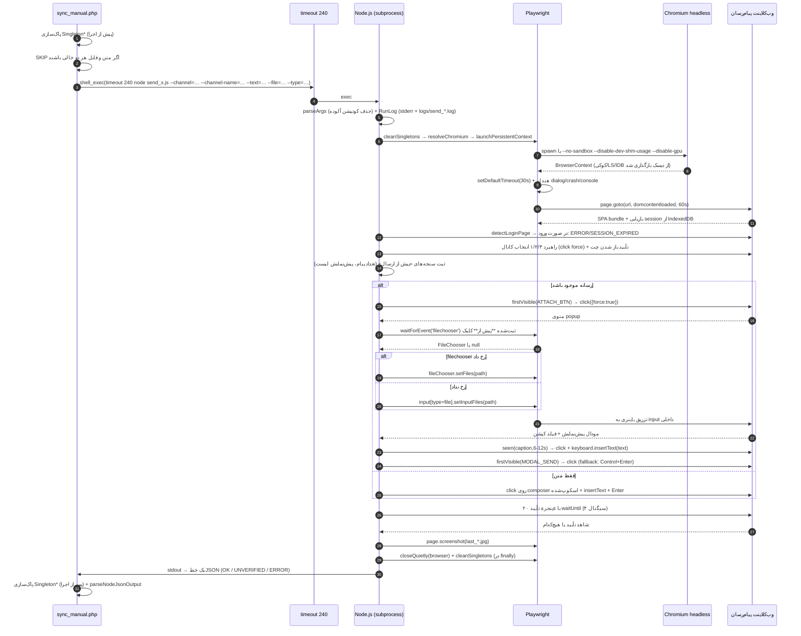
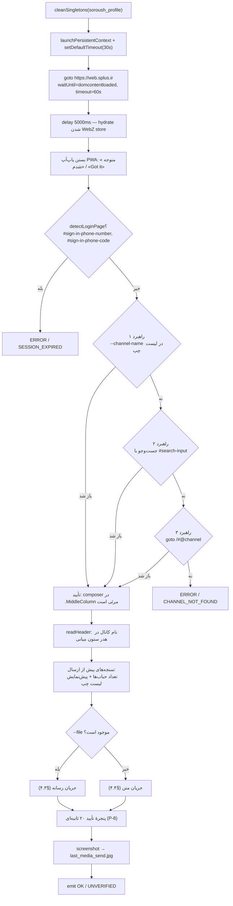
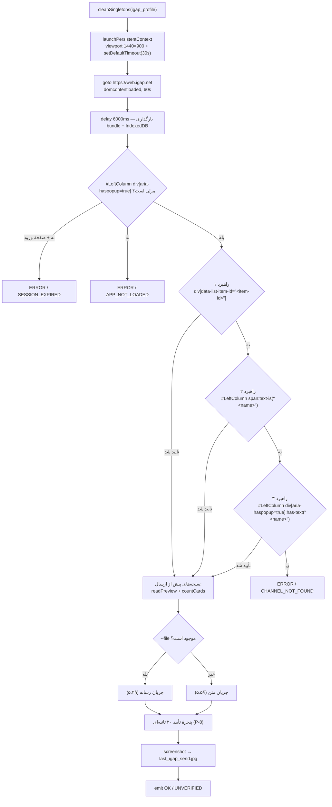

# PLAYWRIGHT_SPECS.md — مشخصات خودکارسازی UI (سروش‌پلاس و آی‌گپ)

> سند مرجع سلکتورها، توالی رویدادها، مدیریت race condition و workaround های حالت headless برای دو UserBot:
> `send_soroush.js` (وب‌کلاینت سروش‌پلاس) و `send_igap.js` (وب‌کلاینت آی‌گپ).
>
> **Playwright:** 1.63.0 · **Chromium:** `/usr/bin/chromium-browser` · **حالت اجرا:** headless
> مستندات مرتبط: [`ARCHITECTURE.md`](ARCHITECTURE.md) §۷ · [`TROUBLESHOOTING.md`](TROUBLESHOOTING.md) §۱–۲ · [`DEPLOYMENT.md`](DEPLOYMENT.md) §۸

---

## فهرست مطالب

1. [مدل اجرا](#s1)
2. [قرارداد ورودی/خروجی](#s2)
3. [الگوهای بنیادین (چرا این‌گونه نوشته شده‌اند)](#s3)
4. [مشخصات سروش‌پلاس — `send_soroush.js`](#s4)
5. [مشخصات آی‌گپ — `send_igap.js`](#s5)
6. [سازگاری با حالت Headless](#s6)
7. [جدول مرجع کامل سلکتورها](#s7)
8. [Playbook نگهداری و بازسازی سلکتور](#s8)
9. [امضاهای خطا و نگاشت آن‌ها به علت](#s9)
10. [محدودیت‌های شناخته‌شده](#s10)

---

## ۱. مدل اجرا <a id="s1"></a>

### ۱.۱ چرخهٔ حیات یک فراخوانی



### ۱.۲ پارامترهای مرورگر

| پارامتر | سروش‌پلاس | آی‌گپ | توضیح |
|---|---|---|---|
| `userDataDir` | `$SYNC_APP_DIR/soroush_profile` | `$SYNC_APP_DIR/igap_profile` | **هرگز** بین دو اسکریپت مشترک نشود |
| `executablePath` | `resolveChromium()` | `resolveChromium()` | به‌ترتیب `SYNC_CHROMIUM_BIN` ← `/usr/bin/chromium-browser` ← `/usr/bin/chromium` ← `google-chrome(-stable)` |
| `headless` | `true` (`false` با `SYNC_HEADED=1`) | همان | سرور بدون X11؛ حالت headed فقط برای ورود تعاملی |
| `viewport` | `1280 × 720` | `1440 × 900` | آی‌گپ در عرض کم، ستون‌ها را collapse می‌کند |
| `userAgent` | **override نمی‌شود** | **override نمی‌شود** | نمونه‌های کاری پروژه بدون override موفق بودند؛ فقط با `SYNC_USER_AGENT` فعال می‌شود |
| `locale` / `timezoneId` | `fa-IR` / `Asia/Tehran` | همان | هم‌تراز با زبان UI و زمان‌نگارش پیام‌ها |
| `ignoreHTTPSErrors` | `true` | `true` | تحمل زنجیرهٔ CA میانی روی سرور |
| `args` | `--no-sandbox --disable-setuid-sandbox --disable-dev-shm-usage --disable-gpu --disable-features=IsolateOrigins,site-per-process --mute-audio` | همان | §۶ |
| `setDefaultTimeout` | ۳۰۰۰۰ms | ۳۰۰۰۰ms | هیچ انتظاری بی‌پایان نمی‌ماند |
| `setDefaultNavigationTimeout` | ۶۰۰۰۰ms | ۶۰۰۰۰ms | `goto` روی شبکهٔ کند |
| هندلرهای صفحه | `dialog → dismiss`, `crash → log`, `console.error → log` | همان | یک `alert` بومی هرگز جریان را متوقف نمی‌کند |

### ۱.۳ دسترسی به صفحه

```javascript
const page = browser.pages()[0] || await browser.newPage();
```

`launchPersistentContext` همیشه **یک** صفحهٔ باز برمی‌گرداند؛ `newPage()` فقط یک سوپاپ اطمینان است. هرگز `browser.contexts()[0].newPage()` را اضافه نکنید — تب دوم باعث می‌شود `page.waitForEvent('filechooser')` روی صفحهٔ اشتباه ثبت شود.

---

## ۲. قرارداد ورودی/خروجی <a id="s2"></a>

### ۲.۱ آرگومان‌های خط فرمان

پارس آرگومان اکنون در `lib/pw_common.js` متمرکز است (یک پیاده‌سازی برای هر دو پلتفرم):

```javascript
function parseArgs(argv) {
    const args = argv.slice(2);
    const clean = (v) => {                       // حذف کوتیشن جفت‌شدهٔ اطراف مقدار
        let s = String(v == null ? '' : v).trim();
        while (s.length >= 2 && ((s[0] === "'" && s[s.length-1] === "'") ||
                                 (s[0] === '"' && s[s.length-1] === '"'))) {
            s = s.slice(1, -1).trim();
        }
        return s;
    };
    const get = (flag, def = null) => {
        const found = args.find(a => a.startsWith(`--${flag}=`));
        return found ? clean(found.split('=').slice(1).join('=')) : def;
    };
    …
}
```

| آرگومان | نوع | پیش‌فرض | ملاحظات |
|---|---|---|---|
| `--channel=<id>` | string | از `.env`: `SOROUSH_CHANNEL_ID` / `IGAP_CHANNEL_ID` | `@` ابتدایی و کوتیشن جفت‌شده حذف می‌شود |
| `--channel-name=<نام نمایشی>` | string | از `.env`: `SOROUSH_CHANNEL_NAME` / `IGAP_CHANNEL_NAME` | **ستون فقرات تأیید**: باز شدن چت درست با دیدن این نام در هدر/لیست تأیید می‌شود |
| `--text=<string>` | string | `''` | چندخطی، فارسی و ایموجی مجاز است |
| `--file=<abs path>` | string | `null` | با `fs.existsSync` تأیید می‌شود؛ وگرنه `FILE_MISSING` |
| `--type=<image\|video\|document\|audio>` | string | `''` | نوع رسانه از لایهٔ scraping؛ در نبود آن از پسوند حدس زده می‌شود |
| `--item-id=<id>` | string | از `.env`: `IGAP_ITEM_ID` (پیش‌فرض `16200343869985976`) | شناسهٔ `data-list-item-id` سل کانال در آی‌گپ |

> 📌 اگر کانال سروش/آی‌گپ نه با آرگومان و نه در `.env` مشخص باشد، اسکریپت **پیش از راه‌اندازی مرورگر** با کد `NO_CHANNEL` خارج می‌شود — رفتار پیشین «باز کردن اولین چت لیست» حذف شده است ([`TROUBLESHOOTING.md`](TROUBLESHOOTING.md) §۵.۶).

**منبع مقدارها:** `lib/pw_common.js` هنگام require، فایل `.env` کنار ریپو را می‌خواند (`loadDotEnv()`)؛ مسیرش با `SYNC_ENV_FILE` قابل override است. اولویت: **متغیر محیطی واقعی > `.env` > پیش‌فرض کد**.

| متغیر محیطی | نقش |
|---|---|
| `SYNC_ENV_FILE` | مسیر فایل `.env` (پیش‌فرض `<repo>/.env`) |
| `SYNC_APP_DIR` | مسیر استقرار؛ محل پروفایل‌ها، `logs/` و اسکرین‌شات‌ها (از `.env` می‌آید) |
| `SYNC_CHROMIUM_BIN` | باینری کرومیوم؛ در نبود آن `resolveChromium()` مسیرهای رایج را می‌آزماید |
| `SYNC_USER_AGENT` | override کردن UA — **به‌طور پیش‌فرض خاموش** (نمونه‌های کاری پروژه بدون override موفق بودند) |
| `SYNC_HEADED=1` | اجرای غیر headless (برای ورود تعاملی روی ماشین دارای نمایشگر) |
| `SOROUSH_CHANNEL_ID` / `SOROUSH_CHANNEL_NAME` | پیش‌فرض `--channel` / `--channel-name` در سروش (از `.env`) |
| `IGAP_CHANNEL_ID` / `IGAP_CHANNEL_NAME` / `IGAP_ITEM_ID` | پیش‌فرض همان آرگومان‌ها در آی‌گپ (از `.env`) |
| `SYNC_IGAP_CHANNEL_NAME` / `SYNC_IGAP_ITEM_ID` | مسیر override موقت (اولویت پایین‌تر از `IGAP_*`) |

> **چرا `split('=').slice(1).join('=')`؟** اگر متن حاوی `=` باشد (مثلاً لینک `https://shamiim.ir/?a=b`)، `split('=')[1]` متن را می‌بُرد. این الگو همهٔ بخش‌های بعد از اولین `=` را دوباره به هم می‌چسباند.

> **چرا `clean()`؟** ریشهٔ باگ «نمونه درست / تولید خراب» همین بود: `sprintf` با backslash خام باعث می‌شد `--channel='shamimeashena1'` **با کوتیشن واقعی** به Node برسد و hash route هرگز resolve نشود. اکنون (الف) PHP مستقیماً `escapeshellarg()` را به هم می‌چسباند و (ب) `clean()` به‌عنوان دفاع دوم هر کوتیشن جفت‌شده را حذف می‌کند. جزئیات: [`TROUBLESHOOTING.md`](TROUBLESHOOTING.md) §۸.۵.

> ⚠️ در نسخهٔ پیشین، آی‌گپ `--channel` را نادیده می‌گرفت و کانال **سخت‌کد** بود. اکنون کانال آی‌گپ از `--item-id` / `--channel-name` / متغیرهای محیطی می‌آید و هر سه راهبرد با تأیید هدر سنجیده می‌شوند (§۵.۳).

### ۲.۲ خروجی

| حالت | stream | exit code | payload نمونه |
|---|---|---|---|
| موفق تأییدشده | `stdout` | `0` | `{"status":"OK","message":"Sent to iGap (modal-button)","verified":true,"proof":"snippet-in-chat","header":"شمیم آشنا","log":"…/logs/send_igap_….log"}` |
| ارسال بدون تأیید | `stdout` | `1` | `{"status":"UNVERIFIED","code":"SEND_NOT_VERIFIED","message":"…","verified":false,"log":"…"}` |
| خطا | `stdout` | `1` | `{"status":"ERROR","code":"SESSION_EXPIRED","error":"…","log":"…"}` |

سه قانون سخت:

1. **stdout فقط یک خط JSON.** همهٔ لاگ‌های مرحله‌ای روی `stderr` و در `logs/send_<platform>_<ts>_<pid>.log` می‌روند (`RunLog`).
2. **`OK` فقط با شاهد.** اگر هیچ‌یک از سیگنال‌های تأیید (§۴.۵ و §۵.۶) دیده نشود، خروجی `UNVERIFIED` است — حتی اگر همهٔ مراحل بدون استثنا اجرا شده باشند.
3. **`process.exit()` داخل `catch` ممنوع.** فقط `process.exitCode` در `finally`، پس از `closeQuietly(browser)` و `cleanSingletons()`؛ وگرنه کرومیوم یتیم و قفل `Singleton` برای اجرای بعدی می‌ماند.

سمت PHP (`runUserbot()`) این سه حالت را چنین نگاشت می‌کند:

```php
$result = parseNodeJsonOutput((string)$output);
$status = $result['status'] ?? null;

if ($status === 'OK') {
    return ['success' => true, 'message' => $result['message'] ?? 'OK',
            'verified' => (bool)($result['verified'] ?? true), 'proof' => $result['proof'] ?? ''];
}
$detail = $result['error'] ?? $result['message'] ?? '';
$code   = $result['code'] ?? '';
return ['success' => false,
        'message' => ($code !== '' ? "[$code] " : '') . ($detail !== '' ? $detail : …)];
```

یعنی `UNVERIFIED` ⇒ `success:false` و badge «؟» در داشبورد (نه «✓» کاذب).

### ۲.۳ ساخت دستور shell سمت PHP

```php
$cmd  = 'timeout ' . (int)USERBOT_TIMEOUT_SEC . ' ';          // کرانهٔ سخت: ۲۴۰ ثانیه
$cmd .= escapeshellarg(NODE_BIN) . ' ' . escapeshellarg($script);
$cmd .= ' --channel='      . escapeshellarg($cleanChannel);
$cmd .= ' --channel-name=' . escapeshellarg($channelName);     // برای تأیید چت درست
if ($text !== '')                        $cmd .= ' --text=' . escapeshellarg($text);
if ($filePath and file_exists($filePath)) {
    $cmd .= ' --file=' . escapeshellarg($filePath);
    $cmd .= ' --type=' . escapeshellarg((string)($mediaType ?? ''));   // نوع واقعی رسانه
}
$output = shell_exec($cmd . ' 2>&1');
```

نتیجهٔ واقعی:

```bash
timeout 240 '/usr/bin/node' '/home/file/public_html/s/send_igap.js' --channel='shamimeashena' \
  --channel-name='شمیم آشنا' --text='🌼🍃🌸 صبح شما به‌سرعت آفتاب' \
  --file='/tmp/sync_66f1a2b3c4d5e_photo.jpg' --type='image' 2>&1
```

| تفاوت با نسخهٔ پیشین | چرا |
|---|---|
| پیشوند `timeout 240` | یک Chromium گیرکرده دیگر worker PHP را تا `max_execution_time` بلوکه نمی‌کند |
| `escapeshellarg` مستقیم، بدون `sprintf` | قالب `'\%s'` در PHP escape معتبر نیست و backslash ادبی تولید می‌کرد → فروپاشی quoting |
| افزودن `--channel-name` و `--type` | تأیید چت درست + انتخاب درست گزینهٔ منوی ضمیمه |
| پاک‌سازی `Singleton*` پیش و پس از اجرا | دفاع در برابر اجرای قبلیِ crash‌شده |
| `SKIP` وقتی متن و فایل هر دو خالی‌اند | اجرای بی‌ثمر مرورگر (۲۰–۴۰ ثانیه) حذف شد |

> 🔴 **ضدالگویی که حذف شد:** `sprintf('\%s \%s --channel=\%s', escapeshellcmd(NODE_BIN), escapeshellarg(SCRIPT), …)`. در PHP، `'\%'` یک escape معتبر نیست و backslash **به‌صورت ادبی** در رشته می‌ماند؛ بنابراین قالبِ sprintf با `\` شروع می‌شد و backslash بلافاصله پیش از `'` تولیدشده توسط `escapeshellarg()` قرار می‌گرفت. در shell، `\'` یعنی «نقل‌قول ادبی» → کل ساختار quoting فرو می‌ریخت. **هرگز از `sprintf` با `\%` برای ساخت دستور shell استفاده نکنید.**

---

## ۳. الگوهای بنیادین <a id="s3"></a>

این نه الگو، ستون فقرات هر دو اسکریپت‌اند و همگی در `lib/pw_common.js` پیاده شده‌اند. هر تغییر آینده باید آن‌ها را حفظ کند.

### ۳.۱ الگوی P-1 — `insertText()` به‌جای `type()`

```javascript
// ❌ غلط — باعث ارسال زودهنگام می‌شود
await page.keyboard.type(postText);

// ✅ درست
await page.keyboard.insertText(postText);
```

| | `keyboard.type()` | `keyboard.insertText()` |
|---|---|---|
| نحوهٔ کار | شبیه‌سازی رویداد `keyDown`/`keyPress`/`keyUp` برای **هر کاراکتر** | یک فراخوانی `Input.insertText` در سطح CDP |
| رفتار با `\n` | به‌عنوان **کلید Enter** ارسال می‌شود → پیام زودهنگام submit می‌شود و پست چندخطی به چند پیام خرد می‌شود | به‌عنوان **کاراکتر خط جدید** درج می‌شود |
| سرعت | کند (به‌ازای هر کاراکتر یک round-trip) | فوری |
| ایموجی/فارسی | گاهی ترکیب‌های ZWNJ و ایموجی را می‌شکند | سالم |

**این مهم‌ترین اصلاح تاریخ پروژه است:** پیش از آن، یک پست ۱۰ خطی ایتا به ۱۰ پیام جداگانه در سروش و آی‌گپ تبدیل می‌شد.

### ۳.۲ الگوی P-2 — `click({ force: true })` برای عبور از لایهٔ Ripple

```javascript
await channelItem.click({ force: true });
```

کلیک معمولی Playwright پیش از اجرا، **actionability check** انجام می‌دهد: عنصر باید visible، stable، enabled و از همه مهم‌تر *receive events* باشد — یعنی نقطهٔ کلیک در hit-test به خود عنصر برسد. در آی‌گپ لایهٔ `.ripple-container` (و `MuiTouchRipple-root`) روی کل سل کشیده شده و hit-test را می‌بلعد:

```
elementhandle.click: Element is not receiving pointer events
  waiting for element to be visible, enabled and stable
  <div class="ripple-container"></div> from <div>… subtree intercepts pointer events
```

`force: true` این بررسی را رد می‌کند و `dispatchEvent` را مستقیماً روی عنصر هدف انجام می‌دهد. رویداد سپس به‌صورت طبیعی در DOM به سمت والد (handler واقعی) حباب می‌شود.

> ⚠️ `force: true` یک *escape hatch* است، نه یک عادت. فقط در موارد زیر مجاز است: (۱) لایهٔ تزئینی رهگیر وجود دارد، (۲) انیمیشن باعث ناپایداری موقتی می‌شود. در موارد دیگر از `waitFor` صریح استفاده کنید.

### ۳.۳ الگوی P-3 — `Promise.all` برای حذف race condition روی FileChooser

```javascript
// ❌ غلط — رویداد ممکن است پیش از ثبت listener شلیک شود
await targetMenuItem.click({ force: true });
const fileChooser = await page.waitForEvent('filechooser');   // ← timeout

// ✅ درست — listener پیش از محرک ثبت می‌شود
const [fileChooser] = await Promise.all([
    page.waitForEvent('filechooser', { timeout: 15000 }),
    targetMenuItem.click({ force: true })
]);
await fileChooser.setFiles(mediaFile);
```

`Promise.all` تضمین می‌کند که هر دو Promise **پیش از** هر رویداد ممکن آغاز شده‌اند. این الگو در `send_igap.js` به‌کار رفته است.

> در `send_soroush.js` الگوی معادل اما با ساختار متغیر استفاده شده:
> ```javascript
> const fileChooserPromise = page.waitForEvent('filechooser', { timeout: 10000 });  // ثبت نخست
> await targetItem.click({ force: true });                                          // سپس محرک
> const fileChooser = await fileChooserPromise;                                     // سپس انتظار
> ```
> این هم از نظر ترتیب **صحیح** است (listener پیش از click ساخته شده)، ولی `Promise.all` خوانا‌تر و مقاوم‌تر در برابر refactoring است. یکسان‌سازی این دو، یکی از موارد بدهی فنی است.

### ۳.۴ الگوی P-4 — `.last()` در برابر `.first()`

| اسکریپت | انتخاب | دلیل |
|---|---|---|
| `send_igap.js` — فیلد کپشن | `.last()` | مودال پیش‌نمایش **پس از** composer اصلی در DOM اضافه می‌شود؛ `.first()` به composer پشت مودال می‌رسید |
| `send_igap.js` — دکمه ارسال مودال | `.last()` | چند سلکتور با `join(', ')` ترکیب شده‌اند؛ آخرین مطابقت، دکمهٔ داخل مودال باز است |
| `send_igap.js` — chatBox متنی | `.last()` | در حالت بدون مودال، editor فعال `#MiddleColumn` آخرین گرهٔ مطابقت است |
| `send_soroush.js` — کپشن مودال | `.last()` | WebZ مودال را به انتهای `<body>` اضافه می‌کند |
| `send_soroush.js` — editor متنی | `.first()` | در WebZ تنها یک `contenteditable` فعال در چت وجود دارد |

### ۳.۵ الگوی P-5 — تحمل نبودِ عنصر بدون شکست جریان

```javascript
if (await captionInput.isVisible({ timeout: 5000 }).catch(() => false)) {
    await captionInput.click({ force: true });
    await page.keyboard.insertText(postText);
}
```

`.catch(() => false)` باعث می‌شود اگر ساختار مودال در نسخهٔ جدید تغییر کرد، اسکریپت **به‌جای شکست کامل**، رسانه را بدون کپشن بفرستد. انتشار محتوا اولویت بالاتری نسبت به کپشن دارد.

### ۳.۶ الگوی P-6 — `finally` برای آزادسازی قطعی مرورگر

```javascript
} finally {
    if (browser) await browser.close();
}
```

بدون این، هر خطا یک Chromium یتیم با قفل `Singleton*` به‌جا می‌گذارد و اجرای بعدی با `Permission denied (13)` شکست می‌خورد.

### ۳.۷ الگوی P-7 — `waitFor` به‌جای `isVisible({timeout})`

```javascript
// ❌ ضدالگو: در Playwright 1.63 پارامتر timeout برای isVisible نادیده گرفته می‌شود
if (await caption.isVisible({ timeout: 8000 })) { … }        // فوراً false اگر هنوز رندر نشده

// ✅ الگوی درست
async function seen(locator, timeout = 5000) {
    try { await locator.first().waitFor({ state: 'visible', timeout }); return true; }
    catch (e) { return false; }
}
```

سه تابع کمکی این الگو را پوشش می‌دهند:

| تابع | کاربرد |
|---|---|
| `C.seen(locator, ms)` | «آیا دیده می‌شود؟» بدون پرتاب استثنا (بر پایهٔ `waitFor`) |
| `C.waitUntil(fn, {timeout, interval, label})` | polling برای شرط‌های چندبخشی (مثل تأیید ارسال) |
| `C.firstVisible(page, [selectors], {timeout})` | یافتن اولین عنصر **واقعاً دیده‌شده** از یک فهرست سلکتور |

> **چرا مهم است؟** دقیقاً همین تفاوت باعث می‌شد کپشن رسانه **بی‌صدا حذف** شود: `isVisible({timeout:8000})` فوراً `false` می‌داد، اسکریپت نتیجه می‌گرفت مودال آماده نیست، و رسانه بدون کپشن منتشر می‌شد.

### ۳.۸ الگوی P-8 — تأیید پس از ارسال (Verification)

ارسال «بدون استثنا» به معنای «رسیدن پیام» نیست. پس از submit، یک پنجرهٔ ۲۰ ثانیه‌ای با `waitUntil` بررسی می‌شود و اولین شاهد مثبت، `proof` خروجی است:

```javascript
await C.waitUntil(async () => {
    if (snippetSeen)   { verified = true; how = 'snippet-in-chat';        return true; }
    if (countGrew)     { verified = true; how = 'message-count+' + d;     return true; }
    if (previewChanged){ verified = true; how = 'left-preview-changed';   return true; }
    if (modalGone && cardsGrew) { verified = true; how = 'modal-closed+cards+' + d; return true; }
    return false;
}, { timeout: 20000, interval: 700, label: 'send verification' });
```

| سیگنال | سروش‌پلاس | آی‌گپ |
|---|---|---|
| بریدهٔ متن در ستون میانی | `.MiddleColumn` + `getByText(snippet)` | `#MiddleColumn` + `getByText(snippet)` |
| رشد تعداد پیام | `.MiddleColumn .Message/.message/.bubble` | کارت‌های رسانه در `#MiddleColumn` |
| تغییر پیش‌نمایش لیست چپ | `.LeftColumn .ListItem.active` | سل `div[aria-haspopup="true"]` شامل نام کانال |
| خالی‌شدن composer | `.input-message-input` تهی | — |
| بسته‌شدن مودال | `.modal-dialog, [role="dialog"]` ناپدید | همان |

اگر هیچ شاهدی پیدا نشود ⇒ `status: "UNVERIFIED"` با `code: "SEND_NOT_VERIFIED"` و exit `1`.

### ۳.۹ الگوی P-9 — پایان ایمن: `process.exitCode` نه `process.exit()`

```javascript
} catch (err) {
    result = { status: 'ERROR', code, error: C.RunLog.brief(err.message, 400), log: log.file };
    exitCode = 1;                       // ← فقط متغیر؛ هرگز process.exit()
    log.step('FATAL: ' + err.stack);
} finally {
    await C.closeQuietly(browser, log);  // همیشه اجرا می‌شود
    C.cleanSingletons(PROFILE_DIR, log); // قفل‌ها پاک می‌شوند
    C.emit(result || { status: 'ERROR', code: 'NO_RESULT', error: 'بدون نتیجه' });
    process.exitCode = exitCode;         // پس از بستن مرورگر
}
```

`process.exit()` بلافاصله process را می‌کُشد؛ در نتیجه `finally` نیمه‌کاره می‌ماند، کرومیوم زنده می‌ماند و `SingletonLock` برای اجرای بعدی باقی می‌ماند (آبشار `Permission denied (13)`).

---

## ۴. مشخصات سروش‌پلاس — `send_soroush.js` <a id="s4"></a>

### ۴.۱ زمینهٔ پلتفرم

| خصوصیت | مقدار |
|---|---|
| وب‌کلاینت | `https://web.splus.ir` |
| شجرهٔ نرم‌افزاری | کلون **Telegram WebZ** (`telegram-tt`) |
| نتیجهٔ معماری | کلاس‌های اختصاصی WebZ مثل `.AttachMenu`, `.menu-container`, `.MenuItem`, `.bubble`, `.confirm-dialog-button`, `#sign-in-phone-code`, `#telegram-search-input` |
| ناوبری کانال | hash route: `https://web.splus.ir/#@<channel>` |
| ذخیره‌سازی session | IndexedDB + LocalStorage (در پروفایل پایدار) |

> چون WebZ یک SPA با hash routing است، `page.goto('https://web.splus.ir/#@channel')` **بدون reload کامل** کار می‌کند؛ اما در اولین بار پس از `launchPersistentContext` صفحه تازه بارگذاری می‌شود، بنابراین `delay(5000)` برای hydrate شدن store لازم است.

### ۴.۲ توالی اجرا



**سه راهبرد باز کردن چت (به ترتیب)**

| # | تابع | سلکتور/کنش | معیار تأیید |
|---|---|---|---|
| ۱ | `openChatByName` | `.LeftColumn .ListItem:has-text("<channel-name>")` → `click({force:true})` | مرئی‌شدن `.MiddleColumn .input-message-input` یا `div[contenteditable="true"]` (۸s) |
| ۲ | `openChatBySearch` | `#search-input, .SearchInput input, input[type="search"], #telegram-search-input` → `fill(channel)` → کلیک روی `.LeftSearch .ListItem` | همان |
| ۳ | `openChatByHash` | `goto https://web.splus.ir/#@<channel>` | همان |

> **چرا hash دیگر اولین راهبرد نیست؟** اگر مقدار کانال آلوده به کوتیشن باشد (باگ تاریخی §۲.۱) یا حساب هنوز hydrate نشده باشد، hash route بی‌صدا به لیست اصلی بازمی‌گردد و fallback قبلی **اولین چت لیست** را کلیک می‌کرد؛ یعنی ارسال به مقصد اشتباه. اکنون هر راهبرد باید خودش را تأیید کند و در صورت شکست، `CHANNEL_NOT_FOUND` برمی‌گردد — نه ارسال اشتباه.

> **تأیید دوشرطی هر راهبرد:** مرئی‌بودن composer به‌تنهایی کافی نیست، چون `:has-text("شمیم")` می‌تواند روی چند چت مطابقت کند و `.first()` چت اشتباهی را باز کند. بنابراین پس از هر راهبرد، `headerMatches()` نام کانال را با هدر ستون میانی (`S-14`) مقایسه می‌کند؛ در صورت عدم تطابق، راهبرد بعدی آزموده می‌شود. اگر هدر اصلاً خوانده نشود، نتیجه «نامشخص» با `WARNING: header not readable` پذیرفته می‌شود تا false negative ایجاد نشود. مسیر موفق در فیلد `via` خروجی ثبت می‌شود (`by-name` / `by-search` / `by-hash`).

### ۴.۳ جریان رسانه

```javascript
// ۰) نوع رسانه: --type صریح از لایهٔ scraping، در نبود آن حدس از پسوند
const isVisual = (opts.type === 'image' || opts.type === 'video')
    || (!opts.type && ['.jpg','.jpeg','.png','.webp','.gif','.mp4']
          .includes(path.extname(opts.file).toLowerCase()));

// ۱) دکمهٔ سنجاقک — اولین عنصر «واقعاً دیده‌شده» از فهرست (P-7)
const ATTACH_BTN = [
    '.AttachMenu button', 'button.attach-file', '.attach-file',
    'button:has(i.icon-attach)', 'button[aria-label*="Attach"]', 'button[title*="Attach"]',
];
const attach = await C.firstVisible(page, ATTACH_BTN, { timeout: 10000, label: 'attach button' });
if (!attach) → ERROR / ATTACH_BUTTON_NOT_FOUND
await attach.locator.click({ force: true });

// ۲) کانتینر منوی بازشده
const menu = page.locator('.menu-container:not(.not-open), .AttachMenu .menu-container, .bubble.open').last();
if (!(await C.seen(menu, 6000))) → ERROR / ATTACH_MENU_NOT_OPEN

// ۳) آیتم منو با آیکون/متن دوزبانه — ایندکس موقعیتی فقط fallback است
const MENU_VISUAL = [
    '.MenuItem:has(i.icon-attach-photo-or-video)', '.MenuItem:has(i.icon-photo)',
    '.MenuItem:has-text("Photo or Video")', '.MenuItem:has-text("Photo or video")',
    '.MenuItem:has-text("عکس یا ویدیو")', '.MenuItem:has-text("تصویر یا ویدیو")',
];
const MENU_DOC = [
    '.MenuItem:has(i.icon-document)', '.MenuItem:has-text("Document")',
    '.MenuItem:has-text("سند")', '.MenuItem:has-text("فایل")',
];
let target = await C.firstVisible(page, isVisual ? MENU_VISUAL : MENU_DOC, { timeout: 5000 });
if (!target) {                     // fallback موقعیتی، اسکوپ‌شده به همان منو
    const visibleItems = menu.locator('.MenuItem:visible, [role="menuitem"]:visible');
    target = { locator: isVisual ? visibleItems.first() : visibleItems.nth(1),
               selector: 'positional-fallback' };
    log.step('WARNING: menu item by icon/text not found; using positional fallback');
}

// ۴) تزریق فایل با دو مسیر (filechooser و در نهایت input[type=file] پنهان)
const chooserPromise = page.waitForEvent('filechooser', { timeout: 12000 }).catch(() => null);
await target.locator.click({ force: true });
const chooser = await chooserPromise;
if (chooser) await chooser.setFiles(opts.file);
else await page.locator('input[type="file"]').last().setInputFiles(opts.file, { timeout: 8000 });
if (!injected) → ERROR / FILE_INJECT_FAILED

// ۵) مودال پیش‌نمایش + کپشن با انتظار واقعی (P-7)
const MODAL = '.modal-dialog, .Modal, [role="dialog"]';
const modalShown = await C.seen(page.locator(MODAL).last(), 10000);
const caption = page.locator([
    `${MODAL} div[contenteditable="true"]`, `${MODAL} textarea`,
    '.media-preview-container div[contenteditable="true"]',
    '.media-preview div[contenteditable="true"]', '.media-preview-container textarea',
].join(', ')).last();
if (await C.seen(caption, 6000)) {
    await caption.click({ force: true });
    await C.insertText(page, opts.text, log);          // بدون Enter فیزیکی (P-1)
} else log.step('WARNING: modal caption editor not found; caption will be lost');

// ۶) ارسال — فقط از داخل مودال؛ Control+Enter به‌عنوان fallback
const MODAL_SEND = [
    `${MODAL} button.confirm-dialog-button`, `${MODAL} button.primary`,
    `${MODAL} button.btn-primary`, `${MODAL} button:has-text("ارسال")`, `${MODAL} button:has-text("Send")`,
];
const sendBtn = await C.firstVisible(page, MODAL_SEND, { timeout: 6000 });
if (sendBtn) await sendBtn.locator.click({ force: true });
else await page.keyboard.press('Control+Enter');
```

**تحلیل طراحی:**

| تصمیم | دلیل |
|---|---|
| `.menu-container:not(.not-open)` | WebZ منوها را در DOM نگه می‌دارد و فقط با کلاس `not-open` مخفی می‌کند؛ بدون این قید `.last()` به منوی بسته می‌رسد |
| `.bubble.open` | در نسخه‌های جدیدتر WebZ منو داخل `bubble` با کلاس `open` رندر می‌شود (سازگاری نسخه‌ای) |
| scoping به `menu` | جلوگیری از انتخاب `.MenuItem` های منوی context یا منوی اصلی |
| `:visible` | WebZ آیتم‌های غیرفعال را با `display:none` پنهان می‌کند (مثلاً «تماس» در کانال) |
| آیکون/متن پیش از ایندکس | برچسب‌ها پایدارتر از ترتیب‌اند؛ اگر سروش آیتمی اضافه کند ایندکس‌ها جابه‌جا می‌شوند ولی `icon-photo` نه |
| `Control+Enter` به‌جای `Enter` | در مودال رسانه، `Enter` می‌تواند خط جدید در کپشن بیندازد یا مودال را نبندد |
| تزریق دو‌مسیرهٔ فایل | بعضی buildها `input[type=file]` پنهان را مستقیم trigger می‌کنند و رویداد `filechooser` رخ نمی‌دهد |

> ⚠️ **شکنندگی باقی‌مانده:** اگر هیچ‌یک از سلکتورهای آیکون/متن جواب ندهد، fallback موقعیتی (`first()`/`nth(1)`) فعال می‌شود و در لاگ با `WARNING: menu item by icon/text not found` ثبت می‌گردد. دیدن این هشدار یعنی باید برچسب‌های جدید را با `dump_dom.js` استخراج و به آرایه‌ها اضافه کنید (§۸.۳).

### ۴.۴ جریان متن ساده

```javascript
const composer = page.locator('.MiddleColumn .input-message-input, .MiddleColumn div[contenteditable="true"]').last();
await composer.click({ force: true });
await C.insertText(page, opts.text, log);   // P-1: بدون Enter فیزیکی در حین تایپ
await C.delay(500);
await page.keyboard.press('Enter');          // Enter = ارسال در WebZ
await C.delay(2000);
```

> اسکوپ به `.MiddleColumn` حیاتی است: در DOM WebZ بیش از یک `div[contenteditable="true"]` وجود دارد (کپشن مودال، ویرایشگر پیش‌نویس). بدون اسکوپ، `strict mode violation: … resolved to N elements` می‌گیرید یا در عنصر اشتباه تایپ می‌شود.

### ۴.۵ نقشهٔ زمان‌بندی سروش‌پلاس

| نقطه | تأخیر | timeout | جمع تجمعی |
|---|---|---|---|
| `launchPersistentContext` + `cleanSingletons` | — | — | ~۳–۵s |
| `page.goto` | — | ۶۰s | ~۲–۴s |
| انتظار hydrate | ۵۰۰۰ms | — | ~۹s |
| بستن پاپ‌آپ PWA | — | ۱٫۵s | ~۹s |
| `detectLoginPage` | — | فوری | ~۹s |
| راهبرد ۱ (نام در لیست) | — | ۴s + ۸s | تا ~۲۱s |
| راهبرد ۲ (جست‌وجو) | ۲۵۰۰ms | ۵s + ۶s + ۸s | تا ~۳۳s |
| راهبرد ۳ (hash) | ۴۰۰۰ms | ۸s | تا ~۴۵s |
| کلیک سنجاقک | ۱۰۰۰ms | ۱۰s | ~۱۰s پس از باز شدن چت |
| انتظار منو | — | ۶s | ~۱۶s |
| یافتن آیتم منو | — | ۵s | ~۲۱s |
| `filechooser` / `input[type=file]` | — | ۱۲s + ۸s | ~۲۵s |
| رندر مودال | ۱۵۰۰ms | ۱۰s | ~۲۷s |
| کپشن | — | ۶s | ~۲۸s |
| دکمهٔ ارسال مودال | ۳۰۰۰ms پس از کلیک | ۶s | ~۳۱s |
| پنجرهٔ تأیید (P-8) | interval ۷۰۰ms | ۲۰s | تا ~۵۱s |
| **مجموع نوعی (رسانه)** | | | **~۳۵–۵۰s** |
| **مجموع نوعی (متن)** | ۵۰۰ + ۲۰۰۰ms + تأیید | | **~۱۵–۲۵s** |

> کرانهٔ سمت PHP برابر `timeout 240` است؛ یعنی حتی بدترین حالت (سه راهبرد ناموفق + تأیید) پیش از کشته‌شدن subprocess تمام می‌شود.

---

## ۵. مشخصات آی‌گپ — `send_igap.js` <a id="s5"></a>

### ۵.۱ زمینهٔ پلتفرم

| خصوصیت | مقدار |
|---|---|
| وب‌کلاینت | `https://web.igap.net` |
| شجرهٔ نرم‌افزاری | SPA با **Vite + Tailwind CSS + MUI (Material UI)** |
| نشانه‌های DOM | کلاس‌های utility تیلویند (`flex flex-row grow gap-xl`)، کلاس‌های MUI (`MuiBadge-root`, `MuiAvatar-root`, `MuiTouchRipple-root`)، آیکون‌های اختصاصی `icon-ig-*-outline` |
| ساختار صفحه | `#LeftColumn` (لیست گفت‌وگوها، `navigation-menu w-[380px]`) + `#MiddleColumn` (فضای چت و composer) |
| ذخیره‌سازی avatar | `blob:https://web.igap.net/<uuid>` → از IndexedDB خوانده می‌شود (دلیل نیاز قطعی به پروفایل پایدار) |

### ۵.۲ ساختار واقعی DOM سل کانال (از `igap_dump.html`)

این دامپ، شاهد واقعی استخراج‌شده از اجرای `inspect_igap.js` است:

```html
<!-- سل کلیک‌پذیر در لیست گفت‌وگوها -->
<div class="min-h-[var(--height-simple-contact-cell)] padding-md relative overflow-hidden
            cursor-pointer grow hover:transition-all hover:bg-state-on_surface_1
            h-[var(--height-compound-contact-cell)] max-h-[var(--height-compound-contact-cell)]
            border-b border-surface-container bg-surface"
     aria-controls="simple-menu" aria-haspopup="true">

  <div class="flex flex-center w-full">
    <div class="flex flex-row w-full items-center gap-lg select-none" dir="ltr">

      <span class="MuiBadge-root primary medium badge-prevent-grow-width badge-content-padding mui-ltr-1rzb3uu">
        <div class="MuiAvatar-root MuiAvatar-circular MuiAvatar-colorDefault large mui-ltr-1lyk2bq">
          
        </div>
        <span class="MuiBadge-badge MuiBadge-dot MuiBadge-invisible …"></span>
      </span>

      <!-- ★ هدف اول سلکتور: data-list-item-id -->
      <div class="flex flex-col grow gap-0.5 overflow-hidden"
           data-list-item-id="16200343869985976">

        <div class="flex flex-row grow gap-xl justify-between">
          <!-- ★ هدف دوم سلکتور: span نام کانال -->
          <span class="flex flex-row label-md text-surface-on gap-sm items-center">شمیم آشنا</span>
          <div class="flex items-center gap-sm">
            <span class="body-sm text-surface-on_variant">09:36</span>
          </div>
        </div>
        …
      </div>
    </div>
  </div>

  <!-- ★ لایهٔ رهگیر: آخرین فرزند، روی کل سل -->
  <div class="ripple-container"></div>
</div>
```

**سه نتیجهٔ معماری از این ساختار:**

1. `.ripple-container` **آخرین فرزند** سلِ `position: relative` است → روی همهٔ عناصر داخلی قرار می‌گیرد → hit-test را می‌بلعد → `force: true` **الزامی** است.
2. `data-list-item-id` روی **div داخلی محتوا** است، نه روی سلِ کلیک‌پذیر. کلیک با `force` روی آن، رویداد را به والدِ handler‌دار حباب می‌کند.
3. `aria-haspopup="true"` روی سل نشان می‌دهد که همان سل، منوی context (کلیک راست) را هم کنترل می‌کند؛ پس کلیک باید **چپ** و بدون modifier باشد.

### ۵.۳ توالی اجرا



**سه راهبرد باز کردن کانال (هر سه با تأیید هدر)**

| # | سلکتور | منبع مقدار | معیار تأیید |
|---|---|---|---|
| ۱ | `div[data-list-item-id="<item-id>"]` | `--item-id` / `SYNC_IGAP_ITEM_ID` / پیش‌فرض `16200343869985976` | `#MiddleColumn` شامل نام کانال باشد (`getByText`, ۱۰s) |
| ۲ | `#LeftColumn span:text-is("<name>")` | `--channel-name` / `SYNC_IGAP_CHANNEL_NAME` / پیش‌فرض `شمیم آشنا` | همان |
| ۳ | `#LeftColumn div[aria-haspopup="true"]:has-text("<name>")` | همان | همان |

تابع مشترک `clickChannel()` کلیک را با `{force:true}` انجام می‌دهد تا از لایهٔ `ripple-container` عبور کند (P-2) و سپس **تأیید می‌کند** که نام کانال در هدر ستون میانی دیده می‌شود؛ اگر تأیید نشود، راهبرد بعدی آزموده می‌شود.

> **تغییر کلیدی نسبت به نسخهٔ پیشین:** کانال دیگر سخت‌کد نیست. `--channel` به‌تنهایی برای آی‌گپ کافی نبود (وب‌کلاینت آی‌گپ hash route ندارد) و اسکریپت قدیمی یک سلکتور ثابت داشت؛ با تغییر کانال، پیام‌ها به مقصد قبلی می‌رفتند.

### ۵.۴ جریان رسانه — دو مرحلهٔ پیمایش منو

```javascript
// مرحله ۱ — باز کردن منوی ضمیمه
const ATTACH_BTN = ['button:has(i.icon-ig-attachment-outline)'];
const attach = await C.firstVisible(page, ATTACH_BTN, { timeout: 10000, label: 'attach button' });
if (!attach) → ERROR / ATTACH_BUTTON_NOT_FOUND
await attach.locator.click({ force: true });

// مرحله ۲ — انتخاب گزینهٔ متناسب با نوع فایل (با یک تلاش مجدد: ripple گاهی کلیک اول را می‌بلعد)
const MENU_VISUAL = [
    '.MenuItem:has-text("Media (image/video)")', '.MenuItem:has(i.icon-gallery)',
    '.MenuItem:has-text("رسانه (تصویر/ویدیو)")',
    'div:has-text("Media (image/video)"):not(:has(div:has-text("Media (image/video)")))',
];
const MENU_DOC = [
    '.MenuItem:has-text("File (document)")', '.MenuItem:has(i.icon-file)',
    '.MenuItem:has-text("فایل (سند)")',
];
let target = null;
for (let attempt = 1; attempt <= 2 && !target; attempt++) {
    target = await C.firstVisible(page, isVisual ? MENU_VISUAL : MENU_DOC, { timeout: 6000 });
    if (!target) { await attach.locator.click({ force: true }).catch(() => {}); await C.delay(1200); }
}
if (!target) → ERROR / ATTACH_MENU_ITEM_NOT_FOUND

// مرحله ۳ — تزریق فایل با دو مسیر
const chooserPromise = page.waitForEvent('filechooser', { timeout: 12000 }).catch(() => null);
await target.locator.click({ force: true });
const chooser = await chooserPromise;
if (chooser) await chooser.setFiles(opts.file);
else await page.locator('input[type="file"]').last().setInputFiles(opts.file, { timeout: 8000 });
if (!injected) → ERROR / FILE_INJECT_FAILED

// مرحله ۴ — کپشن درون مودال با انتظار واقعی (P-7)
const MODAL = '.modal-dialog, [role="dialog"]';
const caption = page.locator([
    `${MODAL} div[contenteditable="true"]`, `${MODAL} textarea`,
    `${MODAL} input[type="text"]`, '#text-editor',
].join(', ')).last();
const captionReady = await C.seen(caption, 12000);
if (opts.text && captionReady) {
    await caption.click({ force: true });
    await C.insertText(page, opts.text, log);
} else if (opts.text) log.step('WARNING: caption editor not ready; media will be sent without caption');

// مرحله ۵ — ارسال: فقط از داخل مودال، سپس Control+Enter، و در نهایت Enter
const MODAL_SEND = [
    `${MODAL} button:has-text("ارسال")`, `${MODAL} button:has-text("Send")`,
    `${MODAL} button:has(i.icon-ig-send-outline)`, `${MODAL} button.confirm-dialog-button`,
    `${MODAL} button.btn-primary`,
];
const sendBtn = await C.firstVisible(page, MODAL_SEND, { timeout: 8000 });
if (sendBtn) await sendBtn.locator.click({ force: true });
else {
    await page.keyboard.press('Control+Enter');
    const modalStill = await page.locator(MODAL).last().isVisible().catch(() => false);
    if (modalStill) await page.keyboard.press('Enter');    // آخرین چاره
}
```

#### چرا دو مرحله، نه یک؟

سه راه‌حل ناموفق، پیش از رسیدن به این طراحی آزمایش شدند:

| # | رویکرد | نتیجه | علت شکست |
|---|---|---|---|
| ۱ | شبیه‌سازی رویداد `paste` با ساخت `DataTransfer` و `dispatchEvent` | فایل هرگز در state ظاهر نشد | فریم‌ورک (MUI/React-like) داده را از `event.clipboardData.files` نمی‌خواند؛ state داخلی با reducerهای اختصاصی به‌روز می‌شود و رویداد مصنوعی `isTrusted: false` دارد |
| ۲ | الحاق دستی `<input type="file">` به DOM و `setInputFiles` روی آن | آپلود انجام نشد | input مصنوعی به **هیچ** reactive binding متصل نیست؛ هیچ handler ای `change` آن را گوش نمی‌دهد |
| ۳ | `waitForEvent('filechooser')` روی آیکون گیره در فوتر | timeout | آن آیکون فقط یک **منوی HTML** باز می‌کند، نه دیالوگ فایل سیستم. رویداد `filechooser` هرگز شلیک نمی‌شود |
| ✅ | **پیمایش دو مرحله‌ای منو + `filechooser` (با fallback روی `input[type=file]` موجود در منو)** | موفق | گزینهٔ `Media`/`File` درون منو، handler واقعی `input.click()` را دارد و Chromium رویداد `filechooser` را شلیک می‌کند |

> تفاوت fallback جدید با رویکرد ناموفق #۲: در #۲ یک input **مصنوعی** به DOM اضافه می‌شد؛ در fallback جدید روی `input[type="file"]` **موجود و متصل به فریم‌ورک** `setInputFiles` صدا زده می‌شود (Playwright این کار را حتی برای input پنهان انجام می‌دهد).

#### تشخیص نوع فایل

```javascript
const isVisual = (opts.type === 'image' || opts.type === 'video')
    || (!opts.type && ['.jpg','.jpeg','.png','.webp','.gif','.mp4']
          .includes(path.extname(opts.file).toLowerCase()));
```

| منبع | اولویت | توضیح |
|---|---|---|
| `--type` از `mediaType` ایتا | ۱ (قطعی) | لایهٔ scraping نوع واقعی پست را از DOM ایتا می‌خواند و PHP آن را منتقل می‌کند |
| پسوند فایل موقت | ۲ (حدسی) | فقط وقتی `--type` خالی باشد (اجرای دستی از خط فرمان) |

| `isVisual` | گزینهٔ منو | انواع |
|---|---|---|
| `true` | `Media (image/video)` | jpg, jpeg, png, webp, gif, mp4 |
| `false` | `File (document)` | pdf, mp3, m4a, ogg, docx, zip, و هر چیز دیگر |

> ✅ **شکاف بسته‌شده:** پیش‌تر نوع رسانه فقط از پسوند حدس زده می‌شد و ویدیو/صدایی که ایتا با پسوند غیرمنتظره می‌داد (`.mov`, `.aac`) به مسیر `File` می‌رفت و در آی‌گپ به‌صورت سند منتشر می‌شد. اکنون `--type` از `mediaType` واقعیِ scrape شده می‌آید؛ اجرای دستی بدون `--type` همچنان از پسوند حدس می‌زند.

### ۵.۵ جریان متن ساده

```javascript
const chatBox = page.locator('#MiddleColumn div[contenteditable="true"], #text-editor').last();
await chatBox.waitFor({ state: 'visible', timeout: 10000 });
await chatBox.click({ force: true });
await C.insertText(page, opts.text, log);
await C.delay(500);
await page.keyboard.press('Enter');
await C.delay(2000);
```

> scoping به `#MiddleColumn` ضروری است: در `#LeftColumn` نیز فیلدهای جست‌وجو و composer های دیگری وجود دارند که با `div[contenteditable="true"]` مطابقت می‌کنند. به همین دلیل `div[contenteditable="true"]:visible` بدون اسکوپ از فهرست سلکتورها حذف شد.

### ۵.۶ نقشهٔ زمان‌بندی آی‌گپ

| نقطه | تأخیر | timeout | جمع تجمعی |
|---|---|---|---|
| `launchPersistentContext` + `cleanSingletons` | — | — | ~۳–۵s |
| `page.goto` | — | ۶۰s | ~۲–۵s |
| بارگذاری SPA + IndexedDB | ۶۰۰۰ms | — | ~۱۱s |
| `detectLoginPage` + آماده بودن لیست | — | ۸s | ~۱۹s |
| راهبرد ۱/۲/۳ + تأیید هدر | — | ۸s + ۱۰s هر راهبرد | تا ~۴۵s (بدترین حالت) |
| باز شدن منوی ضمیمه | ۱۲۰۰ms | ۱۰s | ~۱۲s پس از باز شدن چت |
| یافتن گزینهٔ منو (۲ تلاش) | ۱۲۰۰ms | ۶s × ۲ | ~۲۰s |
| `filechooser` / `input[type=file]` | — | ۱۲s + ۸s | ~۲۴s |
| رندر مودال پیش‌نمایش | ۲۰۰۰ms | — | ~۲۶s |
| کپشن | — | ۱۲s | ~۲۸s |
| دکمهٔ ارسال مودال | ۳۰۰۰ms پس از کلیک | ۸s | ~۳۱s |
| پنجرهٔ تأیید (P-8) | interval ۷۰۰ms | ۲۰s | تا ~۵۱s |
| **مجموع نوعی (رسانه)** | | | **~۳۵–۵۰s** |
| **مجموع نوعی (متن)** | ۵۰۰ + ۲۰۰۰ms + تأیید | | **~۱۵–۲۵s** |

> کرانهٔ سمت PHP برابر `timeout 240` است؛ بدترین مسیر هم داخل آن تمام می‌شود.

---

## ۶. سازگاری با حالت Headless <a id="s6"></a>

### ۶.۱ فلگ‌های Chromium و ضرورت هرکدام

| فلگ | ضرورت | پیامد در صورت حذف |
|---|---|---|
| `--no-sandbox` | 🔴 الزامی | در cPanel، کاربر `file` بدون `user namespace` است → `Failed to move to new namespace: PID namespaces supported, User namespace unsupported` |
| `--disable-setuid-sandbox` | 🔴 الزامی | مکمل بالا؛ بدون آن `Running as root without --no-sandbox is not supported` حتی برای کاربر غیر root اگر setuid helper موجود نباشد |
| `--disable-dev-shm-usage` | 🔴 الزامی | `/dev/shm` در cPanel معمولاً ۶۴MB است → `Out of memory` / crash رندرها هنگام آپلود ویدیو |
| `--disable-gpu` | 🟠 توصیه‌شده | بدون GPU، Chromium به `SwiftShader` می‌افتد و لاگ‌ها را پر می‌کند؛ گاهی `Compositor lost GPU context` |

### ۶.۲ موارد headless که در این پروژه مدیریت شده‌اند

| چالش | راه‌حل اعمال‌شده |
|---|---|
| فایل‌های بزرگ در `/dev/shm` | `--disable-dev-shm-usage` |
| نبود فونت فارسی → اسکرین‌شات ناخوانا | نصب `google-noto-*-arabic-fonts` ([`DEPLOYMENT.md`](DEPLOYMENT.md) §۳.۲) |
| تشخیص headless توسط SPA از روی `navigator.webdriver` | `userAgent` عمداً override نمی‌شود تا با نسخهٔ واقعی Chromium هم‌خوان بماند (نمونه‌های کاری پروژه بدون override موفق بودند). در صورت نیاز `SYNC_USER_AGENT` را تنظیم کنید و اگر پلتفرم سخت‌گیرتر شد، §۶.۳ را ببینید |
| دیالوگ فایل سیستم در headless | Playwright آن را با رویداد `filechooser` انتزاع می‌کند — هیچ دیالوگ واقعی لازم نیست |
| `alert`/`confirm` های ناخواسته | در headless به‌صورت خودکار بسته می‌شوند؛ در صورت نیاز `page.on('dialog', d => d.dismiss())` اضافه کنید |
| نبود X11 برای ورود بصری | remote debugging + SSH tunnel ([`DEPLOYMENT.md`](DEPLOYMENT.md) §۸.۱ روش ۳) |

### ۶.۳ در صورت نیاز به stealth بیشتر

اگر پیام‌رسان شروع به مسدودکردن محیط خودکار کرد، این بلوک را **پیش از** `page.goto` اضافه کنید:

```javascript
await browser.addInitScript(() => {
    Object.defineProperty(navigator, 'webdriver', { get: () => undefined });
    Object.defineProperty(navigator, 'languages',  { get: () => ['fa-IR', 'fa', 'en-US'] });
    Object.defineProperty(navigator, 'plugins',    { get: () => [1, 2, 3, 4, 5] });
    window.chrome = window.chrome || { runtime: {} };
    const origQuery = window.navigator.permissions.query;
    window.navigator.permissions.query = (p) =>
        p.name === 'notifications'
            ? Promise.resolve({ state: Notification.permission })
            : origQuery(p);
});
```

و `locale`/`timezone` را در `launchPersistentContext` تنظیم کنید:

```javascript
locale: 'fa-IR',
timezoneId: 'Asia/Tehran',
```

> این مقادیر با `date_default_timezone_set('Asia/Tehran')` سمت PHP هم‌تراز می‌شوند و از اختلاف مهر زمانی در گزارش‌ها جلوگیری می‌کنند.

### ۶.۴ حالت `--headless=new` در `start_browser.sh`

`start_browser.sh` برای بازرسی دستی است (نه برای ارسال) و اکنون دو هدف و دو حالت دارد:

```bash
bash start_browser.sh soroush            # headless، پروفایل سروش‌پلاس
bash start_browser.sh igap --headed      # پنجرهٔ قابل دیدن (نیاز به DISPLAY)
```

| تفاوت با نسخهٔ پیشین | چرا |
|---|---|
| `--remote-debugging-address=127.0.0.1` (پیش‌تر `0.0.0.0`) | پورت ۹۲۲۲ روی همهٔ اینترفیس‌ها باز بود؛ هر کسی که به آن می‌رسید می‌توانست با session کاربر کار کند |
| `pkill -f "user-data-dir=$PROFILE"` (پیش‌تر `pkill -f chromium`) | فقط کرومیومِ همین پروفایل بسته می‌شود، نه همهٔ فرایندهای دیگر سرور |
| انتخاب هدف (`soroush`/`igap`) | پیش‌تر فقط سروش‌پلاس hard-code بود |
| پاک‌سازی `Singleton*` پیش از اجرا | اجرای قبلیِ crash‌شده باعث `Permission denied (13)` می‌شد |

> اگر واقعاً به دیباگ از راه دور نیاز دارید، به‌جای باز کردن پورت، از تونل SSH استفاده کنید:
> `ssh -L 9222:127.0.0.1:9222 file@server` و سپس `chrome://inspect` در ماشین خودتان.

---

## ۷. جدول مرجع کامل سلکتورها <a id="s7"></a>

### ۷.۱ سروش‌پلاس (`web.splus.ir`)

| # | هدف | سلکتور | روش | وضعیت |
|---|---|---|---|---|
| S-01 | فیلد کد کشور (ورود) | `#sign-in-phone-code` | `fill('Iran')` | ✅ تأییدشده (`login_soroush.js`) |
| S-02 | آیتم لیست کشورها | `div[role="menuitem"]:has-text("Iran")` | `click({force:true})` | ✅ تأییدشده |
| S-03 | فیلد شماره موبایل | `#sign-in-phone-number` | `fill(phone)` | ✅ تأییدشده |
| S-04 | دکمهٔ «بعدی» | `button:has-text("بعدی")` | `click({force:true})` یا `press('Enter')` | ✅ تأییدشده |
| S-05 | پاپ‌آپ «ارسال کد به تلگرام» | `button:has-text("ارسال کد به تلگرام")` | `click({force:true})` | ✅ تأییدشده |
| S-06 | پاپ‌آپ PWA | `button:has-text("متوجه شدم"), button:has-text("Got it")` | `C.seen(…,1500)` + `click({force:true})` | ✅ در `send_soroush.js` هم بسته می‌شود |
| S-07 | فیلد OTP | `input` (`.first()`) | `keyboard.type(otp,{delay:100})` | ⚠️ عمومی |
| S-08 | **تشخیص صفحهٔ ورود** | `#sign-in-phone-number`, `#sign-in-phone-code`, `button:has-text("دریافت کد")` | `detectLoginPage()` → `SESSION_EXPIRED` | ✅ جدید |
| S-09 | **composer (اسکوپ‌شده)** | `.MiddleColumn .input-message-input`, `.MiddleColumn div[contenteditable="true"]` | `.last()` + `seen()` به‌عنوان معیار تأیید باز شدن چت | ✅ اصلاح‌شده (اسکوپ) |
| S-10 | راهبرد ۱ — سل کانال در لیست چپ | `.LeftColumn .ListItem:has-text("<channel-name>")` | `click({force:true})` | ✅ جدید |
| S-11 | راهبرد ۲ — جست‌وجو | `#search-input`, `.SearchInput input`, `input[type="search"]`, `#telegram-search-input` | `fill(channel)` | ✅ اصلاح‌شده |
| S-12 | راهبرد ۲ — نتیجهٔ جست‌وجو | `.LeftSearch .ListItem`, `.search-results .ListItem`, `.LeftColumn .ListItem:has-text("<channel>")` | `.first().click({force:true})` | ✅ اصلاح‌شده |
| S-13 | راهبرد ۳ — hash route | `https://web.splus.ir/#@<channel>` | `goto` | ✅ (اکنون آخرین راهبرد) |
| S-14 | نام کانال در هدر | `.MiddleColumn .peer-title`, `.MiddleColumn .chat-info .title`, `.MiddleColumn .top .title`, `.MiddleColumn h3` | `textContent` → فیلد `header` خروجی | ✅ جدید |
| S-15 | دکمهٔ ضمیمه | `.AttachMenu button`, `button.attach-file`, `.attach-file`, `button:has(i.icon-attach)`, `button[aria-label*="Attach"]`, `button[title*="Attach"]` | `firstVisible()` + `click({force:true})` | ✅ اصلاح‌شده |
| S-16 | منوی بازشده | `.menu-container:not(.not-open)`, `.AttachMenu .menu-container`, `.bubble.open` | `.last()` + `seen(…,6000)` | ✅ تأییدشده |
| S-17 | آیتم «عکس یا ویدیو» | `.MenuItem:has(i.icon-attach-photo-or-video)`, `.MenuItem:has(i.icon-photo)`, `.MenuItem:has-text("Photo or Video")`, `.MenuItem:has-text("عکس یا ویدیو")`, `.MenuItem:has-text("تصویر یا ویدیو")` | `firstVisible()` | ✅ جدید (آیکون/متن) |
| S-18 | آیتم «سند» | `.MenuItem:has(i.icon-document)`, `.MenuItem:has-text("Document")`, `.MenuItem:has-text("سند")`, `.MenuItem:has-text("فایل")` | `firstVisible()` | ✅ جدید (آیکون/متن) |
| S-19 | fallback موقعیتی آیتم منو | `.MenuItem:visible, [role="menuitem"]:visible` (scoped به S-16) | `first()` / `nth(1)` + `WARNING` در لاگ | ⚠️ موقعیتی |
| S-20 | ورودی فایل پنهان | `input[type="file"]` | `.last().setInputFiles()` (fallback اگر `filechooser` رخ نداد) | ✅ جدید |
| S-21 | مودال پیش‌نمایش | `.modal-dialog`, `.Modal`, `[role="dialog"]` | `.last()` + `seen(…,10000)` | ✅ اصلاح‌شده |
| S-22 | کپشن مودال | `.modal-dialog div[contenteditable="true"]`, `.modal-dialog textarea`, `.media-preview-container div[contenteditable="true"]`, `.media-preview div[contenteditable="true"]`, `.media-preview-container textarea` | `.last()` + `seen(…,6000)` + `insertText` | ✅ اصلاح‌شده (بدون اسکوپ‌نداشتِ قدیمی) |
| S-23 | دکمهٔ ارسال مودال | `.modal-dialog button.confirm-dialog-button`, `.modal-dialog button.primary`, `.modal-dialog button.btn-primary`, `.modal-dialog button:has-text("ارسال")`, `.modal-dialog button:has-text("Send")` | `firstVisible()`؛ fallback = `Control+Enter` | ✅ اصلاح‌شده (اسکوپ مودال) |
| S-24 | سیگنال تأیید — حباب پیام | `.MiddleColumn .Message`, `.MiddleColumn .message`, `.MiddleColumn .bubble` | `countMessages()` در `page.evaluate` | ✅ جدید |
| S-25 | سیگنال تأیید — پیش‌نمایش لیست چپ | `.LeftColumn .ListItem.active`, `.LeftColumn .ListItem.selected`, `.LeftColumn [aria-selected="true"]`, `.chat-list .ListItem:first-child` | `readActivePreview()` | ✅ جدید |

### ۷.۲ آی‌گپ (`web.igap.net`)

| # | هدف | سلکتور | روش | وضعیت |
|---|---|---|---|---|
| I-01 | ستون چپ | `#LeftColumn` | مرجع ساختاری | ✅ تأییدشده از `igap_dump.html` |
| I-02 | ستون میانی | `#MiddleColumn` | scoping برای composer و تأیید | ✅ تأییدشده از `igap_dump.html` |
| I-03 | **آماده بودن لیست گفت‌وگوها** | `#LeftColumn div[aria-haspopup="true"]` | `seen(…,8000)`؛ نبود آن ⇒ `APP_NOT_LOADED` | ✅ جدید |
| I-04 | **تشخیص صفحهٔ ورود** | `input[type="tel"]`, `input[placeholder*="موبایل"]`, `input[placeholder*="شماره"]` | `detectLoginPage()` → `SESSION_EXPIRED` | ✅ جدید |
| I-05 | راهبرد ۱ — سل کانال | `div[data-list-item-id="<item-id>"]` | `.first().click({force:true})` | ✅ اکنون از `--item-id`/env |
| I-06 | راهبرد ۲ — نام کانال | `#LeftColumn span:text-is("<name>")` | `.first().click({force:true})` | ✅ جدید (`text-is` = مطابقت کامل) |
| I-07 | راهبرد ۳ — سلِ والد | `#LeftColumn div[aria-haspopup="true"]:has-text("<name>")` | `.first().click({force:true})` | ✅ جدید |
| I-08 | تأیید باز شدن چت | `#MiddleColumn` شامل `<name>` | `getByText(name).first()` + `seen(…,10000)` | ✅ جدید |
| I-09 | لایهٔ رهگیر | `.ripple-container` / `.MuiTouchRipple-root` | **هرگز کلیک نشود** — دلیل `force:true` و تلاش مجدد | ✅ تأییدشده |
| I-10 | دکمهٔ ضمیمه | `button:has(i.icon-ig-attachment-outline)` | `firstVisible()` + `click({force:true})` | ✅ تأییدشده |
| I-11 | گزینهٔ Media | `.MenuItem:has-text("Media (image/video)")`, `.MenuItem:has(i.icon-gallery)`, `.MenuItem:has-text("رسانه (تصویر/ویدیو)")` | `firstVisible()`، ۲ تلاش | ✅ اصلاح‌شده |
| I-12 | گزینهٔ File | `.MenuItem:has-text("File (document)")`, `.MenuItem:has(i.icon-file)`, `.MenuItem:has-text("فایل (سند)")` | `firstVisible()`، ۲ تلاش | ✅ اصلاح‌شده |
| I-13 | ورودی فایل پنهان | `input[type="file"]` | `.last().setInputFiles()` (fallback) | ✅ جدید |
| I-14 | کپشن مودال | `.modal-dialog div[contenteditable="true"]`, `[role="dialog"] div[contenteditable="true"]`, `.modal-dialog textarea`, `[role="dialog"] textarea`, `[role="dialog"] input[type="text"]`, `#text-editor` | `.last()` + `seen(…,12000)` + `insertText` | ✅ اصلاح‌شده (بدون `div[contenteditable]:visible` بدون اسکوپ) |
| I-15 | ارسال مودال | `.modal-dialog button:has-text("ارسال")`, `.modal-dialog button:has-text("Send")`, `[role="dialog"] button:has-text("ارسال")`, `[role="dialog"] button:has-text("Send")`, `[role="dialog"] button:has(i.icon-ig-send-outline)`, `[role="dialog"] button.confirm-dialog-button`, `[role="dialog"] button.btn-primary` | `firstVisible()` → `Control+Enter` → `Enter` | ✅ اصلاح‌شده (اسکوپ مودال) |
| I-16 | composer متنی | `#MiddleColumn div[contenteditable="true"]`, `#text-editor` | `.last()` + `waitFor` | ✅ اصلاح‌شده |
| I-17 | سیگنال تأیید — پیش‌نمایش سل | `#LeftColumn div[aria-haspopup="true"]` شامل نام کانال → `span.truncate`, `p.truncate`, `span[dir="auto"]` | `readPreview()` | ✅ جدید |
| I-18 | سیگنال تأیید — کارت رسانه | `#MiddleColumn img[src], video, audio, .message, [class*="message-card"]` | `countCards()` | ✅ جدید (سیگنال ضعیف؛ فقط همراه با بسته‌شدن مودال) |

**کلاس‌های آیکون مشاهده‌شده در `igap_dump.html`** (برای ساخت سلکتورهای جدید):

```
icon-ig-services-outline   icon-ig-search-outline   icon-ig-iland-outline
icon-ig-double-check-outline   icon-ig-contacts-outline
icon-ig-chat-outline   icon-ig-call-outline
icon-ig-attachment-outline   icon-gallery   icon-file   icon-ig-send-outline
```

الگوی نام‌گذاری: `icon-ig-<نام>-outline` → برای هر دکمهٔ جدید، این الگو را با `inspect_attach.js` یا `dump_dom.js` تأیید کنید.

---

## ۸. Playbook نگهداری و بازسازی سلکتور <a id="s8"></a>

وقتی پیام‌رسان رابط خود را به‌روز می‌کند، اسکریپت با `Timeout … exceeded` شکست می‌خورد. این روند ۶ مرحله‌ای را دنبال کنید.

### ۸.۱ گام ۱ — تولید شواهد

```bash
cd /home/file/public_html/s

# اسکرین‌شات آخرین وضعیت (خودکار توسط اسکریپت تولید شده)
ls -l last_igap_send.jpg last_media_send.jpg

# اجرای دستی با خروجی کامل خطا
sudo -u file /usr/bin/node send_igap.js --channel=shamimeashena --text="probe" ; echo "exit=$?"
```

### ۸.۲ گام ۲ — بازرسی زندهٔ DOM با ابزارهای موجود

```bash
# الف) ساختار فوتر composer در آی‌گپ (دکمه‌ها + input[type=file])
sudo -u file /usr/bin/node inspect_igap.js

# ب) محتوای منوی ضمیمه پس از باز شدن
sudo -u file /usr/bin/node inspect_attach.js
```

خروجی `inspect_igap.js` به این شکل است:

```json
{
  "buttons": [
    { "index": 0, "tag": "BUTTON", "class": "icon-button radius-3xl padding-sm flex-center cursor-pointer",
      "aria": "", "innerHtml": "<i class=\"icon-ig-attachment-outline\"></i>" }
  ],
  "inputs": []
}
```

> توجه به `"inputs": []` — **هیچ** `input[type="file"]` از پیش در DOM وجود ندارد. این دقیقاً همان دلیل شکست رویکرد «الحاق دستی input» است (§۵.۴). input فقط **لحظهٔ** کلیک روی گزینهٔ منو ساخته می‌شود.

### ۸.۳ گام ۳ — دامپ کامل DOM

ابزار `dump_dom.js` **آماده در ریپو** است و از `lib/pw_common.js` استفاده می‌کند (پس Singleton پاک‌سازی می‌شود، باینری کرومیوم خودکار یافت می‌شود و لاگ در `logs/` می‌ماند).

```bash
cd /home/file/public_html/s

# دامپ لیست گفت‌وگوها
sudo -u file /usr/bin/node dump_dom.js igap
sudo -u file /usr/bin/node dump_dom.js soroush

# دامپ با چت بازشده (برای گرفتن composer و منوی ضمیمه)
sudo -u file /usr/bin/node dump_dom.js soroush --chat --channel-name="شمیم آشنا"
sudo -u file /usr/bin/node dump_dom.js igap --chat --channel-name="شمیم آشنا"
```

خروجی‌ها:

| فایل | محتوا |
|---|---|
| `<target>_dump.html` | DOM کامل صفحه |
| `<target>_dump.jpg` | اسکرین‌شات همان لحظه |
| stdout | یک خط JSON: `{"status":"OK","target":"igap","url":…,"bytes":…,"candidates":37,"loginPageDetected":false}` |
| stderr / `logs/dump_<target>_*.log` | فهرست کاندیدهای سلکتور (هر `button`/`a`/`li`/`MenuItem` که یکی از کلمات کلیدی را دارد) به‌همراه همهٔ عناصر `contenteditable`/`input[type=file]`/`textarea` |

کلمات کلیدی پیش‌فرض هر پلتفرم در آرایهٔ `TARGETS[<target>].keywords` همان فایل است؛ اگر UI تغییر کرد، کلمهٔ کلیدی جدید را به آن آرایه اضافه کنید.

### ۸.۴ گام ۴ — جست‌وجوی سلکتور جایگزین در دامپ

```bash
cd /home/file/public_html/s

# همهٔ شناسه‌های یکتای آیتم‌های لیست
grep -o 'data-list-item-id="[0-9]*"' igap_dump.html | sort -u

# همهٔ کلاس‌های آیکون
grep -o 'icon-ig-[a-z-]*' igap_dump.html | sort | uniq -c | sort -rn

# کلاس‌های پرتکرار (ساختار اصلی UI)
grep -o 'class="[^"]*"' igap_dump.html | sort | uniq -c | sort -rn | head -30

# یافتن متن هدف و مشاهدهٔ ساختار اطراف
python3 - <<'PY'
h = open('igap_dump.html', encoding='utf-8', errors='replace').read()
i = h.find('شمیم آشنا')
print(h[max(0, i-1500):i+400].replace('><', '>\n<'))
PY
```

### ۸.۵ گام ۵ — اصول انتخاب سلکتور جایگزین

اولویت از بالا به پایین:

| اولویت | نوع | نمونه | پایداری |
|---|---|---|---|
| ۱ | `data-*` اختصاصی برنامه | `div[data-list-item-id="…"]` | ⭐⭐⭐⭐ |
| ۲ | `role`/`aria` | `button[aria-label="Attach"]`, `[role="menuitem"]` | ⭐⭐⭐⭐ |
| ۳ | کلاس آیکون اختصاصی | `button:has(i.icon-ig-attachment-outline)` | ⭐⭐⭐ |
| ۴ | متن مرئی | `.MenuItem:has-text("Media (image/video)")` | ⭐⭐ (وابسته به زبان UI) |
| ۵ | کلاس فریم‌ورک | `.MenuItem`, `.modal-dialog` | ⭐⭐ |
| ۶ | **ایندکس موقعیتی** | `.nth(1)` | ⭐ (بدترین — هرگز به‌تنهایی) |

**قاعده:** همیشه حداقل دو سلکتور را با `, ` ترکیب کنید (یک ساختاری + یک متنی) و `.first()`/`.last()` را صریح مشخص کنید.

**الگوی مقاوم پیشنهادی برای I-03/I-04 (حذف سخت‌کدی شناسه):**

```javascript
// به‌جای: div[data-list-item-id="16200343869985976"]
const CHANNEL_NAME = process.env.SYNC_IGAP_CHANNEL_NAME || 'شمیم آشنا';
const channelItem = page.locator(
  `div[data-list-item-id="${process.env.SYNC_IGAP_ITEM_ID || '16200343869985976'}"], ` +
  `div[aria-haspopup="true"]:has(span:text-is("${CHANNEL_NAME}")), ` +
  `span:text-is("${CHANNEL_NAME}")`
).first();
```

`:text-is()` مطابقت **کامل** است و از انتخاب اشتباه «شمیم آشنا ۲» جلوگیری می‌کند (`:has-text()` مطابقت جزئی دارد).

### ۸.۶ گام ۶ — اعتبارسنجی و ثبت

```bash
# ۱) اعتبارسنجی سینتکس
node --check send_igap.js && node --check send_soroush.js

# ۲) آزمون متن (سبک)
sudo -u file node send_igap.js --channel=shamimeashena --text="selector-check $(date +%T)"

# ۳) آزمون رسانه (سنگین)
sudo -u file node send_igap.js --channel=shamimeashena --text="selector-check media" \
  --file=/home/file/public_html/s/test_img.jpg

# ۴) بازبینی اسکرین‌شات شاهد
ls -l last_igap_send.jpg

# ۵) ثبت تغییر در Git با پیام توصیفی
git add send_igap.js
git commit -m "fix(igap): update channel selector after web.igap.net UI change"
```

و سپس **جدول §۷.۲ را در همین سند به‌روزرسانی کنید** — این سند باید همیشه با کد هم‌تراز بماند.

---

## ۹. امضاهای خطا و نگاشت آن‌ها به علت <a id="s9"></a>

### ۹.۱ کدهای `code` در خروجی JSON

| `code` | `status` | علت ریشه‌ای | اقدام |
|---|---|---|---|
| `EMPTY_PAYLOAD` | ERROR | متن و فایل هر دو خالی | لایهٔ PHP اکنون چنین فراخوانی‌ای را `SKIP` می‌کند؛ اگر دیدید، پارسر ایتا محتوای پست را نگرفته (§۳.۲ [`TROUBLESHOOTING.md`](TROUBLESHOOTING.md)) |
| `FILE_MISSING` | ERROR | مسیر `--file` وجود ندارد | `downloadMedia()` را ببینید؛ `/tmp` cleanup در cron |
| `SESSION_EXPIRED` | ERROR | صفحهٔ ورود دیده شد | `login_soroush.js` / `login_igap.js` |
| `APP_NOT_LOADED` | ERROR | لیست گفت‌وگوها بارگذاری نشد (آی‌گپ) | شبکه/`web.igap.net`؛ سپس `dump_dom.js igap` |
| `CHANNEL_NOT_FOUND` | ERROR | هیچ‌یک از سه راهبرد تأیید نشد | `--channel-name` دقیق؛ بررسی اینکه حساب عضو/ادمین کانال است |
| `ATTACH_BUTTON_NOT_FOUND` | ERROR | دکمهٔ سنجاقک دیده نشد | composer باز نشده یا UI عوض شده → `dump_dom.js --chat` |
| `ATTACH_MENU_NOT_OPEN` | ERROR | منو پس از کلیک باز نشد (سروش) | overlay/ripple؛ تلاش مجدد با `force:true` |
| `ATTACH_MENU_ITEM_NOT_FOUND` | ERROR | گزینهٔ Media/File پیدا نشد | برچسب‌ها را از دامپ بگیرید و به آرایه‌ها اضافه کنید |
| `FILE_INJECT_FAILED` | ERROR | نه `filechooser` رخ داد نه `input[type=file]` | §۵.۴ و §۸.۹ [`TROUBLESHOOTING.md`](TROUBLESHOOTING.md) |
| `SEND_NOT_VERIFIED` | UNVERIFIED | هیچ شاهدی از نشستن پیام پیدا نشد | §۸.۷ [`TROUBLESHOOTING.md`](TROUBLESHOOTING.md) — **پیش از resend کانال را چک کنید** |
| `TIMEOUT` | ERROR | یکی از انتظارها به کرانه رسید | لاگ همان اجرا مرحلهٔ گیرکرده را نشان می‌دهد |
| `RUNTIME` | ERROR | خطای پیش‌بینی‌نشده | stack کامل در `logs/send_*.log` |
| `NO_RESULT` | ERROR | اسکریپت بدون ساخت نتیجه پایان یافت | باگ داخلی؛ لاگ را ضمیمهٔ گزارش کنید |
| `BAD_TARGET` | ERROR | آرگومان `dump_dom.js` نامعتبر است | `igap` یا `soroush` |

### ۹.۲ امضاهای خطای Playwright

| پیام خطای Playwright | علت ریشه‌ای | اقدام |
|---|---|---|
| `ProcessSingletonLock: Permission denied (13)` | فایل `Singleton*` با مالک `root` | `chown -R file:file` + `find … -name 'Singleton*' -delete` (اکنون `cleanSingletons` پیش و پس از هر اجرا این کار را می‌کند) |
| `Failed to create … /SingletonLock` | قفل باقی‌مانده از اجرای crash‌شده | همان بالا + الگوی P-9 (عدم `process.exit()` در `catch`) |
| `browserType.launchPersistentContext: Executable doesn't exist at …` | Chromium نصب نشده یا مسیر متفاوت | `SYNC_CHROMIUM_BIN` یا `resolveChromium()` (§۱.۲ [`TROUBLESHOOTING.md`](TROUBLESHOOTING.md)) |
| `Target page, context or browser has been closed` | crash رندر (معمولاً `/dev/shm`) | `--disable-dev-shm-usage` هست؛ `free -m` را ببینید |
| `page.goto: Timeout 60000ms exceeded` | کندی شبکه یا فیلتر دامنه | `curl -I https://web.igap.net` + بررسی CSF |
| `locator.waitFor: Timeout … exceeded` (کانال) | session منقضی یا کانال در لیست نیست | `detectLoginPage` زودتر `SESSION_EXPIRED` می‌دهد؛ در غیر این صورت `CHANNEL_NOT_FOUND` |
| `elementhandle.click: Element is not receiving pointer events … .ripple-container … intercepts` | لایهٔ Ripple | `click({ force: true })` + تلاش مجدد |
| `page.waitForEvent('filechooser'): Timeout` | کلیک روی عنصر اشتباه یا نبود دیالوگ فایل | مسیر دوم `setInputFiles` روی `input[type="file"]` |
| `locator.click: Error: strict mode violation: … resolved to N elements` | سلکتور چندگانه بدون `.first()`/`.last()` | اسکوپ به `.MiddleColumn`/`#MiddleColumn`/مودال + `.first()`/`.last()` |
| `page.keyboard.type` باعث ارسال زودهنگام شد | `\n` = Enter | الگوی P-1: `insertText()` |
| `fileChooser.setFiles: ENOENT: no such file or directory` | فایل موقت `/tmp/sync_*` پیش از اجرا حذف شده | `FILE_MISSING` زودتر برمی‌گردد؛ `TMPDIR` را بررسی کنید |
| `waitUntil timeout: send verification …` | هیچ شاهد تأییدی پیدا نشد | `UNVERIFIED` — §۹.۱ |
| خروجی خالی از subprocess | OOM killer یا SIGKILL | `dmesg -T \| grep -i kill`؛ کرانهٔ `timeout 240` سمت PHP |

---

## ۱۰. محدودیت‌های شناخته‌شده <a id="s10"></a>

| # | محدودیت | وضعیت فعلی | اقدام باقی‌مانده |
|---|---|---|---|
| L-1 | کانال آی‌گپ سخت‌کد بود و `--channel` بی‌اثر | ✅ **رفع شد** — `--item-id` / `--channel-name` / env + سه راهبرد با تأیید هدر | در `sync_manual.php` مقدار `IGAP_CHANNEL_NAME` را با نام واقعی کانال خود هم‌تراز کنید |
| L-2 | تشخیص نوع فایل بر پایهٔ پسوند | ✅ **رفع شد** — `--type=<mediaType>` از PHP منتقل می‌شود؛ پسوند فقط fallback اجرای دستی است | — |
| L-3 | تأخیرهای ثابت (`delay`) به‌جای `waitFor` صریح | 🟡 **بهبود یافت** — همهٔ نقاط حساس (مودال، کپشن، منو، تأیید) با `seen`/`waitUntil` سنجیده می‌شوند؛ چند `delay` کوتاه برای hydrate باقی است | می‌توان `waitForLoadState('networkidle')` را جایگزین `delay`های اولیه کرد |
| L-4 | `nth(1)` موقعیتی در منوی سروش | 🟡 **کاهش یافت** — ابتدا آیکون/متن دوزبانه؛ fallback موقعیتی فقط با `WARNING` در لاگ | اگر `WARNING: menu item by icon/text not found` دیدید، برچسب جدید را به آرایه اضافه کنید |
| L-5 | دو مرورگر به‌صورت **ترتیبی** اجرا می‌شوند | ⏳ باز | اجرای موازی با `proc_open` (پروفایل‌ها جدا هستند؛ تداخل Singleton ندارند) |
| L-6 | اسکرین‌شات شاهد با نام ثابت بازنویسی می‌شود | 🟡 **بهبود یافت** — لاگ متنی هر اجرا یکتاست (`logs/send_<platform>_<ts>_<pid>.log`) و نتیجهٔ JSON به آن ارجاع می‌دهد | برای تاریخچهٔ تصویری: `evidence/<platform>_<msgId>_<ts>.jpg` |
| L-7 | `login_igap.js` در ریپو وجود نداشت | ✅ **رفع شد** — فایل آماده با جریان شماره + OTP و قالب `+98` | یک‌بار اجرا و پشتیبان‌گیری از `igap_profile` |
| L-8 | هشدار امنیتی «ورود جدید به حساب کاربری» از آی‌گپ | ⏳ باز (رفتار سمت پلتفرم) | یک‌بار ورود، سپس پشتیبان‌گیری و پرهیز از ورود مکرر |
| L-9 | override کردن `userAgent` با نسخهٔ ثابت | ✅ **رفع شد** — به‌طور پیش‌فرض هیچ override ای نیست (مطابق نمونه‌های کاری)؛ فقط با `SYNC_USER_AGENT` فعال می‌شود | اگر لازم شد، UA را با `chromium-browser --version` هم‌تراز کنید |
| L-10 | نبود retry در سطح UserBot | 🟡 **بهبود یافت** — تلاش مجدد برای باز شدن منوی ضمیمه و دو مسیر تزریق فایل؛ کرانهٔ `timeout 240` سمت PHP | حلقهٔ retry کامل (حداکثر ۲ بار) با backoff در `runUserbot()` |
| L-11 | رسانهٔ حجیم در نمای وب ایتا لینک مستقیم ندارد | ⏳ باز (محدودیت مبدأ) | سیاست تعویق هوشمند + گزارش صریح `DROPPED_AFTER_3_TRIES` پیاده شد؛ انتشار چنین پست‌هایی دستی است |
| L-12 | وب‌کلاینت سروش/آی‌گپ ممکن است هر زمان تغییر کند | ⏳ باز (ذاتی UserBot) | playbook §۸ + `dump_dom.js` + `health_check.sh` روزانه |

---

**پایان مشخصات Playwright.** برای رفع اشکال عملیاتی به [`TROUBLESHOOTING.md`](TROUBLESHOOTING.md) مراجعه کنید.
