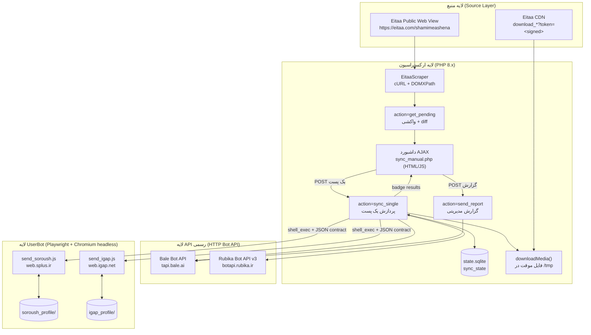
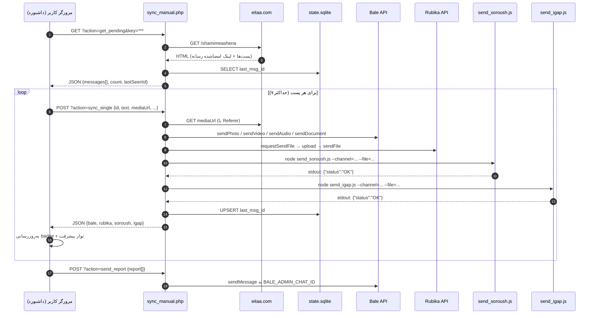

# سیستم همگام‌سازی و توزیع محتوا (Content Syndication & Synchronization System)

> آینه‌سازی (Mirror) خودکار پست‌های کانال **ایتا** به چهار پیام‌رسان ایرانی: **بله**، **روبیکا**، **سروش‌پلاس** و **آی‌گپ** — با پشتیبانی کامل از متن، تصویر، ویدیو، صدا و سند.

| | |
|---|---|
| **نوع سیستم** | Content Syndication Pipeline (نیمه‌خودکار، AJAX-driven) |
| **میزبان** | AlmaLinux / CentOS + cPanel + Apache |
| **مسیر استقرار** | `/home/file/public_html/s/` |
| **کاربر اجراکننده** | `file:file` |
| **زبان‌ها** | PHP 8.x (orchestrator) + Node.js 20 (browser automation) |
| **ذخیره‌سازی وضعیت** | SQLite (`state.sqlite`) |
| **مرورگر خودکارسازی** | Chromium (`/usr/bin/chromium-browser`) + Playwright 1.63.0 |
| **کانال مبدأ** | `https://eitaa.com/shamimeashena` |

---

## ۱. خلاصه اجرایی

این پروژه یک **pipeline تولید محتوای چندکاناله** است. به‌جای انتشار دستی هر پست در چهار پیام‌رسان، سیستم:

1. نمای وب عمومی کانال ایتا را با `cURL` واکشی و با `DOMDocument`/`DOMXPath` پارس می‌کند.
2. پیام‌های جدید را با مقایسهٔ `message_id` در برابر آخرین شناسهٔ ثبت‌شده در SQLite تشخیص می‌دهد.
3. رسانهٔ هر پست را از CDN ایتا (با لینک امضاشدهٔ `download_*?token=...`) روی دیسک موقت دانلود می‌کند.
4. محتوا را هم‌زمان به چهار مقصد می‌فرستد:
   - **بله** و **روبیکا** از طریق **Bot HTTP API رسمی**؛
   - **سروش‌پلاس** و **آی‌گپ** از طریق **UserBot مبتنی بر Playwright** (چون API رسمی آن‌ها اجازهٔ ارسال به کانال با حساب کاربری را نمی‌دهد).
5. نتیجهٔ هر پست را به‌صورت badge در داشبورد وب نمایش می‌دهد و گزارش تجمیعی را برای مدیر در بله ارسال می‌کند.

معماری به‌گونه‌ای طراحی شده که **هر پست در یک درخواست HTTP مستقل** پردازش شود؛ این تصمیم مستقیماً مشکل `504 Gateway Timeout` و `500 Internal Server Error` ناشی از محدودیت زمانی Apache/FastCGI را حل کرده است (نگاه کنید به [`ARCHITECTURE.md`](ARCHITECTURE.md) §۶).

---

## ۲. ویژگی‌های کلیدی

- **پوشش کامل انواع محتوا**: متن ساده، تصویر، ویدیو، صدا (audio) و سند (document) با نگاشت خودکار نوع رسانه به متد صحیح هر پلتفرم.
- **State Machine پایدار**: جدول `sync_state` با کلید اصلی `channel` و ستون `last_msg_id`؛ هیچ پستی دوبار ارسال نمی‌شود حتی اگر مرورگر را ببندید یا اسکریپت را مجدداً اجرا کنید.
- **صف محدود (Bounded Queue)**: ثابت `MAX_MESSAGES_LIMIT = 7` از سیل‌زدگی صف و تایم‌اوت‌های زنجیره‌ای جلوگیری می‌کند.
- **داشبورد بلادرنگ**: نوار پیشرفت، badge وضعیت به تفکیک پلتفرم (OK / Fail / Loading) و ترمینال مجازی زنده با مهر زمانی شمسی.
- **معماری Micro-batching ناهمگام**: پردازش پست‌ها یکی‌یکی از سمت مرورگر کاربر، با پاسخ فوری سرور.
- **Pipeline سه‌مرحله‌ای روبیکا**: `requestSendFile` → آپلود multipart → `sendFile` با fallback خودکار به ارسال متنی در صورت شکست آپلود.
- **خودترمیمی قفل‌های Chromium**: پاک‌سازی `SingletonLock` / `SingletonCookie` / `SingletonSocket` پیش از اجرا و پس از پایان، در هر دو لایهٔ PHP و Node.
- **گزارش‌دهی مدیریتی**: ارسال خلاصهٔ اجرا به `BALE_ADMIN_CHAT_ID` با آیکون‌های ✅ / ❌ به تفکیک هر پست و هر پلتفرم.
- **ابزارهای تشخیص DOM**: دو اسکریپت بازرسی (`inspect_igap.js`, `inspect_attach.js`) برای زمان‌هایی که سلکتورها پس از به‌روزرسانی رابط کاربری پیام‌رسان می‌شکنند.

---

## ۳. معماری سطح بالا



**جریان زمان‌بندی یک پست رسانه‌دار (سناریوی واقعی):**



---

## ۴. ماتریس پلتفرم‌ها

| پلتفرم | روش اتصال | اندپوینت / کلاینت | شناسه مقصد | متن | تصویر | ویدیو | صدا | سند |
|---|---|---|---|---|---|---|---|---|
| **بله** | Bot HTTP API رسمی | `https://tapi.bale.ai/bot<TOKEN>/` | `BALE_CHANNEL_ID` = `@testforme` | ✅ `sendMessage` | ✅ `sendPhoto` | ✅ `sendVideo` | ✅ `sendAudio` | ✅ `sendDocument` |
| **روبیکا** | Bot HTTP API رسمی (v3) | `https://botapi.rubika.ir/v3/<TOKEN>/` | `RUBIKA_CHANNEL_ID` = `@shamimeashena1` | ✅ `sendMessage` | ✅ `type: Image` | ✅ `type: Video` | ✅ `type: Music` | ✅ `type: File` |
| **سروش‌پلاس** | UserBot (Playwright) | `https://web.splus.ir/#@<channel>` | `SOROUSH_CHANNEL_ID` = `shamimeashena1` | ✅ | ✅ | ✅ | ⚠️ مسیر File | ⚠️ مسیر File |
| **آی‌گپ** | UserBot (Playwright) | `https://web.igap.net` | `IGAP_CHANNEL_ID` = `shamimeashena` | ✅ | ✅ | ✅ | ⚠️ مسیر File | ⚠️ مسیر File |

> ⚠️ در دو UserBot، تفکیک نوع فایل بر پایهٔ **پسوند** انجام می‌شود: پسوندهای `.jpg .jpeg .png .webp .gif .mp4` به مسیر «Media» و بقیه به مسیر «File/document» می‌روند.

---

## ۵. نقشه دایرکتوری

```
/home/file/public_html/s/
│
├── 🌐 لایه وب / ارکستراسیون
│   ├── sync_manual.php          ← ⭐ نقطه ورود اصلی: داشبورد + ۳ اندپوینت AJAX
│   ├── sync_daemon.php          ← جایگزین CLI: حلقه daemon با فاصله ۳۰ ثانیه (legacy)
│   └── .htaccess                ← (باید ساخته شود) محافظت از state/profile ها
│
├── 🤖 لایه خودکارسازی مرورگر (Node.js + Playwright)
│   ├── send_soroush.js          ← ارسال به سروش‌پلاس (متن + رسانه)
│   ├── send_igap.js             ← ارسال به آی‌گپ (متن + رسانه)
│   ├── login_soroush.js         ← ورود تعاملی و ساخت session سروش‌پلاس
│   ├── restore_session.js       ← بازگردانی session از soroush_session.json
│   ├── inspect_igap.js          ← ابزار تشخیص DOM فوتر composer آی‌گپ
│   ├── inspect_attach.js        ← ابزار تشخیص منوی ضمیمه آی‌گپ
│   ├── start_browser.sh         ← اجرای Chromium با remote debugging روی پورت ۹۲۲۲
│   ├── package.json             ← وابستگی: playwright ^1.63.0
│   └── node_modules/            ← (git-ignored)
│
├── 🧪 اسکریپت‌های تست مستقل
│   ├── test.php                 ← تست پارسر ایتا روی هر کانال دلخواه (?ch=)
│   ├── send_test.php            ← تست end-to-end: ایتا → دانلود → بله sendPhoto
│   ├── test_rubika.php          ← تست sendMessage روبیکا با GUID و username
│   ├── test_rubika_media.php    ← تست pipeline سه‌مرحله‌ای آپلود فایل روبیکا
│   ├── test_soroush.php         ← تست Bot API سروش‌پلاس (getMe + sendMessage)
│   └── test_img.jpg             ← fixture تصویری تست روبیکا
│
├── 💾 وضعیت و Session (git-ignored، حساس)
│   ├── state.sqlite             ← جدول sync_state
│   ├── soroush_profile/         ← پروفایل پایدار Chromium سروش‌پلاس
│   ├── igap_profile/            ← پروفایل پایدار Chromium آی‌گپ
│   └── soroush_session.json     ← پشتیبان LocalStorage/IndexedDB سروش‌پلاس
│
├── 📸 شواهد اجرا (git-ignored)
│   ├── last_media_send.jpg      ← اسکرین‌شات پایانی send_soroush.js
│   ├── last_igap_send.jpg       ← اسکرین‌شات پایانی send_igap.js
│   ├── step1..3.jpg, step_filled.jpg   ← مراحل ورود سروش‌پلاس
│   ├── igap_attach_menu.jpg, igap_popup_opened.jpg, igap_state.jpg
│   ├── igap_dump.html           ← دامپ DOM آی‌گپ برای استخراج سلکتور
│   └── error_log                ← خطاهای PHP (توسط cPanel نوشته می‌شود)
│
└── 📚 مستندات
    ├── README.md                ← همین فایل
    ├── ARCHITECTURE.md          ← معماری فنی عمیق
    ├── DEPLOYMENT.md            ← راهنمای استقرار تولید
    ├── PLAYWRIGHT_SPECS.md      ← مشخصات خودکارسازی UI
    └── TROUBLESHOOTING.md       ← Runbook رفع اشکال
```

---

## ۶. پیش‌نیازها

| جزء | نسخهٔ هدف | بررسی |
|---|---|---|
| AlmaLinux / CentOS | 8 یا 9 | `cat /etc/redhat-release` |
| PHP | 8.0+ با `pdo_sqlite`, `curl`, `dom`, `libxml`, `mbstring`, `fileinfo` | `php -m \| grep -E 'pdo_sqlite\|curl\|dom\|mbstring\|fileinfo'` |
| Node.js | 20.x در `/usr/bin/node` | `/usr/bin/node -v` |
| Chromium | مسیر `/usr/bin/chromium-browser` | `/usr/bin/chromium-browser --version` |
| Playwright | 1.63.0 (بدون دانلود مرورگر اختصاصی) | `node -e "console.log(require('playwright/package.json').version)"` |
| SQLite | 3.x | `sqlite3 state.sqlite '.tables'` |
| RAM | حداقل ۲ گیگابایت (هر Chromium ≈ ۳۵۰–۷۰۰ مگابایت) | `free -m` |
| دیسک | ۱ گیگابایت فضای آزاد برای پروفایل‌ها و رسانه موقت | `df -h /home` |

راهنمای نصب گام‌به‌گام: [`DEPLOYMENT.md`](DEPLOYMENT.md).

---

## ۷. شروع سریع

```bash
# ۱) ورود به مسیر استقرار
cd /home/file/public_html/s

# ۲) نصب وابستگی Node (بدون دانلود مرورگر Playwright — از Chromium سیستم استفاده می‌کنیم)
PLAYWRIGHT_SKIP_BROWSER_DOWNLOAD=1 npm install

# ۳) اصلاح مالکیت (بسیار مهم — ریشهٔ خطای Permission denied 13)
chown -R file:file /home/file/public_html/s
chmod 755 /home/file/public_html/s
chmod 700 /home/file/public_html/s/{soroush_profile,igap_profile}
chmod 660 /home/file/public_html/s/state.sqlite

# ۴) ساخت/بازرسی پایگاه داده وضعیت
sqlite3 state.sqlite "CREATE TABLE IF NOT EXISTS sync_state (channel TEXT PRIMARY KEY, last_msg_id INTEGER NOT NULL);"
sqlite3 state.sqlite "SELECT * FROM sync_state;"

# ۵) تست پارسر ایتا (بدون ارسال)
curl -s "https://your-domain/s/test.php?ch=shamimeashena" | head -40

# ۶) ساخت session سروش‌پلاس (تعاملی — شماره موبایل و کد OTP لازم است)
sudo -u file /usr/bin/node login_soroush.js

# ۷) باز کردن داشبورد در مرورگر و کلیک روی «بررسی و شروع همگام‌سازی»
#    https://your-domain/s/sync_manual.php?key=<SECURITY_KEY>
```

### اجرای دستی یک ارسال UserBot (خارج از داشبورد)

```bash
# ارسال متن خالی به سروش‌پلاس
sudo -u file /usr/bin/node /home/file/public_html/s/send_soroush.js \
  --channel=shamimeashena1 \
  --text="تست ارسال از خط فرمان"

# ارسال تصویر + کپشن به آی‌گپ
sudo -u file /usr/bin/node /home/file/public_html/s/send_igap.js \
  --channel=shamimeashena \
  --text="تست رسانه" \
  --file=/home/file/public_html/s/test_img.jpg
```

خروجی موفق باید **دقیقاً** یک خط JSON روی stdout باشد:

```json
{"status":"OK","message":"Media post dispatched successfully"}
```

و در صورت خطا روی stderr همراه با کد خروج `1`:

```json
{"status":"ERROR","error":"Timeout 15000ms exceeded."}
```

---

## ۸. پیکربندی

همهٔ تنظیمات به‌صورت `const` در بالای [`sync_manual.php`](sync_manual.php) تعریف شده‌اند:

| ثابت | مقدار فعلی | نقش |
|---|---|---|
| `SECURITY_KEY` | *(در کد — باید تغییر کند)* | کلید دسترسی کوئری‌استرینگ `?key=` |
| `EITAA_CHANNEL_ID` | `shamimeashena` | کانال مبدأ در ایتا (بدون `@`) |
| `MAX_MESSAGES_LIMIT` | `7` | سقف پست‌های پردازشی در هر اجرا |
| `BALE_BOT_TOKEN` | *(محرمانه)* | توکن بات بله |
| `BALE_CHANNEL_ID` | `@testforme` | کانال مقصد بله |
| `BALE_ADMIN_CHAT_ID` | `1598432451` | گیرندهٔ گزارش مدیریتی |
| `RUBIKA_BOT_TOKEN` | *(محرمانه)* | توکن بات روبیکا |
| `RUBIKA_CHANNEL_ID` | `@shamimeashena1` | کانال مقصد روبیکا |
| `SOROUSH_CHANNEL_ID` | `shamimeashena1` | کانال مقصد سروش‌پلاس (بدون `@`) |
| `SOROUSH_SCRIPT` | `/home/file/public_html/s/send_soroush.js` | مسیر مطلق اسکریپت Node |
| `IGAP_CHANNEL_ID` | `shamimeashena` | کانال مقصد آی‌گپ |
| `IGAP_SCRIPT` | `/home/file/public_html/s/send_igap.js` | مسیر مطلق اسکریپت Node |
| `NODE_BIN` | `/usr/bin/node` | باینری Node مورد استفاده در `shell_exec` |

> 🔒 **هشدار امنیتی:** توکن‌ها در حال حاضر hard-code هستند. پیش از هر استقرار عمومی، بخش «امنیت» در [`ARCHITECTURE.md`](ARCHITECTURE.md) §۹ و گام ۹ [`DEPLOYMENT.md`](DEPLOYMENT.md) را اجرا کنید (انتقال به `.env` / `config.local.php` و **چرخش توکن‌ها**، چون در تاریخ Git ثبت شده‌اند).

---

## ۹. اندپوینت‌های AJAX

| متد | اندپوینت | ورودی | خروجی |
|---|---|---|---|
| `GET` | `sync_manual.php?action=get_pending&key=<KEY>` | — | `{success, lastSeenId, count, messages:[{id,text,mediaUrl,mediaType,fileName}]}` |
| `POST` | `sync_manual.php?action=sync_single&key=<KEY>` | بدنهٔ JSON یک پیام | `{success, id, bale:{ok,info}, rubika:{ok,info}, soroush:{ok,info}, igap:{ok,info}}` |
| `POST` | `sync_manual.php?action=send_report&key=<KEY>` | `{report:[string]}` | `{success:true}` |
| `GET` | `sync_manual.php?key=<KEY>` (بدون action) | — | HTML داشبورد |

**معیار موفقیت هر پلتفرم:**

| پلتفرم | شرط `ok = true` |
|---|---|
| بله | `HTTP 200` **و** `response.ok === true` |
| روبیکا | `HTTP 200` **و** `response.status === "OK"` |
| سروش‌پلاس | JSON خروجی اسکریپت: `status === "OK"` |
| آی‌گپ | JSON خروجی اسکریپت: `status === "OK"` |

> نکته مهم: در `sync_single`، مقدار `last_msg_id` **صرف‌نظر از موفقیت یا شکست پلتفرم‌ها** به‌روزرسانی می‌شود. یعنی پستی که مثلاً فقط در آی‌گپ شکست بخورد، دوباره در صف قرار نمی‌گیرد و باید دستی resend شود (نگاه کنید به [`TROUBLESHOOTING.md`](TROUBLESHOOTING.md) §۸).

---

## ۱۰. ابزارهای تشخیصی

| فایل | کاربرد | اجرا |
|---|---|---|
| `test.php` | پارسر ایتا روی هر کانال دلخواه؛ بدون ارسال | `curl "…/test.php?ch=shamimeashena"` |
| `send_test.php` | مسیر کامل ایتا → دانلود → `sendPhoto` بله | `curl "…/send_test.php"` |
| `test_rubika.php` | تفکیک `chat_id` به شکل GUID در برابر username | `curl "…/test_rubika.php"` |
| `test_rubika_media.php` | pipeline سه‌مرحله‌ای آپلود فایل روبیکا | `curl "…/test_rubika_media.php"` |
| `test_soroush.php` | `getMe` و `sendMessage` روی Bot API سروش‌پلاس | `curl "…/test_soroush.php"` |
| `inspect_igap.js` | استخراج دکمه‌های فوتر composer و `input[type=file]` آی‌گپ | `node inspect_igap.js` |
| `inspect_attach.js` | استخراج گزینه‌های منوی ضمیمه آی‌گپ | `node inspect_attach.js` |
| `start_browser.sh` | Chromium با remote debugging (پورت ۹۲۲۲) برای دیباگ زنده | `bash start_browser.sh` |

---

## ۱۱. نقشه مستندات

| سند | محتوا |
|---|---|
| [`ARCHITECTURE.md`](ARCHITECTURE.md) | جریان داده، مکانیک scraping، یکپارچگی REST API، ارکستراسیون Playwright، منطق state machine، پروتکل‌های امنیتی، بدهی فنی |
| [`DEPLOYMENT.md`](DEPLOYMENT.md) | نصب پکیج‌ها، مجوزها، مقداردهی اولیه session، Cron و Systemd، `.htaccess`، مانیتورینگ، رول‌بک |
| [`PLAYWRIGHT_SPECS.md`](PLAYWRIGHT_SPECS.md) | مشخصات کامل سلکتورهای سروش‌پلاس و آی‌گپ، مدیریت race condition، workaround های headless، playbook نگهداری سلکتور |
| [`TROUBLESHOOTING.md`](TROUBLESHOOTING.md) | Runbook دسته‌بندی‌شده با دستورات دقیق bash برای هر حالت خرابی |

---

## ۱۲. تغییرات اخیر این نسخه

| # | تغییر | نوع | فایل |
|---|---|---|---|
| 1 | رفع باگ `sprintf('\%s \%s --channel=\%s', …)` که backslash خام به دستور shell تزریق می‌کرد و کوئوتینگ `escapeshellarg()` را می‌شکست؛ جایگزینی با اتصال مستقیم `escapeshellarg()` | 🐛 Bugfix بحرانی | `sync_manual.php` (`sendToSoroush`, `sendToIgap`) |
| 2 | افزودن `parseNodeJsonOutput()` برای استخراج آخرین JSON معتبر از خروجی Node (هشدارهای Playwright/Chromium که با `2>&1` به stdout می‌آیند، قبلاً باعث `json_decode` ناموفق و badge «✕» کاذب می‌شدند) | 🐛 Bugfix | `sync_manual.php` |
| 3 | افزودن `.gitignore` و خارج‌سازی `node_modules/`، پروفایل‌های مرورگر، `soroush_session.json`، `state.sqlite`، اسکرین‌شات‌های runtime و `error_log` از ردیابی Git (3844 → 17 فایل) | 🔒 امنیتی/بهداشت ریپو | `.gitignore` |
| 4 | افزودن مجموعه مستندات تولیدی پنج‌گانه | 📚 Documentation | `README.md`, `ARCHITECTURE.md`, `DEPLOYMENT.md`, `PLAYWRIGHT_SPECS.md`, `TROUBLESHOOTING.md` |

---

## ۱۳. سلب مسئولیت عملیاتی

- مسیرهای UserBot (سروش‌پلاس و آی‌گپ) به **رابط وب رسمی** این پیام‌رسان‌ها وابسته‌اند. هر به‌روزرسانی سمت آن‌ها ممکن است سلکتورهای DOM را باطل کند؛ در این صورت [`PLAYWRIGHT_SPECS.md`](PLAYWRIGHT_SPECS.md) §۸ (playbook بازسازی سلکتور) را دنبال کنید.
- استفاده از حساب کاربری واقعی برای خودکارسازی، مشروط به رعایت **شرایط استفادهٔ هر پلتفرم** است. پیش از استقرار تولید، از انطباق قانونی آن اطمینان حاصل کنید.
- لینک‌های رسانهٔ ایتا **امضاشده و زمان‌دار** هستند؛ فاصلهٔ زیاد بین `get_pending` و `sync_single` می‌تواند منجر به `HTTP 403` در دانلود رسانه شود.
