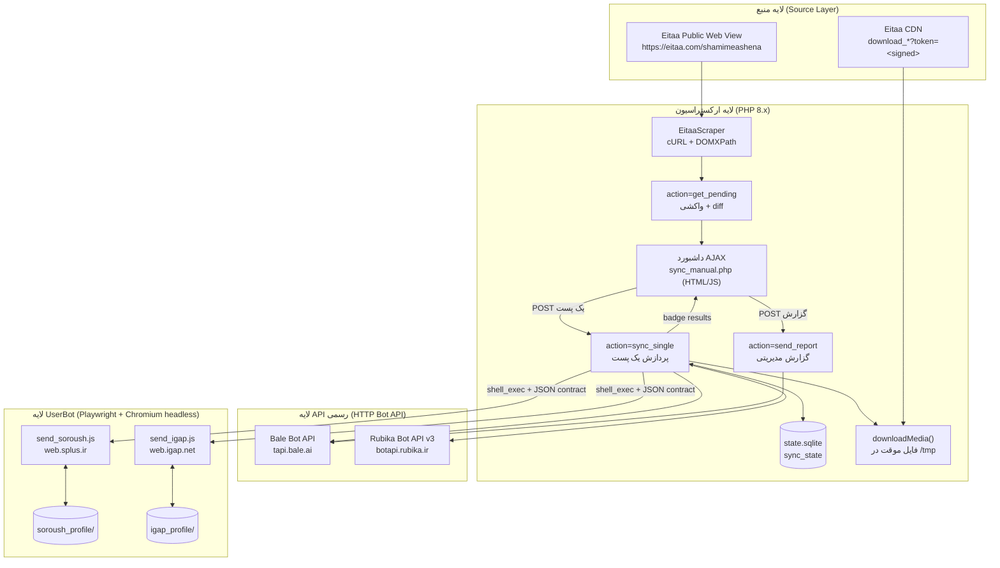
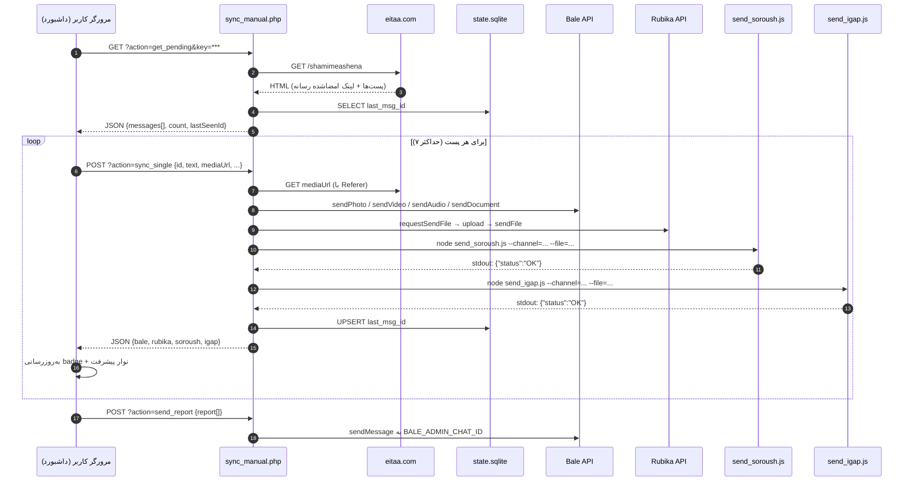

# سیستم همگام‌سازی و توزیع محتوا (Content Syndication & Synchronization System)

> آینه‌سازی (Mirror) خودکار پست‌های کانال **ایتا** به چهار پیام‌رسان ایرانی: **بله**، **روبیکا**، **سروش‌پلاس** و **آی‌گپ** — با پشتیبانی کامل از متن، تصویر، ویدیو، صدا و سند.

| | |
|---|---|
| **نوع سیستم** | Content Syndication Pipeline (نیمه‌خودکار، AJAX-driven) |
| **میزبان** | AlmaLinux / CentOS + cPanel + Apache |
| **مسیر استقرار** | `/home/file/public_html/s/` |
| **کاربر اجراکننده** | `file:file` |
| **زبان‌ها** | PHP 8.x (orchestrator) + Node.js 20 (browser automation) |
| **ذخیره‌سازی وضعیت** | SQLite (`state.sqlite`) |
| **مرورگر خودکارسازی** | Chromium (`/usr/bin/chromium-browser`) + Playwright 1.63.0 |
| **کانال مبدأ** | `https://eitaa.com/shamimeashena` |

---

## ۱. خلاصه اجرایی

این پروژه یک **pipeline تولید محتوای چندکاناله** است. به‌جای انتشار دستی هر پست در چهار پیام‌رسان، سیستم:

1. نمای وب عمومی کانال ایتا را با `cURL` واکشی و با `DOMDocument`/`DOMXPath` پارس می‌کند.
2. پیام‌های جدید را با مقایسهٔ `message_id` در برابر آخرین شناسهٔ ثبت‌شده در SQLite تشخیص می‌دهد.
3. رسانهٔ هر پست را از CDN ایتا (با لینک امضاشدهٔ `download_*?token=...`) روی دیسک موقت دانلود می‌کند.
4. محتوا را هم‌زمان به چهار مقصد می‌فرستد:
   - **بله** و **روبیکا** از طریق **Bot HTTP API رسمی**؛
   - **سروش‌پلاس** و **آی‌گپ** از طریق **UserBot مبتنی بر Playwright** (چون API رسمی آن‌ها اجازهٔ ارسال به کانال با حساب کاربری را نمی‌دهد).
5. نتیجهٔ هر پست را به‌صورت badge در داشبورد وب نمایش می‌دهد و گزارش تجمیعی را برای مدیر در بله ارسال می‌کند.

معماری به‌گونه‌ای طراحی شده که **هر پست در یک درخواست HTTP مستقل** پردازش شود؛ این تصمیم مستقیماً مشکل `504 Gateway Timeout` و `500 Internal Server Error` ناشی از محدودیت زمانی Apache/FastCGI را حل کرده است (نگاه کنید به [`ARCHITECTURE.md`](ARCHITECTURE.md) §۶).

---

## ۲. ویژگی‌های کلیدی

- **پوشش کامل انواع محتوا**: متن ساده، تصویر، ویدیو، صدا (audio) و سند (document) با نگاشت خودکار نوع رسانه به متد صحیح هر پلتفرم.
- **State Machine پایدار**: جدول `sync_state` با کلید اصلی `channel` و ستون `last_msg_id`؛ هیچ پستی دوبار ارسال نمی‌شود حتی اگر مرورگر را ببندید یا اسکریپت را مجدداً اجرا کنید.
- **صف محدود (Bounded Queue)**: ثابت `MAX_MESSAGES_LIMIT = 7` از سیل‌زدگی صف و تایم‌اوت‌های زنجیره‌ای جلوگیری می‌کند.
- **داشبورد بلادرنگ**: نوار پیشرفت، badge وضعیت به تفکیک پلتفرم (OK / Fail / Loading) و ترمینال مجازی زنده با مهر زمانی شمسی.
- **معماری Micro-batching ناهمگام**: پردازش پست‌ها یکی‌یکی از سمت مرورگر کاربر، با پاسخ فوری سرور.
- **Pipeline سه‌مرحله‌ای روبیکا**: `requestSendFile` → آپلود multipart → `sendFile` با fallback خودکار به ارسال متنی در صورت شکست آپلود.
- **خودترمیمی قفل‌های Chromium**: پاک‌سازی `SingletonLock` / `SingletonCookie` / `SingletonSocket` پیش از اجرا و پس از پایان، در هر دو لایهٔ PHP و Node.
- **گزارش‌دهی مدیریتی**: ارسال خلاصهٔ اجرا به `BALE_ADMIN_CHAT_ID` با آیکون‌های ✅ / ❌ به تفکیک هر پست و هر پلتفرم.
- **ابزارهای تشخیص DOM**: دو اسکریپت بازرسی (`inspect_igap.js`, `inspect_attach.js`) برای زمان‌هایی که سلکتورها پس از به‌روزرسانی رابط کاربری پیام‌رسان می‌شکنند.

---

## ۳. معماری سطح بالا



**جریان زمان‌بندی یک پست رسانه‌دار (سناریوی واقعی):**



---

## ۴. ماتریس پلتفرم‌ها

| پلتفرم | روش اتصال | اندپوینت / کلاینت | شناسه مقصد | متن | تصویر | ویدیو | صدا | سند |
|---|---|---|---|---|---|---|---|---|
| **بله** | Bot HTTP API رسمی | `https://tapi.bale.ai/bot<TOKEN>/` | `BALE_CHANNEL_ID` = `@testforme` | ✅ `sendMessage` | ✅ `sendPhoto` | ✅ `sendVideo` | ✅ `sendAudio` | ✅ `sendDocument` |
| **روبیکا** | Bot HTTP API رسمی (v3) | `https://botapi.rubika.ir/v3/<TOKEN>/` | `RUBIKA_CHANNEL_ID` = `@shamimeashena1` | ✅ `sendMessage` | ✅ `type: Image` | ✅ `type: Video` | ✅ `type: Music` | ✅ `type: File` |
| **سروش‌پلاس** | UserBot (Playwright) | `https://web.splus.ir/#@<channel>` | `SOROUSH_CHANNEL_ID` = `shamimeashena1` | ✅ | ✅ | ✅ | ⚠️ مسیر File | ⚠️ مسیر File |
| **آی‌گپ** | UserBot (Playwright) | `https://web.igap.net` | `IGAP_CHANNEL_ID` = `shamimeashena` | ✅ | ✅ | ✅ | ⚠️ مسیر File | ⚠️ مسیر File |

> ⚠️ در دو UserBot، تفکیک نوع فایل بر پایهٔ **پسوند** انجام می‌شود: پسوندهای `.jpg .jpeg .png .webp .gif .mp4` به مسیر «Media» و بقیه به مسیر «File/document» می‌روند.

---

## ۵. نقشه دایرکتوری

```
/home/file/public_html/s/
│
├── 🔑 پیکربندی
│   ├── .env                     ← ⭐ همهٔ توکن‌ها و رمزها (git-ignored، مجوز ۶۰۰)
│   ├── .env.example             ← الگوی کامل کلیدها با توضیح فارسی (بدون مقدار حساس)
│   ├── config.php               ← خواندن .env و تعریف ثابت‌ها برای همهٔ اسکریپت‌های PHP
│   └── setup_env.sh             ← ساخت خودکار .env + مهاجرت از تاریخ Git + کلید تصادفی
│
├── 🌐 لایه وب / ارکستراسیون
│   ├── sync_manual.php          ← ⭐ نقطه ورود اصلی: داشبورد + ۳ اندپوینت AJAX
│   ├── cli_run.php              ← ⭐ پل CLI: اجرای همان action ها بدون Apache (cron)
│   ├── sync_daemon.php          ← جایگزین CLI: حلقه daemon با فاصله ۳۰ ثانیه (legacy)
│   └── .htaccess                ← محافظت از state/profile/.env (لیست سفید)
│
├── 🤖 لایه خودکارسازی مرورگر (Node.js + Playwright)
│   ├── lib/
│   │   └── pw_common.js         ← ⭐ لایهٔ مشترک: parseArgs، RunLog، launchBrowser،
│   │                               seen/waitUntil/firstVisible، emit، detectLoginPage
│   ├── send_soroush.js          ← ارسال به سروش‌پلاس (متن + رسانه + تأیید ارسال)
│   ├── send_igap.js             ← ارسال به آی‌گپ (متن + رسانه + تأیید ارسال)
│   ├── login_soroush.js         ← ورود تعاملی و ساخت session سروش‌پلاس
│   ├── login_igap.js            ← ⭐ ورود تعاملی و ساخت session آی‌گپ
│   ├── restore_session.js       ← بازگردانی session از soroush_session.json
│   ├── dump_dom.js              ← ⭐ دامپ DOM + استخراج کاندیدهای سلکتور
│   ├── inspect_igap.js          ← ابزار تشخیص DOM فوتر composer آی‌گپ
│   ├── inspect_attach.js        ← ابزار تشخیص منوی ضمیمه آی‌گپ
│   ├── start_browser.sh         ← Chromium با پروفایل پایدار (دیباگ فقط روی 127.0.0.1)
│   ├── package.json             ← وابستگی: playwright ^1.63.0
│   └── node_modules/            ← (git-ignored)
│
├── ⚙️ عملیات و نگهداری (Ops)
│   ├── cron_sync.sh             ← ⭐ رانندهٔ خودکار: صف → ارسال → گزارش (CLI/HTTP)
│   ├── smoke_test.sh            ← ⭐ آزمون پذیرش ۶ بخشی (محیط، سینتکس، شبکه، ارسال زنده)
│   ├── acceptance.sh            ← پوشش جدول T-1..T-18 (همان smoke_test.sh)
│   ├── health_check.sh          ← بررسی سلامت روزانه + هشدار به مدیر در بله
│   ├── collect_diagnostics.sh   ← جمع‌آوری یکجای شواهد برای گزارش خطا
│   ├── restore_runtime.sh       ← ⭐ بازیابی node_modules/پروفایل‌ها/state پس از git checkout
│   ├── .cron_key                ← کلید حالت HTTP در cron (git-ignored، ساختهٔ setup_env.sh)
│   ├── logrotate.conf           ← چرخش لاگ‌ها (کپی به /etc/logrotate.d/eitaa-sync)
│   └── deploy/systemd/          ← eitaa-sync.{service,timer} و eitaa-health.{service,timer}
│
├── 🧪 اسکریپت‌های تست مستقل
│   ├── test.php                 ← تست پارسر ایتا روی هر کانال دلخواه (?ch=)
│   ├── send_test.php            ← تست end-to-end: ایتا → دانلود → بله sendPhoto
│   ├── test_rubika.php          ← تست sendMessage روبیکا با GUID و username
│   ├── test_rubika_media.php    ← تست pipeline سه‌مرحله‌ای آپلود فایل روبیکا
│   ├── test_soroush.php         ← تست Bot API سروش‌پلاس (getMe + sendMessage)
│   └── test_img.jpg             ← fixture تصویری تست روبیکا
│
├── 💾 وضعیت و Session (git-ignored، حساس)
│   ├── state.sqlite             ← جدول sync_state
│   ├── soroush_profile/         ← پروفایل پایدار Chromium سروش‌پلاس
│   ├── igap_profile/            ← پروفایل پایدار Chromium آی‌گپ
│   └── soroush_session.json     ← پشتیبان LocalStorage/IndexedDB سروش‌پلاس
│
├── 📸 شواهد اجرا (git-ignored)
│   ├── last_media_send.jpg      ← اسکرین‌شات پایانی send_soroush.js
│   ├── last_igap_send.jpg       ← اسکرین‌شات پایانی send_igap.js
│   ├── step1..3.jpg, step_filled.jpg   ← مراحل ورود سروش‌پلاس
│   ├── igap_attach_menu.jpg, igap_popup_opened.jpg, igap_state.jpg
│   ├── igap_dump.html, igap_dump.jpg   ← خروجی dump_dom.js برای استخراج سلکتور
│   ├── igap_login_step1..4.jpg  ← مراحل ورود آی‌گپ (login_igap.js)
│   ├── logs/                    ← لاگ هر اجرا: send_<platform>_<ts>_<pid>.log + cron_sync.log
│   └── error_log                ← خطاهای PHP (توسط cPanel نوشته می‌شود)
│
└── 📚 مستندات
    ├── README.md                ← همین فایل
    ├── ARCHITECTURE.md          ← معماری فنی عمیق
    ├── DEPLOYMENT.md            ← راهنمای استقرار تولید
    ├── PLAYWRIGHT_SPECS.md      ← مشخصات خودکارسازی UI
    └── TROUBLESHOOTING.md       ← Runbook رفع اشکال
```

---

## ۶. پیش‌نیازها

| جزء | نسخهٔ هدف | بررسی |
|---|---|---|
| AlmaLinux / CentOS | 8 یا 9 | `cat /etc/redhat-release` |
| PHP | 8.0+ با `pdo_sqlite`, `curl`, `dom`, `libxml`, `mbstring`, `fileinfo` | `php -m \| grep -E 'pdo_sqlite\|curl\|dom\|mbstring\|fileinfo'` |
| Node.js | 20.x در `/usr/bin/node` | `/usr/bin/node -v` |
| Chromium | مسیر `/usr/bin/chromium-browser` | `/usr/bin/chromium-browser --version` |
| Playwright | 1.63.0 (بدون دانلود مرورگر اختصاصی) | `node -e "console.log(require('playwright/package.json').version)"` |
| SQLite | 3.x | `sqlite3 state.sqlite '.tables'` |
| RAM | حداقل ۲ گیگابایت (هر Chromium ≈ ۳۵۰–۷۰۰ مگابایت) | `free -m` |
| دیسک | ۱ گیگابایت فضای آزاد برای پروفایل‌ها و رسانه موقت | `df -h /home` |

راهنمای نصب گام‌به‌گام: [`DEPLOYMENT.md`](DEPLOYMENT.md).

---

## ۷. شروع سریع

```bash
# ۱) ورود به مسیر استقرار
cd /home/file/public_html/s

# ۲) نصب وابستگی Node (بدون دانلود مرورگر Playwright — از Chromium سیستم استفاده می‌کنیم)
PLAYWRIGHT_SKIP_BROWSER_DOWNLOAD=1 npm install

# ۳) اصلاح مالکیت (بسیار مهم — ریشهٔ خطای Permission denied 13)
chown -R file:file /home/file/public_html/s
chmod 755 /home/file/public_html/s
chmod 700 /home/file/public_html/s/{soroush_profile,igap_profile}
chmod 660 /home/file/public_html/s/state.sqlite

# ۴) ساخت/بازرسی پایگاه داده وضعیت
sqlite3 state.sqlite "CREATE TABLE IF NOT EXISTS sync_state (channel TEXT PRIMARY KEY, last_msg_id INTEGER NOT NULL);"
sqlite3 state.sqlite "SELECT * FROM sync_state;"

# ۵) تست پارسر ایتا (بدون ارسال)
curl -s "https://your-domain/s/test.php?ch=shamimeashena" | head -40

# ۶) ساخت session سروش‌پلاس (تعاملی — شماره موبایل و کد OTP لازم است)
sudo -u file /usr/bin/node login_soroush.js

# ۷) ساخت session آی‌گپ (تعاملی — همین الگو برای web.igap.net)
sudo -u file /usr/bin/node login_igap.js

# ۸) خودآزمون کامل محیط (بدون ارسال) و سپس با ارسال زندهٔ تستی
sudo -u file bash smoke_test.sh
sudo -u file bash smoke_test.sh --live

# ۹) باز کردن داشبورد در مرورگر و کلیک روی «بررسی و شروع همگام‌سازی»
#    https://your-domain/s/sync_manual.php?key=<SECURITY_KEY>
```

### اجرای دستی یک ارسال UserBot (خارج از داشبورد)

> ⚠️ `--channel-name` اختیاری است ولی **قویاً توصیه می‌شود**: اسکریپت با آن
> تأیید می‌کند که چتِ درست باز شده است. بدون آن، اگر جست‌وجو نتیجهٔ اشتباه
> بدهد، پیام به چت دیگری می‌رود (ریشهٔ باگ اصلی این پروژه — §۱۲).

```bash
# ارسال متن به سروش‌پلاس
sudo -u file /usr/bin/node /home/file/public_html/s/send_soroush.js \
  --channel=shamimeashena1 \
  --channel-name="شمیم آشنا" \
  --text="تست ارسال از خط فرمان"

# ارسال تصویر + کپشن به آی‌گپ (--type نوع رسانه را صریح می‌کند)
sudo -u file /usr/bin/node /home/file/public_html/s/send_igap.js \
  --channel=shamimeashena \
  --channel-name="شمیم آشنا" \
  --text="تست رسانه" \
  --file=/home/file/public_html/s/test_img.jpg \
  --type=image
```

stdout **دقیقاً یک خط JSON** است (لاگ مرحله‌ای روی stderr و در `logs/` می‌رود):

```json
{"status":"OK","message":"Sent to iGap (modal-button)","verified":true,"proof":"snippet-in-chat","header":"شمیم آشنا","log":"/home/file/public_html/s/logs/send_igap_20260920_120000_31337.log"}
```

سه حالت خروجی ممکن (کد خروج: `0` فقط برای `OK`):

| `status` | معنا | کد خروج |
|---|---|---|
| `OK` | ارسال شد **و** صحت آن با یکی از سیگنال‌های تأیید راستی‌آزمایی شد (`proof`) | `0` |
| `UNVERIFIED` | فرایند ارسال اجرا شد ولی تأیید نشد → **OK کاذب گزارش نمی‌شود** | `1` |
| `ERROR` | خطای قطعی با `code` قابل اقدام (جدول کدها در [`TROUBLESHOOTING.md`](TROUBLESHOOTING.md) §۸٫۶) | `1` |

### اجرای چرخهٔ کامل بدون داشبورد (CLI)

```bash
# یک action را مستقیم با PHP CLI اجرا کنید (بدون Apache و بدون کلید)
cd /home/file/public_html/s
ACTION=get_pending php cli_run.php

# بدنهٔ POST را از فایل بدهید (برای sync_single)
printf '%s' '{"id":74124,"text":"تست","mediaUrl":null,"mediaType":"text"}' > /tmp/body.json
ACTION=sync_single SYNC_BODY_FILE=/tmp/body.json php cli_run.php

# کل چرخه: صف → ارسال → گزارش مدیریتی
sudo -u file bash cron_sync.sh
```

---

## ۸. پیکربندی

همهٔ پیکربندی — به‌ویژه **همهٔ توکن‌ها و رمزها** — در یک فایل `.env` کنار برنامه نگه داشته می‌شود و هیچ secret ای در کد باقی نمانده است. سه فایل این لایه را می‌سازند:

| فایل | نقش | در Git؟ |
|---|---|---|
| `.env.example` | الگوی کامل همهٔ کلیدها با توضیح فارسی (بدون مقدار حساس) | ✅ بله |
| `config.php` | خواندن `.env` و تعریف ثابت‌ها + توابع `env()/envInt()/envBool()/envMissing()` | ✅ بله |
| `lib/pw_common.js` | خواندن همان `.env` سمت Node (برای مقدارهای پیش‌فرض کانال و مسیرها) | ✅ بله |
| `lib/dotenv.sh` | خواندن امن همان `.env` در Bash (برای `cron_sync.sh`، `health_check.sh` و…) | ✅ بله |
| `.env` | مقدارهای واقعی استقرار شما | ❌ هرگز (git-ignored + مسدود در `.htaccess`) |

### ۸.۱ ساخت `.env` (یک دستور)

```bash
cd /home/file/public_html/s
bash setup_env.sh              # ساخت .env + مهاجرت خودکار مقدارها + کلید تصادفی
bash setup_env.sh --show       # نمایش خلاصه با مقدارهای پوشیده
bash setup_env.sh --check      # اعتبارسنجی کلیدهای ضروری و مجوز ۶۰۰
chmod 600 .env && chown file:file .env
```

`setup_env.sh` این کارها را می‌کند: ساخت `.env` از روی `.env.example`، بیرون کشیدن مقدارهای قدیمی از درخت کاری و **تاریخ Git** (تا توکن‌ها را دوباره تایپ نکنید)، ساخت `SECURITY_KEY` تصادفی ۳۲ نویسه‌ای (مقدار قدیمی `1` بود)، هم‌تراز کردن همهٔ مسیرها با دایرکتوری واقعی برنامه، ساخت `.cron_key`، و ست کردن مجوز `600`.

> 🔴 این توکن‌ها در تاریخ Git نیز وجود دارند؛ پس از استقرار حتماً **چرخش** کنید (revoke + ساخت مجدد در پنل هر پیام‌رسان). برای حذف کامل از تاریخ: `git filter-repo` یا BFG. جزئیات در [`ARCHITECTURE.md`](ARCHITECTURE.md) §۹.

### ۸.۲ اولویت مقدارها

```text
متغیر محیطی واقعی (systemd / cron / shell)   >   .env   >   پیش‌فرض داخل config.php
```

یعنی برای یک اجرای آزمایشی می‌توانید بدون دست زدن به `.env` فقط یک مقدار را override کنید:

```bash
IGAP_CHANNEL_NAME="کانال آزمایش" sudo -u file --preserve-env=IGAP_CHANNEL_NAME \
  /usr/bin/node send_igap.js --text="تست"
```

### ۸.۳ جدول کلیدها

**اعتبارنامه‌ها و دسترسی (فقط از `.env` — پیش‌فرض خالی است)**

| کلید | نقش |
|---|---|
| `SECURITY_KEY` | کلید داشبورد و اندپوینت‌های AJAX (`?key=`) |
| `DASHBOARD_ALLOWED_IP` | محدودسازی IP داشبورد (چند مقدار با کاما؛ خالی = بدون محدودیت) |
| `BALE_BOT_TOKEN` | توکن بات بله |
| `BALE_ADMIN_CHAT_ID` | گیرندهٔ گزارش مدیریتی در بله |
| `RUBIKA_BOT_TOKEN` | توکن بات روبیکا |
| `RUBIKA_CHAT_ID_GUID` | شناسهٔ یکتا (GUID) کانال روبیکا — برای آزمون تفکیک GUID/username |
| `SOROUSH_BOT_TOKEN`, `SOROUSH_CHAT_ID` | مسیر Bot API سروش (اختیاری؛ مسیر اصلی UserBot است) |

**مبدأ و مقصدها (پیش‌فرض امن دارند)**

| کلید | پیش‌فرض | نقش |
|---|---|---|
| `EITAA_CHANNEL_ID` | `shamimeashena` | کانال مبدأ در ایتا (بدون `@`) |
| `MAX_MESSAGES_LIMIT` | `7` | سقف پست‌های پردازشی در هر اجرا |
| `BALE_CHANNEL_ID` | `@testforme` | کانال مقصد بله |
| `RUBIKA_CHANNEL_ID` | `@shamimeashena1` | کانال مقصد روبیکا |
| `SOROUSH_CHANNEL_ID` | `shamimeashena1` | کانال مقصد سروش‌پلاس (بدون `@`) |
| `SOROUSH_CHANNEL_NAME` | `شمیم آشنا` | **نام نمایشی**؛ معیار تأیید «باز شدن چت درست» |
| `IGAP_CHANNEL_ID` | `shamimeashena` | کانال مقصد آی‌گپ |
| `IGAP_CHANNEL_NAME` | `شمیم آشنا` | نام نمایشی کانال در لیست گفت‌وگوهای آی‌گپ |
| `IGAP_ITEM_ID` | `16200343869985976` | `data-list-item-id` سل کانال در آی‌گپ |

**مسیرها و زمان اجرا**

| کلید | پیش‌فرض | نقش |
|---|---|---|
| `SYNC_APP_DIR` | دایرکتوری خود برنامه | ریشهٔ همهٔ مسیرها (پروفایل‌ها، `logs/`، state) |
| `NODE_BIN` | `/usr/bin/node` | باینری Node در `shell_exec` |
| `SYNC_CHROMIUM_BIN` | `/usr/bin/chromium-browser` | باینری کرومیوم (خالی = تشخیص خودکار) |
| `PHP_BIN` | *(خالی = تشخیص خودکار)* | باینری PHP برای `cron_sync.sh` |
| `SOROUSH_SCRIPT` / `IGAP_SCRIPT` | `<APP>/send_*.js` | مسیر اسکریپت‌های Node |
| `SOROUSH_PROFILE_DIR` / `IGAP_PROFILE_DIR` | `<APP>/*_profile` | پروفایل پایدار کرومیوم |
| `STATE_DB_PATH` / `LOG_DIR` | `<APP>/state.sqlite` و `<APP>/logs` | پایگاه دادهٔ وضعیت و لاگ‌ها |

**زمان‌بندی، تحمل خطا و اشکال‌زدایی**

| کلید | پیش‌فرض | نقش |
|---|---|---|
| `USERBOT_TIMEOUT_SEC` | `240` | کرانهٔ سخت هر اجرای UserBot (`timeout` دور subprocess) |
| `MEDIA_MAX_RETRY` | `3` | سقف تلاش دانلود رسانه پیش از انتشار بدون رسانه ([`TROUBLESHOOTING.md`](TROUBLESHOOTING.md) §۳.۳) |
| `SYNC_GAP_SEC` | `5` | فاصلهٔ بین پست‌ها در `cron_sync.sh` |
| `CHECK_INTERVAL_SEC` | `30` | فاصلهٔ بررسی در `sync_daemon.php` (legacy) |
| `SYNC_BASE_URL` | *(خالی = حالت CLI)* | پایهٔ URL برای حالت HTTP در `cron_sync.sh` |
| `SYNC_USER_AGENT` | *(خالی)* | override کردن UA کرومیوم — توصیه نمی‌شود |
| `SYNC_HEADED` | `0` | `1` = اجرای غیر headless برای ورود تعاملی |
| `ENABLE_SOROUSH_BOT` | `false` | فعال‌سازی مسیر Bot API سروش در daemon |

> 📝 **مقدار دارای فاصله را در کوتیشن بگذارید.** نام کانال‌ها فارسی و دارای فاصله‌اند (`SOROUSH_CHANNEL_NAME="شمیم آشنا"`). `setup_env.sh` این کوتیشن را خودش می‌گذارد و هر سه لودر (`config.php`، `lib/pw_common.js`، `lib/dotenv.sh`) آن را حذف می‌کنند؛ ولی اگر دستی ویرایش کردید، بدون کوتیشن ممکن است `source .env` در shell بشکند.

> ⚠️ اگر `SECURITY_KEY` خالی باشد، داشبورد با پیام «پیکربندی ناقص» بالا نمی‌آید و اگر `BALE_BOT_TOKEN` یا `RUBIKA_BOT_TOKEN` خالی باشد، همان پلتفرم با پیام `پیکربندی ناقص است؛ این کلیدها در .env مقدار ندارند: …` شکست می‌خورد — **نه** ارسال اشتباه یا OK کاذب.

---

## ۹. اندپوینت‌های AJAX

| متد | اندپوینت | ورودی | خروجی |
|---|---|---|---|
| `GET` | `sync_manual.php?action=get_pending&key=<KEY>` | — | `{success, lastSeenId, count, messages:[{id,text,mediaUrl,mediaType,fileName}]}` |
| `POST` | `sync_manual.php?action=sync_single&key=<KEY>` | بدنهٔ JSON یک پیام | `{success, id, media:{ok,info}, bale:{ok,info}, rubika:{ok,info}, soroush:{ok,info}, igap:{ok,info}}` |
| `POST` | `sync_manual.php?action=send_report&key=<KEY>` | `{report:[string]}` | `{success:true}` |
| `POST` | `sync_manual.php?action=resend&key=<KEY>` | `{"ids":[…]}` یا `{"from":74136,"to":74142}` + `{"only":["soroush","igap"]}` | `{success, only, count, lastSeenId, results:[…]}` |
| `POST` | `sync_manual.php?action=rewind&key=<KEY>` | `{"id":74135}` | `{success, before, lastSeenId}` |
| `GET` | `sync_manual.php?key=<KEY>` (بدون action) | — | HTML داشبورد |

**`action=resend` — جبران شکست جزئی بدون پست تکراری**

اگر پستی به بله/روبیکا رفته ولی سروش/آی‌گپ شکست خورده باشد، `last_msg_id` جلو رفته و پست دیگر در صف برنمی‌گردد. `resend` کانال ایتا را **دوباره scrape می‌کند** (چون لینک رسانه امضاشده و زمان‌دار است)، پست‌های خواسته‌شده را پیدا می‌کند و فقط به مقصدهای `only` می‌فرستد؛ `last_msg_id` دست نمی‌خورد مگر `"advance":true` بدهید.

```bash
KEY=$(cat .cron_key)
curl -s -X POST "https://دامنه/s/sync_manual.php?action=resend&key=$KEY" \
     -H 'Content-Type: application/json' \
     -d '{"from":74136,"to":74142,"only":["soroush","igap"]}' | jq .

# مسیر CLI (بدون کلید وب):
echo '{"ids":[74136,74137],"only":["soroush","igap"]}' > /tmp/resend.json
ACTION=resend SYNC_BODY_FILE=/tmp/resend.json php cli_run.php | jq .
```

همین فیلتر در `sync_single` هم هست: `{"id":…,"text":…,"only":["igap"]}`. پلتفرم‌های ردشده در پاسخ `{"ok":null,"info":"SKIPPED"}` می‌گیرند و در داشبورد با `—` نمایش داده می‌شوند.

**دو پاسخ ویژهٔ `sync_single`**

| حالت | نمونه | رفتار |
|---|---|---|
| تعویق رسانه | `{"success":false,"deferred":true,"id":74125,"error":"MEDIA_DOWNLOAD_FAILED","reason":"TOKEN_EXPIRED_HTTP_403","attempt":1}` | **هیچ‌چیز منتشر نمی‌شود** و `last_msg_id` جلو نمی‌رود؛ در چرخهٔ بعد با لینک امضاشدهٔ تازه دوباره تلاش می‌شود |
| انتشار بدون رسانه | `{"success":true,"media":{"ok":false,"info":"DROPPED_AFTER_3_TRIES:EMPTY_OR_PLACEHOLDER_BODY"}}` | پس از سقف تلاش‌ها فقط متن منتشر می‌شود و این اتفاق صریحاً در داشبورد، لاگ cron و گزارش مدیریتی ثبت می‌گردد |

**اجرای همان action ها از CLI (بدون Apache و بدون کلید)**

```bash
cd /home/file/public_html/s
ACTION=get_pending php cli_run.php
printf '%s' '{"id":74124,"text":"تست"}' > /tmp/body.json
ACTION=sync_single SYNC_BODY_FILE=/tmp/body.json php cli_run.php
```

> 🔴 `cli_run.php` با `.htaccess` از وب **مسدود** است؛ هرگز آن را در لیست سفید نگذارید.

**معیار موفقیت هر پلتفرم:**

| پلتفرم | شرط `ok = true` |
|---|---|
| بله | `HTTP 200` **و** `response.ok === true` |
| روبیکا | `HTTP 200` **و** `response.status === "OK"` |
| سروش‌پلاس | JSON خروجی اسکریپت: `status === "OK"` **و** `verified === true` (حالت `UNVERIFIED` = شکست) |
| آی‌گپ | JSON خروجی اسکریپت: `status === "OK"` **و** `verified === true` (حالت `UNVERIFIED` = شکست) |

> نکته مهم: در `sync_single`، مقدار `last_msg_id` **صرف‌نظر از موفقیت یا شکست پلتفرم‌ها** به‌روزرسانی می‌شود (تنها استثنا: حالت `deferred` که هیچ‌چیز منتشر نشده است). یعنی پستی که مثلاً فقط در آی‌گپ شکست بخورد، دوباره در صف قرار نمی‌گیرد و باید دستی resend شود (نگاه کنید به [`TROUBLESHOOTING.md`](TROUBLESHOOTING.md) §۸).

---

## ۱۰. ابزارهای تشخیصی

| فایل | کاربرد | اجرا |
|---|---|---|
| `test.php` | پارسر ایتا روی هر کانال دلخواه؛ بدون ارسال | `curl "…/test.php?ch=shamimeashena"` |
| `send_test.php` | مسیر کامل ایتا → دانلود → `sendPhoto` بله | `curl "…/send_test.php"` |
| `test_rubika.php` | تفکیک `chat_id` به شکل GUID در برابر username | `curl "…/test_rubika.php"` |
| `test_rubika_media.php` | pipeline سه‌مرحله‌ای آپلود فایل روبیکا | `curl "…/test_rubika_media.php"` |
| `test_soroush.php` | `getMe` و `sendMessage` روی Bot API سروش‌پلاس | `curl "…/test_soroush.php"` |
| `inspect_igap.js` | استخراج دکمه‌های فوتر composer و `input[type=file]` آی‌گپ | `node inspect_igap.js` |
| `inspect_attach.js` | استخراج گزینه‌های منوی ضمیمه آی‌گپ | `node inspect_attach.js` |
| `dump_dom.js` | دامپ کامل DOM + فهرست کاندیدهای سلکتور بر اساس کلمهٔ کلیدی | `node dump_dom.js igap` |
| `start_browser.sh` | Chromium با پروفایل پایدار؛ پورت دیباگ فقط `127.0.0.1` | `bash start_browser.sh igap \| soroush [--headed]` |
| `smoke_test.sh` | آزمون پذیرش ۶ بخشی (محیط، سینتکس، مجوز، شبکه، صف، ارسال زنده) | `bash smoke_test.sh [--live]` |
| `acceptance.sh` | پوشش جدول آزمون T-1..T-18 (پوششی بر `smoke_test.sh`) | `bash acceptance.sh` |
| `health_check.sh` | سلامت روزانهٔ زیرساخت + هشدار خودکار به مدیر در بله | `bash health_check.sh` |
| `collect_diagnostics.sh` | جمع‌آوری یکجای شواهد (سیستم، مجوز، فرایند، state، شبکه، لاگ) | `bash collect_diagnostics.sh` |
| `cli_run.php` | اجرای هر action از `sync_manual.php` در CLI (بدون Apache/کلید) | `ACTION=get_pending php cli_run.php` |
| `cron_sync.sh` | چرخهٔ کامل خودکار: صف → ارسال → گزارش | `bash cron_sync.sh` |

---

## ۱۱. نقشه مستندات

| سند | محتوا |
|---|---|
| [`ARCHITECTURE.md`](ARCHITECTURE.md) | جریان داده، مکانیک scraping، یکپارچگی REST API، ارکستراسیون Playwright، منطق state machine، پروتکل‌های امنیتی، بدهی فنی |
| [`DEPLOYMENT.md`](DEPLOYMENT.md) | نصب پکیج‌ها، مجوزها، مقداردهی اولیه session، Cron و Systemd، `.htaccess`، مانیتورینگ، رول‌بک |
| [`PLAYWRIGHT_SPECS.md`](PLAYWRIGHT_SPECS.md) | مشخصات کامل سلکتورهای سروش‌پلاس و آی‌گپ، مدیریت race condition، workaround های headless، playbook نگهداری سلکتور |
| [`TROUBLESHOOTING.md`](TROUBLESHOOTING.md) | Runbook دسته‌بندی‌شده با دستورات دقیق bash برای هر حالت خرابی |

---

## ۱۲. تغییرات اخیر این نسخه

| # | تغییر | نوع | فایل |
|---|---|---|---|
| 1 | رفع باگ `sprintf('\%s \%s --channel=\%s', …)` که backslash خام به دستور shell تزریق می‌کرد و کوئوتینگ `escapeshellarg()` را می‌شکست؛ جایگزینی با اتصال مستقیم `escapeshellarg()` | 🐛 Bugfix بحرانی | `sync_manual.php` (`sendToSoroush`, `sendToIgap`) |
| 2 | افزودن `parseNodeJsonOutput()` برای استخراج آخرین JSON معتبر از خروجی Node (هشدارهای Playwright/Chromium که با `2>&1` به stdout می‌آیند، قبلاً باعث `json_decode` ناموفق و badge «✕» کاذب می‌شدند) | 🐛 Bugfix | `sync_manual.php` |
| 3 | افزودن `.gitignore` و خارج‌سازی `node_modules/`، پروفایل‌های مرورگر، `soroush_session.json`، `state.sqlite`، اسکرین‌شات‌های runtime و `error_log` از ردیابی Git (3844 → 17 فایل) | 🔒 امنیتی/بهداشت ریپو | `.gitignore` |
| 4 | افزودن مجموعه مستندات تولیدی پنج‌گانه | 📚 Documentation | `README.md`, `ARCHITECTURE.md`, `DEPLOYMENT.md`, `PLAYWRIGHT_SPECS.md`, `TROUBLESHOOTING.md` |
| 5 | **بازنویسی کامل موتور ارسال UserBot**: لایهٔ مشترک `lib/pw_common.js` (پارس آرگومان، لاگ ماندگار، راه‌اندازی مرورگر، انتظار شرطی، خروجی JSON) تا رفتار سروش‌پلاس و آی‌گپ یکسان و قابل اتکا شود | ♻️ Refactor | `lib/pw_common.js`, `send_soroush.js`, `send_igap.js` |
| 6 | **رفع ریشهٔ «نمونه درست / تولید خراب»**: کوتیشن‌های واقعیِ باقی‌مانده در `--channel` باعث می‌شد آدرس `#@'shamimeashena1'` هرگز resolve نشود و پیام به چت اشتباه برود. اکنون (الف) `escapeshellarg()` مستقیم است و (ب) `parseArgs` هر کوتیشن جفت‌شدهٔ اطراف مقدار را حذف می‌کند | 🐛 Bugfix بحرانی | `lib/pw_common.js`, `sync_manual.php` |
| 7 | **تأیید پس از ارسال**: موفقیت فقط با دیدن یکی از سیگنال‌ها (متن در چت، رشد تعداد پیام‌ها، تغییر پیش‌نمایش لیست، بسته‌شدن مودال) گزارش می‌شود؛ در غیر این صورت `UNVERIFIED` با کد خروج ۱ — پایان OK کاذب | ✨ قابلیت | `send_soroush.js`, `send_igap.js` |
| 8 | **حذف `isVisible({timeout})`** (در Playwright 1.63 تایم‌اوت آن deprecated و بی‌اثر است و باعث می‌شد کپشن بی‌صدا حذف شود)؛ جایگزینی با `waitFor`/`waitUntil`/`seen` | 🐛 Bugfix | `lib/pw_common.js`, هر دو sender |
| 9 | **پایان آبشار قفل Singleton**: حذف `process.exit()` داخل `catch` و استفاده از `process.exitCode` در `finally` تا `browser.close()` همیشه اجرا شود؛ به‌علاوه پاک‌سازی Singleton پیش و پس از اجرا و کرانهٔ `timeout 240` روی subprocess از سمت PHP | 🐛 Bugfix | هر دو sender, `sync_manual.php` |
| 10 | **باز شدن چت درست با سه راهبرد** (لیست ← جست‌وجو ← hash در سروش‌پلاس؛ `data-list-item-id` ← `span:text-is` ← `:has-text` در آی‌گپ) همراه با تأیید نام کانال در هدر؛ کانال آی‌گپ دیگر سخت‌کد نیست (`--channel-name`, `--item-id`) | ✨ قابلیت | هر دو sender |
| 11 | **تزریق فایل با دو مسیر** (رویداد `filechooser` و در نهایت `input[type="file"]` پنهان) + انتخاب آیتم منوی ضمیمه با آیکون/متن دوزبانه به‌جای ایندکس موقعیتی + `--type` صریح از لایهٔ scraping | 🐛 Bugfix | هر دو sender, `sync_manual.php` |
| 12 | افزودن `login_igap.js` (ورود تعاملی آی‌گپ با قالب شمارهٔ ملی/بین‌المللی) و `dump_dom.js` (یافتن سلکتور جایگزین پس از تغییر وب‌کلاینت) | ✨ ابزار جدید | `login_igap.js`, `dump_dom.js` |
| 13 | افزودن فایل‌های عملیاتی آمادهٔ اجرا: `cron_sync.sh` (حالت CLI بدون وابستگی به تایم‌اوت Apache)، `cli_run.php`، `smoke_test.sh`، `acceptance.sh`، `health_check.sh`، `collect_diagnostics.sh`، `logrotate.conf`، `.htaccess`، واحدهای `deploy/systemd/` | ⚙️ Ops | ۹ فایل جدید |
| 14 | **رفع حفرهٔ امنیتی CDP**: `start_browser.sh` پیش‌تر `--remote-debugging-address=0.0.0.0` داشت (دسترسی کامل به session از بیرون)؛ اکنون فقط `127.0.0.1` و فقط پروفایل هدف را `pkill` می‌کند | 🔒 امنیتی | `start_browser.sh` |
| 15 | **خروج همهٔ رمزها از کد**: فایل `.env` کنار برنامه تنها منبع اعتبارنامه‌ها شد؛ `config.php` آن را برای همهٔ اسکریپت‌های PHP می‌خواند و `lib/pw_common.js` همان فایل را برای Node. `setup_env.sh` مقدارها را از تاریخ Git مهاجرت می‌دهد و `SECURITY_KEY` تصادفی می‌سازد | 🔒 امنیتی | `config.php`, `.env.example`, `setup_env.sh`, همهٔ `*.php`, `lib/pw_common.js` |
| 16 | **شکست صریح به‌جای رفتار مبهم** وقتی پیکربندی ناقص است: داشبورد با پیام «پیکربندی ناقص» بالا نمی‌آید، بله/روبیکا `NOT_CONFIGURED` برمی‌گردانند و sender ها `NO_CHANNEL` می‌دهند | ✨ قابلیت | `sync_manual.php`, `send_soroush.js`, `test_*.php` |
| 17 | `lib/dotenv.sh`: لودر امن `.env` برای Bash — جایگزین `source .env` که روی مقدارهای فارسیِ دارای فاصله (`شمیم آشنا`) با «command not found» می‌شکست | 🐛 رفع باگ | `lib/dotenv.sh`, `cron_sync.sh`, `health_check.sh`, `collect_diagnostics.sh`, `smoke_test.sh`, `start_browser.sh` |
| 18 | `smoke_test.sh` صادق‌تر شد: حالت `SKIP` برای پیش‌نیازهای نصب‌نشده (PHP/Node/Chromium)، مسیر باینری‌ها از `.env` با fallback به `PATH`، و شمارش دقیق فرایندهای کرومیوم از `/proc/*/exe` (بدون مثبت کاذب) | ✨ قابلیت | `smoke_test.sh` |
| 19 | `restore_runtime.sh`: بازیابی `node_modules`، پروفایل‌ها و `state.sqlite` از تاریخ Git وقتی `git checkout` پاکشان کرده (بدون نیاز به اینترنت) | 🛠️ ابزار | `restore_runtime.sh` |
| 20 | کد خطای `NODE_DEPS_MISSING` + پیش‌بررسی `playwright` پیش از راه‌اندازی Node: به‌جای stack trace خام، پیام فارسیِ قابل‌اقدام | 🐛 رفع باگ | `sync_manual.php` |
| 21 | دو action جدید `resend` (ارسال دوباره فقط به مقصدهای شکست‌خورده، با scrape تازهٔ رسانه) و `rewind` (عقب بردن `last_msg_id`) + فیلتر `only` در `sync_single` | ✨ قابلیت | `sync_manual.php` |
| 22 | افزودن `DASHBOARD_ALLOWED_IP` (محدودسازی IP داشبورد از `.env`) و `IGAP_ITEM_ID` (انتقال `--item-id` به Node) | ✨ قابلیت | `config.php`, `sync_manual.php` |

---

## ۱۳. سلب مسئولیت عملیاتی

- مسیرهای UserBot (سروش‌پلاس و آی‌گپ) به **رابط وب رسمی** این پیام‌رسان‌ها وابسته‌اند. هر به‌روزرسانی سمت آن‌ها ممکن است سلکتورهای DOM را باطل کند؛ در این صورت [`PLAYWRIGHT_SPECS.md`](PLAYWRIGHT_SPECS.md) §۸ (playbook بازسازی سلکتور) را دنبال کنید.
- استفاده از حساب کاربری واقعی برای خودکارسازی، مشروط به رعایت **شرایط استفادهٔ هر پلتفرم** است. پیش از استقرار تولید، از انطباق قانونی آن اطمینان حاصل کنید.
- لینک‌های رسانهٔ ایتا **امضاشده و زمان‌دار** هستند؛ فاصلهٔ زیاد بین `get_pending` و `sync_single` می‌تواند منجر به `HTTP 403` در دانلود رسانه شود.
- برای رسانهٔ حجیم، نمای وب ایتا به‌جای `src` مستقیم پیام «حجم رسانه بالاست / مشاهده در ایتا» نشان می‌دهد؛ چنین پست‌هایی با خطای `MEDIA_URL_UNAVAILABLE` در صف می‌مانند و باید دستی منتشر شوند.
- وضعیت `UNVERIFIED` به معنای «شکست قطعی» نیست، بلکه یعنی **شاهدی برای موفقیت پیدا نشد**. پیش از resend، اسکرین‌شات شاهد و فایل `logs/` همان اجرا را بررسی کنید تا پست دوباره (و دو بار) منتشر نشود.
