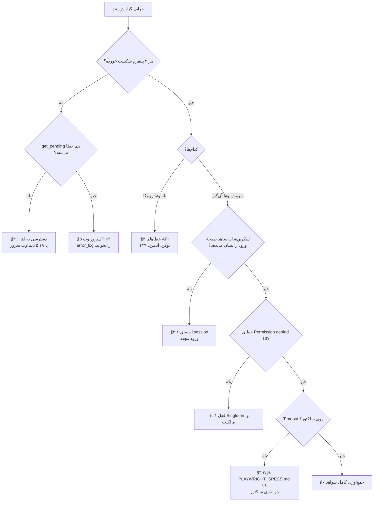

# TROUBLESHOOTING.md — Runbook عملیاتی

> راهنمای دسته‌بندی‌شدهٔ رفع اشکال برای سیستم همگام‌سازی چندکاناله.
> هر ورودی چهار بخش دارد: **علائم** → **تشخیص** → **علت و رفع** → **پیشگیری**.
> همهٔ دستورات برای اجرا روی سرور AlmaLinux با کاربر `root` (یا با `sudo -u file` برای عملیات اپلیکیشن) نوشته شده‌اند.
>
> مسیر پایه در همهٔ دستورات: `APP=/home/file/public_html/s`

---

## فهرست سریع: علامت → بخش

| علامت مشاهده‌شده | بخش |
|---|---|
| `ProcessSingletonLock: Permission denied (13)` | [§۱.۱](#s1-1) |
| `Executable doesn't exist at /usr/bin/chromium-browser` | [§۱.۲](#s1-2) |
| `Target page, context or browser has been closed` / crash | [§۱.۳](#s1-3) |
| فرایندهای chromium باقی‌مانده پس از اجرا | [§۱.۴](#s1-4) |
| `Error while loading shared libraries: libnss3.so` | [§۱.۵](#s1-5) |
| صفحهٔ ورود در اسکرین‌شات / کانال در لیست نیست | [§۲](#s2) |
| «ورود جدید به حساب کاربری» از آی‌گپ | [§۲.۴](#s2-4) |
| `{"success":false,"error":"عدم دسترسی به ایتا"}` | [§۳.۱](#s3-1) |
| `count: 0` ولی در ایتا پست جدید هست | [§۳.۲](#s3-2) |
| رسانه دانلود نشد / فقط متن ارسال شد | [§۳.۳](#s3-3) |
| پست‌های ویدیویی سنگین همگام نمی‌شوند | [§۳.۴](#s3-4) |
| بله: `ok:false` / `429` / `chat not found` | [§۴.۱](#s4-1) |
| روبیکا: `upload_url` خالی / `file_id` تهی | [§۴.۲](#s4-2) |
| «(عدم آپلود فایل روبیکا)» در کانال | [§۴.۵](#s4-5) |
| `504 Gateway Timeout` / `500 Internal Server Error` | [§۵.۱](#s5-1) |
| `PHP Parse error: unexpected fully qualified name "\vert"` | [§۵.۲](#s5-2) |
| `Call to undefined function shell_exec()` / بدون خروجی | [§۵.۳](#s5-3) |
| `Allowed memory size exhausted` | [§۵.۴](#s5-4) |
| `.htaccess` باعث ۵۰۰ شد | [§۵.۵](#s5-5) |
| `database is locked` / `SQLITE_BUSY` | [§۶.۱](#s6-1) |
| `near "ON": syntax error` در UPSERT | [§۶.۲](#s6-2) |
| توکن‌ها نشت کرده‌اند / در Git هستند | [§۷.۱](#s7-1) |
| پورت ۹۲۲۲ باز است | [§۷.۲](#s7-2) |
| `state.sqlite` با URL قابل دانلود است | [§۷.۳](#s7-3) |
| پست دوبار منتشر شد | [§۸.۱](#s8-1) |
| پست در صف ظاهر نمی‌شود / جا افتاد | [§۸.۲](#s8-2) |
| badge آی‌گپ «✕» ولی پیام در کانال هست | [§۸.۳](#s8-3) |
| گزارش مدیریتی در بله نمی‌رسد | [§۸.۴](#s8-4) |
| cron اجرا نمی‌شود | [§۹.۱](#s9-1) |
| `jq: command not found` | [§۹.۲](#s9-2) |
| نام فایل فارسی خراب شد | [§۹.۳](#s9-3) |

---

## ۰. تشخیص سریع (اول این را اجرا کنید)

```bash
cat > /home/file/public_html/s/collect_diagnostics.sh <<'SCRIPT'
#!/usr/bin/env bash
# collect_diagnostics.sh — جمع‌آوری یکجا شواهد برای گزارش خطا
APP=/home/file/public_html/s
OUT="$APP/logs/diag_$(date +%F_%H%M%S).txt"
mkdir -p "$APP/logs"
exec > >(tee -a "$OUT") 2>&1

echo "=========== $(date '+%F %T') ==========="
echo "--- ۱) سیستم ---"
uname -a; cat /etc/redhat-release 2>/dev/null
echo "uptime: $(uptime -p) | load: $(cat /proc/loadavg)"
free -m; df -h /home /tmp /dev/shm
echo "getenforce: $(getenforce 2>/dev/null || echo n/a)"

echo; echo "--- ۲) زمان اجرا ---"
for b in /usr/bin/node /usr/bin/chromium-browser; do
  printf '%-32s ' "$b"; [[ -x "$b" ]] && "$b" --version 2>&1 | head -1 || echo "MISSING/NOT-EXECUTABLE"
done
ea-php81 -v 2>/dev/null | head -1 || php -v | head -1
ea-php81 -m 2>/dev/null | grep -Ei 'pdo_sqlite|^curl$|^dom$|libxml|mbstring|fileinfo|^gd$' | tr '\n' ' '; echo
ea-php81 -i 2>/dev/null | grep -i 'disable_functions' | head -1

echo; echo "--- ۳) مالکیت و مجوز ---"
ls -ld "$APP" "$APP"/soroush_profile "$APP"/igap_profile 2>&1
ls -l  "$APP"/state.sqlite "$APP"/sync_manual.php "$APP"/.htaccess 2>&1
echo "Singleton باقی‌مانده:"; find "$APP" -maxdepth 2 -name 'Singleton*' -ls 2>/dev/null || echo "  (هیچ)"
echo "مالکیت نادرست (غیر file):"; find "$APP" -maxdepth 2 ! -user file -printf '%u:%g %p\n' 2>/dev/null | head -20

echo; echo "--- ۴) فرایندها ---"
ps -eo pid,ppid,user,etime,rss,cmd | grep -E 'chromium|send_(soroush|igap)|sync_daemon' | grep -v grep || echo "  (هیچ)"
echo "تعداد chromium: $(pgrep -c -f chromium 2>/dev/null || echo 0)"

echo; echo "--- ۵) state ---"
sqlite3 "$APP/state.sqlite" "SELECT channel, last_msg_id FROM sync_state;" 2>&1
ls -l "$APP"/state.sqlite* 2>&1

echo; echo "--- ۶) شبکه ---"
for h in eitaa.com tapi.bale.ai botapi.rubika.ir web.splus.ir web.igap.net; do
  printf '%-22s ' "$h"
  curl -s -o /dev/null -w '%{http_code} %{time_total}s\n' --max-time 12 "https://$h" 2>&1 || echo FAIL
done
echo "پورت‌های باز مرتبط:"; ss -lntp 2>/dev/null | grep -E '9222|:80|:443' || true

echo; echo "--- ۷) آخرین خطاها ---"
echo ">>> error_log (۲۰ خط آخر):"; tail -20 "$APP/error_log" 2>/dev/null || echo "  (موجود نیست)"
echo ">>> logs/cron_sync.log (۲۰ خط آخر):"; tail -20 "$APP/logs/cron_sync.log" 2>/dev/null || echo "  (موجود نیست)"
echo ">>> dmesg kill (۱۰ خط):"; dmesg -T 2>/dev/null | grep -iE 'killed process|oom' | tail -10 || echo "  (دسترسی نیست)"

echo; echo "--- ۸) شواهد بصری ---"
ls -lt "$APP"/*.jpg 2>/dev/null | head -8

echo; echo "گزارش ذخیره شد در: $OUT"
SCRIPT
chown file:file /home/file/public_html/s/collect_diagnostics.sh
chmod 750 /home/file/public_html/s/collect_diagnostics.sh
bash /home/file/public_html/s/collect_diagnostics.sh
```

---

## ۱. Chromium و مرورگر

### ۱.۱ قفل Singleton و `Permission denied (13)` <a id="s1-1"></a>

**علائم**

```
Failed to create /home/file/public_html/s/igap_profile/SingletonLock: Permission denied (13)
ProcessSingletonLock: Permission denied (13)
{"status":"ERROR","error":"browserType.launchPersistentContext: Failed to create ... SingletonLock"}
```
در داشبورد: badge سروش و آی‌گپ هر دو «✕» در حالی که بله و روبیکا «✓» هستند.

**تشخیص**

```bash
APP=/home/file/public_html/s
find "$APP" -maxdepth 2 -name 'Singleton*' -exec ls -l {} \;
find "$APP" -maxdepth 2 ! -user file -printf '%u:%g %m %p\n' | head -20
ps -eo pid,user,etime,cmd | grep chromium | grep -v grep
```

**علت** — دو سناریو:

| سناریو | نشانه |
|---|---|
| الف) اجرای قبلی با `root` انجام شده و `Singleton*` با مالک `root:root` ساخته شده؛ کاربر `file` نمی‌تواند آن را حذف کند | `ls -l` مالک `root` را نشان می‌دهد |
| ب) Chromium هنوز در حال اجراست و قفل معتبر است | `ps` فرایند زنده را نشان می‌دهد |

**رفع**

```bash
APP=/home/file/public_html/s

# ۱) اگر فرایند زنده است، آن را ببندید
pkill -f 'send_soroush.js|send_igap.js' ; sleep 2
pkill -f chromium ; sleep 3
pkill -9 -f chromium ; sleep 2

# ۲) حذف قفل‌ها (با root، چون مالک root است)
find "$APP" -maxdepth 2 -name 'Singleton*' -print -delete

# ۳) بازگرداندن مالکیت کل درخت
chown -R file:file "$APP"

# ۴) مجوزهای صحیح
find "$APP"/soroush_profile "$APP"/igap_profile -type d -exec chmod 700 {} \;
find "$APP"/soroush_profile "$APP"/igap_profile -type f -exec chmod 600 {} \;

# ۵) تأیید با کاربر واقعی
sudo -u file test -w "$APP/igap_profile" && echo "WRITABLE ✅"
sudo -u file /usr/bin/node "$APP/send_igap.js" --channel=shamimeashena --text="recovery test"
```

**پیشگیری**

- هرگز اسکریپت‌ها را با `root` اجرا نکنید؛ همیشه `sudo -u file`.
- دفاع چهارلایهٔ موجود را حفظ کنید: پاک‌سازی `Singleton*` در Node (پیش از launch) و در PHP (پیش و پس از `shell_exec`).
- افزودن به cron روزانه:
  ```cron
  55 4 * * * find /home/file/public_html/s -maxdepth 2 -name 'Singleton*' -delete
  ```

### ۱.۲ Chromium یافت نمی‌شود <a id="s1-2"></a>

**علائم**

```
browserType.launchPersistentContext: Executable doesn't exist at /usr/bin/chromium-browser
```

**تشخیص**

```bash
ls -l /usr/bin/chromium-browser /usr/bin/chromium 2>&1
command -v chromium chromium-browser google-chrome 2>&1
rpm -qa | grep -i chromium
```

**رفع**

```bash
# حالت الف) نصب نشده
dnf install -y epel-release && dnf install -y chromium

# حالت ب) نصب است اما نام باینری متفاوت است
ln -sf "$(command -v chromium || command -v chromium-browser)" /usr/bin/chromium-browser
/usr/bin/chromium-browser --version
```

> **هرگز** به‌جای symlink، مسیر را در `executablePath` تغییر ندهید مگر اینکه همزمان در هر دو اسکریپت (`send_soroush.js`, `send_igap.js`) و `inspect_*.js` اعمال شود:
> ```bash
> grep -rn 'executablePath' --include='*.js' /home/file/public_html/s
> ```

### ۱.۳ crash مرورگر و `/dev/shm` <a id="s1-3"></a>

**علائم**

```
Target page, context or browser has been closed
Browser closed. ... Page crashed!
Received signal 11 SEGV_MAPERR
```
در `dmesg`: `traps: chrome[12345] general protection fault` یا `Out of memory: Killed process … (chrome)`

**تشخیص**

```bash
df -h /dev/shm
free -m
dmesg -T | grep -iE 'killed process|out of memory|segv' | tail -20
grep -rn 'disable-dev-shm-usage' /home/file/public_html/s/*.js   # باید در هر دو اسکریپت باشد
```

**رفع**

```bash
# ۱) اطمینان از وجود فلگ (در صورت نبود، اضافه کنید)
grep -q 'disable-dev-shm-usage' /home/file/public_html/s/send_igap.js || \
  echo "فلگ --disable-dev-shm-usage در send_igap.js وجود ندارد!"

# ۲) بزرگ‌سازی /dev/shm (اگر دسترسی root دارید)
mount -o remount,size=1G /dev/shm
# دائمی: در /etc/fstab
# tmpfs /dev/shm tmpfs defaults,size=1G 0 0

# ۳) بستن مرورگرهای باقی‌مانده پیش از اجرای بعدی
pkill -f chromium

# ۴) اگر RAM واقعاً کم است، محدودیت مصرف برای هر فراخوانی
ulimit -v 2000000   # در cron_sync.sh پیش از curl/node
```

**پیشگیری:** آستانهٔ RAM را در `health_check.sh` روی ۵۰۰ MB تنظیم کنید و `--disable-dev-shm-usage` را در هر اسکریپت جدید Playwright بگنجانید.

### ۱.۴ فرایندهای یتیم و zombie <a id="s1-4"></a>

**علائم** — حافظه به‌تدریج پر می‌شود؛ اجرای بعدی کند یا با قفل مواجه می‌شود.

**تشخیص**

```bash
ps -eo pid,ppid,user,etime,rss,stat,cmd | grep -E 'chromium|node' | grep -v grep
pgrep -c -f chromium
ps -eo stat,pid,cmd | awk '$1 ~ /Z/'
```

**رفع**

```bash
# کشتن ترتیبی: اول اسکریپت‌ها، بعد Chromium
pkill -f 'send_soroush.js|send_igap.js'
sleep 2
pkill -f chromium
sleep 3
pkill -9 -f chromium
find /home/file/public_html/s -maxdepth 2 -name 'Singleton*' -delete
```

**پیشگیری** — افزودن timeout سخت به subprocess در PHP (اگر `shell_exec` بدون مرز زمانی بماند، ممکن است فرایند برای همیشه باز بماند):

```php
// الگوی پیشنهادی: اجرای با timeout به‌جای shell_exec خالی
$cmd = 'timeout 120 ' . $cmd;          // پیش از ' 2>&1'
$output = shell_exec($cmd . ' 2>&1');
```

و در cron، یک پاک‌سازی نگهبان:

```cron
*/30 * * * * pgrep -f chromium | wc -l | grep -qv '^0$' && pkill -9 -f chromium
```

### ۱.۵ وابستگی‌های کتابخانه‌ای ناقص <a id="s1-5"></a>

**علائم**

```
/usr/bin/chromium-browser: error while loading shared libraries: libnss3.so: cannot open shared object file
[ERROR:gpu_process_host.cc] GPU process launch failed
```

**تشخیص**

```bash
ldd /usr/bin/chromium-browser | grep 'not found'
sudo -u file /usr/bin/chromium-browser --headless --disable-gpu --no-sandbox --dump-dom about:blank | head -3
```

**رفع**

```bash
dnf install -y nss atk at-spi2-atk at-spi2-core cups-libs libdrm libxkbcommon \
  libX11 libXcomposite libXdamage libXext libXfixes libXrandr \
  mesa-libgbm mesa-libEGL alsa-lib pango cairo liberation-fonts \
  google-noto-sans-arabic-fonts google-noto-naskh-arabic-fonts google-noto-color-emoji-fonts
fc-cache -fv
ldd /usr/bin/chromium-browser | grep -c 'not found'    # باید 0 باشد
```

---

## ۲. Session و احراز هویت <a id="s2"></a>

### ۲.۱ تشخیص انقضای session

**علائم**

- badge سروش یا آی‌گپ «✕» با پیام `locator.waitFor: Timeout 15000ms exceeded`
- پیام‌های متنی هم ارسال نمی‌شوند (نه فقط رسانه)
- در اسکرین‌شات شاهد، صفحهٔ ورود/شماره موبایل دیده می‌شود

**تشخیص**

```bash
APP=/home/file/public_html/s

# ۱) اجرای دستی و دیدن خطای دقیق
sudo -u file /usr/bin/node "$APP/send_igap.js" --channel=shamimeashena --text="session probe"; echo "exit=$?"

# ۲) بررسی اسکرین‌شات شاهد
ls -l "$APP/last_igap_send.jpg" "$APP/last_media_send.jpg"
scp file@server:/home/file/public_html/s/last_igap_send.jpg ./   # از ماشین محلی

# ۳) سن فایل کوکی‌ها
find "$APP"/igap_profile "$APP"/soroush_profile -name 'Cookies' -printf '%TY-%Tm-%Td %p\n'

# ۴) دامپ DOM برای دیدن اینکه واقعاً چه صفحه‌ای باز شده
sudo -u file /usr/bin/node "$APP/dump_dom.js" igap    # اگر موجود است
grep -ciE 'ورود|sign in|login|شماره موبایل' "$APP/igap_dump.html"
```

اگر شمارش گام ۴ بزرگ‌تر از صفر است، صفحهٔ ورود نمایش داده می‌شود ⇒ session منقضی است.

**رفع — سروش‌پلاس**

```bash
cd /home/file/public_html/s
# پشتیبان از وضعیت فعلی (برای امکان بازگشت)
tar -czf backups/soroush_profile_before_relogin_$(date +%F).tar.gz soroush_profile
sudo -u file /usr/bin/node login_soroush.js
# سپس تست:
sudo -u file /usr/bin/node send_soroush.js --channel=shamimeashena1 --text="session restored"
```

**رفع — آی‌گپ**

```bash
cd /home/file/public_html/s
tar -czf backups/igap_profile_before_relogin_$(date +%F).tar.gz igap_profile
sudo -u file /usr/bin/node login_igap.js      # اسکریپت معرفی‌شده در DEPLOYMENT.md §۸.۲
sudo -u file /usr/bin/node send_igap.js --channel=shamimeashena --text="session restored"
```

**پیشگیری**

- پس از هر ورود موفق، بلافاصله پشتیبان بگیرید و `chmod 600` بدهید.
- از ورود مکرر از محیط‌های متفاوت بپرهیزید (هر ورود جدید، session قبلی را در معرض باطل‌شدن قرار می‌دهد).
- در `health_check.sh` آستانهٔ «سن session < ۳۰ روز» فعال است؛ هشدار را جدی بگیرید.

### ۲.۲ بازگردانی session از فایل پشتیبان (سروش)

```bash
cd /home/file/public_html/s
ls -l soroush_session.json
sudo -u file /usr/bin/node restore_session.js
# خروجی: step_restored.jpg
```

اگر بازگردانی ناموفق بود (یعنی `restore_session.js` صفحهٔ ورود را نشان داد)، فایل پشتیبان هم منقضی است → ورود کامل از ابتدا (§۲.۱).

### ۲.۳ پروفایل آسیب‌دیده

**علائم** — Chromium با `ERROR:cache_util_win.cc` / `Corrupted` یا بلافاصله crash می‌کند؛ یا `IndexedDB.open` در وب‌کلاینت خطا می‌دهد.

**رفع**

```bash
APP=/home/file/public_html/s
pkill -9 -f chromium; sleep 2

# فقط cache را حذف کنید — session در Cookies/Local Storage/IndexedDB است
rm -rf "$APP"/igap_profile/Default/{Cache,Code\ Cache,GPUCache,ShaderCache,DawnCache}
rm -rf "$APP"/soroush_profile/Default/{Cache,Code\ Cache,GPUCache,ShaderCache,DawnCache}
rm -f  "$APP"/igap_profile/Default/*.log
chown -R file:file "$APP"/igap_profile "$APP"/soroush_profile
find "$APP" -maxdepth 2 -name 'Singleton*' -delete

sudo -u file /usr/bin/node "$APP/send_igap.js" --channel=shamimeashena --text="cache cleared probe"
```

اگر هنوز کار نکرد: پروفایل را کامل از پشتیبان بازیابی کنید (§۸.۳ [`DEPLOYMENT.md`](DEPLOYMENT.md)) یا ورود از ابتدا.

### ۲.۴ هشدار امنیتی «ورود جدید» <a id="s2-4"></a>

**علامت** — در لیست گفت‌وگوهای آی‌گپ پیامی از «iGap Messenger» با متن «ورود جدید به حساب کاربری آیگپ» دیده می‌شود (در `igap_dump.html` ثبت شده است).

**معنی** — پلتفرم یک ورود از دستگاه/مرورگر ناشناس را تشخیص داده و به کاربر اطلاع داده است. این **خطا نیست**، اما دو پیامد دارد:

1. کاربر ممکن است آن ورود را «خاتمه» دهد → session باطل می‌شود.
2. ورودهای مکرر می‌توانند حساب را مشمول محدودیت کنند.

**اقدام**

```bash
# فقط یک‌بار ورود انجام دهید و سپس پروفایل را قفل کنید
cd /home/file/public_html/s
tar -czf backups/sessions_$(date +%F_%H%M).tar.gz soroush_profile igap_profile state.sqlite
chmod 600 backups/*.tar.gz
chattr +i backups/sessions_*.tar.gz 2>/dev/null || true   # محافظت در برابر حذف تصادفی
```

---

## ۳. Scraping ایتا

### ۳.۱ عدم دسترسی به ایتا <a id="s3-1"></a>

**علائم**

```json
{"success":false,"error":"عدم دسترسی به ایتا"}
```

**تشخیص**

```bash
# ۱) دسترسی شبکه از سمت سرور
curl -sS -o /dev/null -w 'code=%{http_code} time=%{time_total} size=%{size_download}\n' \
     --max-time 20 https://eitaa.com/shamimeashena

# ۲) با User-Agent مرورگر (همان چیزی که daemon می‌فرستد)
curl -sS -o /dev/null -w 'code=%{http_code}\n' --max-time 20 \
     -A 'Mozilla/5.0 (Windows NT 10.0; Win64; x64) AppleWebKit/537.36 (KHTML, like Gecko) Chrome/120.0.0.0 Safari/537.36' \
     https://eitaa.com/shamimeashena

# ۳) DNS و مسیر
getent hosts eitaa.com
traceroute -n -m 12 -w 2 eitaa.com 2>/dev/null | head -12

# ۴) فایروال خروجی
csf -g 443 2>/dev/null | head; iptables -L OUTPUT -n --line-numbers 2>/dev/null | head -20

# ۵) از یک دید بیرونی (برای تفکیک مشکل سرور از مشکل ایتا)
curl -s "https://api.allorigins.win/raw?url=https://eitaa.com/shamimeashena" | head -c 300
```

**علت و رفع**

| `http_code` | علت | رفع |
|---|---|---|
| `000` / timeout | فایروال خروجی یا DNS | `csf -a` برای خروجی ۴۴۳؛ بررسی `/etc/resolv.conf`؛ `systemd-resolve --flush-caches` |
| `403` | ایتا درخواست بدون UA را رد می‌کند | افزودن `CURLOPT_USERAGENT` به `get_pending` (کد فعلی آن را ندارد — §۳.۵) |
| `429` | نرخ درخواست بالا | کاهش فرکانس cron به `*/20`؛ افزودن jitter |
| `5xx` | مشکل سمت ایتا | صبر + retry؛ داشبورد را دوباره بزنید |
| `200` ولی `size` کوچک | صفحهٔ «کانال موجود نیست» | بررسی املای `EITAA_CHANNEL_ID` |

### ۳.۲ تغییر DOM ایتا <a id="s3-2"></a>

**علائم** — `get_pending` پاسخ `success:true` می‌دهد اما `count: 0` است، در حالی که در کانال پست جدید وجود دارد. یا `total_fetched` در `test.php` صفر است.

**تشخیص**

```bash
# ۱) آیا کلاس‌های مورد انتظار هنوز وجود دارند؟
HTML=$(curl -s --max-time 20 -A 'Mozilla/5.0 (Windows NT 10.0; Win64; x64) Chrome/120.0.0.0' \
       https://eitaa.com/shamimeashena)
echo "$HTML" | wc -c
for c in etme_widget_message etme_widget_message_text etme_widget_message_photo_wrap \
         etme_widget_message_document_wrap data-post; do
  printf '%-40s %s\n' "$c" "$(echo "$HTML" | grep -c "$c")"
done

# ۲) پاسخ کامل پارسر
curl -s "https://your-domain/s/test.php?ch=shamimeashena" | jq '.status, .total_fetched, .latest_post_id'

# ۳) نمونهٔ ساختار واقعی
echo "$HTML" | grep -o 'data-post="[^"]*"' | head -5
echo "$HTML" | grep -o 'class="etme_widget_message[a-z_ ]*"' | sort | uniq -c
```

**رفع**

اگر شمارش یک کلاس صفر شد، ایتا ساختار را عوض کرده است:

```bash
# کلاس‌های جدید را پیدا کنید
echo "$HTML" | grep -oE 'class="[^"]*message[^"]*"' | sort | uniq -c | sort -rn | head -20
echo "$HTML" | grep -oE 'data-[a-z]+="[^"]{0,40}"' | sort | uniq -c | sort -rn | head -20
```

سپس XPath های مربوطه را در **هر سه نقطه** به‌روز کنید:

```bash
grep -n 'etme_widget_message' /home/file/public_html/s/sync_manual.php \
                              /home/file/public_html/s/sync_daemon.php \
                              /home/file/public_html/s/test.php \
                              /home/file/public_html/s/send_test.php
```

پس از ویرایش:

```bash
ea-php81 -l /home/file/public_html/s/sync_manual.php
curl -s "https://your-domain/s/test.php?ch=shamimeashena" | jq '.total_fetched'
```

### ۳.۳ شکست دانلود رسانه <a id="s3-3"></a>

**علائم** — پست فقط متنی ارسال می‌شود؛ در روبیکا پیام «(عدم آپلود فایل روبیکا)» دیده نمی‌شود اما badge رسانه‌دار نیست.

**تشخیص**

```bash
# لینک رسانهٔ واقعی را از test.php بردارید
curl -s "https://your-domain/s/test.php?ch=shamimeashena" \
  | jq -r '.messages[] | select(.media_url != null) | .media_url' | head -3

# دانلود دستی با همان هدرهایی که downloadMedia() می‌فرستد
URL='<لینک بالا>'
curl -sS -o /tmp/probe.bin -w 'code=%{http_code} size=%{size_download} type=%{content_type}\n' \
     --max-time 60 -L \
     -A 'Mozilla/5.0 (Windows NT 10.0; Win64; x64)' \
     -H 'Referer: https://eitaa.com/shamimeashena' \
     "$URL"
file /tmp/probe.bin; ls -l /tmp/probe.bin
head -c 200 /tmp/probe.bin | xxd | head -5
```

**علت و رفع**

| مشاهده | علت | رفع |
|---|---|---|
| `code=403` | هدر `Referer` غایب یا token منقضی | `Referer` در `downloadMedia()` هست؛ پس **token منقضی شده** → داشبورد را رفرش کنید تا `get_pending` دوباره لینک تازه بسازد |
| `code=404` | رسانه از مبدأ حذف شده | قابل رفع نیست؛ پست متنی می‌شود |
| `code=200` ولی `size < 100` | پاسخ خطای HTML | `head` خروجی را ببینید؛ معمولاً «دسترسی ممکن نیست» |
| `type=text/html` | لینک به صفحهٔ خطا redirect شده | `CURLOPT_FOLLOWLOCATION` فعال است؛ دامنهٔ مقصد را در فایروال باز کنید |
| `code=206` | پاسخ Partial — **معتبر است** | کد فعلی `206` را می‌پذیرد؛ اقدامی لازم نیست |
| `file` خروجی `HTML document` | همان ۴۰۳ | — |
| `Permission denied` روی `/tmp` | `open_basedir` یا `/tmp` با `noexec` | `php -i \| grep open_basedir`؛ `mount \| grep /tmp` |

**بازبینی فایل‌های موقت باقی‌مانده:**

```bash
ls -lt /tmp/sync_* 2>/dev/null | head
find /tmp -maxdepth 1 -name 'sync_*' -mmin +180 -ls -delete
```

### ۳.۴ رسانهٔ سنگین در نمای وب نیست <a id="s3-4"></a>

**علائم** — در ایتا پست ویدیویی/حجیم دیده می‌شود، ولی `mediaUrl` در `get_pending` برابر `null` است و پست فقط متنی همگام می‌شود. در HTML ایتا عبارت زیر وجود دارد:

```
حجم رسانه بالاست
مشاهده در ایتا
```

**تشخیص**

```bash
curl -s -A 'Mozilla/5.0' https://eitaa.com/shamimeashena | grep -c 'حجم رسانه بالاست'
curl -s "https://your-domain/s/test.php?ch=shamimeashena" \
  | jq -r '.messages[] | "\(.id) \(.media_type // "-")"' | head -10
```

**علت** — نمای وب عمومی ایتا برای رسانهٔ حجیم، لینک مستقیم `<video src>` را رندر نمی‌کند و کاربر را به اپلیکیشن ارجاع می‌دهد. این یک **محدودیت ذاتی scraping نمای وب** است.

**رفع**

```bash
# گزینه ۱ — دانلود دستی و ارسال مستقیم با اسکریپت‌های Node
scp user@pc:/path/to/video.mp4 /home/file/public_html/s/tmp_video.mp4
chown file:file /home/file/public_html/s/tmp_video.mp4
sudo -u file /usr/bin/node /home/file/public_html/s/send_igap.js \
  --channel=shamimeashena --text="کپشن دستی" --file=/home/file/public_html/s/tmp_video.mp4
sudo -u file /usr/bin/node /home/file/public_html/s/send_soroush.js \
  --channel=shamimeashena1 --text="کپشن دستی" --file=/home/file/public_html/s/tmp_video.mp4
rm -f /home/file/public_html/s/tmp_video.mp4

# گزینه ۲ — ارسال به بله/روبیکا با curl مستقیم (API رسمی محدودیت نمای وب را ندارد)
curl -sS -F "chat_id=@testforme" -F "caption=کپشن" -F "video=@/path/video.mp4" \
  "https://tapi.bale.ai/bot<TOKEN>/sendVideo" | jq .ok
```

**پیشگیری** — در بلندمدت، استفاده از MTProto/API اختصاصی ایتا به‌جای scraping نمای وب (نگاه کنید به §۱۱ [`ARCHITECTURE.md`](ARCHITECTURE.md)).

### ۳.۵ افزودن User-Agent به `get_pending` (بهبود توصیه‌شده)

`sync_daemon.php` و `test.php` هدر UA می‌فرستند اما `sync_manual.php?action=get_pending` **نمی‌فرستد**. اگر ایتا سخت‌گیری کند، این تفاوت باعث `403` فقط در داشبورد می‌شود.

```bash
grep -n -A 8 'curl_init("https://eitaa.com/"' /home/file/public_html/s/sync_manual.php
```

الگوی اصلاح (در بلوک `curl_setopt_array` مربوط به `get_pending` اضافه کنید):

```php
CURLOPT_USERAGENT  => 'Mozilla/5.0 (Windows NT 10.0; Win64; x64) AppleWebKit/537.36 (KHTML, like Gecko) Chrome/120.0.0.0 Safari/537.36',
CURLOPT_HTTPHEADER => ['Accept-Language: fa,en;q=0.9'],
```

```bash
ea-php81 -l /home/file/public_html/s/sync_manual.php   # اجباری پس از هر ویرایش
```

---

## ۴. API — بله و روبیکا

### ۴.۱ خطاهای API بله <a id="s4-1"></a>

**تشخیص عمومی**

```bash
TOKEN='<BALE_BOT_TOKEN>'
BASE="https://tapi.bale.ai/bot${TOKEN}"

# الف) اعتبار توکن
curl -s "$BASE/getMe" | jq

# ب) عضویت/ادمین بودن بات در کانال
curl -s "$BASE/getChatMember?chat_id=@testforme&user_id=<BOT_ID>" | jq

# ج) ارسال آزمایشی متن
curl -s -X POST "$BASE/sendMessage" -H 'Content-Type: application/json' \
     -d '{"chat_id":"@testforme","text":"diag '"$(date +%T)"'"}' | jq
```

**جدول کدها**

| پاسخ | علت | رفع |
|---|---|---|
| `{"ok":false,"error_code":401,"description":"Unauthorized"}` | توکن نامعتبر/باطل‌شده | ساخت بات جدید و چرخش توکن (§۷.۱) |
| `{"ok":false,"error_code":400,"description":"Bad Request: chat not found"}` | `chat_id` اشتباه یا بات عضو کانال نیست | بات را در کانال **ادمین** کنید؛ `@username` دقیق |
| `{"ok":false,"error_code":400,"description":"Bad Request: bot is not a member"}` | عضو نبودن | افزودن بات به کانال |
| `{"ok":false,"error_code":403,"description":"Forbidden: bot is not admin"}` | نبود حق ارسال | ارتقا به ادمین با حق «ارسال پیام» |
| `{"ok":false,"error_code":429,"description":"Too Many Requests"}` | نرخ محدود | افزودن تأخیر بین پست‌ها (§۴.۴) |
| `{"ok":false,"error_code":400,"description":"Bad Request: PHOTO_INVALID_DIMENSIONS"}` | ابعاد/قالب تصویر نامعتبر | تبدیل با `gd` یا `convert` |
| `{"ok":false,"error_code":400,"description":"Bad Request: wrong file identifier/http url"}` | فایل multipart ناقص | بررسی وجود فایل در `/tmp` در لحظهٔ ارسال |
| `HTTP 413` / `Payload Too Large` | فایل بزرگ‌تر از سقف پلتفرم | فشرده‌سازی یا تفکیک |
| `code=0` و پاسخ خالی | timeout شبکه یا DNS | `curl -v https://tapi.bale.ai` |

### ۴.۲ خطاهای pipeline روبیکا <a id="s4-2"></a>

**تشخیص مرحله‌به‌مرحله** — از اسکریپت موجود استفاده کنید؛ خروجی آن سه مرحله را جداگانه گزارش می‌کند:

```bash
curl -s "https://your-domain/s/test_rubika_media.php" \
  | jq '{request_send_file, upload_response, send_file_result}'
```

| مرحله | نشانهٔ شکست | علت | رفع |
|---|---|---|---|
| ۱ `requestSendFile` | `data.upload_url` خالی یا `status != OK` | توکن نامعتبر / نوع نامعتبر | `test_rubika.php` برای اعتبار توکن؛ `type` باید یکی از `Image, Video, Music, Voice, File` باشد |
| ۲ آپلود | `file_id` تهی | نام فیلد اشتباه (`file` الزامی است) یا MIME نامعتبر | `mime_content_type()` نیازمند اکستنشن `fileinfo` است: `ea-php81 -m \| grep fileinfo` |
| ۳ `sendFile` | `status != OK` | `chat_id` نامعتبر یا بات ادمین نیست | تبدیل به GUID (§۴.۳) |

**آزمون دستی مرحلهٔ آپلود:**

```bash
TOKEN='<RUBIKA_BOT_TOKEN>'
UP=$(curl -s -X POST "https://botapi.rubika.ir/v3/$TOKEN/requestSendFile" \
       -H 'Content-Type: application/json' -d '{"type":"Image"}' | jq -r '.data.upload_url // .data')
echo "upload_url = $UP"
curl -s -X POST "$UP" -F "file=@/home/file/public_html/s/test_img.jpg;type=image/jpeg" | jq
```

### ۴.۳ GUID در برابر username در روبیکا

**علامت** — ارسال با `@shamimeashena1` شکست می‌خورد اما تست با GUID موفق است.

```bash
curl -s "https://your-domain/s/test_rubika.php" | jq
```

خروجی نمونه:

```json
{
  "test_guid":     { "http_code": 200, "response": { "status": "OK", "data": { "message_id": 123 } } },
  "test_username": { "http_code": 200, "response": { "status": "ERR", "error_code": 400 } }
}
```

**رفع**

```bash
# استخراج GUID از پاسخ موفق یا از getUpdates
curl -s -X POST "https://botapi.rubika.ir/v3/$TOKEN/getUpdates" | jq '.data[0].chat_id // .data[0].message.chat_id'

# جایگزینی در کد
sed -i "s/const RUBIKA_CHANNEL_ID  = '@shamimeashena1';/const RUBIKA_CHANNEL_ID  = '<GUID>';/" \
  /home/file/public_html/s/sync_manual.php
ea-php81 -l /home/file/public_html/s/sync_manual.php
```

### ۴.۴ نرخ‌محدودسازی (Rate Limit)

**علائم** — `429` از بله یا `status: ERR` با `error_code: 429` از روبیکا؛ معمولاً وقتی `MAX_MESSAGES_LIMIT` با فایل‌های حجیم ترکیب شود.

**تشخیص**

```bash
grep -c '429\|Too Many' /home/file/public_html/s/logs/cron_sync.log
```

**رفع — افزایش فاصلهٔ بین پست‌ها در `cron_sync.sh`**

```bash
# در حلقهٔ for، پس از هر POST این خط را اضافه کنید:
sleep 20
```

یا به‌صورت patch:

```bash
sed -i '/log "POST ${MID} →/a\  sleep 20   # rate-limit guard' /home/file/public_html/s/cron_sync.sh
```

**رفع — کاهش اندازهٔ صف**

```php
const MAX_MESSAGES_LIMIT = 4;   // به‌جای 7
```

**رفع — عقب‌گرد تصاعدی در `callApi()`** (الگوی پیشنهادی):

```php
function callApiWithRetry(string $url, mixed $data, bool $isMultipart, array $headers = [], int $max = 3): array {
    for ($i = 1; $i <= $max; $i++) {
        $r = callApi($url, $data, $isMultipart, $headers);
        $is429 = ($r['code'] === 429) || (($r['res']['error_code'] ?? 0) === 429);
        if (!$is429) return $r;
        sleep(min(60, (2 ** $i) * 5));   // 10s, 20s, 40s
    }
    return $r;
}
```

### ۴.۵ fallback متنی روبیکا <a id="s4-5"></a>

**علامت** — در کانال روبیکا پیام با پسوند `(عدم آپلود فایل روبیکا)` منتشر شده و badge روبیکا «✕» است.

**معنی** — pipeline آپلود در مرحلهٔ ۱ یا ۲ شکست خورده، اما **متن پست از دست نرفته است**.

**اقدام**

```bash
# ۱) تشخیص مرحلهٔ شکست
curl -s "https://your-domain/s/test_rubika_media.php" | jq

# ۲) پس از رفع، resend دستی همان پست (بدون تغییر state)
curl -s -X POST "https://your-domain/s/sync_manual.php?action=sync_single&key=<KEY>" \
     -H 'Content-Type: application/json' \
     -d '{"id":0,"text":"<متن پست>","mediaUrl":"<لینک تازه از get_pending>","mediaType":"image","fileName":"photo.jpg"}' | jq
```

> `id: 0` باعث می‌شود `setLastSeenId(…, 0)` اجرا شود که state را به صفر برمی‌گرداند! برای resend ایمن، **ابتدا** مقدار فعلی را ذخیره و **سپس** بازیابی کنید:
> ```bash
> APP=/home/file/public_html/s
> CUR=$(sqlite3 "$APP/state.sqlite" "SELECT last_msg_id FROM sync_state WHERE channel='shamimeashena';")
> # ... اجرای resend ...
> sqlite3 "$APP/state.sqlite" "UPDATE sync_state SET last_msg_id=$CUR WHERE channel='shamimeashena';"
> ```
> یا ساده‌تر: مستقیماً از `curl` به API بله/روبیکا و `node send_*.js` بفرستید (§۸.۲).

---

## ۵. سرور وب و PHP

### ۵.۱ تایم‌اوت ۵۰۴ و ۵۰۰ <a id="s5-1"></a>

**علائم**

```
504 Gateway Timeout
500 Internal Server Error
curl: (52) Empty reply from server
```
یا در داشبورد: `خطای غیرمنتظره ارتباط با سرور: Failed to fetch`

**تشخیص**

```bash
# ۱) اندازه‌گیری واقعی زمان یک sync_single
time curl -s -o /tmp/r.json -w 'code=%{http_code} time=%{time_total}\n' --max-time 300 \
  -X POST -H 'Content-Type: application/json' \
  -d '{"id":0,"text":"timing probe","mediaUrl":null,"mediaType":null,"fileName":"file.bin"}' \
  "https://your-domain/s/sync_manual.php?action=sync_single&key=<KEY>"
cat /tmp/r.json | jq

# ۲) تایم‌اوت‌های پیکربندی‌شده
ea-php81 -i | grep -E 'max_execution_time|memory_limit'
grep -RniE '^\s*(Timeout|ProxyTimeout)\b' /etc/httpd/conf/ /etc/apache2/conf/ 2>/dev/null
grep -RniE 'rollingTimeout|gracefulTimeout' /usr/local/lsws/conf/ 2>/dev/null

# ۳) لاگ Apache در لحظهٔ خطا
tail -50 /etc/apache2/logs/error_log 2>/dev/null || tail -50 /usr/local/apache/logs/error_log
tail -50 /home/file/public_html/s/error_log

# ۴) آیا worker کشته شده؟
grep -iE 'timeout|killed|premature|SIGTERM' /etc/apache2/logs/error_log 2>/dev/null | tail -20
```

**علت و رفع**

| نشانه در لاگ | علت | رفع |
|---|---|---|
| `Script timed out before returning headers` | `max_execution_time` کم | §۶.۱ [`DEPLOYMENT.md`](DEPLOYMENT.md): `max_execution_time = 300` |
| `proxy: ... failed` / `Timeout waiting for output` | `ProxyTimeout` کم | `ProxyTimeout 600` در userdata conf vhost |
| `Premature end of script headers` | crash PHP-FPM (معمولاً OOM) | `memory_limit = 512M` + بررسی `free -m` |
| `504` دقیقاً در ~۶۰ ثانیه | LiteSpeed `rollingTimeout` | افزایش به ۶۰۰ |
| `504` دقیقاً در ~۳۰ ثانیه | FastCGI/Cloudflare | افزایش تایم‌اوت در لایهٔ مربوطه؛ Cloudflare سقف ۱۰۰s دارد و **قابل تغییر نیست** → از پورت مستقیم یا زیردامنهٔ غیرپروکسی‌شده استفاده کنید |

**رفع ساختاری** — اطمینان حاصل کنید که معماری micro-batching حفظ شده است: **هرگز** حلقهٔ پردازش چند پست را به سمت سرور منتقل نکنید. حلقه باید در مرورگر (`processQueue`) یا در `cron_sync.sh` بماند.

```bash
# تأیید اینکه sync_single فقط یک پست پردازش می‌کند
grep -n 'foreach\|for (' /home/file/public_html/s/sync_manual.php | sed -n '1,20p'
```

**راه‌حل جایگزین برای محیط‌های با تایم‌اوت سخت (مثل Cloudflare)** — اجرای مستقیم CLI به‌جای HTTP:

```bash
# در PHP CLI، php://input از stdin خوانده می‌شود و header() بی‌اثر است
echo '{"id":74125,"text":"probe","mediaUrl":null,"mediaType":null,"fileName":"f.bin"}' \
 | sudo -u file ea-php81 -r '$_GET=["action"=>"sync_single"]; require "/home/file/public_html/s/sync_manual.php";' | jq
```

> پیش از تکیه بر این روش، روی سرور خود تأیید کنید که `php://input` در CLI از stdin می‌خواند. اگر پاسخ `Invalid payload` بود، از مسیر HTTP با `curl` استفاده کنید.

### ۵.۲ Parse error ناشی از backslash خام <a id="s5-2"></a>

**علائم** — داشبورد صفحهٔ سفید یا متن خطا نشان می‌دهد و در `error_log`:

```
PHP Parse error: syntax error, unexpected fully qualified name "\vert" in .../sync_manual.php on line 180
PHP Parse error: syntax error, unexpected token "\" in ...
```

این خطای واقعی و ثبت‌شده در `error_log` همین پروژه است:

```bash
cat /home/file/public_html/s/error_log
```

**تشخیص**

```bash
APP=/home/file/public_html/s
ea-php81 -l "$APP/sync_manual.php"
# یافتن backslash قبل از % در رشته‌های قالب
grep -n "sprintf('\\\\%" "$APP"/*.php
grep -nE "'\\\\[%a-zA-Z]" "$APP"/sync_manual.php | head
```

**علت** — در رشته‌های single-quote PHP فقط `\\` و `\'` escape هستند. `'\%s'` یعنی **backslash ادبی + `%s`**. وقتی این رشته در `sprintf` استفاده شود، خروجی با `\` شروع می‌شود؛ اگر همان `\` کنار یک نام/عملگر قرار بگیرد، tokenizer آن را به‌عنوان «نام کاملاً صلاحیت‌دار» (`\Namespace\Name`) تفسیر می‌کند و Parse error می‌دهد.

**رفع**

```php
// ❌ هرگز
$cmd = sprintf('\%s \%s --channel=\%s', escapeshellcmd($node), escapeshellarg($script), escapeshellarg($ch));

// ✅ همیشه — الحاق مستقیم با escapeshellarg
$cmd = escapeshellarg($node) . ' ' . escapeshellarg($script) . ' --channel=' . escapeshellarg($ch);
```

این اصلاح در همین نسخه اعمال شده است (نگاه کنید به `sendToSoroush()` و `sendToIgap()`). برای اطمینان از بازگشت نکردن:

```bash
grep -n "escapeshellarg(NODE_BIN)" /home/file/public_html/s/sync_manual.php   # باید ۲ نتیجه بدهد
grep -c "sprintf('\\\\%" /home/file/public_html/s/sync_manual.php             # باید 0 باشد
ea-php81 -l /home/file/public_html/s/sync_manual.php
node --check /home/file/public_html/s/send_soroush.js
node --check /home/file/public_html/s/send_igap.js
```

**پیشگیری** — افزودن اعتبارسنجی خودکار به `cron_sync.sh`:

```bash
ea-php81 -l "$APP/sync_manual.php" >/dev/null || { log "FATAL: PHP parse error"; exit 1; }
```

### ۵.۳ `shell_exec` غیرفعال <a id="s5-3"></a>

**علائم** — بله و روبیکا «✓» اما سروش و آی‌گپ همیشه «✕» با `info: Fail`؛ در `error_log`:

```
PHP Warning: shell_exec() has been disabled for security reasons
```

**تشخیص**

```bash
ea-php81 -i | grep -i disable_functions
ea-php81 -r 'var_dump(function_exists("shell_exec"), is_callable("shell_exec"));'
sudo -u file ea-php81 -r 'echo shell_exec("/usr/bin/node -v");'
```

**رفع**

```bash
# الف) از طریق WHM
# WHM → MultiPHP INI Editor → Basic Editor → دامنه → disable_functions → حذف shell_exec

# ب) مستقیم در فایل INI
grep -rn 'disable_functions' /opt/cpanel/ea-php81/root/etc/php.ini /home/file/.php/81*/php.ini 2>/dev/null
sed -i 's/,\?shell_exec//g; s/shell_exec,\?//g' /opt/cpanel/ea-php81/root/etc/php.ini
/scripts/restartsrv_apache

# ج) تأیید
ea-php81 -r 'echo trim(shell_exec("/usr/bin/node -v")), PHP_EOL;'
```

### ۵.۴ کمبود حافظه <a id="s5-4"></a>

**علائم**

```
PHP Fatal error: Allowed memory size of 134217728 bytes exhausted (tried to allocate ...)
```

**تشخیص**

```bash
grep -i 'memory' /home/file/public_html/s/error_log | tail -10
ea-php81 -i | grep memory_limit
free -m
```

**رفع**

```bash
# در MultiPHP INI Editor یا مستقیم:
sed -i 's/^memory_limit = .*/memory_limit = 512M/' /opt/cpanel/ea-php81/root/etc/php.ini
/scripts/restartsrv_apache

# اگر مصرف از DOMDocument است، پارس را محدود کنید — فقط آخرین N پیام
grep -n 'LIBXML_COMPACT\|LIBXML_HTML_NOIMPLIED' /home/file/public_html/s/sync_manual.php
```

الگوی بهینه‌سازی (افزودن `LIBXML_COMPACT` کاهش چشمگیر حافظه دارد):

```php
$dom->loadHTML('<?xml encoding="utf-8" ?>' . $html,
    LIBXML_HTML_NOIMPLIED | LIBXML_HTML_NODEFDTD | LIBXML_COMPACT);
```

### ۵.۵ خطای ۵۰۰ ناشی از `.htaccess` <a id="s5-5"></a>

**علائم** — پس از افزودن `.htaccess` همهٔ صفحات `500` می‌دهند. در `error_log`:

```
.htaccess: Invalid command 'Require', perhaps misspelled
.htaccess: Invalid command 'Header', perhaps misspelled
Options not allowed here
```

**تشخیص**

```bash
tail -20 /etc/apache2/logs/error_log 2>/dev/null || tail -20 /usr/local/apache/logs/error_log
grep -RniE 'AllowOverride' /etc/httpd/conf/httpd.conf /etc/apache2/conf/httpd.conf 2>/dev/null
/usr/local/cpanel/bin/whmapi1 get_domain_info 2>/dev/null | grep -i webserver   # apache یا litespeed
```

**رفع**

| پیام | علت | رفع |
|---|---|---|
| `Invalid command 'Require'` | Apache 2.2 syntax در محیط 2.4 | از `Require all denied` استفاده کنید (نه `Deny from all`) |
| `Invalid command 'Header'` | `mod_headers` غیرفعال | `<IfModule mod_headers.c>` را نگه دارید (در فایل موجود است) یا `a2enmod headers` |
| `Options not allowed` | `AllowOverride` بدون `Options` | حذف خط `Options -Indexes` یا اصلاح `AllowOverride All` |
| LiteSpeed | پشتیبانی متفاوت از `<FilesMatch>` | به `RewriteRule` تبدیل کنید (§زیر) |

**نسخهٔ سازگار با LiteSpeed:**

```apache
Options -Indexes

RewriteEngine On
RewriteRule \.(sqlite|sqlite3|json|log|sh|ini|env|key|pem|jpg|jpeg|png)$ - [F,L,NC]

<IfModule mod_headers.c>
    Header set X-Robots-Tag "noindex, nofollow, noarchive"
</IfModule>
```

**بازگشت فوری به حالت کار (اگر عجله دارید):**

```bash
mv /home/file/public_html/s/.htaccess /home/file/public_html/s/.htaccess.disabled
curl -s -o /dev/null -w '%{http_code}\n' "https://your-domain/s/sync_manual.php?key=<KEY>"   # باید 200 شود
# سپس نسخهٔ اصلاح‌شده را برگردانید — بدون .htaccess سیستم ناامن است!
```

---

## ۶. پایگاه داده

### ۶.۱ قفل پایگاه داده <a id="s6-1"></a>

**علائم**

```
Fatal error: Uncaught PDOException: SQLSTATE[HY000]: General error: 5 database is locked
SQLSTATE[HY000]: General error: 6 database table is locked
```

**تشخیص**

```bash
APP=/home/file/public_html/s
ls -l "$APP"/state.sqlite*
fuser -v "$APP/state.sqlite" 2>&1
lsof "$APP/state.sqlite" 2>/dev/null
ps -eo pid,user,etime,cmd | grep -E 'sync_daemon|sync_manual|cron_sync' | grep -v grep
```

**علت** — دو نویسندهٔ هم‌زمان: معمولاً `sync_daemon.php` (systemd) **و** `cron_sync.sh` (cron) **و** داشبورد دستی، همگی فعال‌اند.

**رفع**

```bash
# ۱) فقط یک زمان‌بند فعال باشد
systemctl disable --now eitaa-daemon.service 2>/dev/null   # اگر cron_sync را ترجیح می‌دهید
crontab -l -u file | grep -n sync

# ۲) حذف فایل‌های journal باقی‌مانده
pkill -f 'sync_daemon.php' ; sleep 1
rm -f "$APP"/state.sqlite-journal "$APP"/state.sqlite-wal "$APP"/state.sqlite-shm
chown file:file "$APP"/state.sqlite
chmod 660 "$APP"/state.sqlite

# ۳) فعال‌سازی WAL + busy_timeout (بهبود مقاومت در برابر قفل)
sqlite3 "$APP/state.sqlite" "PRAGMA journal_mode=WAL; PRAGMA busy_timeout=8000; PRAGMA synchronous=NORMAL;"
sqlite3 "$APP/state.sqlite" "PRAGMA journal_mode;"   # باید wal باشد
chown file:file "$APP"/state.sqlite*

# ۴) تأیید سلامت
sqlite3 "$APP/state.sqlite" "PRAGMA integrity_check; SELECT * FROM sync_state;"
```

**پیشگیری** — افزودن `busy_timeout` در کد (پس از ساخت PDO):

```php
$db->exec("PRAGMA busy_timeout = 8000");
$db->exec("PRAGMA journal_mode = WAL");
```

> اگر WAL را فعال کردید، در `cron` پاک‌سازی **نباید** `state.sqlite-wal` را حذف کند؛ آن فایل بخشی از داده است.

### ۶.۲ SQLite قدیمی و UPSERT <a id="s6-2"></a>

**علائم**

```
SQLSTATE[HY000]: General error: 1 near "ON": syntax error
```

**تشخیص**

```bash
sqlite3 --version
ea-php81 -r '$p=new PDO("sqlite::memory:"); echo $p->query("select sqlite_version()")->fetchColumn(), PHP_EOL;'
```

`ON CONFLICT … DO UPDATE` نیازمند **SQLite ≥ 3.24.0** است.

**رفع الف — ارتقا**

```bash
dnf install -y sqlite
# اگر مخزن سیستم نسخهٔ قدیمی دارد، از IUS/remi یا بیلد از منبع
sqlite3 --version
```

**رفع ب — جایگزینی با منطق دو مرحله‌ای (بدون نیاز به ارتقا)**

```php
function setLastSeenId(PDO $db, string $channel, int $msgId): void {
    $stmt = $db->prepare("UPDATE sync_state SET last_msg_id = :msg_id WHERE channel = :channel");
    $stmt->execute([':channel' => $channel, ':msg_id' => $msgId]);
    if ($stmt->rowCount() === 0) {
        $ins = $db->prepare("INSERT OR REPLACE INTO sync_state (channel, last_msg_id) VALUES (:channel, :msg_id)");
        $ins->execute([':channel' => $channel, ':msg_id' => $msgId]);
    }
}
```

```bash
ea-php81 -l /home/file/public_html/s/sync_manual.php
```

### ۶.۳ پایگاه دادهٔ خراب یا گم‌شده

**علائم**

```
SQLSTATE[HY000]: General error: 11 database corruption at line …
PDOException: SQLSTATE[HY000] [14] unable to open database file
```

**تشخیص**

```bash
APP=/home/file/public_html/s
sqlite3 "$APP/state.sqlite" "PRAGMA integrity_check;"
ls -ld "$APP" ; ls -l "$APP/state.sqlite"
sudo -u file touch "$APP/.write_test" && echo "DIR WRITABLE" && rm -f "$APP/.write_test"
df -h /home
```

**رفع**

```bash
APP=/home/file/public_html/s

# حالت الف) فایل وجود ندارد → ساخت مجدد + مقداردهی از کانال
sudo -u file sqlite3 "$APP/state.sqlite" \
  "CREATE TABLE IF NOT EXISTS sync_state (channel TEXT PRIMARY KEY, last_msg_id INTEGER NOT NULL);"

LAST=$(curl -s "https://your-domain/s/test.php?ch=shamimeashena" | jq -r '.messages[0].id // 0')
sudo -u file sqlite3 "$APP/state.sqlite" \
  "INSERT INTO sync_state VALUES ('shamimeashena', ${LAST:-0});"
chown file:file "$APP/state.sqlite"; chmod 660 "$APP/state.sqlite"

# حالت ب) خراب است → بازیابی
sqlite3 "$APP/state.sqlite" ".recover" > /tmp/state_recovered.sql 2>/dev/null \
  || sqlite3 "$APP/state.sqlite" ".dump" > /tmp/state_recovered.sql
rm -f "$APP/state.sqlite.broken"; mv "$APP/state.sqlite" "$APP/state.sqlite.broken"
sudo -u file sqlite3 "$APP/state.sqlite" < /tmp/state_recovered.sql
chown file:file "$APP/state.sqlite"; chmod 660 "$APP/state.sqlite"
sqlite3 "$APP/state.sqlite" "PRAGMA integrity_check; SELECT * FROM sync_state;"

# حالت ج) بازیابی از پشتیبان
ls -lt "$APP"/backups/state_*.sqlite 2>/dev/null | head -3
cp "$APP/backups/state_<STAMP>.sqlite" "$APP/state.sqlite"
chown file:file "$APP/state.sqlite"; chmod 660 "$APP/state.sqlite"
```

> ⚠️ اگر `last_msg_id` را ناشناس (مثلاً `0`) رها کنید، اجرای بعدی **۷ پست آخر کانال را دوباره منتشر می‌کند**. حتماً مقدار صحیح را ست کنید.

---

## ۷. امنیت

### ۷.۱ چرخش اعتبارنامه‌های نشت‌کرده <a id="s7-1"></a>

**چرا فوری است** — توکن‌های بات در کامیت اولیهٔ Git (`e5e4708`) ثبت شده‌اند. هر کسی که به ریپو دسترسی داشته (یا تاریخچه را clone کرده) می‌تواند:

- در کانال‌های شما پست بگذارد یا آن‌ها را مدیریت کند (بله و روبیکا)؛
- با `git clone` به پروفایل‌های مرورگر دسترسی یابد ⇒ **کنترل کامل حساب کاربری سروش‌پلاس و آی‌گپ**.

**تشخیص — چه چیزهایی در تاریخچه هست؟**

```bash
cd /home/file/public_html/s
git log --oneline --all
git ls-tree -r --name-only HEAD | wc -l
git log --all --pretty=format: --name-only --diff-filter=A \
  | sort -u | grep -iE 'session|profile|sqlite|token|\.env' | head -30
# جست‌وجوی رشته‌های حساس در تاریخچه
git rev-list --all | while read c; do git grep -lI -e 'bot[0-9]\{6,\}:' "$c" 2>/dev/null; done | head
```

**رفع — گام ۱: چرخش فوری (حیاتی‌ترین اقدام)**

| پلتفرم | اقدام |
|---|---|
| بله | در @BotFather بله: revoke و ساخت توکن جدید |
| روبیکا | در پنل توسعه‌دهندگان روبیکا: باطل‌سازی و صدور توکن جدید |
| سروش‌پلاس | در اپ: «دستگاه‌های فعال» → پایان دادن به session وب → ورود مجدد با `login_soroush.js` |
| آی‌گپ | در اپ: «نشست‌های فعال» → خاتمهٔ همه → ورود مجدد با `login_igap.js` |
| `SECURITY_KEY` | تولید کلید تازه: `head -c 48 /dev/urandom \| base64 \| tr -d '/+=\n' \| cut -c1-40` |

```bash
APP=/home/file/public_html/s
NEWKEY=$(head -c 48 /dev/urandom | base64 | tr -d '/+=\n' | cut -c1-40)
echo "$NEWKEY" > "$APP/.cron_key" && chown file:file "$APP/.cron_key" && chmod 600 "$APP/.cron_key"
sed -i "s/^const SECURITY_KEY       = '.*';/const SECURITY_KEY       = '${NEWKEY}';/" "$APP/sync_manual.php"
grep -n 'SECURITY_KEY' "$APP/sync_manual.php" | head -3
ea-php81 -l "$APP/sync_manual.php"
```

**رفع — گام ۲: خارج‌سازی از ردیابی (انجام شده در این نسخه)**

```bash
cd /home/file/public_html/s
cat .gitignore | head -20
git ls-files | wc -l        # باید ~۱۷–۲۲ باشد
git status --porcelain | head
```

**رفع — گام ۳: پاک‌سازی تاریخچه (اختیاری، مخرب)**

> این عمل تاریخچه را بازنویسی می‌کند و با هر clone دیگری ناسازگار می‌شود. **فقط** اگر ریپو خصوصی/تک‌کاربره است.
> توجه: حتی پس از پاک‌سازی، **چرخش توکن‌ها الزامی است** — چون ممکن است قبلاً کپی شده باشند.

```bash
cd /home/file/public_html/s
git clone --mirror . ../s-mirror-backup.git          # پشتیبان کامل پیش از هر کاری

pip install git-filter-repo 2>/dev/null || dnf install -y git-filter-repo
git filter-repo --invert-paths \
  --path soroush_profile --path igap_profile \
  --path soroush_session.json --path state.sqlite \
  --path node_modules --path error_log \
  --path-glob '*.jpg' --force

git remote -v
git push --force --all origin
git push --force --tags origin
```

**پیشگیری**

- `.gitignore` موجود را در هر ریپوی جدید کپی کنید.
- پیش از هر `git add .` این را اجرا کنید:
  ```bash
  git status --porcelain | grep -iE 'profile|session|sqlite|\.env|token' && echo "⛔ فایل حساس در staging است!" || echo "✅ پاک"
  ```
- افزودن hook محافظ:
  ```bash
  cat > /home/file/public_html/s/.git/hooks/pre-commit <<'HOOK'
  #!/usr/bin/env bash
  if git diff --cached --name-only | grep -qiE '(_profile/|_session\.json|\.sqlite|\.env$|node_modules/|error_log)'; then
    echo "⛔ commit متوقف شد: فایل حساس در staging است."
    git diff --cached --name-only | grep -iE '(_profile/|_session\.json|\.sqlite|\.env$|node_modules/|error_log)'
    exit 1
  fi
  HOOK
  chmod +x /home/file/public_html/s/.git/hooks/pre-commit
  ```

### ۷.۲ پورت دیباگ Chromium باز <a id="s7-2"></a>

**چرا خطرناک است** — `start_browser.sh` موجود از `--remote-debugging-address=0.0.0.0` استفاده می‌کند. پروتکل CDP **هیچ احراز هویتی ندارد**: هر کسی که به پورت ۹۲۲۲ برسد می‌تواند کوکی‌ها را بخواند، در کانال‌ها پست بگذارد و حساب کاربری را کامل کنترل کند.

**تشخیص**

```bash
ss -lntp | grep -E '9222|922[0-9]'
grep -n 'remote-debugging' /home/file/public_html/s/start_browser.sh
curl -s --max-time 5 http://127.0.0.1:9222/json/version | jq .   # اگر پاسخ داد، باز است
# از بیرون سرور تست کنید:
# curl -s --max-time 5 http://<SERVER_IP>:9222/json/version
```

**رفع**

```bash
APP=/home/file/public_html/s

# ۱) بستن فوری
pkill -f 'remote-debugging-port=9222'

# ۲) اصلاح دائمی اسکریپت
sed -i 's/--remote-debugging-address=0\.0\.0\.0/--remote-debugging-address=127.0.0.1/' "$APP/start_browser.sh"
grep -n 'remote-debugging' "$APP/start_browser.sh"

# ۳) بستن پورت در فایروال
csf -d 9222 "CDP debug port" && csf -r 2>/dev/null
firewall-cmd --permanent --remove-port=9222/tcp 2>/dev/null && firewall-cmd --reload

# ۴) تأیید
ss -lntp | grep 9222 || echo "✅ پورت بسته است"
```

**روش صحیح دیباگ بصری** — تونل SSH:

```bash
# روی ماشین محلی
ssh -N -L 9222:127.0.0.1:9222 file@server
# سپس در Chrome محلی: http://127.0.0.1:9222
```

### ۷.۳ افشای فایل‌های حساس از وب <a id="s7-3"></a>

**تشخیص — آزمون نفوذ سریع**

```bash
BASE="https://your-domain/s"
for u in state.sqlite soroush_session.json igap_dump.html error_log \
         step2.jpg step3.jpg last_igap_send.jpg last_media_send.jpg \
         start_browser.sh send_soroush.js send_igap.js .git/config \
         backups/ logs/ soroush_profile/Default/Cookies igap_profile/Default/Cookies; do
  code=$(curl -s -o /dev/null -w '%{http_code}' --max-time 15 "$BASE/$u")
  flag="✅"; [[ "$code" != "403" && "$code" != "404" ]] && flag="🔴"
  printf '%s %-42s %s\n' "$flag" "$u" "$code"
done
```

هر موردی که `200` داد، یک **نشت فعال** است.

**رفع**

```bash
APP=/home/file/public_html/s
# ۱) اطمینان از وجود .htaccess
test -f "$APP/.htaccess" || echo "🔴 .htaccess وجود ندارد — DEPLOYMENT.md §۶.۳ را اجرا کنید"

# ۲) اگر فهرست‌برداری دایرکتوری باز است
grep -n 'Options -Indexes' "$APP/.htaccess" || sed -i '1i Options -Indexes' "$APP/.htaccess"

# ۳) AllowOverride
grep -RniE 'AllowOverride' /etc/httpd/conf/httpd.conf /etc/apache2/conf/httpd.conf 2>/dev/null
# باید شامل FileInfo AuthConfig باشد یا All

# ۴) اسکرین‌شات‌های دارای OTP را فوراً پاک کنید
rm -f "$APP"/step*.jpg "$APP"/igap_login_step*.jpg
ls -l "$APP"/*.jpg

# ۵) بکاپ‌ها را به خارج از DocumentRoot منتقل کنید
mkdir -p /home/file/backups_app && chown file:file /home/file/backups_app && chmod 700 /home/file/backups_app
mv "$APP"/backups/*.tar.gz /home/file/backups_app/ 2>/dev/null
sed -i 's#\$APP/backups#/home/file/backups_app#g' "$APP"/*.sh 2>/dev/null
```

**پیشگیری** — افزودن این آزمون به `health_check.sh` و اجرای هفتگی از یک ماشین بیرونی.

### ۷.۴ بازبینی امنیتی دوره‌ای

```bash
APP=/home/file/public_html/s
echo "=== فایل‌هایی که نباید عمومی باشند ==="
find "$APP" -maxdepth 1 \( -name '*.sqlite' -o -name '*session*.json' -o -name '.cron_key' -o -name 'config.local.php' \) -printf '%m %u:%g %p\n'
echo "=== کلیدهای hard-code باقی‌مانده ==="
grep -rnE "BOT_TOKEN\s*=\s*'[A-Za-z0-9:]{10,}'" "$APP"/*.php | sed -E "s/'[^']{6,}'/'***REDACTED***'/g"
echo "=== SSL verify غیرفعال ==="
grep -rn 'CURLOPT_SSL_VERIFYPEER => false' "$APP"/*.php | wc -l
echo "=== کلید دسترسی ضعیف ==="
grep -n "SECURITY_KEY" "$APP/sync_manual.php" | head -1
```

اگر `SECURITY_KEY` هنوز `'1'` است، **همین حالا** §۷.۱ را اجرا کنید.

---

## ۸. منطق همگام‌سازی

### ۸.۱ انتشار تکراری <a id="s8-1"></a>

**علت‌های ممکن**

| علت | تشخیص |
|---|---|
| `sync_single` پیش از `setLastSeenId` کشته شد (تایم‌اوت/kill) | در `logs/cron_sync.log` خط `POST <id>` وجود ندارد ولی پیام در کانال هست |
| دو زمان‌بند هم‌زمان فعال (cron + systemd + daemon) | `crontab -l -u file \| grep sync` **و** `systemctl list-timers \| grep eitaa` **و** `pgrep -f sync_daemon` |
| دو اپراتور هم‌زمان داشبورد را باز کرده‌اند | زمان‌های هم‌پوشان در لاگ |
| state دستی به عقب برگردانده شد | `sqlite3 state.sqlite "SELECT * FROM sync_state;"` |

**رفع**

```bash
APP=/home/file/public_html/s

# ۱) فقط یک زمان‌بند
systemctl disable --now eitaa-daemon.service 2>/dev/null
systemctl list-timers --no-pager | grep -i eitaa
crontab -l -u file | grep -i sync

# ۲) قفل اجرا را تأیید کنید
ls -l /tmp/cron_sync.lock /tmp/cron_sync_outer.lock
flock -n /tmp/cron_sync.lock -c 'echo "قفل آزاد است"' && echo "OK"

# ۳) state را با واقعیت کانال هم‌تراز کنید
LAST=$(curl -s "https://your-domain/s/test.php?ch=shamimeashena" | jq -r '.messages[0].id // 0')
CUR=$(sqlite3 "$APP/state.sqlite" "SELECT last_msg_id FROM sync_state WHERE channel='shamimeashena';")
echo "کانال: $LAST | state: $CUR"
[[ "$CUR" -lt "$LAST" ]] && sqlite3 "$APP/state.sqlite" \
  "UPDATE sync_state SET last_msg_id=$LAST WHERE channel='shamimeashena';"
```

### ۸.۲ پست جاافتاده <a id="s8-2"></a>

**علائم** — پستی در کانال مقصد وجود ندارد ولی در ایتا هست و `last_msg_id` از آن رد شده است.

**علت** — یا پست در بازهٔ `MAX_MESSAGES_LIMIT` نبوده (بیش از ۷ پست بین دو اجرا منتشر شده)، یا در `sync_single` هر ۴ پلتفرم شکست خورده‌اند اما state جلو رفته است.

**تشخیص**

```bash
APP=/home/file/public_html/s
# چه پست‌هایی در ایتا هستند
curl -s "https://your-domain/s/test.php?ch=shamimeashena" | jq -r '.messages[] | "\(.id) \(.media_type // "text") \(.text[0:40])"'
# state کجاست
sqlite3 "$APP/state.sqlite" "SELECT * FROM sync_state;"
# لاگ چه می‌گوید
grep -E "POST (74120|74121|74122)" "$APP/logs/cron_sync.log"
```

**رفع — resend دستی دقیق (بدون دست زدن به state)**

```bash
APP=/home/file/public_html/s

# الف) دریافت لینک رسانهٔ تازهٔ همان پست
curl -s "https://your-domain/s/test.php?ch=shamimeashena" \
  | jq -r '.messages[] | select(.id==74124) | .media_url, .media_type, .text' 

# ب) ارسال به سروش و آی‌گپ مستقیم با Node
sudo -u file /usr/bin/node "$APP/send_igap.js" \
  --channel=shamimeashena --text="<متن پست>" --file=/home/file/public_html/s/test_img.jpg

sudo -u file /usr/bin/node "$APP/send_soroush.js" \
  --channel=shamimeashena1 --text="<متن پست>" --file=/home/file/public_html/s/test_img.jpg

# ج) ارسال به بله با curl (رسانه را ابتدا دانلود کنید)
curl -s -o /tmp/resend.jpg -A 'Mozilla/5.0' -H 'Referer: https://eitaa.com/shamimeashena' '<media_url>'
curl -s -X POST "https://tapi.bale.ai/bot<TOKEN>/sendPhoto" \
  -F "chat_id=@testforme" -F "caption=<متن>" -F "photo=@/tmp/resend.jpg" | jq .ok

# د) ارسال به روبیکا با pipeline
curl -s -X POST "https://botapi.rubika.ir/v3/<TOKEN>/requestSendFile" \
  -H 'Content-Type: application/json' -d '{"type":"Image"}' | jq
# سپس آپلود و sendFile مطابق DEPLOYMENT.md / test_rubika_media.php
rm -f /tmp/resend.jpg
```

**رفع — بازگرداندن state برای صف‌شدن مجدد**

```bash
APP=/home/file/public_html/s
sqlite3 "$APP/state.sqlite" "UPDATE sync_state SET last_msg_id = 74123 WHERE channel='shamimeashena';"
sudo -u file bash "$APP/cron_sync.sh"
tail -20 "$APP/logs/cron_sync.log"
```

> ⚠️ بازگرداندن state باعث ارسال مجدد **همهٔ** پست‌های بالاتر از آن شناسه می‌شود (تا سقف ۷). اگر فقط یک پست مدنظر است، از روش resend دستی استفاده کنید.

### ۸.۳ خطای کاذب در badge <a id="s8-3"></a>

**علائم** — پیام با موفقیت در کانال سروش/آی‌گپ منتشر شده، ولی badge «✕» است.

**علت‌ها**

| علت | تشخیص |
|---|---|
| نویز stdout (هشدار Chromium/Playwright) پیش از JSON | اجرای دستی و دیدن کل خروجی |
| `timeout` در مرحلهٔ پایانی پس از ارسال واقعی | پیام در کانال هست ولی خطا `Timeout 10000ms exceeded` |
| subprocess با `SIGKILL` کشته شد (OOM) | `dmesg -T \| grep -i killed` |

**تشخیص**

```bash
APP=/home/file/public_html/s
sudo -u file /usr/bin/node "$APP/send_igap.js" --channel=shamimeashena --text="probe" 2>&1 | cat -A | head -20
sudo -u file /usr/bin/node "$APP/send_igap.js" --channel=shamimeashena --text="probe" 2>&1 | tail -1 | jq .
```

اگر `tail -1 | jq .` یک JSON معتبر با `status: OK` داد اما خروجی کامل شامل خطوط نویز بود، مشکل همان نویز است.

**وضعیت فعلی** — این مورد در همین نسخه رفع شده: تابع `parseNodeJsonOutput()` آخرین خط JSON معتبر را استخراج می‌کند و نویز پیش از آن نادیده گرفته می‌شود. برای تأیید:

```bash
grep -n -A 14 'function parseNodeJsonOutput' /home/file/public_html/s/sync_manual.php
```

**اگر هنوز خطای کاذب دارید** — اسکرین‌شات شاهد را ببینید:

```bash
ls -l /home/file/public_html/s/last_igap_send.jpg
scp file@server:/home/file/public_html/s/last_igap_send.jpg ./
```

اگر در تصویر پیام ارسال‌شده دیده می‌شود ولی `status: ERROR` است، خطا در مرحلهٔ **پس از** ارسال رخ داده (مثلاً `page.screenshot` یا `browser.close`) → بلوک `try` را بررسی کنید و عملیات غیرضروری پس از ارسال را به `finally` منتقل کنید.

### ۸.۴ گزارش مدیریتی ارسال نمی‌شود <a id="s8-4"></a>

**تشخیص**

```bash
APP=/home/file/public_html/s
# ۱) آیا داشبورد اصلاً send_report را صدا می‌زند؟ (در Network مرورگر ببینید)
# ۲) تست مستقیم
curl -s -X POST "https://your-domain/s/sync_manual.php?action=send_report&key=<KEY>" \
  -H 'Content-Type: application/json' \
  -d '{"report":["🔹 تست دستی گزارش"]}' | jq
# ۳) آیا BALE_ADMIN_CHAT_ID درست است؟
grep -n 'BALE_ADMIN_CHAT_ID' "$APP/sync_manual.php" | head -2
# ۴) آیا کاربر با بات گفت‌وگو کرده است؟ (بدون آن، بات نمی‌تواند پیام مستقیم بفرستد)
curl -s "https://tapi.bale.ai/bot<TOKEN>/getUpdates" | jq '.result | length'
```

**علت و رفع**

| علت | رفع |
|---|---|
| `reportItems` خالی | مرورگر `reportList` را خالی فرستاده — یعنی `sync_single` هیچ‌وقت موفق پاسخ نداده؛ §۵.۱ |
| کاربر هرگز `/start` به بات نداده | ابتدا از حساب مدیر یک پیام به بات بفرستید، سپس `getUpdates` را بخوانید تا `chat.id` را تأیید کنید |
| `BALE_ADMIN_CHAT_ID` اشتباه | با مقدار `chat.id` از `getUpdates` جایگزین کنید |
| توکن باطل | §۴.۱ |

---

## ۹. خودکارسازی (Cron / systemd)

### ۹.۱ cron اجرا نمی‌شود <a id="s9-1"></a>

**تشخیص**

```bash
# ۱) آیا سرویس cron فعال است؟
systemctl status crond --no-pager | head -5

# ۲) آیا job ثبت شده؟
crontab -l -u file
ls -l /etc/cron.d/ | head
grep -rn 'cron_sync' /etc/cron.d/ /var/spool/cron/ 2>/dev/null

# ۳) لاگ cron
grep CRON /var/log/cron /var/log/syslog 2>/dev/null | tail -20
journalctl -u crond --since "2 hours ago" --no-pager | tail -20

# ۴) آیا لاگ اپلیکیشن نوشته شده؟
ls -l /home/file/public_html/s/logs/
tail -30 /home/file/public_html/s/logs/cron_sync.log

# ۵) آیا قفل گیر کرده؟
ls -l /tmp/cron_sync.lock /tmp/cron_sync_outer.lock
flock -n /tmp/cron_sync.lock -c 'echo FREE' || echo "LOCKED — اجرای قبلی گیر کرده"
```

**علت و رفع**

| علت | رفع |
|---|---|
| قفل قدیمی گیر کرده | `pkill -f cron_sync.sh; rm -f /tmp/cron_sync*.lock` |
| `PATH` در cron متفاوت است | در crontab: `PATH=/usr/local/bin:/usr/bin:/bin` و استفاده از مسیر مطلق `/usr/bin/flock` |
| `HOME` تنظیم نشده | در crontab: `HOME=/home/file` |
| اسکریپت executable نیست | `chmod 750 cron_sync.sh && chown file:file cron_sync.sh` |
| `.cron_key` وجود ندارد | `echo -n '<KEY>' > .cron_key && chmod 600 .cron_key && chown file:file .cron_key` |
| crontab با کاربر root ثبت شده | باید با `-u file` باشد؛ وگرنه Chromium با مالکیت root اجرا می‌شود → §۱.۱ |
| `MAILTO` خطاها را بلعیده | موقتاً `MAILTO=admin@domain` بگذارید یا خروجی را به فایل هدایت کنید |

### ۹.۲ وابستگی‌های `cron_sync.sh` <a id="s9-2"></a>

```bash
for c in curl jq flock sqlite3 node; do
  printf '%-10s ' "$c"; command -v "$c" || echo "MISSING 🔴"
done
```

```bash
dnf install -y jq curl util-linux sqlite
```

اگر `systemd` استفاده می‌کنید:

```bash
systemctl status eitaa-sync.timer eitaa-sync.service --no-pager
journalctl -u eitaa-sync.service -n 40 --no-pager
systemctl list-timers eitaa-sync.timer --no-pager
# آزمون دستی
systemctl start eitaa-sync.service && sleep 5 && journalctl -u eitaa-sync.service -n 20 --no-pager
```

خطای رایج systemd:

| پیام | رفع |
|---|---|
| `Failed at step EXEC spawning …: Permission denied` | `chmod 750 cron_sync.sh` + `chown file:file` |
| `Unknown user/group: file` | نام کاربر واقعی را در `User=`/`Group=` بگذارید |
| `Timeout … killing` | `TimeoutStartSec=1800` |
| `StandardOutput=append: not supported` | systemd < 240 → از `ExecStart=/bin/bash -c '… >> log 2>&1'` استفاده کنید |

### ۹.۳ Locale و نام فایل‌های فارسی <a id="s9-3"></a>

**علائم** — نام سند ایتا فارسی است (مثلاً `مجله آشنا ۲۴۳.pdf`) و فایل موقت با نام خراب ساخته می‌شود:

```
?????????? ? ? ? ? ? /tmp/sync_66f1a2_?????.pdf
fileChooser.setFiles: ENOENT: no such file or directory
```

**تشخیص**

```bash
locale
sudo -u file locale
grep -iE 'LANG|LC_ALL' /var/spool/cron/file 2>/dev/null
ls -b /tmp/sync_* 2>/dev/null | head
locale -a | grep -iE 'fa_IR|en_US.utf8'
```

**رفع**

```bash
# ۱) locale مناسب را تولید کنید
dnf install -y glibc-langpack-fa glibc-langpack-en
localedef -i en_US -f UTF-8 en_US.UTF-8 2>/dev/null
locale -a | grep -i utf

# ۲) در crontab
# LANG=en_US.UTF-8
# LC_ALL=en_US.UTF-8

# ۳) در unit فایل systemd
# Environment=LANG=en_US.UTF-8
# Environment=LC_ALL=en_US.UTF-8

# ۴) در Apache/PHP (برای اجرای وب)
grep -rn 'SetEnv LANG' /etc/apache2/conf/ /etc/httpd/conf/ 2>/dev/null
# افزودن به .htaccess یا vhost:
#   SetEnv LANG en_US.UTF-8

systemctl daemon-reload && systemctl restart crond
```

> `cron_sync.sh` موجود این دو متغیر را `export` می‌کند؛ اما مسیر **وب** (داشبورد) از محیط Apache ارث می‌برد، پس گام ۴ برای آن لازم است.

### ۹.۴ هم‌ترازی state و زمان‌بند

**بررسی روزانهٔ پیشنهادی:**

```bash
APP=/home/file/public_html/s
LAST=$(curl -s "https://your-domain/s/test.php?ch=shamimeashena" | jq -r '.messages[0].id // 0')
CUR=$(sqlite3 "$APP/state.sqlite" "SELECT last_msg_id FROM sync_state WHERE channel='shamimeashena';")
echo "آخرین پست ایتا: $LAST   |   state: $CUR   |   اختلاف: $((LAST - CUR))"
if (( LAST - CUR > 7 )); then
  echo "🔴 بیش از MAX_MESSAGES_LIMIT پست جا افتاده است — resend دستی لازم است (§۸.۲)"
fi
```

افزودن به `health_check.sh` به‌عنوان یک `chk` اضافی.

---

## ۱۰. چک‌لیست تشخیص ساختاریافته

هنگام گزارش یک خرابی، این جدول را کامل کنید — زمان رفع را به‌طور چشمگیری کاهش می‌دهد:

| # | پرسش | دستور | پاسخ |
|---|---|---|---|
| ۱ | کدام پلتفرم‌ها شکست خورده‌اند؟ | badge های داشبورد یا `logs/cron_sync.log` | … |
| ۲ | فقط رسانه شکست خورده یا متن هم؟ | `send_igap.js --text="probe"` | … |
| ۳ | `error_log` چه می‌گوید؟ | `tail -30 $APP/error_log` | … |
| ۴ | خروجی خام subprocess چیست؟ | `sudo -u file node send_igap.js … 2>&1 \| tail -5` | … |
| ۵ | اسکرین‌شات شاهد چه صفحه‌ای را نشان می‌دهد؟ | `last_igap_send.jpg` | … |
| ۶ | قفل Singleton یا مالکیت نادرست؟ | `find $APP -maxdepth 2 -name 'Singleton*' -ls` | … |
| ۷ | state کجاست و کانال کجا؟ | §۹.۴ | … |
| ۸ | شبکهٔ خروجی سالم است؟ | حلقهٔ `curl` در §۰ | … |
| ۹ | منابع سیستم کافی است؟ | `free -m; df -h /home /dev/shm` | … |
| ۱۰ | آخرین تغییر چه بوده؟ | `git log --oneline -5; ls -lt $APP \| head` | … |

### درخت تصمیم سریع



---

## ۱۱. شماره تماس‌های اضطراری عملیاتی

| سناریو | اولین اقدام (کمتر از ۵ دقیقه) |
|---|---|
| داشبورد کاملاً از دسترس خارج است | `ea-php81 -l sync_manual.php` → §۵.۲ |
| همهٔ پست‌ها در همهٔ کانال‌ها تکرار می‌شوند | `systemctl stop eitaa-sync.timer` + `crontab -l -u file` → §۸.۱ |
| حافظهٔ سرور پر شده | `pkill -9 -f chromium` → §۱.۳ |
| نشت توکن مشکوک | §۷.۱ گام ۱ (چرخش) — **پیش از هر بررسی دیگر** |
| کانال‌ها ۳۰ دقیقه است به‌روز نشده‌اند | §۹.۴ (مقایسهٔ state با کانال) → §۹.۱ |
| پس از به‌روزرسانی وب‌کلاینت پیام‌رسان همه چیز شکست | `inspect_attach.js` + `dump_dom.js` → [`PLAYWRIGHT_SPECS.md`](PLAYWRIGHT_SPECS.md) §۸ |

---

**پایان Runbook.** هر الگوی خطای جدیدی که در تولید دیدید و در این سند نبود، آن را با همان ساختار چهاربخشی (علائم → تشخیص → علت و رفع → پیشگیری) به بخش مربوطه اضافه کنید تا این سند زنده بماند.
